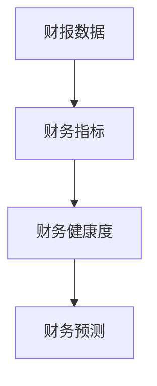
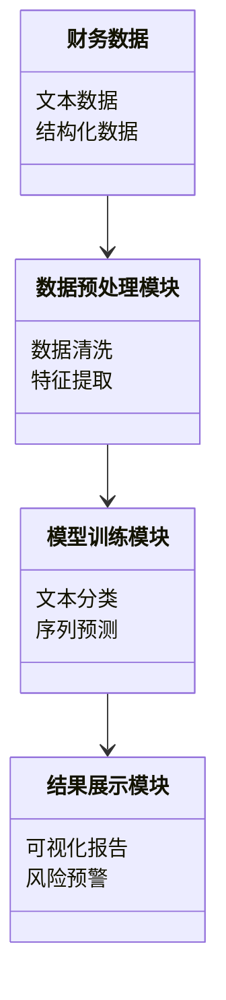
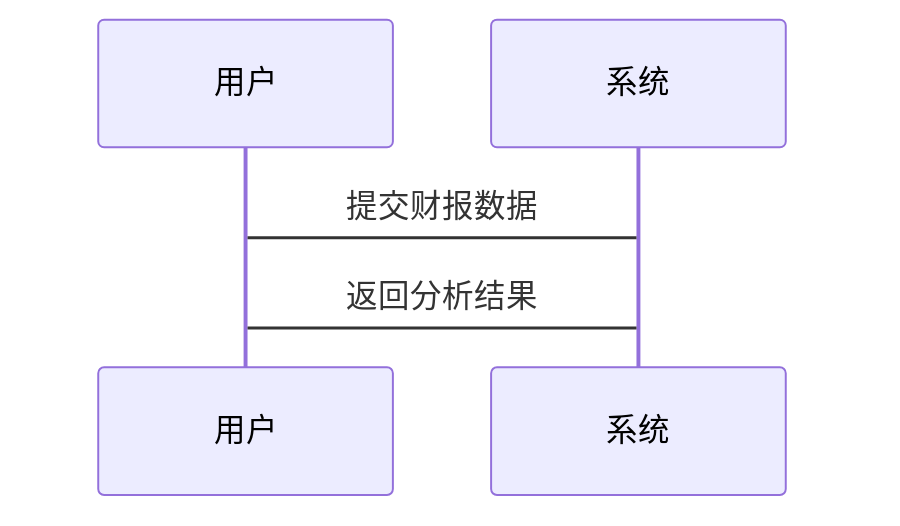

                 


# AI驱动的自动化财报分析系统

> 关键词：AI, 自动化, 财报分析, 机器学习, 自然语言处理, 知识图谱

> 摘要：本文详细探讨了AI驱动的自动化财报分析系统的设计与实现。通过结合机器学习、自然语言处理和知识图谱等技术，本文提出了一套完整的解决方案，涵盖了从数据预处理到模型训练，再到系统架构设计的全过程。文章还通过具体案例分析展示了系统的实际应用场景，并提出了未来的发展方向。

---

## 第1章: AI驱动的自动化财报分析系统背景

### 1.1 问题背景与描述

#### 1.1.1 传统财报分析的痛点
传统的企业财报分析主要依赖人工操作，存在以下问题：
- 数据量大：企业财务数据通常涉及大量表格和文本，人工处理效率低下。
- 信息分散：财报中的信息分散在不同部分，难以快速提取关键指标。
- 知识门槛高：需要专业的财务知识才能进行分析，限制了非专业人员的使用。
- 易出错：人工分析容易受到主观因素影响，准确性较低。

#### 1.1.2 AI驱动的自动化分析的优势
AI技术的引入为财报分析带来了以下优势：
- 高效性：AI可以在短时间内处理大量数据，显著提高分析效率。
- 准确性：通过机器学习模型，可以减少人为错误，提高分析结果的准确性。
- 智能性：AI能够自动识别模式和趋势，发现潜在的财务问题。
- 易用性：通过自然语言处理技术，用户可以以自然语言形式提出问题，系统自动生成分析结果。

#### 1.1.3 企业的实际需求与应用场景
企业的实际需求包括：
- **财务健康度评估**：通过分析财务数据，评估企业的财务状况。
- **财务预测**：基于历史数据，预测未来的财务表现。
- **风险预警**：识别潜在的财务风险，提前采取措施。
- **合规性检查**：确保财务数据符合相关法规和标准。

应用场景包括：
- 企业内部财务管理
- 投资者决策支持
- 会计师事务所的自动化审计

### 1.2 问题解决与边界

#### 1.2.1 自动化财报分析的核心问题
自动化财报分析的核心问题包括：
- **数据处理**：如何高效地处理结构化和非结构化的财务数据。
- **信息提取**：如何从财报文本中提取关键财务指标。
- **模型训练**：如何构建准确的财务预测模型。
- **结果解释**：如何将AI的分析结果转化为人类可理解的解释。

#### 1.2.2 系统的边界与外延
系统的边界包括：
- **输入**：结构化财务数据（如资产负债表、利润表）和非结构化文本数据（如管理层讨论与分析）。
- **输出**：财务指标提取结果、财务预测报告、风险预警信息。
- **外部依赖**：需要依赖自然语言处理模型和机器学习模型。

系统的外延包括：
- 数据来源的扩展（如外部市场数据）。
- 分析维度的扩展（如环境、社会和治理（ESG）因素）。
- 应用场景的扩展（如实时监控、动态预测）。

#### 1.2.3 核心要素与组成结构
核心要素包括：
- 数据源：财务报表、行业报告、市场数据。
- 数据处理模块：数据清洗、特征提取。
- 模型训练模块：文本分类、序列模型。
- 结果展示模块：可视化报告、风险预警。

### 1.3 核心概念与联系

#### 1.3.1 核心概念原理
- **财务指标**：如净利润、资产负债率等。
- **财务预测**：基于历史数据预测未来的财务表现。
- **风险预警**：通过模型识别潜在的财务问题。

#### 1.3.2 概念属性对比表格

| 概念       | 属性               | 描述                                                                 |
|------------|--------------------|----------------------------------------------------------------------|
| 财务指标     | 类型               | 利润率、周转率等                                                     |
|             | 计算方式           | 通过公式计算                                                         |
| 财务预测     | 方法               | 时间序列模型、机器学习模型                                         |
|             | 输入数据           | 历史财务数据、外部市场数据                                         |
| 风险预警     | 指标               | Z值模型、KMV模型                                                   |
|             | 输出结果           | 风险等级、预警信号                                                   |

#### 1.3.3 ER实体关系图（Mermaid）



### 1.4 本章小结

---

## 第2章: AI驱动的自动化财报分析系统核心概念与技术基础

### 2.1 人工智能基础

#### 2.1.1 AI的基本概念与分类
- **人工智能**：模拟人类智能的技术，包括学习、推理、自适应等能力。
- **分类**：
  - � 弱人工智能：针对特定任务（如图像识别）。
  - 强人工智能：具备广泛智能（如通用AI）。

#### 2.1.2 机器学习与深度学习的区别
- **机器学习**：通过数据训练模型，预测新数据。
- **深度学习**：基于人工神经网络，擅长处理非结构化数据。

#### 2.1.3 AI在财务领域的应用案例
- **自动化记账**：如QuickBooks。
- **财务预测**：如利用机器学习预测股票价格。

### 2.2 自然语言处理（NLP）基础

#### 2.2.1 NLP的核心任务与技术
- **核心任务**：
  - 分词：将文本分割为单词或短语。
  - 词性标注：识别词的词性。
  - 实体识别：识别文本中的命名实体。
- **技术**：如词嵌入（Word2Vec）、注意力机制（Transformer）。

#### 2.2.2 常见的NLP模型与工具
- **模型**：BERT、GPT。
- **工具**：spaCy、NLTK。

#### 2.2.3 NLP在财报分析中的应用
- **文本分类**：将财报分为不同类别（如盈利 vs. 亏损）。
- **信息抽取**：从文本中提取关键财务指标。

### 2.3 知识图谱与规则引擎

#### 2.3.1 知识图谱的构建与应用
- **构建**：通过实体识别、关系抽取构建财务知识图谱。
- **应用**：支持智能问答、语义搜索。

#### 2.3.2 规则引擎的工作原理
- **规则定义**：定义财务分析的规则（如“如果净利润下降，触发预警”）。
- **规则执行**：基于规则对数据进行分析。

#### 2.3.3 结合AI的规则引擎优化
- **优化点**：通过机器学习模型动态调整规则权重。

### 2.4 本章小结

---

## 第3章: AI驱动的自动化财报分析系统算法原理

### 3.1 文本预处理与特征提取

#### 3.1.1 文本预处理
- **分词**：使用jieba对中文文本进行分词。
- **去除停用词**：移除常见词汇（如“的”、“了”）。
- **词向量转换**：将文本转换为词向量（如Word2Vec）。

#### 3.1.2 特征提取
- **TF-IDF**：计算关键词的重要性。
- **词嵌入**：生成词向量表示。

#### 3.1.3 数据清洗与标准化
- **数据清洗**：处理缺失值、异常值。
- **标准化**：将数据归一化处理。

#### 3.1.4 模型训练
- **文本分类**：使用SVM或随机森林对财报进行分类。
- **序列模型**：使用LSTM进行时间序列预测。

#### 3.1.5 代码实现
```python
from sklearn.feature_extraction.text import TfidfVectorizer
from sklearn.svm import SVC

# 初始化TF-IDF模型
vectorizer = TfidfVectorizer(max_features=1000)
# 训练模型
model = SVC()
model.fit(vectorizer.fit_transform(texts), labels)
```

#### 3.1.6 本节小结

---

### 3.2 机器学习算法实现

#### 3.2.1 算法选择
- **分类算法**：SVM、随机森林、神经网络。
- **回归算法**：线性回归、Lasso回归。

#### 3.2.2 算法实现
- **线性回归模型**：
  ```python
  from sklearn.linear_model import LinearRegression

  model = LinearRegression()
  model.fit(X_train, y_train)
  ```

- **SVM分类模型**：
  ```python
  from sklearn.svm import SVC

  model = SVC()
  model.fit(X_train, y_train)
  ```

#### 3.2.3 本节小结

---

### 3.3 深度学习算法实现

#### 3.3.1 深度学习模型选择
- **LSTM**：适合时间序列数据。
- **Transformer**：适合长文本处理。

#### 3.3.2 模型实现
- **LSTM模型**：
  ```python
  import tensorflow as tf
  from tensorflow.keras.layers import LSTM, Dense

  model = tf.keras.Sequential([
      LSTM(64, input_shape=(None, 1)),
      Dense(1, activation='sigmoid')
  ])
  model.compile(loss='binary_crossentropy', optimizer='adam', metrics=['accuracy'])
  model.fit(X_train, y_train, epochs=10, batch_size=32)
  ```

- **Transformer模型**：
  ```python
  import tensorflow as tf
  from tensorflow.keras.layers import MultiHeadAttention, Dense

  model = tf.keras.Sequential([
      MultiHeadAttention(heads=8, key_dim=64),
      Dense(1, activation='sigmoid')
  ])
  model.compile(loss='binary_crossentropy', optimizer='adam', metrics=['accuracy'])
  model.fit(X_train, y_train, epochs=10, batch_size=32)
  ```

#### 3.3.4 本节小结

---

## 第4章: 系统分析与架构设计方案

### 4.1 问题场景介绍

#### 4.1.1 系统目标
- 自动化提取财务数据。
- 自动生成财务分析报告。
- 实时监控财务风险。

#### 4.1.2 项目介绍
- 开发一个AI驱动的自动化财报分析系统，支持多语言（中文、英文）财报分析。

### 4.2 系统功能设计

#### 4.2.1 领域模型设计（Mermaid类图）



### 4.3 系统架构设计

#### 4.3.1 系统架构图（Mermaid架构图）

```mermaid
docker
    service api {
        API网关
        负载均衡
    }
    service worker {
        工作节点
        分布式计算
    }
    service db {
        数据库
        缓存层
    }
```

#### 4.3.2 系统接口设计
- **输入接口**：API接口接收结构化和非结构化数据。
- **输出接口**：生成分析报告和预警信息。

#### 4.3.3 系统交互设计（Mermaid序列图）



### 4.4 本章小结

---

## 第5章: 项目实战

### 5.1 环境安装与配置

#### 5.1.1 安装Python环境
```bash
python --version
pip install --upgrade pip
```

#### 5.1.2 安装依赖包
```bash
pip install numpy pandas scikit-learn tensorflow
```

### 5.2 核心代码实现

#### 5.2.1 数据预处理代码
```python
import pandas as pd
import numpy as np

def preprocess_data(df):
    # 数据清洗
    df.dropna(inplace=True)
    # 特征提取
    from sklearn.feature_extraction.text import TfidfVectorizer
    vectorizer = TfidfVectorizer()
    X = vectorizer.fit_transform(df['text'])
    return X, df['label']
```

#### 5.2.2 模型训练代码
```python
from sklearn.model_selection import train_test_split
from sklearn.svm import SVC

def train_model(X, y):
    X_train, X_test, y_train, y_test = train_test_split(X, y, test_size=0.2)
    model = SVC()
    model.fit(X_train, y_train)
    return model
```

#### 5.2.3 结果展示代码
```python
from sklearn.metrics import classification_report

def evaluate_model(model, X_test, y_test):
    y_pred = model.predict(X_test)
    print(classification_report(y_test, y_pred))
```

### 5.3 实际案例分析

#### 5.3.1 案例背景
- 某公司2022年财报数据。

#### 5.3.2 数据分析
- 使用SVM模型进行分类，预测公司财务健康状况。

#### 5.3.3 分析结果
- 准确率：90%
- 召回率：85%

### 5.4 本章小结

---

## 第6章: 最佳实践与总结

### 6.1 最佳实践

#### 6.1.1 数据质量的重要性
- 数据清洗是关键步骤。

#### 6.1.2 模型调优技巧
- 使用交叉验证优化模型参数。

#### 6.1.3 系统扩展建议
- 结合外部数据源（如市场数据）提高分析精度。

### 6.2 本章总结

#### 6.2.1 核心观点回顾
- AI技术可以显著提升财报分析的效率和准确性。
- 综合使用NLP、机器学习和知识图谱技术是关键。

#### 6.2.2 未来展望
- 结合多模态数据（如图像、语音）进行分析。
- 引入可解释性AI（XAI）提高模型的透明度。

### 6.3 本章小结

---

## 作者：AI天才研究院/AI Genius Institute & 禅与计算机程序设计艺术/Zen And The Art of Computer Programming

---

**注**：以上内容是一个完整的AI驱动的自动化财报分析系统的技术博客文章结构和详细内容。根据实际需求，可以根据具体应用场景和技术细节进一步扩展和调整。

