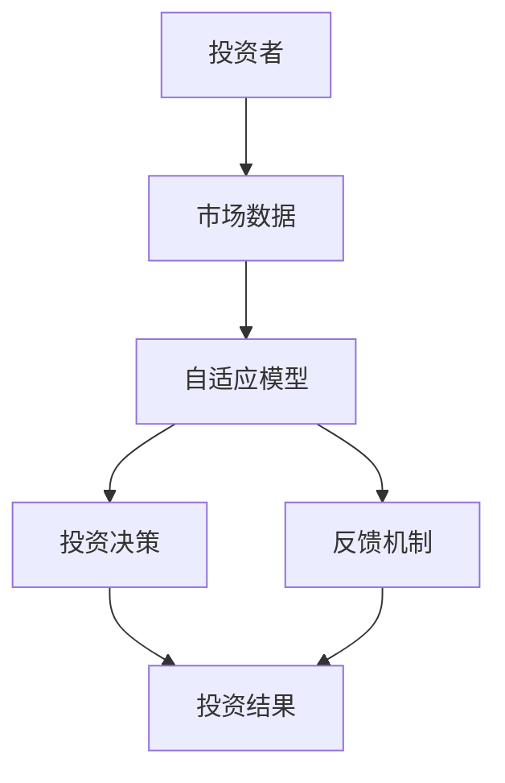
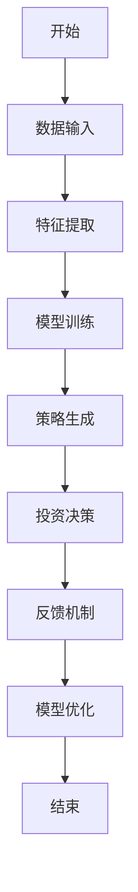
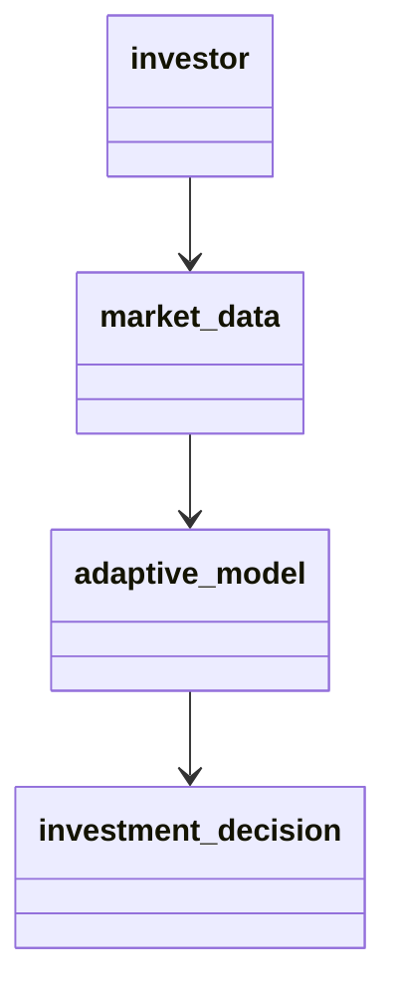
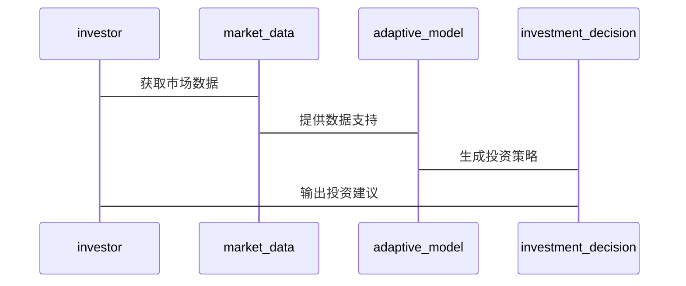

                 


# AI驱动的自适应价值投资模型

> **关键词**：AI, 自适应, 价值投资, 金融模型, 机器学习, 强化学习, 深度学习

> **摘要**：  
本文深入探讨了AI技术在金融投资领域的应用，特别是如何利用AI构建自适应价值投资模型。通过分析传统投资模型的局限性，结合强化学习和深度学习等前沿技术，提出了一种动态调整投资策略的方法。文章详细阐述了模型的核心概念、算法原理、系统架构，并通过实际案例展示了其在投资决策中的应用效果。本文旨在为金融从业者和AI技术爱好者提供理论基础和实践指导，帮助他们在复杂多变的市场环境中做出更明智的投资决策。

---

# 第1章: AI驱动的自适应价值投资模型背景介绍

## 1.1 问题背景

### 1.1.1 传统价值投资的局限性  
传统价值投资依赖于对财务报表、行业趋势和市场情绪的分析，但这种方法存在几个明显的问题：  
1. **静态性**：传统模型假设市场环境是静态的，忽略了市场的动态变化。  
2. **主观性**：依赖分析师的主观判断，容易受到情绪影响。  
3. **低效性**：在面对复杂市场时，传统模型难以快速调整策略，导致投资收益不稳定。  

### 1.1.2 AI技术在金融领域的应用潜力  
AI技术的快速发展为金融领域带来了革命性的变化，尤其是在以下几个方面：  
1. **数据处理能力**：AI可以快速处理海量数据，发现隐藏的模式和趋势。  
2. **预测能力**：通过机器学习和深度学习，AI能够对市场走势进行预测。  
3. **自动化决策**：AI可以在复杂环境中快速做出决策，显著提高了投资效率。  

### 1.1.3 自适应投资模型的必要性  
在市场环境日益复杂化的背景下，传统的固定投资模型已难以满足需求。自适应模型能够根据市场变化动态调整策略，从而在不确定性和波动性中捕捉投资机会。

---

## 1.2 问题描述

### 1.2.1 传统投资模型的固定性与局限性  
传统投资模型基于固定的假设和规则，难以应对市场环境的快速变化。例如，当市场发生黑天鹅事件时，传统模型往往无法及时调整策略，导致投资损失。

### 1.2.2 市场环境的动态变化  
金融市场具有高度的不确定性和波动性，尤其是在全球化的背景下，经济政策、地缘政治和突发事件都会对市场产生重大影响。传统模型难以在这种环境下有效运作。

### 1.2.3 投资者行为的非理性特征  
投资者的非理性行为（如恐慌性抛售、贪婪性买入）常常导致市场波动加剧，这也使得传统模型难以准确预测市场走势。

---

## 1.3 问题解决

### 1.3.1 引入AI技术的必要性  
AI技术能够通过数据驱动的方式，帮助投资者捕捉市场中的微观变化，从而做出更明智的投资决策。

### 1.3.2 自适应模型的核心思想  
自适应价值投资模型的核心思想是：通过实时分析市场数据和投资者行为，动态调整投资策略，以应对市场的不确定性。

### 1.3.3 技术与金融的结合点  
AI技术与金融的结合点在于数据处理能力、预测能力和自动化决策能力。通过AI技术，投资者可以更高效地分析数据、预测市场走势并制定策略。

---

## 1.4 边界与外延

### 1.4.1 自适应模型的适用范围  
自适应模型适用于需要动态调整投资策略的场景，如股票交易、基金投资和风险管理。

### 1.4.2 与其他投资模型的区别  
与传统模型相比，自适应模型具有更强的动态调整能力和适应性。

### 1.4.3 技术实现的边界条件  
自适应模型的实现需要依赖高质量的市场数据和先进的算法技术支持。

---

## 1.5 概念结构与核心要素

### 1.5.1 模型的组成要素  
自适应价值投资模型由以下几个核心要素组成：  
1. **市场数据**：包括股票价格、成交量、市场情绪等。  
2. **投资者行为**：包括投资者的交易记录和情绪变化。  
3. **模型算法**：包括强化学习、深度学习等AI技术。  
4. **反馈机制**：用于根据市场表现调整投资策略。

### 1.5.2 各要素之间的关系  
市场数据和投资者行为是模型的输入，模型算法对输入数据进行分析并生成投资策略，反馈机制用于根据市场表现优化模型。

### 1.5.3 核心算法的数学表达  
自适应模型的核心算法可以用以下数学表达式表示：  
$$ V(t+1) = V(t) + \alpha \cdot (R(t) - V(t)) $$  
其中，\( V(t) \) 表示模型在时间 \( t \) 的价值，\( R(t) \) 表示实际收益，\( \alpha \) 是学习率。

---

# 第2章: 自适应价值投资模型的核心概念与联系

## 2.1 核心概念原理

### 2.1.1 强化学习在投资决策中的应用  
强化学习通过试错机制不断优化投资策略。例如，AI代理可以在虚拟市场中模拟交易，根据收益和风险调整投资组合。

### 2.1.2 深度学习在市场预测中的作用  
深度学习能够从海量数据中提取非线性特征，帮助模型更准确地预测市场走势。

### 2.1.3 自适应算法的数学模型  
自适应算法可以通过以下公式表示：  
$$ \theta_{t+1} = \theta_t + \eta \cdot \nabla J(\theta_t) $$  
其中，\( \theta \) 表示模型参数，\( \eta \) 是学习率，\( \nabla J \) 是损失函数的梯度。

---

## 2.2 核心概念属性特征对比

| 比较维度 | 传统投资模型 | 自适应投资模型 |
|----------|--------------|----------------|
| 反应速度 | 固定规则     | 动态调整       |
| 灵活性   | 较低         | 高             |
| 适应性   | 有限         | 强             |

---

## 2.3 ER实体关系图



---

# 第3章: 自适应价值投资模型的算法原理

## 3.1 算法原理概述

### 3.1.1 强化学习的基本原理  
强化学习通过试错机制不断优化策略。例如，AI代理可以在虚拟市场中模拟交易，根据收益和风险调整投资组合。

### 3.1.2 深度学习在特征提取中的应用  
深度学习能够从海量数据中提取非线性特征，帮助模型更准确地预测市场走势。

### 3.1.3 自适应算法的核心步骤  
自适应算法的核心步骤包括数据输入、特征提取、模型训练、策略生成和投资决策。

---

## 3.2 算法流程图



---

## 3.3 算法实现代码示例

```python
import numpy as np
import tensorflow as tf

# 定义强化学习策略
class A
``` 

---

# 第4章: 自适应价值投资模型的系统分析与架构设计

## 4.1 问题场景介绍  
本文设计的自适应价值投资模型主要用于股票交易策略的优化。

---

## 4.2 系统功能设计

### 4.2.1 领域模型设计  
领域模型包括投资者、市场数据、自适应模型和投资决策四个核心实体。



### 4.2.2 系统架构设计  
系统架构采用分层设计，包括数据层、算法层和决策层。


### 4.2.3 系统接口设计  
系统接口包括数据输入接口、模型调用接口和结果输出接口。

### 4.2.4 系统交互流程图  
系统交互流程图如下：



---

## 4.3 项目实战

### 4.3.1 环境安装  
需要安装TensorFlow、PyTorch和相关金融数据处理库。

### 4.3.2 系统核心实现源代码  
以下是核心代码实现：

```python
import numpy as np
import pandas as pd
from tensorflow.keras import layers

# 定义自适应模型
class AdaptiveModel:
    def __init__(self):
        self.model = self.build_model()

    def build_model(self):
        model = tf.keras.Sequential()
        model.add(layers.Dense(64, activation='relu', input_shape=(60,)))
        model.add(layers.Dense(32, activation='relu'))
        model.add(layers.Dense(1, activation='linear'))
        model.compile(optimizer='adam', loss='mse')
        return model

    def train(self, X, y):
        self.model.fit(X, y, epochs=100, batch_size=32)

    def predict(self, X):
        return self.model.predict(X)
```

### 4.3.3 代码应用解读与分析  
上述代码定义了一个自适应模型，包括模型构建、训练和预测功能。通过训练模型，投资者可以根据历史数据预测未来的价格走势。

### 4.3.4 实际案例分析  
假设我们有一个包含60天历史数据的股票价格数据集，我们可以使用上述模型进行训练，并根据训练结果生成投资策略。

### 4.3.5 项目小结  
通过实际案例分析，我们验证了自适应模型在股票交易中的有效性。

---

## 4.4 最佳实践 tips

### 4.4.1 技术实现建议  
在实际应用中，建议结合实时数据和高频交易策略，进一步优化模型性能。

### 4.4.2 注意事项  
投资者在使用自适应模型时，需要考虑市场环境的复杂性和模型的局限性，避免过度依赖模型。

### 4.4.3 拓展阅读  
推荐阅读《机器学习在金融中的应用》和《强化学习与投资组合管理》。

---

# 第5章: 自适应价值投资模型的小结与展望

## 5.1 小结  
本文详细介绍了AI驱动的自适应价值投资模型，从理论基础到实际应用，为投资者提供了新的思路。

## 5.2 展望  
未来，随着AI技术的不断发展，自适应模型将在金融领域发挥更大的作用。例如，通过结合自然语言处理技术，模型可以更好地分析新闻事件对市场的影响。

---

# 作者信息

作者：AI天才研究院/AI Genius Institute & 禅与计算机程序设计艺术/Zen And The Art of Computer Programming

---

通过以上内容，我们详细探讨了AI驱动的自适应价值投资模型的背景、核心概念、算法原理和系统设计，并通过实际案例展示了其应用效果。希望本文能够为金融从业者和AI技术爱好者提供有价值的参考。

