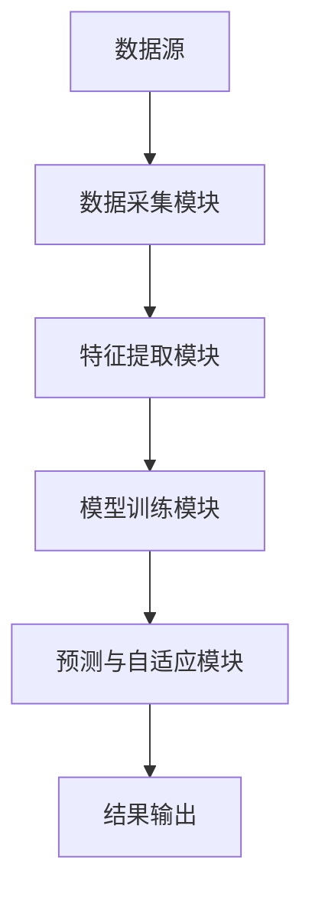

                 


# AI驱动的自适应市场周期识别

> 关键词：AI，自适应市场周期，时间序列分析，深度学习，机器学习，市场预测，金融分析

> 摘要：本文深入探讨了AI技术在市场周期识别中的应用，分析了AI驱动的自适应市场周期识别的核心概念、算法原理、系统架构以及实际案例。通过详细阐述时间序列分析、机器学习和深度学习等技术，本文展示了如何利用AI技术实现市场周期的自适应识别，并提供了实际的项目实施指南和最佳实践。

---

## 第一部分：AI驱动的自适应市场周期识别概述

### 第1章：背景与概念

#### 1.1 问题背景

市场周期是指市场在经济发展过程中经历的不同阶段，如繁荣、衰退、萧条和复苏等。准确识别市场周期对企业和投资者至关重要，因为它可以帮助做出更明智的决策。然而，传统的市场周期分析方法依赖于人工经验和统计分析，存在效率低、主观性强、滞后性等问题。

近年来，人工智能（AI）技术的发展为市场周期识别提供了新的解决方案。AI技术能够处理大量非结构化数据，发现隐藏的模式，并实时适应市场变化，从而实现自适应的市场周期识别。

---

#### 1.2 核心概念

AI驱动的自适应市场周期识别是指利用AI技术（如机器学习和深度学习）对市场数据进行分析，识别市场周期的变化，并根据实时数据动态调整模型参数，以提高预测的准确性和适应性。

---

#### 1.3 应用场景

AI驱动的自适应市场周期识别在多个领域具有广泛的应用，包括：

1. **金融市场**：股票、债券、外汇等金融工具的价格预测。
2. **经济研究**：宏观经济周期的分析与预测。
3. **行业分析**：特定行业市场周期的识别与优化。

---

## 第二部分：AI与市场周期识别的核心概念

### 第2章：AI技术基础

#### 2.1 机器学习简介

机器学习是一种通过数据训练模型的技术，分为监督学习、无监督学习和强化学习三种主要类型：

1. **监督学习**：基于标记数据进行模型训练，如回归和分类任务。
2. **无监督学习**：基于未标记数据进行模式发现，如聚类和降维。
3. **强化学习**：通过与环境交互学习策略，如游戏AI。

#### 2.2 深度学习基础

深度学习是一种基于人工神经网络的机器学习技术，通过多层神经网络提取数据的高层次特征。常用的深度学习模型包括：

1. **卷积神经网络（CNN）**：适用于图像识别任务。
2. **循环神经网络（RNN）**：适用于序列数据处理，如时间序列分析。
3. **Transformer网络**：适用于自然语言处理和序列建模任务。

#### 2.3 时间序列分析

时间序列分析是研究随时间变化的数据序列的特征和模式的技术。常用的模型包括：

1. **ARIMA模型**：自回归积分滑动平均模型，适用于线性时间序列预测。
2. **LSTM网络**：长短期记忆网络，适用于非线性时间序列预测。

---

### 第3章：市场周期识别的AI驱动原理

#### 3.1 AI与市场周期识别的关系

AI驱动的市场周期识别通过以下步骤实现：

1. **数据采集**：收集市场相关的数据，如价格、交易量、宏观经济指标等。
2. **特征提取**：从数据中提取有用的特征，如均值、标准差、趋势等。
3. **模型训练**：使用机器学习或深度学习模型训练数据，识别市场周期的模式。
4. **预测与自适应**：利用训练好的模型预测市场周期的变化，并根据实时数据动态调整模型参数。

---

#### 3.2 核心概念与联系

通过ER图可以清晰地展示AI驱动的市场周期识别的核心概念及其联系：

```mermaid
er
actor: 用户
goal: 市场周期识别
market_data: 市场数据
model: AI模型
output: 周期预测结果
```

---

## 第三部分：算法原理与数学模型

### 第4章：算法原理

#### 4.1 时间序列分析算法

1. **ARIMA模型**

ARIMA（Autoregressive Integrated Moving Average）模型是一种常用的线性时间序列预测模型。其基本公式为：

$$ ARIMA(p, d, q) $$

其中：
- \( p \)：自回归阶数
- \( d \)：差分阶数
- \( q \)：移动平均阶数

2. **LSTM网络**

LSTM（Long Short Term Memory）网络是一种基于RNN的时间序列模型，能够有效捕捉时间序列的长短期依赖关系。LSTM的基本单元包括输入门、遗忘门和输出门。

---

### 第5章：系统架构与设计

#### 5.1 系统功能设计

系统功能设计包括以下几个模块：

1. **数据采集模块**：从数据库或API获取市场数据。
2. **特征提取模块**：从原始数据中提取特征。
3. **模型训练模块**：训练AI模型。
4. **预测与自适应模块**：实时预测市场周期并调整模型。

---

#### 5.2 系统架构设计

系统架构设计包括以下几个部分：



---

## 第四部分：项目实战

### 第6章：项目实战

#### 6.1 环境安装

安装所需的Python库：

```bash
pip install numpy pandas scikit-learn keras tensorflow
```

#### 6.2 核心实现代码

以下是使用LSTM网络进行时间序列预测的代码示例：

```python
import numpy as np
from tensorflow.keras.models import Sequential
from tensorflow.keras.layers import LSTM, Dense

# 生成模拟数据
data = np.random.random((1000, 1))

# 定义模型
model = Sequential()
model.add(LSTM(64, input_shape=(None, 1)))
model.add(Dense(1))

# 编译模型
model.compile(loss='mean_squared_error', optimizer='adam')

# 训练模型
model.fit(data, data, epochs=10, batch_size=32)
```

#### 6.3 案例分析

以股票价格预测为例，利用LSTM网络对股票价格进行预测。通过训练模型，可以实现对股票价格的实时预测，并根据预测结果动态调整交易策略。

---

## 第五部分：总结与展望

### 第7章：小结与未来展望

本文详细探讨了AI驱动的自适应市场周期识别的核心概念、算法原理和系统架构，并通过实际案例展示了其应用价值。未来，随着AI技术的不断发展，市场周期识别将更加精准和高效，为企业和投资者提供更有力的支持。

---

作者：AI天才研究院 & 禅与计算机程序设计艺术

