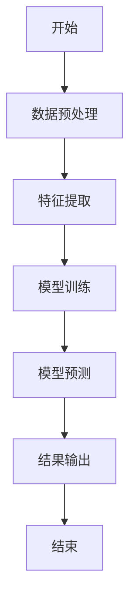
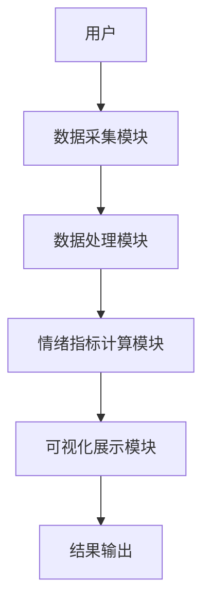

                 


# AI驱动的自适应市场情绪指标

## 关键词

AI, 市场情绪指标, 自适应算法, 金融分析, 自然语言处理, 机器学习

## 摘要

本文将详细介绍如何利用人工智能技术构建自适应的市场情绪指标，通过分析市场的实时动态，优化投资决策。我们将从背景、算法原理、系统架构到项目实战，全面解析这一创新方法。

---

# 目录

## 第一部分: AI驱动的自适应市场情绪指标概述

### 第1章: 市场情绪指标与AI驱动的结合

#### 1.1 市场情绪指标的定义与背景

- 1.1.1 传统市场情绪指标的局限性
- 1.1.2 AI驱动的市场情绪指标的优势
- 1.1.3 市场情绪指标在金融领域的应用价值

#### 1.2 自适应市场情绪指标的核心概念

- 1.2.1 自适应市场情绪指标的定义
- 1.2.2 自适应与传统市场情绪指标的区别
- 1.2.3 市场情绪指标的基本组成

## 第二部分: 自适应市场情绪指标的数学模型与算法原理

### 第2章: 自适应市场情绪指标的核心算法

#### 2.1 基于自然语言处理的情感分析模型

- 2.1.1 情感分析的定义与作用
- 2.1.2 基于TF-IDF的文本特征提取
- 2.1.3 情感分类模型（如SVM、随机森林、深度学习模型）

#### 2.2 基于时间序列分析的市场情绪预测模型

- 2.2.1 时间序列预测的定义与作用
- 2.2.2 常用的时间序列模型（ARIMA、LSTM等）
- 2.2.3 市场情绪预测模型的实现步骤

#### 2.3 基于机器学习的自适应算法

- 2.3.1 自适应算法的定义与作用
- 2.3.2 常用的自适应算法（如遗传算法、粒子群优化等）
- 2.3.3 自适应算法在市场情绪指标中的应用

### 第3章: 自适应市场情绪指标的数学模型

#### 3.1 情感分析模型的数学公式

$$
\text{情感得分} = \sum_{i=1}^{n} w_i \cdot s_i
$$

其中，\( w_i \) 是第 \( i \) 个关键词的权重，\( s_i \) 是第 \( i \) 个关键词的情感值。

#### 3.2 时间序列预测模型的数学公式

$$
\text{预测值} = a \cdot \text{收盘价} + b \cdot \text{开盘价} + c \cdot \text{最高价} + d \cdot \text{最低价}
$$

### 第4章: 自适应市场情绪指标的算法流程图

#### 4.1 情感分析模型的流程图



## 第三部分: 自适应市场情绪指标的系统架构设计

### 第5章: 系统功能设计

#### 5.1 数据采集模块

- 5.1.1 数据来源（如新闻、社交媒体、交易数据等）
- 5.1.2 数据采集工具（如网络爬虫、API接口等）

#### 5.2 数据处理模块

- 5.2.1 数据清洗与预处理
- 5.2.2 数据特征提取
- 5.2.3 数据转换与标准化

#### 5.3 情绪指标计算模块

- 5.3.1 情感分析模型的实现
- 5.3.2 时间序列预测模型的实现
- 5.3.3 自适应算法的实现

#### 5.4 可视化展示模块

- 5.4.1 情绪指标的可视化展示
- 5.4.2 市场情绪变化的趋势分析
- 5.4.3 可视化工具的选择与实现

### 第6章: 系统架构设计

#### 6.1 系统架构设计图



#### 6.2 系统接口设计

- 6.2.1 数据接口
- 6.2.2 计算接口
- 6.2.3 展示接口

#### 6.3 系统交互流程图


## 第四部分: 自适应市场情绪指标的项目实战

### 第7章: 项目实战

#### 7.1 环境安装与配置

- 7.1.1 安装Python环境
- 7.1.2 安装必要的库（如TensorFlow、Pandas、NLTK等）

#### 7.2 核心代码实现

- 7.2.1 数据预处理代码示例

```python
import pandas as pd
import numpy as np

# 加载数据
data = pd.read_csv('market_data.csv')

# 数据清洗
data.dropna(inplace=True)
data = data[~data['text'].isnull()]
```

- 7.2.2 情感分析模型实现代码示例

```python
from sklearn.feature_extraction.text import TfidfVectorizer
from sklearn.svm import SVC

vectorizer = TfidfVectorizer()
X = vectorizer.fit_transform(data['text'])
y = data['sentiment']

model = SVC()
model.fit(X, y)
```

- 7.2.3 时间序列预测模型实现代码示例

```python
from sklearn.linear_model import LinearRegression

model = LinearRegression()
model.fit(X, y)
```

#### 7.3 项目小结

- 7.3.1 项目实现的关键点总结
- 7.3.2 项目实现中的常见问题及解决方案
- 7.3.3 项目未来的优化方向

## 第五部分: 最佳实践与总结

### 第8章: 最佳实践

#### 8.1 小结

- 8.1.1 核心概念回顾
- 8.1.2 算法实现总结
- 8.1.3 系统设计总结

#### 8.2 注意事项

- 8.2.1 数据质量的重要性
- 8.2.2 模型调优的注意事项
- 8.2.3 系统安全与稳定性

#### 8.3 拓展阅读

- 8.3.1 相关领域的最新研究
- 8.3.2 更多算法实现的资源
- 8.3.3 金融数据分析的其他应用

---

## 作者

作者：AI天才研究院 & 禅与计算机程序设计艺术

---

以上是《AI驱动的自适应市场情绪指标》的技术博客文章的完整目录大纲和部分正文内容。通过这一系列的分析与设计，我们可以看到AI在金融领域的巨大潜力，以及如何利用先进的技术手段来优化市场情绪指标的计算与应用。

