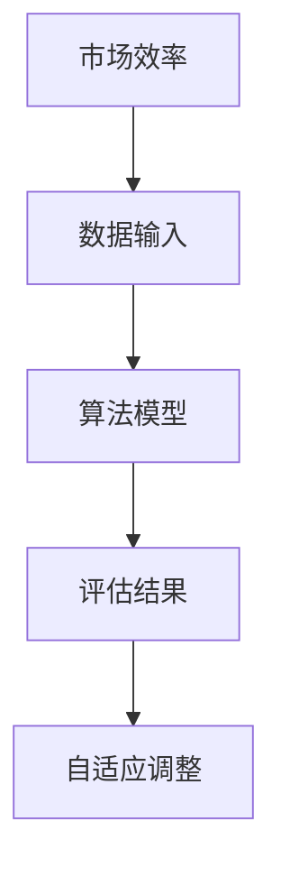
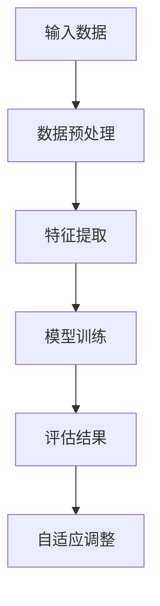
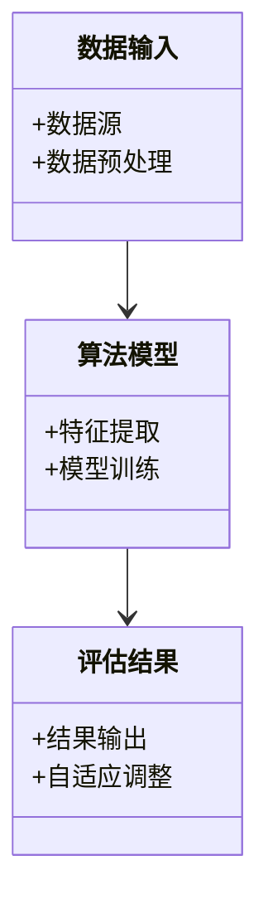
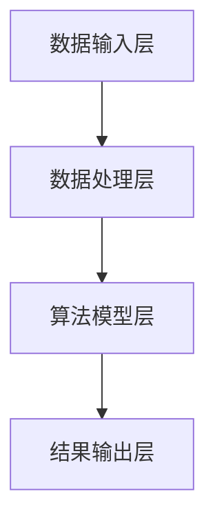
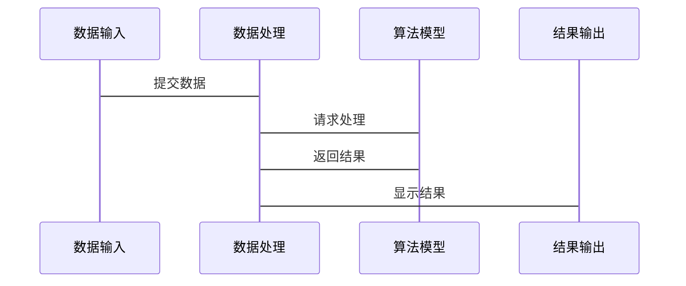

                 


# AI驱动的自适应市场效率评估

> 关键词：AI驱动，市场效率，自适应评估，算法原理，系统架构，项目实战

> 摘要：本文详细探讨了AI技术在自适应市场效率评估中的应用，通过系统化的理论分析、算法设计和项目实践，深入剖析了AI驱动的自适应市场效率评估的核心原理与实现方法。文章从基础概念出发，逐步展开到算法实现、系统架构设计以及实际案例分析，旨在为读者提供全面而深入的技术指导。

---

## 第一部分: AI驱动的自适应市场效率评估基础

### 第1章: 市场效率与自适应评估概述

#### 1.1 市场效率的基本概念
市场效率是衡量市场运作效能的重要指标，反映了市场在资源配置、价格发现和信息传递等方面的能力。自适应评估则是指根据市场动态变化，实时调整评估方法和策略的过程。AI技术的引入，使得市场效率评估更加智能化和动态化。

#### 1.2 AI在市场效率评估中的作用
AI技术通过大数据分析、机器学习和深度学习等方法，能够快速捕捉市场中的细微变化，从而提高评估的准确性和实时性。AI不仅能够处理海量数据，还能通过模型优化不断提升评估的效果。

---

### 第2章: AI驱动的自适应市场效率评估的核心概念

#### 2.1 核心概念与联系
- **市场效率**：市场的资源配置效率和价格发现能力。
- **自适应评估**：根据市场动态调整评估方法。
- **AI驱动**：利用人工智能技术实现动态评估。

#### 2.2 核心概念的属性特征对比
以下是核心概念的属性特征对比表：

| 概念         | 输入数据 | 输出结果 | 实时性 | 自适应性 |
|--------------|----------|----------|--------|----------|
| 市场效率     | 市场数据 | 效率指标 | 低     | 低       |
| 自适应评估   | 动态数据 | 调整策略 | 高     | 高       |
| AI驱动评估 | 结构化数据 | 智能结果 | 极高   | 极高      |

#### 2.3 ER实体关系图架构
以下是自适应市场效率评估的核心概念架构图：



---

## 第二部分: AI驱动的自适应市场效率评估的算法原理

### 第3章: 算法原理讲解

#### 3.1 算法原理的数学模型
自适应市场效率评估的核心算法基于回归分析和神经网络。以下是一个简化的数学模型：

$$
y = \beta_0 + \beta_1 x_1 + \beta_2 x_2 + \epsilon
$$

其中，$y$ 是目标变量（市场效率指标），$x_1$ 和 $x_2$ 是自变量（市场数据），$\beta_0$ 是截距，$\beta_1$ 和 $\beta_2$ 是回归系数，$\epsilon$ 是误差项。

#### 3.2 算法流程图
以下是算法实现的流程图：



#### 3.3 算法实现的Python代码
以下是核心算法的Python代码示例：

```python
import numpy as np
from sklearn.linear_model import LinearRegression

# 数据预处理
X = np.array([[x1, x2] for x1, x2 in zip(data_x1, data_x2)])
y = np.array(data_y)

# 模型训练
model = LinearRegression()
model.fit(X, y)

# 评估结果
y_pred = model.predict(X)
```

---

### 第4章: 系统分析与架构设计方案

#### 4.1 问题场景介绍
自适应市场效率评估系统需要实时处理海量市场数据，快速生成评估结果，并根据市场变化动态调整评估策略。

#### 4.2 系统功能设计
以下是系统功能的类图：



#### 4.3 系统架构设计
以下是系统架构的架构图：



#### 4.4 系统接口设计
以下是系统接口的交互流程：



---

## 第三部分: AI驱动的自适应市场效率评估的项目实战

### 第5章: 项目实战

#### 5.1 环境安装与配置
- **开发环境**：Python 3.8+
- **依赖库**：numpy、pandas、scikit-learn

#### 5.2 系统核心实现
以下是核心代码实现：

```python
def adaptive_market_assessment(data):
    # 数据预处理
    processed_data = preprocess(data)
    # 特征提取
    features = extract_features(processed_data)
    # 模型训练
    model = train_model(features)
    # 评估结果
    result = model.predict(features)
    return result
```

#### 5.3 实际案例分析
以下是一个实际案例分析：

假设我们有股票市场的历史数据，包括开盘价、收盘价、成交量等。通过自适应市场效率评估系统，我们可以实时评估市场的资源配置效率，并根据市场变化动态调整评估策略。

---

## 第6章: 总结与扩展

### 6.1 最佳实践
- 定期更新模型，确保评估结果的准确性。
- 结合实时数据流，提升评估的实时性。
- 使用分布式计算，提高系统的处理能力。

### 6.2 小结
本文详细介绍了AI驱动的自适应市场效率评估的核心概念、算法原理和系统架构，并通过实际案例展示了其应用。通过本文的学习，读者可以掌握如何利用AI技术实现动态的市场效率评估。

### 6.3 注意事项
- 数据质量和实时性是影响评估结果的关键因素。
- 模型的选择和调优需要根据具体场景进行。

### 6.4 拓展阅读
- 《机器学习实战》
- 《深度学习》
- 《算法导论》

---

作者：AI天才研究院/AI Genius Institute & 禅与计算机程序设计艺术 /Zen And The Art of Computer Programming

