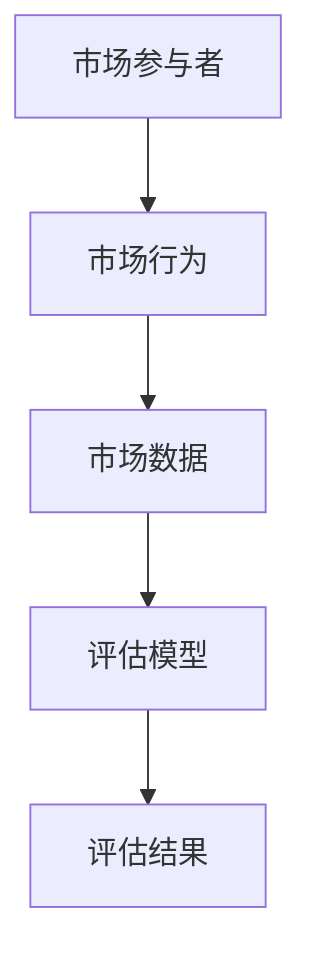
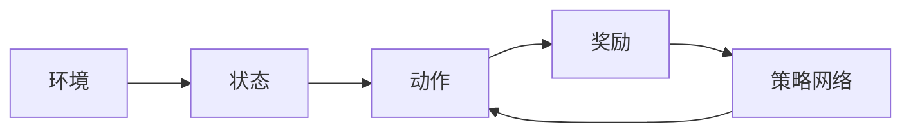

                 


# AI驱动的自适应市场效率评估

> 关键词：AI驱动，自适应市场效率，市场评估，强化学习，动态优化，数据驱动

> 摘要：本文深入探讨了AI驱动的自适应市场效率评估的核心概念、算法原理、系统架构及实际应用。通过结合强化学习和动态优化技术，本文提出了一种新型的市场效率评估方法，能够实时适应市场变化，提供更精准的评估结果。

---

## 第一部分: AI驱动的自适应市场效率评估背景与概念

### 第1章: 问题背景与定义

#### 1.1 市场效率的基本概念
市场效率是指市场中资源配置的效率程度，即市场能够以最低成本将资源分配到最有效率的用途中。传统的市场效率评估方法通常基于静态数据和固定模型，难以应对复杂多变的市场环境。

#### 1.2 传统市场效率评估的局限性
- 数据驱动不足，难以捕捉市场动态变化。
- 模型固定，无法实时调整以适应市场波动。
- 评估结果缺乏动态优化能力，难以提供实时反馈。

#### 1.3 AI驱动的自适应评估的提出
AI技术的快速发展为市场效率评估带来了新的可能性。通过结合强化学习和动态优化技术，AI驱动的自适应评估能够实时调整模型参数，提供更精准的评估结果。

---

### 第2章: 自适应市场效率评估的核心概念

#### 2.1 自适应评估模型的构成
- **数据驱动的特征提取**：通过AI技术从海量数据中提取关键特征，用于评估市场效率。
- **动态优化机制**：基于实时数据，动态调整评估模型的权重和参数。
- **多目标平衡策略**：在多个评估目标之间寻找平衡点，避免单一目标的过度优化。

#### 2.2 核心概念对比分析
| 比较维度 | 传统评估模型 | 自适应评估模型 |
|----------|--------------|----------------|
| 数据来源 | 静态数据      | 动态数据        |
| 模型调整 | 固定模型      | 动态优化模型    |
| 评估结果 | 静态结果      | 实时反馈        |

#### 2.3 实体关系图（ER图）分析


---

## 第二部分: 自适应市场效率评估的算法原理

### 第3章: 强化学习在自适应评估中的应用

#### 3.1 强化学习的基本原理
- **状态空间**：市场环境中的各种因素，如价格、成交量等。
- **动作空间**：评估模型可能采取的调整动作。
- **奖励机制**：根据评估结果的好坏给予奖励或惩罚。

#### 3.2 自适应评估的强化学习模型
- **状态表示与特征提取**：将市场数据转化为强化学习的状态表示。
- **动作选择与策略网络**：通过策略网络选择最优动作。
- **奖励函数的设计与优化**：设计合理的奖励函数以指导模型学习。

#### 3.3 算法实现与流程图


### 第4章: 自适应市场效率评估算法

#### 4.1 自适应评估算法的数学模型
- **优化目标**：最大化评估结果的准确性。
- **动态权重调整公式**：$w_{t+1} = w_t + \alpha \cdot (r_t - w_t)$，其中$\alpha$为学习率，$r_t$为当前奖励。
- **多目标优化的数学表达**：$$\min_{\theta} \frac{1}{2}||y - f(x)||^2 + \lambda ||\theta||^2$$

#### 4.2 算法实现与代码解读
- 环境搭建与数据预处理：使用Python和TensorFlow框架，数据来源包括历史价格、成交量等。
- 策略网络与价值网络的实现：基于神经网络构建策略网络和价值网络。
- 训练过程与超参数调优：通过强化学习算法（如PPO）进行训练，调整学习率和批量大小。

#### 4.3 算法流程图与代码示例


---

## 第三部分: 自适应市场效率评估的系统架构与实现

### 第5章: 系统架构设计

#### 5.1 问题场景与系统目标
- **问题场景**：复杂多变的市场环境，传统评估方法难以实时调整。
- **系统目标**：构建一个基于AI的自适应评估系统，实时优化评估模型。

#### 5.2 系统功能设计
- **数据采集模块**：实时采集市场数据。
- **特征提取模块**：从数据中提取关键特征。
- **评估模型模块**：基于强化学习进行评估和优化。

#### 5.3 系统架构设计


---

## 第四部分: 项目实战与应用

### 第6章: 项目实战

#### 6.1 环境安装与数据预处理
- **环境安装**：安装Python、TensorFlow、Mermaid等工具。
- **数据预处理**：清洗和归一化市场数据。

#### 6.2 核心代码实现
- **特征提取代码**：
  ```python
  import pandas as pd
  data = pd.read_csv('market_data.csv')
  features = data[['price', 'volume', 'change']]
  ```

- **强化学习模型实现**：
  ```python
  import tensorflow as tf
  model = tf.keras.Sequential([
      tf.keras.layers.Dense(64, activation='relu'),
      tf.keras.layers.Dense(1, activation='linear')
  ])
  ```

#### 6.3 实际案例分析
- 通过实际市场数据验证模型的评估效果，对比传统方法和AI驱动方法的评估结果。

---

## 第五部分: 最佳实践与总结

### 第7章: 最佳实践

#### 7.1 小结
- AI驱动的自适应市场效率评估能够显著提高评估的准确性和实时性。
- 强化学习和动态优化技术是实现自适应评估的核心。

#### 7.2 注意事项
- 数据质量和实时性是系统的关键，需确保数据来源可靠。
- 模型调优需要根据具体场景进行，避免过度优化。

#### 7.3 拓展阅读
- 推荐阅读《强化学习入门》和《深度学习实战》等书籍，深入理解AI技术在市场分析中的应用。

---

## 作者信息

作者：AI天才研究院/AI Genius Institute & 禅与计算机程序设计艺术 /Zen And The Art of Computer Programming

---

本文通过系统的分析和实践，深入探讨了AI驱动的自适应市场效率评估的核心概念、算法原理和系统架构。通过结合强化学习和动态优化技术，本文提出了一种新型的市场效率评估方法，为实际应用提供了理论和实践指导。

