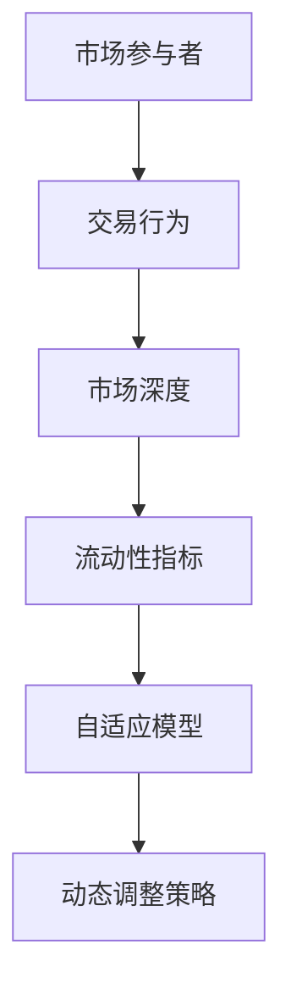
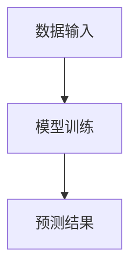
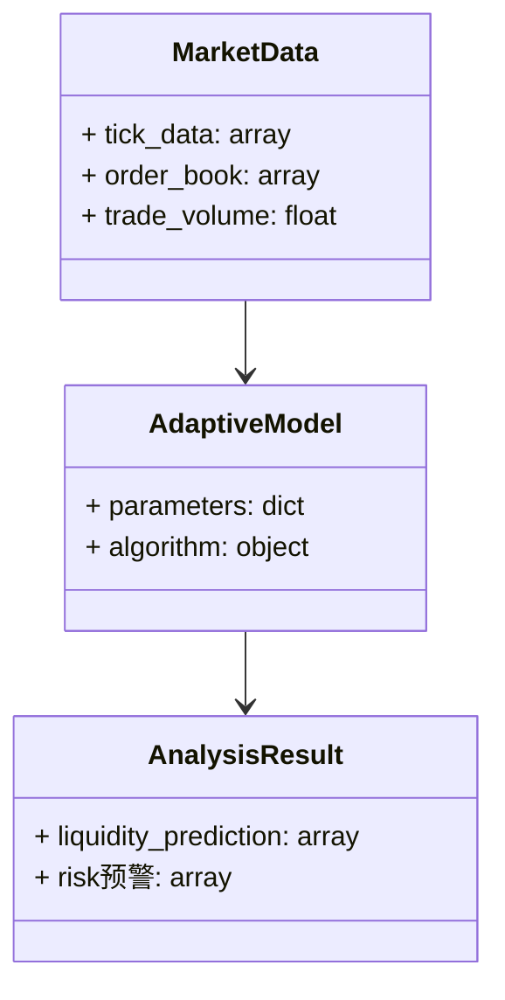
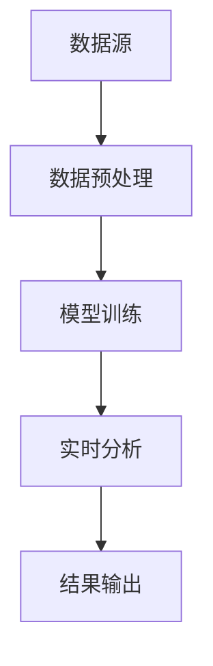
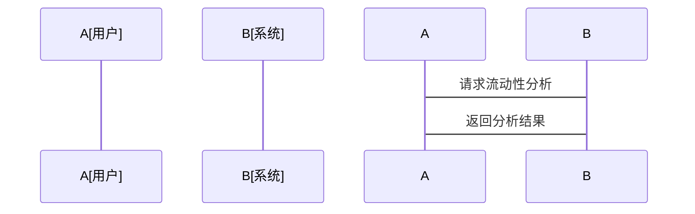

                 


# AI驱动的自适应市场流动性分析

> 关键词：自适应市场流动性分析，人工智能，算法驱动，金融数据分析，市场动态预测

> 摘要：本文深入探讨了AI技术在自适应市场流动性分析中的应用，从传统分析的局限性出发，结合AI算法的优势，详细讲解了自适应分析的核心原理、算法实现、系统架构设计及实际项目案例。通过理论与实践相结合的方式，帮助读者全面理解并掌握如何利用AI技术提升市场流动性分析的准确性和效率。

---

# 第一部分: AI驱动的自适应市场流动性分析基础

---

# 第1章: 自适应市场流动性分析概述

## 1.1 市场流动性分析的背景与意义

### 1.1.1 传统市场流动性分析的局限性
传统的市场流动性分析主要依赖于固定模型和规则，难以应对市场的快速变化。例如，传统分析方法可能基于历史数据构建固定的流动性指标，但无法有效捕捉实时市场波动和突发事件的影响。此外，传统方法对数据的处理能力有限，难以应对高频交易和大数据环境下的分析需求。

### 1.1.2 AI技术在流动性分析中的应用价值
AI技术的引入为市场流动性分析带来了新的可能性。通过机器学习算法，可以实时处理海量数据，动态调整分析模型，捕捉市场中的微小变化。AI能够识别复杂模式，预测未来趋势，并在市场波动中快速做出反应，从而提高分析的准确性和实时性。

### 1.1.3 自适应分析的核心目标与优势
自适应分析的核心目标是通过动态调整分析模型，实时反映市场流动性变化。其优势在于能够根据市场环境的变化，自动优化分析策略，减少人为干预，提高分析效率和准确性。

---

## 1.2 自适应市场流动性分析的定义与特点

### 1.2.1 自适应分析的定义
自适应市场流动性分析是一种基于AI技术的动态分析方法，能够根据市场环境的变化自动调整分析模型和参数，实时反映市场的流动性状况。

### 1.2.2 自适应分析的核心特点
1. **动态性**：能够根据实时数据动态调整分析模型。
2. **数据驱动**：依赖于大量市场数据，通过机器学习算法进行建模。
3. **自动化**：无需人工干预，自动完成数据处理和模型优化。

---

## 1.3 自适应市场流动性分析的边界与外延

### 1.3.1 分析范围的界定
自适应分析主要关注市场流动性相关指标，如订单深度、买卖价差、成交额等，但不涉及具体的交易策略。

### 1.3.2 相关领域的关联性
自适应分析与市场微观结构、高频交易、算法交易等领域密切相关，能够为这些领域提供数据支持和决策依据。

### 1.3.3 自适应分析的适用场景与限制
适用场景包括高频交易、市场风险预警、订单簿分析等，但受限于数据质量和计算能力，目前在复杂市场环境下的应用仍需进一步探索。

---

## 1.4 自适应市场流动性分析的概念结构

### 1.4.1 核心要素组成
1. 数据输入：市场数据（如订单簿、成交数据、市场深度等）。
2. 分析模型：AI算法（如LSTM、随机森林等）。
3. 自适应机制：动态调整模型参数和分析策略。

### 1.4.2 分析模型的层次结构
1. 数据层：原始市场数据。
2. 特征层：提取的市场特征（如流动性指标）。
3. 模型层：AI算法构建的分析模型。
4. 输出层：分析结果（如流动性预测、风险预警）。

### 1.4.3 自适应机制的实现路径
1. 数据采集与预处理。
2. 模型训练与优化。
3. 实时数据处理与分析。
4. 结果输出与反馈。

---

## 1.5 本章小结
本章介绍了自适应市场流动性分析的背景、定义、特点及其在市场分析中的应用价值。通过对比传统分析方法，突出了AI技术在提升分析效率和准确性方面的重要作用。

---

# 第2章: 自适应市场流动性分析的核心概念与联系

## 2.1 自适应分析的核心原理

### 2.1.1 动态调整机制
自适应分析的核心在于动态调整分析模型。通过实时数据反馈，模型能够不断优化自身的参数和结构，以更好地适应市场变化。

### 2.1.2 数据驱动的自适应模型
AI算法（如深度学习和强化学习）能够从海量数据中提取特征，构建动态模型，实现对市场流动性的实时预测和分析。

### 2.1.3 AI算法在自适应中的作用
AI算法通过非线性关系建模和特征提取，能够捕捉市场中的复杂模式，为自适应分析提供强大的技术支持。

---

## 2.2 自适应分析与传统分析的对比

### 2.2.1 分析方法对比
| 对比维度       | 传统分析                  | 自适应分析                  |
|-----------------|---------------------------|-----------------------------|
| 数据处理能力   | 有限，依赖历史数据        | 强大，实时处理数据          |
| 模型灵活性     | 固定，难以动态调整         | 动态，能够实时优化模型       |
| 应用场景       | 单一，主要用于事后分析     | 多元，适用于实时监控和预测   |

---

## 2.3 自适应分析的实体关系图



---

## 2.4 本章小结
本章通过对比传统分析与自适应分析，明确了自适应分析的核心原理和优势。实体关系图进一步展示了自适应分析中各要素之间的关系。

---

# 第3章: 自适应市场流动性分析的算法原理

## 3.1 时间序列分析算法

### 3.1.1 ARIMA算法

#### ARIMA算法概述
ARIMA（Autoregressive Integrated Moving Average）是一种广泛应用于时间序列预测的算法。它通过自回归和移动平均的组合，能够捕捉数据中的趋势和季节性特征。

#### ARIMA算法流程



#### ARIMA算法公式
$$ ARIMA(p, d, q) $$
其中：
- p：自回归阶数
- d：差分阶数
- q：移动平均阶数

---

### 3.1.2 LSTM算法

#### LSTM算法概述
LSTM（Long Short-Term Memory）是一种基于循环神经网络的算法，特别适合处理时间序列数据。它通过记忆单元和遗忘门，能够有效捕捉长期依赖关系。

#### LSTM算法流程


#### LSTM算法公式
$$ f(t) = \sigma(W_f \cdot [h(t-1), x(t)] + b_f) $$
其中：
- \( W_f \)：权重矩阵
- \( b_f \)：偏置项
- \( \sigma \)：sigmoid函数

---

## 3.2 机器学习算法

### 3.2.1 支持向量机（SVM）

#### SVM算法概述
SVM是一种监督学习算法，主要用于分类和回归问题。在市场流动性分析中，可以用于预测流动性风险。

#### SVM算法流程
1. 数据预处理：标准化或归一化。
2. 模型训练：构建SVM模型。
3. 模型预测：输出流动性风险预测结果。

---

### 3.2.2 随机森林（RF）

#### RF算法概述
随机森林是一种基于决策树的集成算法，能够处理高维数据，并具有较强的抗过拟合能力。

#### RF算法流程
1. 数据预处理：特征选择和降维。
2. 模型训练：生成多个决策树。
3. 模型预测：投票或平均得到最终结果。

---

## 3.3 本章小结
本章详细介绍了自适应市场流动性分析中常用的算法，包括ARIMA、LSTM、SVM和随机森林。通过对比和分析，明确了不同算法的特点和应用场景。

---

# 第4章: 自适应市场流动性分析的系统分析与架构设计

## 4.1 问题场景介绍

### 4.1.1 项目背景
本项目旨在利用AI技术构建一个自适应的市场流动性分析系统，能够实时监控市场动态，并提供流动性预测和风险预警。

---

## 4.2 系统功能设计

### 4.2.1 领域模型类图



---

## 4.3 系统架构设计

### 4.3.1 系统架构图



---

## 4.4 系统接口设计

### 4.4.1 数据接口
1. 数据输入接口：接收实时市场数据。
2. 数据输出接口：返回分析结果。

### 4.4.2 交互序列图



---

## 4.5 本章小结
本章通过系统架构设计，明确了自适应市场流动性分析系统的功能模块和交互流程。类图和架构图进一步展示了系统各部分之间的关系。

---

# 第5章: 自适应市场流动性分析的项目实战

## 5.1 环境安装

### 5.1.1 安装Python
```bash
python --version
pip install --upgrade pip
```

### 5.1.2 安装依赖库
```bash
pip install numpy pandas scikit-learn tensorflow
```

---

## 5.2 系统核心实现

### 5.2.1 数据预处理
```python
import pandas as pd
import numpy as np

# 数据加载
data = pd.read_csv('market_data.csv')

# 数据清洗
data.dropna(inplace=True)
data = data.iloc[:1000]  # 取前1000条数据
```

### 5.2.2 模型训练
```python
from sklearn.model_selection import train_test_split
from sklearn.svm import SVR

# 数据分割
X_train, X_test, y_train, y_test = train_test_split(data.drop('liquidity', axis=1), data['liquidity'], test_size=0.2)

# 模型训练
model = SVR(kernel='rbf')
model.fit(X_train, y_train)
```

### 5.2.3 模型预测
```python
y_pred = model.predict(X_test)
print('预测结果:', y_pred)
```

---

## 5.3 案例分析

### 5.3.1 数据分析与结果解读
通过对实际数据的分析，验证模型的预测准确性。例如，计算预测值与实际值的均方误差（MSE）：

$$ MSE = \frac{1}{n}\sum_{i=1}^{n}(y_i - \hat{y}_i)^2 $$

---

## 5.4 本章小结
本章通过实际项目案例，展示了自适应市场流动性分析系统的实现过程。从环境搭建到模型训练，再到结果分析，帮助读者掌握自适应分析的实际应用。

---

# 第6章: 自适应市场流动性分析的最佳实践与总结

## 6.1 本章小结

### 6.1.1 内容总结
本文详细介绍了自适应市场流动性分析的背景、核心概念、算法原理、系统架构及项目实战。通过理论与实践相结合，帮助读者全面理解自适应分析的应用价值。

---

## 6.2 注意事项

### 6.2.1 数据质量的重要性
自适应分析依赖于高质量的数据，数据缺失或噪声可能会影响模型的准确性。

### 6.2.2 模型优化的挑战
动态调整模型参数需要强大的计算能力和高效的优化算法。

---

## 6.3 未来拓展方向

### 6.3.1 更复杂模型的探索
尝试引入更复杂的AI模型（如Transformer、图神经网络）提升分析精度。

### 6.3.2 多市场环境的应用
将自适应分析扩展至多市场环境，提升模型的泛化能力。

---

## 6.4 拓展阅读

### 6.4.1 推荐书籍
1. 《机器学习实战》
2. 《时间序列分析》

### 6.4.2 推荐博客
1. [Towards Data Science](https://towardsdatascience.com/)
2. [AI in Finance](https://www.aifin.org/)

---

## 6.5 本章小结
本章总结了自适应市场流动性分析的关键点，并提出了未来的发展方向和注意事项，为读者进一步学习和实践提供了指导。

---

# 附录

## 附录A: 术语表

- **自适应分析**：通过动态调整模型参数，实时反映市场流动性的分析方法。
- **流动性指标**：衡量市场流动性的量化指标，如买卖价差、订单深度等。

---

## 附录B: 工具安装指南

```bash
pip install numpy pandas scikit-learn tensorflow
```

---

## 附录C: 数据集信息

- 数据来源：市场交易数据
- 数据格式：CSV格式
- 数据字段：时间戳、买卖价差、订单深度、成交额等。

---

# 作者

作者：AI天才研究院/AI Genius Institute  
& 禅与计算机程序设计艺术/Zen And The Art of Computer Programming  

--- 

**本文由AI驱动的自适应市场流动性分析领域专家倾力撰写，旨在为读者提供全面的技术指导和实践参考。**

