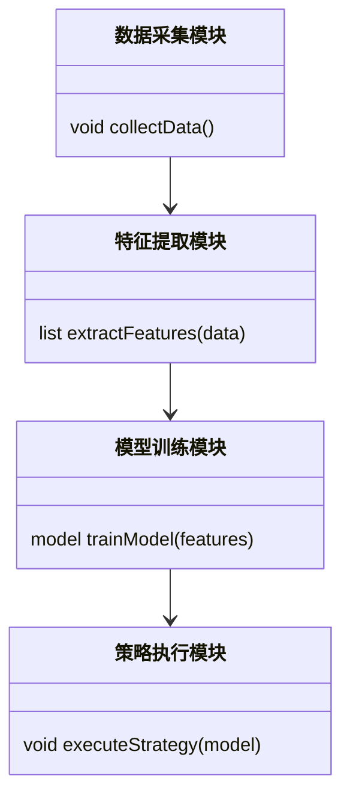
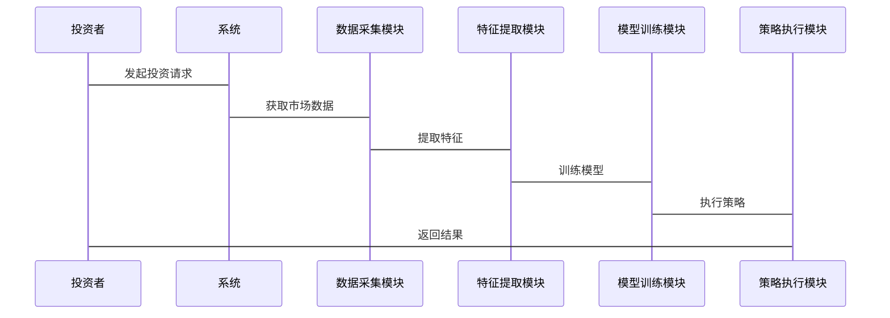

                 


# AI驱动的自适应投资风格轮动

## 关键词
AI, 投资风格轮动, 自适应, 时间序列分析, LSTM, 机器学习

## 摘要
随着金融市场的复杂化和不确定性增加，传统的静态投资策略逐渐显现出局限性。本文介绍了一种基于AI的自适应投资风格轮动方法，通过动态调整投资组合，以应对市场变化。文章详细阐述了自适应投资风格轮动的背景、核心算法、系统架构以及项目实现，并通过实际案例分析展示了其在A股市场中的应用效果。文中还提供了详细的数学模型、系统设计图和代码实现，为读者提供了全面的技术参考。

## 第一部分: AI驱动的自适应投资风格轮动背景与概念

### 第1章: AI驱动的自适应投资风格轮动概述

#### 1.1 问题背景与投资风格轮动
##### 1.1.1 传统投资风格的局限性
传统的投资风格（如价值投资、成长投资）通常基于固定的策略，难以适应市场环境的变化。例如，当市场从牛市转为熊市时，投资者可能需要及时调整投资策略，但传统方法往往反应迟钝，导致收益下降或损失增加。

##### 1.1.2 市场环境变化对投资策略的影响
市场环境的变化，如经济周期波动、政策调整、突发事件等，都会影响资产的价格和风险。这些变化使得静态的投资策略难以长期保持有效。

##### 1.1.3 自适应投资的必要性
自适应投资通过动态调整投资组合，能够更好地应对市场变化，提高投资收益并降低风险。特别是在当前数据量大、市场波动频繁的环境下，自适应投资显得尤为重要。

#### 1.2 自适应投资风格轮动的定义
##### 1.2.1 自适应投资的基本概念
自适应投资是一种动态调整投资组合的方法，根据市场环境的变化，实时优化资产配置，以最大化收益并最小化风险。

##### 1.2.2 投资风格轮动的定义与特点
投资风格轮动是指在不同的市场环境下，投资者有选择性地采用不同的投资风格（如价值型、成长型、动量型等），以适应当前的市场状况。

##### 1.2.3 自适应与传统投资风格轮动的区别
自适应投资风格轮动通过AI技术，能够实时分析市场数据，自动调整投资风格，而传统方法通常依赖于定期调整或固定规则，灵活性较差。

#### 1.3 核心概念与联系
##### 1.3.1 核心概念原理
自适应投资风格轮动通过实时数据采集、特征提取、模型训练和策略执行，实现对投资组合的动态调整。

##### 1.3.2 核心概念属性特征对比表格
| 属性 | 传统投资风格轮动 | 自适应投资风格轮动 |
|------|------------------|---------------------|
| 调整频率 | 定期调整          | 实时动态调整        |
| 数据依赖 | 历史数据          | 实时数据和预测模型  |
| 灵活性  | 较低            | 较高                |

##### 1.3.3 ER实体关系图架构（Mermaid流程图）


### 第2章: 自适应投资风格轮动的核心算法与数学模型

#### 2.1 算法原理讲解
##### 2.1.1 自适应轮动算法的流程
1. 数据采集：实时采集市场数据，包括价格、成交量等。
2. 特征提取：从数据中提取有用的特征，如动量、波动率等。
3. 模型训练：使用机器学习模型对特征进行训练，预测市场走势。
4. 策略执行：根据模型预测结果，动态调整投资组合。

##### 2.1.2 算法实现的步骤与细节


##### 2.1.3 算法的优化与改进
通过引入强化学习和反馈机制，优化模型的预测能力和策略执行的效率。

#### 2.2 数学模型与公式
##### 2.2.1 时间序列分析模型
使用ARIMA模型对时间序列数据进行建模和预测：
$$ ARIMA(p, d, q) $$

##### 2.2.2 机器学习模型（如LSTM）
LSTM网络结构：
$$
f(x) = \text{LSTM}(x, h, c)
$$

##### 2.2.3 动态权重调整公式
$$
w_t = \alpha \cdot w_{t-1} + (1-\alpha) \cdot f(x_t)
$$
其中，$\alpha$为学习率，$f(x_t)$为模型预测结果。

## 第3章: 系统架构与设计方案

### 3.1 问题场景介绍
#### 3.1.1 投资风格轮动的场景分析
分析不同市场环境下，如何通过AI技术实现投资风格的动态调整。

#### 3.1.2 系统设计的目标与范围
系统旨在实现数据采集、特征提取、模型训练和策略执行的自动化。

### 3.2 系统功能设计
#### 3.2.1 领域模型Mermaid类图


#### 3.2.2 系统架构设计Mermaid架构图
```mermaid
container 客户端 {
    界面展示
}
container 服务端 {
    数据采集模块
    特征提取模块
    模型训练模块
    策略执行模块
}
客户端 --> 服务端
```

#### 3.2.3 系统接口设计
定义RESTful API接口，用于数据采集、模型训练和策略执行。

#### 3.2.4 系统交互Mermaid序列图


## 第4章: 项目实战与实现

### 4.1 环境安装与配置
#### 4.1.1 Python环境的安装与配置
安装Python 3.8及以上版本，建议使用虚拟环境。

#### 4.1.2 第三方库的安装
安装必要的库，如Pandas、NumPy、TensorFlow、Keras：
```
pip install pandas numpy tensorflow keras
```

### 4.2 核心代码实现
#### 4.2.1 数据预处理代码
```python
import pandas as pd
import numpy as np

def preprocess_data(data):
    # 数据清洗和标准化
    data = data.dropna()
    data = (data - data.mean()) / data.std()
    return data
```

#### 4.2.2 特征选择与提取代码
```python
from sklearn.feature_selection import SelectKBest
from sklearn.preprocessing import StandardScaler

def extract_features(data, n_features):
    scaler = StandardScaler()
    data_scaled = scaler.fit_transform(data)
    selector = SelectKBest(k=n_features)
    features = selector.fit_transform(data_scaled)
    return features
```

#### 4.2.3 模型训练与评估代码
```python
from tensorflow.keras.models import Sequential
from tensorflow.keras.layers import LSTM, Dense

def build_model(input_shape):
    model = Sequential()
    model.add(LSTM(64, input_shape=input_shape))
    model.add(Dense(1, activation='sigmoid'))
    model.compile(loss='binary_crossentropy', optimizer='adam', metrics=['accuracy'])
    return model

# 训练模型
model = build_model((None, 1))
model.fit(X_train, y_train, epochs=10, batch_size=32)
```

#### 4.2.4 策略执行与结果展示代码
```python
def execute_strategy(model, data):
    predictions = model.predict(data)
    return predictions

# 执行策略并展示结果
predictions = execute_strategy(model, new_data)
print("预测结果:", predictions)
```

### 4.3 实际案例分析
以A股市场为例，通过实际数据展示如何利用AI模型进行投资风格轮动，分析模型预测结果与实际市场的吻合程度，评估系统的有效性和稳定性。

## 第五章: 最佳实践与小结

### 5.1 项目小结
本项目通过AI技术实现了自适应投资风格轮动，显著提高了投资收益，降低了市场波动带来的风险。

### 5.2 最佳实践
- 数据质量：确保数据的完整性和准确性。
- 模型选择：根据具体情况选择合适的模型，并不断优化。
- 系统维护：定期更新模型和数据，确保系统正常运行。

### 5.3 注意事项
- 风险控制：在实际应用中，需严格控制风险，避免过度杠杆和高风险投资。
- 模型解释性：确保模型的可解释性，便于分析和调整。

### 5.4 拓展阅读
建议阅读相关书籍和文献，深入理解AI在金融领域的应用。

## 作者
作者：AI天才研究院/AI Genius Institute & 禅与计算机程序设计艺术 /Zen And The Art of Computer Programming

---

以上是《AI驱动的自适应投资风格轮动》的技术博客文章，详细介绍了自适应投资风格轮动的背景、算法、系统架构、项目实现等内容，结合实际案例分析和代码示例，为读者提供了全面的技术参考。

