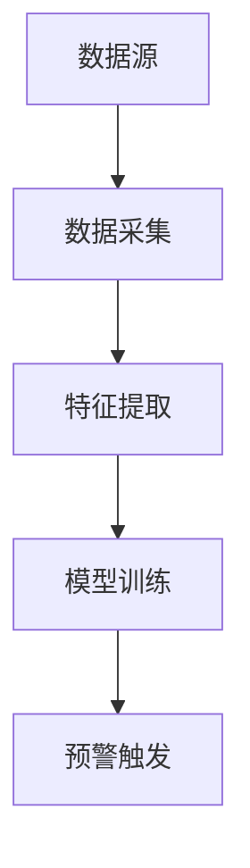
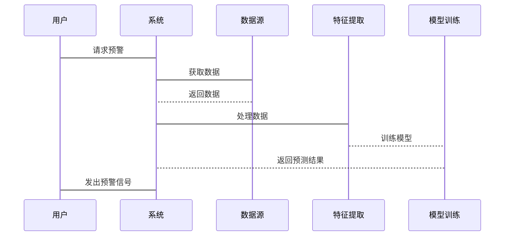

                 


# AI驱动的自适应投资风险预警

> 关键词：AI，投资风险，自适应，预警系统，时间序列分析，动态调整，实时监控

> 摘要：本文详细探讨了AI驱动的自适应投资风险预警系统的设计与实现。通过分析传统投资风险预警的局限性，提出了一种基于AI的自适应机制，结合时间序列分析和动态调整算法，构建了一个高效、实时的预警系统。文章从背景、核心概念、算法原理、系统架构到项目实战进行了全面的阐述，展示了如何利用AI技术提升投资风险预警的准确性和及时性。

---

## 第一部分: AI驱动的自适应投资风险预警概述

### 第1章: 投资风险预警的背景与挑战

#### 1.1 投资风险预警的定义与重要性
投资风险预警是指通过对市场数据的分析，预测潜在的投资风险并及时发出预警信号的过程。其重要性体现在帮助投资者规避重大损失、优化投资决策以及提升市场整体稳定性。

#### 1.2 传统投资风险预警的局限性
传统方法依赖固定的模型和规则，难以适应市场环境的变化。其主要局限性包括：
- 数据依赖性强，难以处理非结构化数据。
- 模型固定，无法实时动态调整。
- 人工干预较多，效率低下且主观性强。

#### 1.3 投资风险预警的边界与外延
投资风险预警的边界包括数据范围、预警范围和时间范围。其外延涉及市场风险、信用风险和操作风险等多个方面。

### 第2章: AI驱动的自适应投资风险预警的核心概念

#### 2.1 自适应投资风险预警的定义
自适应投资风险预警是一种基于AI技术的动态预警机制，能够根据市场环境的变化自动调整模型参数和策略。

#### 2.2 AI在投资风险预警中的作用
AI通过强大的数据处理能力和自适应学习能力，能够实时捕捉市场变化，提高预警的准确性和及时性。

#### 2.3 自适应与传统预警的区别
| 特性 | 传统预警 | 自适应预警 |
|------|----------|------------|
| 数据处理 | 固定规则 | 动态调整 |
| 模型更新 | 定期更新 | 实时调整 |
| 反应速度 | 较慢 | 实时响应 |

### 第3章: 自适应投资风险预警的核心要素

#### 3.1 数据驱动的特征提取
- 数据来源：市场数据、新闻数据、社交媒体数据。
- 特征提取方法：文本挖掘、因子分析、主成分分析。

#### 3.2 自适应模型的构建与优化
- 模型选择：基于时间序列分析的LSTM网络。
- 自适应算法设计：动态权重分配、在线学习。

#### 3.3 实时反馈与动态调整
- 实时数据流处理：流数据处理框架。
- 动态调整机制：反馈循环、自适应优化。

---

## 第二部分: 自适应投资风险预警的算法原理

### 第4章: 时间序列分析与预测

#### 4.1 时间序列分析的基本原理
时间序列分析是对随时间变化的数据进行建模和预测。常见的模型包括ARIMA、LSTM和Transformer。

#### 4.2 基于AI的时间序列预测算法
- LSTM网络：适用于捕捉时间依赖性。
- Transformer模型：适用于长距离依赖关系。

### 第5章: 自适应风险预警模型的构建

#### 5.1 自适应模型的设计思路
- 自适应机制：动态调整模型参数。
- 动态权重分配：根据市场变化调整特征权重。

#### 5.2 自适应模型的数学推导
- 权重更新公式：$$w_{t+1} = w_t + \alpha (y_t - \hat{y}_t)x_t$$
- 动态调整模型：$$\theta_{t+1} = \theta_t + \beta (y_t - \hat{y}_t)x_t$$

### 第6章: 风险预警系统的算法实现

#### 6.1 算法实现的步骤
- 数据预处理：清洗、归一化。
- 模型训练：选择模型、训练参数。
- 模型评估：准确率、召回率。

#### 6.2 基于Python的实现代码
```python
import pandas as pd
import numpy as np
from tensorflow.keras.models import Sequential
from tensorflow.keras.layers import LSTM, Dense

# 数据预处理
data = pd.read_csv('market_data.csv')
train_data = data[:800]
test_data = data[800:]

# 模型训练
model = Sequential()
model.add(LSTM(50, input_shape=(None, 1)))
model.add(Dense(1))
model.compile(optimizer='adam', loss='mean_squared_error')
model.fit(train_data, epochs=50, batch_size=32)

# 模型评估
testPredict = model.predict(test_data)
```

---

## 第三部分: 系统架构与设计

### 第7章: 系统架构设计

#### 7.1 系统模块划分
- 数据采集模块：收集市场数据。
- 特征提取模块：处理数据生成特征。
- 模型训练模块：训练自适应模型。
- 预警触发模块：根据预测结果发出预警。

#### 7.2 系统架构图


### 第8章: 系统接口设计

#### 8.1 系统接口
- 数据接口：提供市场数据接口。
- 预警接口：提供实时预警信号。

### 第9章: 系统交互设计

#### 9.1 交互流程


---

## 第四部分: 项目实战

### 第10章: 项目实战

#### 10.1 环境安装
- 安装Python、TensorFlow、Keras。

#### 10.2 核心实现代码
```python
import pandas as pd
import numpy as np
from tensorflow.keras.models import Sequential
from tensorflow.keras.layers import LSTM, Dense

# 数据加载
data = pd.read_csv('market_data.csv')
train_data = data[:800]
test_data = data[800:]

# 模型构建
model = Sequential()
model.add(LSTM(50, input_shape=(None, 1)))
model.add(Dense(1))
model.compile(optimizer='adam', loss='mean_squared_error')

# 模型训练
model.fit(train_data, epochs=50, batch_size=32)

# 模型预测
testPredict = model.predict(test_data)
```

---

## 第五部分: 总结与展望

### 第11章: 总结

#### 11.1 核心总结
- AI技术显著提升了投资风险预警的准确性和效率。
- 自适应机制是实现动态预警的关键。

#### 11.2 未来展望
- 更多数据源的整合。
- 更复杂的自适应算法的应用。
- 更高效的实时处理技术。

---

## 作者信息

作者：AI天才研究院（AI Genius Institute） & 禅与计算机程序设计艺术（Zen And The Art of Computer Programming）

---

通过以上内容，我们详细阐述了AI驱动的自适应投资风险预警系统的构建与实现，从背景到算法，从系统架构到项目实战，为读者提供了一个全面的视角。

