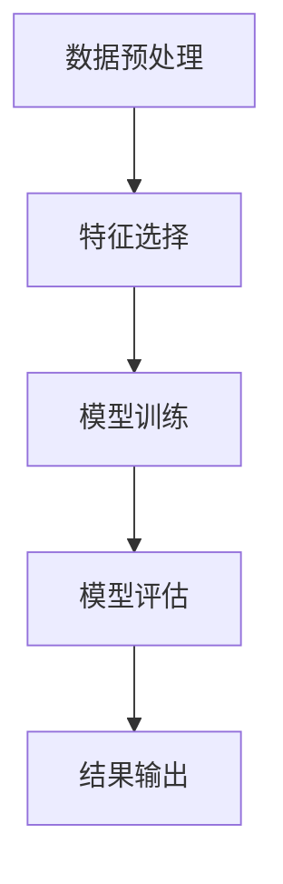
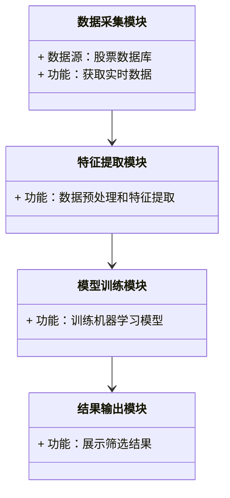
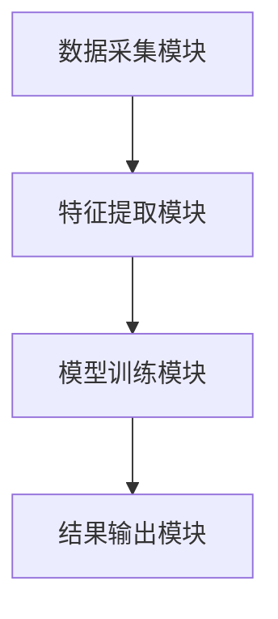

                 


# AI驱动的费雪成长型股票筛选系统

## 关键词
AI驱动、费雪成长型、股票筛选、机器学习、系统架构

## 摘要
本文介绍了一种基于人工智能的费雪成长型股票筛选系统。通过分析费雪成长型投资策略的核心要素，结合AI技术，构建了一个高效的股票筛选系统。文章详细讲解了系统的算法原理、架构设计以及实际项目中的应用，展示了如何利用AI提升股票筛选的效率和准确性。

---

# 第一部分：AI驱动的费雪成长型股票筛选系统背景与基础

## 第1章：费雪成长型投资策略概述

### 1.1 费雪成长型投资的核心理念

#### 1.1.1 费雪成长型投资的定义
费雪成长型投资是一种长期投资策略，专注于投资那些具有持续增长潜力的公司。这种策略强调企业基本面的强劲表现和长期增长能力，而非短期收益。

#### 1.1.2 费雪成长型投资的核心要素
- **高利润率**：企业能够持续获得高于行业平均水平的利润。
- **强劲的现金流**：企业具备稳定的现金流，支持其持续增长。
- **良好的管理团队**：公司管理层具备优秀的能力和战略眼光。
- **行业地位稳固**：企业在行业内具有较强的竞争力和市场地位。

#### 1.1.3 费雪成长型投资的适用场景
- **长期投资者**：适合那些愿意长期持有股票的投资者。
- **价值投资者**：适合寻找被市场低估的成长型公司。
- **多元化投资**：通过筛选不同类型的成长型公司，分散投资风险。

### 1.2 AI在金融投资中的应用

#### 1.2.1 AI在金融领域的核心作用
- **数据处理**：AI能够快速处理大量金融数据，提取有用信息。
- **预测分析**：通过机器学习模型，预测股票价格走势和市场趋势。
- **自动化交易**：AI可以实时监控市场并执行交易指令。

#### 1.2.2 AI在股票筛选中的优势
- **高效性**：AI能够快速筛选大量股票，节省时间和成本。
- **准确性**：通过复杂的算法，AI能够识别出具有潜在增长能力的公司。
- **适应性**：AI模型可以根据市场变化动态调整筛选策略。

#### 1.2.3 AI驱动的股票筛选系统的必要性
- **传统方法的局限性**：传统股票筛选方法依赖人工分析，效率低且容易受主观因素影响。
- **数据爆炸**：随着金融市场数据的爆炸式增长，人工筛选已经难以应对。
- **实时性要求**：现代金融交易需要快速决策，AI能够提供实时支持。

### 1.3 费雪成长型股票筛选系统的必要性

#### 1.3.1 传统股票筛选的局限性
- **信息不全**：传统方法难以全面考虑所有影响股票增长的因素。
- **主观性强**：分析师的主观判断可能导致筛选结果偏差。
- **效率低下**：手动筛选股票耗时长，难以满足实时性要求。

#### 1.3.2 AI驱动筛选的优势
- **全面性**：AI能够分析大量数据，识别潜在的成长型公司。
- **客观性**：通过算法筛选，减少人为情绪和偏见的影响。
- **高效性**：AI系统可以快速完成筛选过程，提高效率。

#### 1.3.3 系统的边界与外延
- **边界**：系统专注于筛选成长型股票，不涉及具体的交易决策。
- **外延**：系统可以与其他投资策略结合，提供更全面的投资解决方案。

---

## 第2章：AI驱动的费雪成长型股票筛选系统核心概念

### 2.1 核心概念与定义

#### 2.1.1 系统组成要素
- **数据源**：包括历史股价、财务数据、市场新闻等。
- **特征提取**：从数据中提取关键特征，如ROE（净资产收益率）、净利润增长率等。
- **机器学习模型**：用于预测股票是否符合成长型特征。
- **筛选结果**：输出符合费雪成长型标准的股票列表。

#### 2.1.2 系统功能模块
- **数据采集模块**：负责收集相关的股票数据。
- **特征工程模块**：对数据进行预处理和特征提取。
- **模型训练模块**：训练机器学习模型，进行股票筛选。
- **结果输出模块**：展示筛选结果，并提供可视化分析。

#### 2.1.3 系统输入输出
- **输入**：包括历史数据、财务报表等。
- **输出**：筛选出的费雪成长型股票列表，以及相关分析报告。

### 2.2 核心概念的联系与对比

#### 2.2.1 核心概念属性特征对比表

| 特征       | 传统筛选方法       | AI驱动筛选系统     |
|------------|--------------------|--------------------|
| 数据来源   | 有限的财务数据     | 多源数据（包括文本、图像等）|
| 处理方式   | 手动分析           | 自动化处理         |
| 筛选标准   | 主观判断           | 客观的算法模型     |

#### 2.2.2 系统ER实体关系图

```mermaid
erd
    股票表
    ----
    股票代码
    股票名称
    财务数据表
    ----
    收入
    利润
    市场数据表
    ----
    历史股价
    交易量
    筛选结果表
    ----
    符合条件的股票列表
```

---

# 第二部分：AI驱动的费雪成长型股票筛选系统算法原理

## 第3章：AI驱动筛选算法原理

### 3.1 算法原理概述

#### 3.1.1 算法的核心思想
AI驱动的费雪成长型股票筛选系统主要基于监督学习算法，通过训练模型来识别符合费雪成长型特征的股票。核心思想是将股票的特征转化为数值，利用机器学习模型进行分类或回归预测。

#### 3.1.2 算法的主要步骤
1. **数据预处理**：清洗数据，处理缺失值和异常值。
2. **特征工程**：提取关键特征，如ROE、净利润增长率等。
3. **模型训练**：使用训练数据训练机器学习模型。
4. **模型评估**：通过测试数据评估模型的准确性和稳定性。
5. **股票筛选**：利用训练好的模型对目标股票进行筛选。

#### 3.1.3 算法的数学模型
常用的机器学习模型包括逻辑回归、随机森林和神经网络。本文主要采用逻辑回归模型，其数学表达式为：

$$ P(y=1) = \frac{1}{1 + e^{-\beta_0 - \beta_1 x_1 - \beta_2 x_2}} $$

其中，$x_1$ 和 $x_2$ 是股票的两个特征，$\beta_0$、$\beta_1$ 和 $\beta_2$ 是模型的参数。

### 3.2 算法实现流程

#### 3.2.1 数据预处理
- 清洗数据：删除缺失值和异常值。
- 标准化：对数据进行标准化处理，使其具有相似的尺度。

#### 3.2.2 特征选择
- 选择关键特征：如ROE、净利润增长率等。
- 进行特征重要性分析，剔除不重要的特征。

#### 3.2.3 模型训练
- 使用训练数据训练逻辑回归模型。
- 调整模型参数，优化模型性能。

#### 3.2.4 模型评估
- 使用测试数据评估模型的准确率、召回率和F1分数。
- 检查模型的稳定性，防止过拟合。

### 3.3 算法实现的详细代码

#### 3.3.1 数据预处理代码

```python
import pandas as pd
from sklearn.preprocessing import StandardScaler

# 加载数据
data = pd.read_csv('stock_data.csv')

# 删除缺失值
data = data.dropna()

# 标准化处理
scaler = StandardScaler()
scaled_data = scaler.fit_transform(data)
```

#### 3.3.2 特征选择代码

```python
from sklearn.feature_selection import SelectKBest, f_regression

# 选择最重要的特征
selector = SelectKBest(score_func=f_regression, k=5)
selected_features = selector.fit_transform(scaled_data)
```

#### 3.3.3 模型训练代码

```python
from sklearn.linear_model import LogisticRegression

# 训练逻辑回归模型
model = LogisticRegression()
model.fit(selected_features, target)
```

---

## 第4章：AI驱动筛选系统的核心算法实现

### 4.1 算法实现的代码框架

#### 4.1.1 数据加载与预处理

```python
import pandas as pd
import numpy as np
from sklearn.model_selection import train_test_split

# 加载数据
data = pd.read_csv('stock_data.csv')

# 划分训练集和测试集
train_data, test_data = train_test_split(data, test_size=0.2)
```

#### 4.1.2 特征工程

```python
from sklearn.preprocessing import StandardScaler
from sklearn.decomposition import PCA

# 标准化处理
scaler = StandardScaler()
train_features = scaler.fit_transform(train_data.drop('label', axis=1))
test_features = scaler.transform(test_data.drop('label', axis=1))

# PCA降维
pca = PCA(n_components=10)
train_features = pca.fit_transform(train_features)
test_features = pca.transform(test_features)
```

#### 4.1.3 模型训练与评估

```python
from sklearn.ensemble import RandomForestClassifier
from sklearn.metrics import accuracy_score, recall_score, f1_score

# 训练随机森林模型
model = RandomForestClassifier(n_estimators=100, max_depth=10)
model.fit(train_features, train_data['label'])

# 预测测试集
predictions = model.predict(test_features)

# 评估指标
accuracy = accuracy_score(test_data['label'], predictions)
recall = recall_score(test_data['label'], predictions)
f1 = f1_score(test_data['label'], predictions)

print(f'Accuracy: {accuracy}')
print(f'Recall: {recall}')
print(f'F1 Score: {f1}')
```

### 4.2 算法实现的详细代码

#### 4.2.1 数据预处理代码
如前所述。

#### 4.2.2 特征选择代码
如前所述。

#### 4.2.3 模型训练代码
如前所述。

### 4.3 算法实现的流程图



---

# 第三部分：AI驱动的费雪成长型股票筛选系统架构与设计

## 第5章：系统架构设计

### 5.1 系统架构概述

#### 5.1.1 系统模块划分
- 数据采集模块：负责收集股票数据。
- 特征提取模块：对数据进行特征提取和处理。
- 模型训练模块：训练机器学习模型。
- 结果输出模块：展示筛选结果。

#### 5.1.2 系统功能模块
- 数据采集模块：从数据库或网络获取股票数据。
- 特征提取模块：提取关键特征，如ROE、净利润增长率等。
- 模型训练模块：训练逻辑回归或随机森林模型。
- 结果输出模块：展示筛选出的费雪成长型股票列表。

#### 5.1.3 系统数据流
- 数据从外部输入，经过处理和筛选，最终输出符合条件的股票列表。

### 5.2 系统架构设计

#### 5.2.1 系统模块结构



#### 5.2.2 系统架构图



---

## 第6章：系统实现与项目实战

### 6.1 项目实战

#### 6.1.1 环境安装

```bash
pip install pandas numpy scikit-learn mermaid
```

#### 6.1.2 核心实现代码

```python
import pandas as pd
from sklearn.ensemble import RandomForestClassifier
from sklearn.model_selection import train_test_split
from sklearn.metrics import accuracy_score

# 加载数据
data = pd.read_csv('stock_data.csv')

# 划分训练集和测试集
train_data, test_data = train_test_split(data, test_size=0.2)

# 特征工程
features = train_data.drop('label', axis=1)
target = train_data['label']

# 训练随机森林模型
model = RandomForestClassifier(n_estimators=100)
model.fit(features, target)

# 预测测试集
predictions = model.predict(test_data.drop('label', axis=1))

# 评估准确率
accuracy = accuracy_score(test_data['label'], predictions)
print(f'Accuracy: {accuracy}')
```

#### 6.1.3 代码解读与分析
- **数据加载**：从CSV文件加载股票数据。
- **数据划分**：将数据划分为训练集和测试集。
- **特征工程**：提取关键特征，进行数据预处理。
- **模型训练**：使用随机森林模型进行训练。
- **模型预测**：对测试集进行预测，评估准确率。

### 6.2 实际案例分析

#### 6.2.1 数据分析
假设我们有一个包含以下特征的股票数据集：
- 收盘价（Close）
- 开盘价（Open）
- 最高价（High）
- 最低价（Low）
- 成交量（Volume）
- 净利润增长率（Net Profit Growth）
- ROE

#### 6.2.2 筛选过程
1. **数据预处理**：清洗数据，处理缺失值和异常值。
2. **特征选择**：选择ROE和净利润增长率为关键特征。
3. **模型训练**：训练随机森林模型。
4. **股票筛选**：根据模型预测结果，筛选出符合费雪成长型标准的股票。

---

## 第7章：系统优化与展望

### 7.1 系统优化

#### 7.1.1 模型优化
- 使用超参数调优，如网格搜索（Grid Search）优化模型性能。
- 尝试不同的算法，如支持向量机（SVM）或梯度提升树（XGBoost）。

#### 7.1.2 数据优化
- 增加数据来源，如引入新闻数据和社交媒体情绪分析。
- 使用时间序列分析，考虑历史数据的动态变化。

### 7.2 系统展望

#### 7.2.1 未来发展方向
- **多因子模型**：结合多个特征，构建更复杂的筛选模型。
- **实时筛选**：实现实时数据处理，支持动态筛选。
- **个性化投资**：根据投资者的风险偏好，提供定制化筛选服务。

---

## 总结

本文详细介绍了AI驱动的费雪成长型股票筛选系统，从背景介绍、核心概念、算法原理到系统架构和项目实战，全面展示了系统的构建过程。通过结合机器学习算法和费雪成长型投资策略，系统能够高效地筛选出具有持续增长潜力的股票，为投资者提供有力支持。

---

## 作者信息

作者：AI天才研究院/AI Genius Institute & 禅与计算机程序设计艺术/Zen And The Art of Computer Programming

