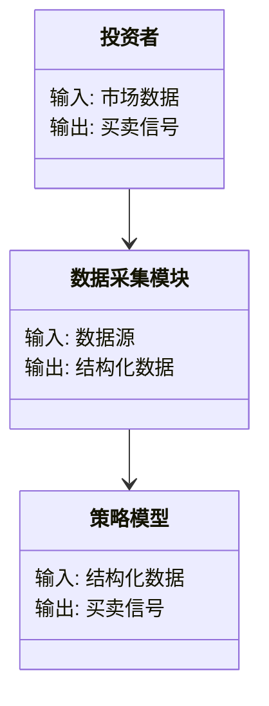
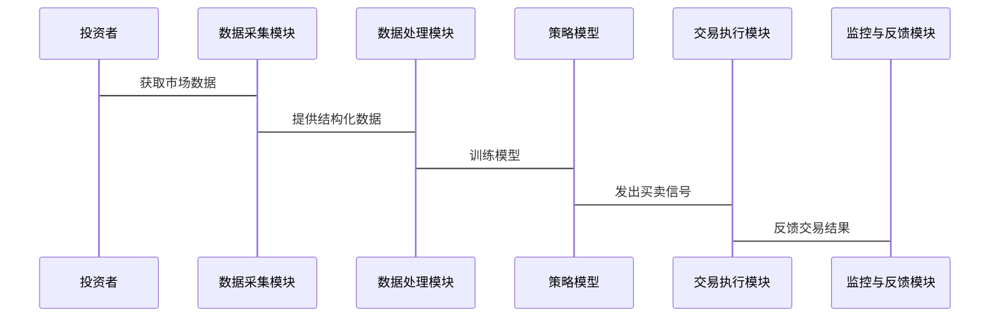

                 


# AI驱动的逆向投资策略实现

> 关键词：AI，逆向投资，投资策略，强化学习，生成模型，金融数据分析

> 摘要：  
本文详细探讨了如何利用人工智能技术实现逆向投资策略。通过分析逆向投资的基本概念、AI在金融投资中的应用背景，以及结合强化学习和生成模型的算法原理，本文为读者提供了一种基于AI的逆向投资策略实现框架。文章还通过项目实战展示了如何构建AI驱动的逆向投资系统，并提出了相应的系统架构设计和最佳实践建议。

---

# 第1章: 逆向投资策略概述

## 1.1 逆向投资的定义与特点

### 1.1.1 逆向投资的定义
逆向投资是一种投资策略，强调在市场恐慌或低估时买入，在市场狂热或高估时卖出。与传统投资策略不同，逆向投资注重逆市场情绪操作，追求在非理性市场中寻找投资机会。

### 1.1.2 逆向投资的核心特点
- **反向思维**：在市场下跌时寻找价值，避免追涨杀跌。
- **长期视角**：逆向投资需要耐心持有优质资产，等待市场回归理性。
- **风险管理**：通过逆向策略降低市场波动对投资组合的影响。

### 1.1.3 逆向投资与传统投资的对比
| 特性 | 逆向投资 | 传统投资 |
|------|----------|----------|
| 投资时机 | 市场低点 | 市场高点 |
| 风险控制 | 强调安全边际 | 侧重收益最大化 |
| 交易频率 | 低频交易 | 高频交易 |

## 1.2 AI在金融投资中的应用背景

### 1.2.1 金融数据分析的挑战
金融数据具有以下特点：
- 数据量大：包括股票价格、成交量、新闻等多源数据。
- 数据维度高：涉及技术指标、基本面数据等多维度信息。
- 数据波动性强：市场价格波动频繁，预测难度大。

### 1.2.2 AI技术在金融领域的优势
- **数据处理能力**：AI能够快速处理海量金融数据，提取有价值的信息。
- **模式识别**：AI通过深度学习模型能够发现数据中的非线性关系和潜在规律。
- **实时性**：AI算法可以实现实时数据分析和策略执行。

### 1.2.3 逆向投资与AI结合的可行性
AI技术可以帮助投资者：
- **识别市场情绪**：通过自然语言处理（NLP）分析新闻、社交媒体等信息，判断市场情绪。
- **预测市场拐点**：利用时间序列模型预测价格波动和市场趋势。
- **优化投资组合**：通过强化学习优化资产配置，降低风险。

## 1.3 逆向投资策略的核心要素

### 1.3.1 投资标的筛选标准
- **估值指标**：市盈率（P/E）、市净率（P/B）等。
- **基本面分析**：公司财务状况、行业地位等。
- **技术分析**：K线图、均线、成交量等技术指标。

### 1.3.2 市场情绪分析的重要性
市场情绪是逆向投资的关键因素。当市场情绪极度悲观时，往往是买入的机会；当市场情绪极度乐观时，可能是卖出的信号。

### 1.3.3 风险控制与收益优化
- **止损策略**：设定止损点，避免重大损失。
- **分散投资**：通过多元化投资降低风险。
- **动态调整**：根据市场变化动态调整投资组合。

## 1.4 本章小结
本章介绍了逆向投资的基本概念、特点以及与传统投资的对比。同时，探讨了AI技术在金融投资中的应用背景，分析了逆向投资与AI结合的可行性。

---

# 第2章: AI驱动的逆向投资策略实现框架

## 2.1 数据采集与预处理

### 2.1.1 数据来源渠道
- **股票市场数据**：包括历史价格、成交量等。
- **新闻数据**：包括公司公告、行业新闻等。
- **社交媒体数据**：包括投资者情绪分析数据。

### 2.1.2 数据清洗与特征提取
- **数据清洗**：去除缺失值、异常值等。
- **特征提取**：提取有用的特征，如移动平均线、相对强弱指数（RSI）等。

### 2.1.3 数据标准化与格式化
- **标准化**：将数据归一化处理，方便模型输入。
- **格式化**：将数据转换为模型所需的格式，如时间序列数据。

## 2.2 策略模型构建

### 2.2.1 策略生成算法选择
- **强化学习**：通过策略网络生成买卖信号。
- **生成模型**：通过生成对抗网络（GAN）生成虚拟市场数据，辅助策略制定。

### 2.2.2 模型训练与优化
- **训练数据**：使用历史市场数据训练模型。
- **优化目标**：最大化投资收益，最小化回撤。

### 2.2.3 模型评估与验证
- **回测**：在历史数据上验证策略的有效性。
- **风险指标**：计算最大回撤、夏普比率等风险指标。

## 2.3 策略执行与反馈

### 2.3.1 策略执行机制
- **自动交易**：通过API连接交易平台，实现自动化交易。
- **手动干预**：在市场出现极端情况时，人工干预策略执行。

### 2.3.2 策略效果反馈与调整
- **实时监控**：监控策略执行效果，及时调整参数。
- **模型更新**：定期更新模型，保持策略的有效性。

### 2.3.3 策略迭代与优化
- **参数优化**：通过超参数搜索优化策略表现。
- **模型改进**：引入新的算法和技术，提升策略性能。

## 2.4 本章小结
本章详细介绍了AI驱动的逆向投资策略实现框架，包括数据采集与预处理、策略模型构建以及策略执行与反馈的全过程。

---

# 第3章: 逆向投资策略的核心算法原理

## 3.1 强化学习在逆向投资中的应用

### 3.1.1 强化学习的基本原理
强化学习是一种通过试错机制学习策略的方法。在逆向投资中，强化学习可以通过策略网络生成买卖信号。

### 3.1.2 强化学习在投资决策中的应用
- **状态空间**：包括当前市场价格、市场情绪等。
- **动作空间**：包括买入、卖出、持有等动作。
- **奖励函数**：根据投资收益计算奖励。

### 3.1.3 策略网络的构建与训练
```python
class PolicyNetwork(nn.Module):
    def __init__(self, input_dim, output_dim):
        super(PolicyNetwork, self).__init__()
        self.fc1 = nn.Linear(input_dim, 64)
        self.fc2 = nn.Linear(64, output_dim)
        
    def forward(self, x):
        x = F.relu(self.fc1(x))
        x = F.softmax(self.fc2(x), dim=-1)
        return x
```

### 3.1.4 算法实现的数学模型
$$ V(s) = \max_{a} [ r(s,a) + V(s') ] $$

## 3.2 基于生成模型的投资策略生成

### 3.2.1 生成模型的基本原理
生成模型（如GAN）可以生成虚拟市场数据，用于测试和优化投资策略。

### 3.2.2 生成模型在投资策略中的应用
- **数据增强**：通过生成数据增强训练数据集。
- **策略测试**：通过生成数据测试策略在不同市场环境下的表现。

### 3.2.3 模型的训练与优化
```python
class Generator(nn.Module):
    def __init__(self, input_dim, output_dim):
        super(Generator, self).__init__()
        self.fc1 = nn.Linear(input_dim, 64)
        self.fc2 = nn.Linear(64, output_dim)
        
    def forward(self, x):
        x = F.relu(self.fc1(x))
        x = F.sigmoid(self.fc2(x))
        return x
```

### 3.2.4 算法实现的数学模型
$$ p_\theta(g|s) = \prod_{i=1}^n p_\theta(g_i|g_{i-1},s) $$

## 3.3 算法实现的代码示例

### 3.3.1 强化学习策略网络实现
```python
import torch
import torch.nn as nn
import torch.optim as optim

class PolicyNetwork(nn.Module):
    def __init__(self, input_dim, output_dim):
        super(PolicyNetwork, self).__init__()
        self.fc1 = nn.Linear(input_dim, 64)
        self.fc2 = nn.Linear(64, output_dim)
        
    def forward(self, x):
        x = F.relu(self.fc1(x))
        x = F.softmax(self.fc2(x), dim=-1)
        return x

# 初始化网络
input_dim = 64
output_dim = 3  # 买入、卖出、持有
model = PolicyNetwork(input_dim, output_dim)

# 定义损失函数和优化器
criterion = nn.CrossEntropyLoss()
optimizer = optim.Adam(model.parameters(), lr=0.001)

# 训练网络
for epoch in range(100):
    for batch in data_loader:
        inputs, labels = batch
        outputs = model(inputs)
        loss = criterion(outputs, labels)
        optimizer.zero_grad()
        loss.backward()
        optimizer.step()
```

### 3.3.2 生成模型实现
```python
class Discriminator(nn.Module):
    def __init__(self, input_dim):
        super(Discriminator, self).__init__()
        self.fc1 = nn.Linear(input_dim, 64)
        self.fc2 = nn.Linear(64, 1)
        
    def forward(self, x):
        x = F.relu(self.fc1(x))
        x = F.sigmoid(self.fc2(x))
        return x

# 初始化判别器
discriminador = Discriminator(input_dim)

# 定义损失函数和优化器
criterion = nn.BCELoss()
optimizer = optim.Adam(discriminador.parameters(), lr=0.001)

# 训练判别器
for epoch in range(100):
    for batch in data_loader:
        real_data, fake_data = batch
        # 训练判别器在真实数据上的损失
        real_labels = torch.ones_like(real_data)
        fake_labels = torch.zeros_like(fake_data)
        real_output = discriminador(real_data)
        fake_output = discriminador(fake_data)
        loss_real = criterion(real_output, real_labels)
        loss_fake = criterion(fake_output, fake_labels)
        total_loss = (loss_real + loss_fake) / 2
        optimizer.zero_grad()
        total_loss.backward()
        optimizer.step()
```

## 3.4 算法实现的数学模型与公式

### 3.4.1 强化学习的数学模型
$$ V(s) = \max_{a} [ r(s,a) + V(s') ] $$

### 3.4.2 生成模型的数学公式
$$ p_\theta(g|s) = \prod_{i=1}^n p_\theta(g_i|g_{i-1},s) $$

## 3.5 本章小结
本章详细讲解了强化学习和生成模型在逆向投资中的应用，通过代码示例和数学公式，展示了如何利用这些算法实现逆向投资策略。

---

# 第4章: 逆向投资策略的系统架构设计

## 4.1 问题场景介绍
逆向投资策略需要一个高效的系统架构来支持数据采集、模型训练和策略执行。

## 4.2 系统功能设计

### 4.2.1 领域模型


### 4.2.2 系统架构


### 4.2.3 系统接口设计
- **数据接口**：与数据源（如API）对接，获取实时数据。
- **交易接口**：与交易平台对接，执行买卖操作。
- **监控接口**：实时监控策略执行情况，提供反馈。

### 4.2.4 系统交互


## 4.3 本章小结
本章通过系统架构设计，展示了如何构建一个高效的AI驱动的逆向投资系统，包括数据采集、模型训练和策略执行的全过程。

---

# 第5章: 逆向投资策略的项目实战

## 5.1 项目背景
本项目旨在利用AI技术实现一个逆向投资策略系统，帮助投资者在非理性市场中获取收益。

## 5.2 项目核心实现

### 5.2.1 环境安装
```bash
pip install numpy pandas torch matplotlib
```

### 5.2.2 核心代码实现
```python
import torch
import torch.nn as nn
import torch.optim as optim
import numpy as np
import pandas as pd
import matplotlib.pyplot as plt

# 数据预处理
data = pd.read_csv('stock_data.csv')
data = data['close'].values
data = (data - np.mean(data)) / np.std(data)

# 训练模型
model = nn.Sequential(
    nn.Linear(64, 64),
    nn.ReLU(),
    nn.Linear(64, 3)
)
criterion = nn.CrossEntropyLoss()
optimizer = optim.Adam(model.parameters(), lr=0.001)

# 策略执行
def backtest(strategy):
    profits = []
    for i in range(len(data)-1):
        action = strategy(data[i])
        if action == 0:  # 买入
            profits.append(data[i+1] - data[i])
        elif action == 1:  # 卖出
            profits.append(0)
        else:  # 持有
            profits.append(data[i+1] - data[i])
    return np.mean(profits), np.std(profits)
```

### 5.2.3 项目总结
通过项目实战，我们展示了如何利用AI技术实现逆向投资策略。通过回测，可以验证策略的有效性，并根据回测结果进行优化。

## 5.3 本章小结
本章通过一个实际的项目案例，展示了AI驱动的逆向投资策略的实现过程，包括环境安装、核心代码实现和项目总结。

---

# 第6章: 逆向投资策略的最佳实践

## 6.1 小结
逆向投资是一种有效的投资策略，通过结合AI技术，可以提高投资决策的科学性和效率。

## 6.2 注意事项
- **数据质量**：确保数据来源可靠，避免噪声干扰。
- **模型优化**：定期更新模型，保持策略的有效性。
- **风险管理**：制定合理的风险控制策略，避免重大损失。

## 6.3 拓展阅读
- 《The Intelligent Investor》
- 《Reinforcement Learning: Theory and Algorithms》
- 《Generative Adversarial Networks》

## 6.4 本章小结
本章总结了逆向投资策略的最佳实践，提出了在实际应用中需要注意的事项，并推荐了相关的拓展阅读资料。

---

# 作者信息

作者：AI天才研究院/AI Genius Institute & 禅与计算机程序设计艺术 /Zen And The Art of Computer Programming

---

以上是《AI驱动的逆向投资策略实现》的技术博客文章的完整目录大纲和详细内容。文章从逆向投资的基本概念出发，逐步深入探讨了AI在其中的应用，结合具体算法实现和系统架构设计，最后通过项目实战和最佳实践为读者提供了完整的解决方案。

