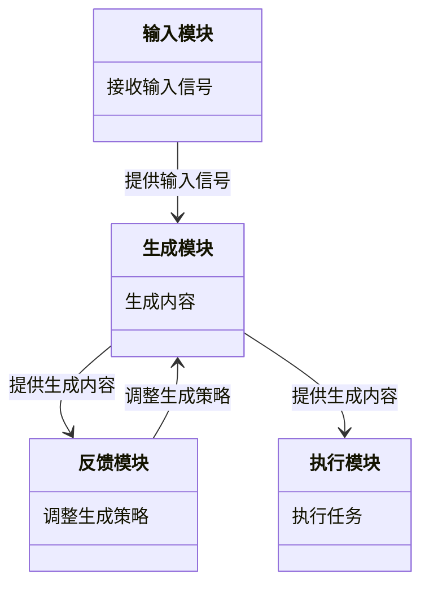
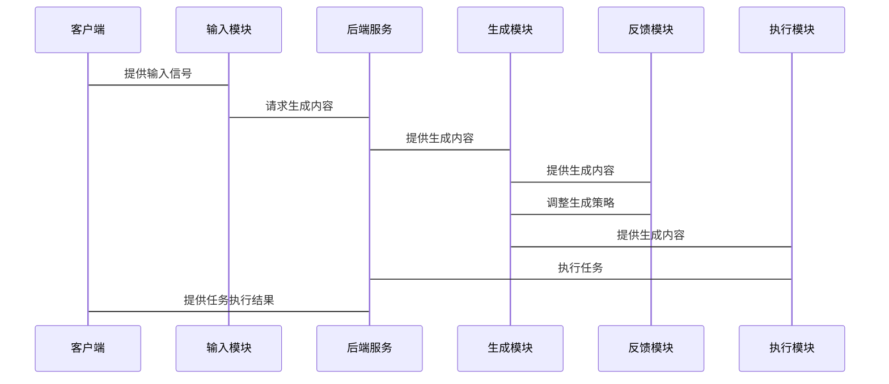

                 


# GPT系列模型：打造强大的生成式AI Agent

> 关键词：生成式AI, GPT系列模型, AI Agent, 生成模型, 自然语言处理

> 摘要：本文将详细探讨如何基于GPT系列模型打造强大的生成式AI Agent。我们将从生成式AI的基本概念、GPT系列模型的核心原理、生成式AI Agent的系统架构，到实际的项目实现进行全面解析。通过本文，读者将能够深入了解生成式AI Agent的核心技术，并掌握如何基于GPT系列模型构建高效的生成式AI系统。

---

## 第一部分：生成式AI Agent的背景与核心概念

### 第1章：生成式AI Agent的背景介绍

#### 1.1 生成式AI的基本概念

##### 1.1.1 生成式AI的定义与特点
生成式AI（Generative AI）是一种能够生成新内容的人工智能技术，与传统的检索式AI（基于已有数据返回结果）不同，生成式AI可以创造出全新的文本、图像、音频等内容。其核心特点包括：
- **创造性**：生成全新的内容，而非简单的数据检索。
- **多样性**：能够生成多种不同的输出。
- **上下文理解**：能够根据上下文生成连贯的内容。

##### 1.1.2 GPT系列模型的演进历程
GPT（Generative Pre-trained Transformer）是由OpenAI开发的生成式AI模型系列，自2018年首次发布以来，经历了多次重大更新：
- **GPT-1 (2018)**：初步展示了生成文本的能力。
- **GPT-2 (2019)**：显著提升了生成文本的质量和长度。
- **GPT-3 (2020)**：引入了更大的参数规模和更强大的生成能力。
- **GPT-4 (2023)**：进一步优化了多模态能力、生成精度和安全性能。

##### 1.1.3 生成式AI Agent的应用场景
生成式AI Agent（Agent）是一种能够自主执行任务的智能体，结合生成式AI的能力，其应用场景包括：
- **自然语言处理**：智能对话、文本生成。
- **内容创作**：自动撰写文章、广告文案。
- **数据分析**：生成报告、预测分析。
- **人机交互**：智能客服、虚拟助手。

#### 1.2 GPT系列模型的背景与现状

##### 1.2.1 GPT系列模型的发展历程
GPT系列模型的发展体现了生成式AI技术的不断进步：
- **GPT-1**：初步探索生成式任务。
- **GPT-2**：提升生成文本的质量和长度。
- **GPT-3**：引入更大的模型规模和多任务学习能力。
- **GPT-4**：结合多模态输入，进一步提升生成的准确性和安全性。

##### 1.2.2 GPT系列模型的核心优势
GPT系列模型的核心优势在于其基于Transformer架构的自然语言处理能力，具体包括：
- **强大的上下文理解能力**：通过Transformer的自注意力机制，模型能够捕捉文本中的长距离依赖关系。
- **预训练+微调模式**：通过大规模预训练数据，模型能够快速适应特定任务。
- **生成能力的可扩展性**：通过调整模型规模和参数数量，可以实现从低资源到高资源场景的灵活部署。

##### 1.2.3 当前生成式AI的市场与技术趋势
当前生成式AI的市场呈现出快速发展的趋势，主要体现在：
- **技术进步**：模型的生成能力不断提升，从文本生成扩展到多模态生成。
- **应用场景多样化**：生成式AI正在应用于教育、医疗、金融等多个领域。
- **伦理与安全问题**：生成式AI的滥用风险也在推动相关伦理和技术规范的发展。

---

### 第2章：生成式AI Agent的核心概念

#### 2.1 生成式AI Agent的定义与特点

##### 2.1.1 生成式AI Agent的定义
生成式AI Agent是一种能够通过生成式AI技术自主执行任务的智能体。它能够根据输入的上下文生成新的文本、图像或其他形式的内容，并根据生成结果进行后续操作。

##### 2.1.2 生成式AI Agent的核心属性
生成式AI Agent的核心属性包括：
- **自主性**：能够在没有人工干预的情况下独立运行。
- **生成性**：能够生成新的内容，而非仅仅检索现有数据。
- **适应性**：能够根据反馈不断优化生成策略。

##### 2.1.3 生成式AI Agent与传统AI的区别
生成式AI Agent与传统AI的主要区别在于：
- **生成能力**：生成式AI Agent能够生成新内容，而传统AI通常基于已有数据进行推理或分类。
- **自主性**：生成式AI Agent具备一定的自主决策能力，而传统AI通常需要明确的规则或指令。

#### 2.2 生成式AI Agent的工作原理

##### 2.2.1 生成式AI Agent的基本流程
生成式AI Agent的工作流程可以分为以下几个步骤：
1. **输入接收**：接收用户的输入或环境的触发信号。
2. **生成内容**：基于输入生成新的内容。
3. **反馈处理**：根据反馈调整生成策略。
4. **任务执行**：根据生成内容执行具体任务。

##### 2.2.2 基于GPT系列模型的生成机制
基于GPT系列模型的生成机制主要依赖于以下几点：
- **自注意力机制**：通过自注意力机制捕捉文本中的长距离依赖关系。
- **解码器架构**：采用解码器架构生成序列式输出。
- **概率生成**：通过概率模型生成多样化的输出。

##### 2.2.3 生成式AI Agent的输入输出关系
生成式AI Agent的输入输出关系可以用以下公式表示：
$$
\text{Output} = f(\text{Input}, \text{Context})
$$
其中，$\text{Input}$表示输入内容，$\text{Context}$表示上下文信息，$f$表示生成模型。

#### 2.3 生成式AI Agent的系统架构

##### 2.3.1 生成式AI Agent的组件构成
生成式AI Agent的系统架构通常包括以下几个组件：
- **输入模块**：接收输入信号。
- **生成模块**：基于输入生成内容。
- **反馈模块**：根据反馈调整生成策略。
- **执行模块**：根据生成内容执行具体任务。

##### 2.3.2 基于GPT系列模型的架构特点
基于GPT系列模型的架构特点包括：
- **Transformer架构**：采用Transformer的解码器架构进行内容生成。
- **自注意力机制**：通过自注意力机制捕捉上下文信息。
- **预训练+微调模式**：通过大规模预训练数据进行初始化，再针对具体任务进行微调。

##### 2.3.3 生成式AI Agent的系统边界与外延
生成式AI Agent的系统边界包括：
- **输入边界**：输入数据的格式和类型。
- **输出边界**：生成内容的格式和类型。
- **交互边界**：与其他系统或用户的交互方式。

---

### 第3章：生成式AI Agent的核心概念与联系

#### 3.1 核心概念原理

##### 3.1.1 生成式AI Agent的核心算法原理
生成式AI Agent的核心算法原理基于以下几点：
- **自注意力机制**：通过自注意力机制捕捉文本中的长距离依赖关系。
- **解码器架构**：采用解码器架构生成序列式输出。
- **概率生成**：通过概率模型生成多样化的输出。

##### 3.1.2 GPT系列模型的训练原理
GPT系列模型的训练原理可以总结为以下几点：
- **预训练目标**：通过大规模预训练数据学习语言模型。
- **微调任务**：针对具体任务对模型进行微调。
- **生成策略**：通过生成策略优化模型的生成能力。

##### 3.1.3 生成式AI Agent的生成原理
生成式AI Agent的生成原理可以表示为：
$$
P(y|x) = \text{模型}(x) \rightarrow y
$$
其中，$x$表示输入，$y$表示生成的输出。

#### 3.2 核心概念属性对比

##### 3.2.1 生成式AI Agent与传统AI的对比
生成式AI Agent与传统AI的主要区别可以表示为以下表格：

| 特性         | 生成式AI Agent      | 传统AI             |
|--------------|---------------------|--------------------|
| 输入类型      | 多样化输入           | 确定性输入           |
| 输出类型      | 多样化输出           | 确定性输出           |
| 自主性        | 高                  | 低或无              |
| 生成能力      | 强                  | 无或弱              |

##### 3.2.2 不同GPT系列模型的对比
不同GPT系列模型的对比可以通过以下表格展示：

| 模型版本       | GPT-1                | GPT-2               | GPT-3                | GPT-4                |
|----------------|----------------------|---------------------|----------------------|----------------------|
| 参数规模       | 小                   | 中                   | 大                   | 更大                 |
| 生成能力       | 基础                 | 提升                 | 显著提升             | 多模态                |
| 应用场景       | 初步生成             | 多任务生成           | 多领域生成           | 多模态生成            |

---

## 第二部分：生成式AI Agent的算法原理

### 第4章：生成式AI Agent的算法原理

#### 4.1 GPT系列模型的结构与训练方法

##### 4.1.1 GPT系列模型的结构
GPT系列模型的结构基于Transformer的解码器架构，主要包括以下几个部分：
- **嵌入层**：将输入文本转换为词向量。
- **自注意力机制**：捕捉文本中的长距离依赖关系。
- **前馈网络**：对生成的词向量进行非线性变换。

##### 4.1.2 GPT系列模型的训练方法
GPT系列模型的训练方法可以分为以下步骤：
1. **预训练**：通过大规模数据进行语言模型训练。
2. **微调**：针对具体任务对模型进行微调。

##### 4.1.3 GPT系列模型的数学公式
GPT系列模型的核心数学公式可以表示为：
$$
P(y|x) = \prod_{i=1}^{n} P(y_i|x_{\leq i}, y_{\leq i-1})
$$
其中，$x$表示输入文本，$y$表示生成的输出文本。

#### 4.2 基于GPT系列模型的生成策略

##### 4.2.1 生成策略的选择
生成策略的选择直接影响生成内容的质量和效率，主要包括以下几种：
- **贪心策略**：每次选择概率最高的词进行生成。
- **随机采样**：通过随机采样生成多样化的内容。
- **温度采样**：通过调整温度参数控制生成的多样性和确定性。

##### 4.2.2 生成过程的数学表达
生成过程的数学表达可以表示为：
$$
y_{i} = \text{argmax}(P(y_i|x_{\leq i}, y_{\leq i-1}))
$$
其中，$P(y_i|x_{\leq i}, y_{\leq i-1})$表示在给定输入和之前生成的词的情况下，当前词的概率。

#### 4.3 GPT系列模型的训练流程

##### 4.3.1 数据预处理
数据预处理是训练GPT系列模型的关键步骤，主要包括以下内容：
- **分词与编码**：将文本数据进行分词并转换为词向量。
- **数据清洗**：去除噪声数据，确保数据质量。
- **数据划分**：将数据划分为训练集、验证集和测试集。

##### 4.3.2 模型训练
模型训练过程可以分为以下步骤：
1. **初始化模型参数**：基于预训练数据初始化模型参数。
2. **计算损失函数**：使用交叉熵损失函数计算生成的误差。
3. **反向传播与优化**：通过反向传播算法优化模型参数。

##### 4.3.3 模型评估
模型评估是训练过程中的重要环节，主要通过以下指标进行评估：
- **困惑度（Perplexity）**：衡量模型对训练数据的拟合程度。
- **生成质量**：通过人工评估或自动评估指标（如BLEU、ROUGE）衡量生成内容的质量。

---

## 第三部分：生成式AI Agent的系统架构设计

### 第5章：生成式AI Agent的系统架构设计

#### 5.1 系统功能设计

##### 5.1.1 系统功能模块
生成式AI Agent的系统功能模块可以分为以下几个部分：
- **输入模块**：接收用户的输入或环境的触发信号。
- **生成模块**：基于输入生成新的内容。
- **反馈模块**：根据反馈调整生成策略。
- **执行模块**：根据生成内容执行具体任务。

##### 5.1.2 系统功能设计的领域模型
领域模型可以用以下Mermaid类图表示：



#### 5.2 系统架构设计

##### 5.2.1 系统架构的总体设计
系统架构总体设计可以用以下Mermaid架构图表示：


#### 5.3 系统接口设计

##### 5.3.1 系统接口的定义
系统接口的定义可以用以下表格表示：

| 接口名称       | 输入参数           | 输出参数           |
|----------------|--------------------|--------------------|
| 生成内容       | 输入信号           | 生成内容           |
| 调整策略       | 反馈信息           | 调整后的策略       |
| 执行任务       | 生成内容           | 任务执行结果       |

##### 5.3.2 系统接口的实现
系统接口的实现可以用以下Mermaid序列图表示：



---

## 第四部分：生成式AI Agent的项目实战

### 第6章：生成式AI Agent的项目实战

#### 6.1 环境安装与配置

##### 6.1.1 环境要求
生成式AI Agent的环境要求包括：
- **硬件要求**：CPU或GPU（推荐使用GPU加速）。
- **软件要求**：Python 3.8及以上版本，TensorFlow或PyTorch框架。

##### 6.1.2 环境配置
环境配置可以通过以下步骤完成：
1. 安装Python和必要的开发工具。
2. 安装TensorFlow或PyTorch框架。
3. 下载并安装GPT系列模型的预训练权重。

#### 6.2 系统核心实现

##### 6.2.1 生成模块的实现
生成模块的实现可以用以下Python代码表示：

```python
def generate(text, max_length=50):
    # 输入处理
    inputs = tokenizer(text, return_tensors='pt')
    input_ids = inputs['input_ids'].to(device)
    attention_mask = inputs['attention_mask'].to(device)
    
    # 生成过程
    outputs = model.generate(input_ids=input_ids, attention_mask=attention_mask, max_length=max_length)
    generated_text = tokenizer.decode(outputs[0], skip_special_tokens=True)
    return generated_text
```

##### 6.2.2 反馈模块的实现
反馈模块的实现可以用以下Python代码表示：

```python
def feedback(generated_text, target_text):
    # 计算相似度
    similarity = calculate_similarity(generated_text, target_text)
    # 调整生成策略
    adjust_strategy(similarity)
    return similarity
```

##### 6.2.3 执行模块的实现
执行模块的实现可以用以下Python代码表示：

```python
def execute_task(generated_text):
    # 根据生成内容执行任务
    task = determine_task(generated_text)
    if task == 'text_generation':
        execute_text_generation(generated_text)
    elif task == 'image_generation':
        execute_image_generation(generated_text)
    # 其他任务类型...
    return task_status
```

#### 6.3 代码实现与应用解读

##### 6.3.1 生成模块的代码实现
生成模块的代码实现如下：

```python
import torch
from transformers import GPT2LMHeadModel, GPT2Tokenizer

# 初始化模型和tokenizer
model = GPT2LMHeadModel.from_pretrained('gpt2')
tokenizer = GPT2Tokenizer.from_pretrained('gpt2')

def generate(text, max_length=50):
    inputs = tokenizer(text, return_tensors='pt')
    input_ids = inputs['input_ids'].to('cuda')
    attention_mask = inputs['attention_mask'].to('cuda')
    outputs = model.generate(input_ids=input_ids, attention_mask=attention_mask, max_length=max_length)
    generated_text = tokenizer.decode(outputs[0], skip_special_tokens=True)
    return generated_text
```

##### 6.3.2 反馈模块的代码实现
反馈模块的代码实现如下：

```python
def feedback(generated_text, target_text):
    # 计算相似度
    similarity = calculate_similarity(generated_text, target_text)
    # 调整生成策略
    adjust_strategy(similarity)
    return similarity

def calculate_similarity(text1, text2):
    # 使用余弦相似度计算
    vectorizer = TfidfVectorizer()
    vectors = vectorizer.fit_transform([text1, text2])
    cosine_sim = linear_kernel(vectors[0], vectors[1])
    return cosine_sim

def adjust_strategy(similarity):
    if similarity < 0.7:
        # 相似度低，增加温度参数
        pass
    elif similarity > 0.9:
        # 相似度高，降低温度参数
        pass
```

##### 6.3.3 执行模块的代码实现
执行模块的代码实现如下：

```python
def execute_task(generated_text):
    # 确定任务类型
    task = determine_task(generated_text)
    if task == 'text_generation':
        execute_text_generation(generated_text)
    elif task == 'image_generation':
        execute_image_generation(generated_text)
    # 其他任务类型...
    return task_status

def determine_task(text):
    # 通过关键词匹配确定任务类型
    if 'generate image' in text:
        return 'image_generation'
    elif 'write a story' in text:
        return 'text_generation'
    else:
        return 'unknown'
```

#### 6.4 实际案例分析与详细讲解

##### 6.4.1 案例背景
假设我们正在开发一个智能写作助手，用户输入一段文本，生成式AI Agent需要根据输入生成相关的内容。

##### 6.4.2 案例实现
案例实现的具体步骤如下：
1. 用户输入文本：`"Write a story about..."`。
2. 生成模块生成相关的故事内容。
3. 反馈模块对生成内容进行评估，并调整生成策略。
4. 执行模块根据生成内容执行具体的写作任务。

##### 6.4.3 案例分析
通过上述案例，我们可以看到生成式AI Agent在实际应用中的潜力。生成模块能够根据输入生成高质量的内容，反馈模块能够根据生成内容的质量进行调整，执行模块能够根据生成内容执行具体的任务。

---

## 第五部分：生成式AI Agent的总结与展望

### 第7章：生成式AI Agent的总结与展望

#### 7.1 全文总结

##### 7.1.1 生成式AI Agent的核心技术总结
生成式AI Agent的核心技术总结如下：
- **生成式AI模型**：基于GPT系列模型的生成能力。
- **系统架构设计**：包括输入模块、生成模块、反馈模块和执行模块。
- **生成策略优化**：通过反馈机制不断优化生成策略。

##### 7.1.2 生成式AI Agent的应用价值总结
生成式AI Agent的应用价值体现在以下几个方面：
- **提高效率**：能够自动化完成多种任务。
- **降低成本**：减少人工干预，降低运营成本。
- **提升用户体验**：通过生成高质量内容提升用户满意度。

#### 7.2 未来展望

##### 7.2.1 生成式AI Agent的技术发展方向
生成式AI Agent的技术发展方向包括：
- **多模态生成**：从文本生成扩展到图像、音频等多种模态。
- **实时生成**：提升生成速度，满足实时应用场景的需求。
- **智能优化**：通过强化学习等技术进一步优化生成策略。

##### 7.2.2 生成式AI Agent的市场前景展望
生成式AI Agent的市场前景广阔，未来可能在以下几个领域得到广泛应用：
- **教育领域**：智能辅导系统、自动化内容生成。
- **医疗领域**：医疗报告生成、疾病预测。
- **金融领域**：金融数据分析、风险评估。

#### 7.3 最佳实践与注意事项

##### 7.3.1 最佳实践
- **模型优化**：通过模型压缩和优化算法提升生成效率。
- **数据安全**：确保生成过程中的数据安全和隐私保护。
- **用户反馈**：通过用户反馈不断优化生成策略。

##### 7.3.2 注意事项
- **伦理问题**：避免生成式AI的滥用，确保生成内容的伦理合规。
- **技术风险**：关注生成式AI的技术风险，如生成错误信息的风险。
- **法律合规**：确保生成式AI的使用符合相关法律法规。

---

## 作者信息

作者：AI天才研究院/AI Genius Institute & 禅与计算机程序设计艺术 /Zen And The Art of Computer Programming

