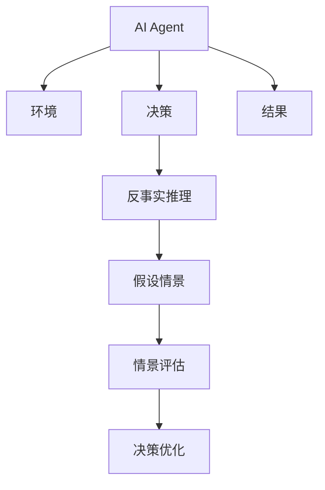
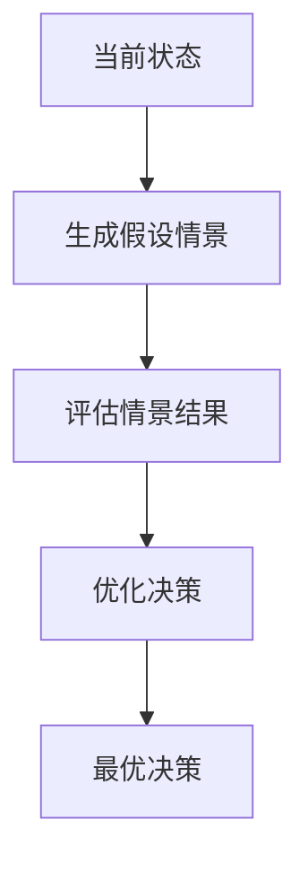
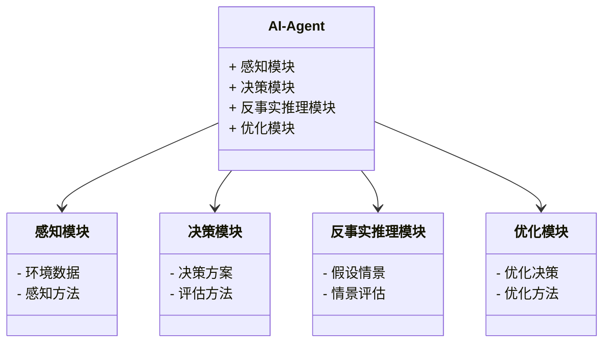
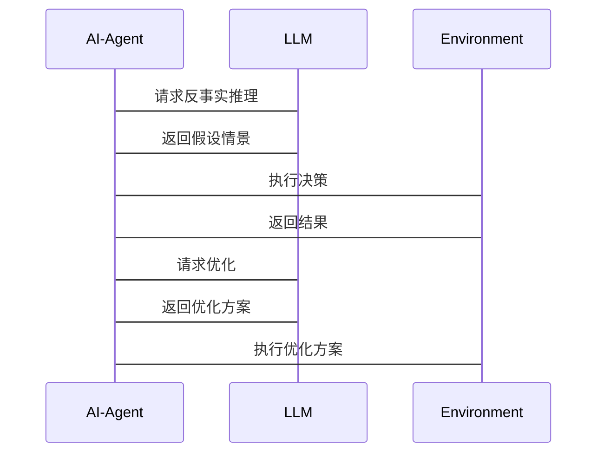

                 


# LLM在AI Agent反事实推理中的应用

> 关键词：LLM，AI Agent，反事实推理，大语言模型，人工智能，决策优化

> 摘要：本文深入探讨了大语言模型（LLM）在AI Agent反事实推理中的应用，从理论到实践，详细分析了LLM如何增强AI Agent的决策能力。通过系统介绍反事实推理的原理、LLM的实现机制，以及它们在AI Agent中的结合方式，本文为读者提供了一种全新的视角来理解智能决策优化的潜力。

---

# 1. 背景介绍

## 1.1 问题背景

AI Agent（人工智能代理）是一种能够感知环境、自主决策并执行任务的智能系统。在现实世界中，AI Agent需要面对复杂的不确定性，做出最优或合理的决策。反事实推理（Counterfactual Reasoning）是一种思考方式，涉及分析与现实情况相反的假设情景，以评估不同决策的潜在结果。

### 1.1.1 AI Agent的基本概念与特点

AI Agent是一种智能实体，能够通过感知环境信息，自主选择行动以实现特定目标。其特点包括：

- **自主性**：无需外部干预，自主决策。
- **反应性**：能够实时感知环境变化并调整行为。
- **目标导向**：所有行动均以实现目标为导向。
- **社会能力**：能够与其他Agent或人类进行交互协作。

### 1.1.2 反事实推理的定义与应用

反事实推理是一种逻辑推理方法，用于分析与现实情况相悖的假设情景。例如，考虑“如果我做出不同的选择，结果会怎样？”这种思维方式在决策优化中尤为重要。

反事实推理在多个领域有广泛应用，包括经济学、医学和人工智能。在AI Agent中，反事实推理帮助系统评估多种可能的决策路径及其结果，从而优化选择。

### 1.1.3 LLM在AI Agent中的作用

大语言模型（LLM）是基于深度学习的自然语言处理模型，能够生成自然语言文本并理解上下文。LLM在AI Agent中的应用包括：

- **决策支持**：通过分析大量数据，生成可能的决策方案。
- **情境理解**：帮助AI Agent理解复杂环境。
- **结果预测**：评估不同决策的潜在结果。

## 1.2 问题描述

AI Agent在复杂环境中做出决策时，需要考虑多种可能的路径和结果。反事实推理能够帮助系统评估这些路径，但其复杂性要求AI Agent具备强大的分析能力。

### 1.2.1 AI Agent决策中的不确定性问题

AI Agent在决策过程中常面临不确定性，这可能来自环境的动态变化、信息的不完全性或模型的局限性。反事实推理通过分析假设情景，帮助系统更好地理解这些不确定性。

### 1.2.2 反事实推理在决策中的重要性

反事实推理使AI Agent能够评估不同决策的潜在结果，从而做出更优的选择。例如，在医疗诊断中，反事实推理可以帮助医生评估不同治疗方案的效果。

### 1.2.3 LLM如何解决反事实推理的挑战

LLM通过生成大量可能的决策路径，并评估每种路径的结果，帮助AI Agent克服反事实推理中的计算复杂性问题。

## 1.3 问题解决

### 1.3.1 LLM如何辅助AI Agent进行反事实推理

LLM通过生成自然语言文本和分析数据，帮助AI Agent评估不同决策路径的结果。例如，LLM可以生成多个假设情景，并预测每种情景的结果。

### 1.3.2 反事实推理在AI Agent中的实现路径

反事实推理的实现路径包括：

1. **生成假设情景**：LLM生成与现实相反的假设情景。
2. **评估情景结果**：分析每种假设情景的潜在结果。
3. **优化决策**：根据评估结果，优化AI Agent的决策。

### 1.3.3 LLM与AI Agent结合的优势

- **强大的分析能力**：LLM能够处理大量数据，生成详细的分析结果。
- **自然语言处理能力**：LLM能够理解复杂文本，帮助AI Agent更好地理解环境。
- **高效的决策优化**：通过分析假设情景，优化决策过程。

## 1.4 边界与外延

### 1.4.1 反事实推理的边界条件

反事实推理的边界条件包括：

- **数据限制**：假设情景的准确性依赖于数据的完整性。
- **计算能力**：复杂的反事实推理需要强大的计算能力。
- **模型假设**：假设情景的分析依赖于模型的假设。

### 1.4.2 LLM在反事实推理中的局限性

- **生成假设情景的质量**：生成的情景可能不够准确或相关。
- **计算资源消耗**：复杂的反事实推理需要大量计算资源。
- **模型偏差**：LLM可能引入偏差，影响分析结果。

### 1.4.3 AI Agent反事实推理的未来发展方向

未来，AI Agent的反事实推理可能在以下几个方面发展：

- **更高效的计算方法**：开发更高效的算法，减少计算资源消耗。
- **更准确的假设情景生成**：改进LLM，生成更相关和准确的假设情景。
- **多模态分析**：结合视觉、听觉等多种数据源，提高分析准确性。

## 1.5 概念结构与核心要素

### 1.5.1 AI Agent的核心要素

AI Agent的核心要素包括：

- **感知层**：感知环境信息。
- **决策层**：分析信息，做出决策。
- **执行层**：执行决策，产生行动。

### 1.5.2 反事实推理的关键要素

反事实推理的关键要素包括：

- **假设情景生成**：生成与现实相反的情景。
- **情景评估**：评估每种情景的潜在结果。
- **决策优化**：根据评估结果，优化决策。

### 1.5.3 LLM在反事实推理中的角色

LLM在反事实推理中的角色包括：

- **数据处理**：处理大量数据，生成假设情景。
- **结果预测**：预测不同情景的结果。
- **决策支持**：支持AI Agent做出最优决策。

---

# 2. 核心概念与联系

## 2.1 AI Agent的原理

### 2.1.1 AI Agent的定义与分类

AI Agent可以根据智能水平分为：

- **反应式AI Agent**：基于当前感知做出反应。
- **认知式AI Agent**：具备更高水平的推理和规划能力。

### 2.1.2 AI Agent的决策机制

AI Agent的决策机制通常包括：

1. **感知环境**：收集环境信息。
2. **分析信息**：分析信息，生成可能的决策方案。
3. **评估决策**：评估每种决策的潜在结果。
4. **选择最优决策**：根据评估结果，选择最优决策。

### 2.1.3 AI Agent的核心算法

AI Agent的核心算法包括：

- **强化学习**：通过试错优化决策。
- **决策树**：分析不同决策路径的结果。
- **贝叶斯网络**：基于概率进行决策。

## 2.2 LLM的原理

### 2.2.1 大语言模型的定义与特点

大语言模型是一种基于深度学习的自然语言处理模型，具有以下特点：

- **大规模训练数据**：通常训练于 millions of parameters。
- **多任务学习能力**：能够处理多种语言任务。
- **生成能力**：能够生成自然语言文本。

### 2.2.2 LLM的训练方法与模型结构

LLM的训练方法包括：

- **监督学习**：基于标注数据进行训练。
- **无监督学习**：基于未标注数据进行训练。
- **迁移学习**：将预训练模型应用于特定任务。

### 2.2.3 LLM的核心算法与实现

LLM的核心算法包括：

- **Transformer架构**：基于自注意力机制。
- **BERT模型**：Bidirectional Encoder Representations from Transformers。
- **GPT模型**：Generative Pre-trained Transformer。

## 2.3 反事实推理的原理

### 2.3.1 反事实推理的定义与特点

反事实推理是一种逻辑推理方法，涉及分析与现实情况相反的假设情景。其特点包括：

- **假设性**：基于假设情景进行推理。
- **评估性**：评估不同决策的潜在结果。
- **优化性**：帮助优化决策过程。

### 2.3.2 反事实推理的实现方法

反事实推理的实现方法包括：

1. **生成假设情景**：基于当前环境生成与现实相反的情景。
2. **评估情景结果**：分析每种假设情景的潜在结果。
3. **优化决策**：根据评估结果，优化决策过程。

### 2.3.3 反事实推理的应用场景

反事实推理的应用场景包括：

- **医疗诊断**：评估不同治疗方案的效果。
- **金融投资**：评估不同投资策略的潜在回报。
- **自动驾驶**：评估不同驾驶决策的安全性。

## 2.4 核心概念对比与联系

### 2.4.1 AI Agent与LLM的对比

AI Agent与LLM的对比：

| 属性            | AI Agent                          | LLM                          |
|-----------------|-----------------------------------|------------------------------|
| 功能            | 感知环境、决策、执行              | 处理语言数据、生成文本        |
| 技术基础        | 人工智能、机器学习                | 自然语言处理、深度学习        |
| 应用场景        | 自动化控制、智能助手              | 语言生成、文本理解            |

### 2.4.2 LLM如何提升AI Agent的能力

- **增强决策支持**：通过分析大量数据，生成更优的决策方案。
- **提升情境理解**：帮助AI Agent更好地理解复杂环境。
- **优化结果预测**：通过生成假设情景，优化决策过程。

### 2.4.3 AI Agent反事实推理的实体关系图



---

# 3. 算法原理讲解

## 3.1 AI Agent反事实推理的算法流程

### 3.1.1 算法步骤

反事实推理的算法步骤包括：

1. **生成假设情景**：基于当前环境，生成与现实相反的假设情景。
2. **评估情景结果**：分析每种假设情景的潜在结果。
3. **优化决策**：根据评估结果，优化决策过程。

### 3.1.2 算法实现

以下是一个简单的Python实现示例：

```python
def generate_counterfactuals(current_state):
    # 生成与现实相反的情景
    counterfactuals = []
    for state in current_state:
        # 生成相反的状态
        counterfactual = ...
        counterfactuals.append(counterfactual)
    return counterfactuals

def evaluate_scenario(counterfactual):
    # 评估假设情景的结果
    result = ...
    return result

def optimize_decision(counterfactual_results):
    # 根据评估结果，优化决策
    optimal_decision = ...
    return optimal_decision

# 主函数
def main():
    current_state = ...
    counterfactuals = generate_counterfactuals(current_state)
    results = [evaluate_scenario(cf) for cf in counterfactuals]
    optimal_decision = optimize_decision(results)
    return optimal_decision

if __name__ == "__main__":
    main()
```

### 3.1.3 算法流程图



## 3.2 反事实推理的数学模型

### 3.2.1 概率模型

反事实推理可以通过概率模型进行分析。假设我们有一个决策D，其结果R的概率可以通过以下公式表示：

$$ P(R|D) = \frac{P(R \cap D)}{P(D)} $$

### 3.2.2 逻辑推理模型

反事实推理也可以通过逻辑推理模型进行分析。例如，我们可以使用贝叶斯网络进行推理：

$$ P(R|D) = \frac{P(D|R)P(R)}{P(D)} $$

---

# 4. 系统分析与架构设计

## 4.1 问题场景介绍

AI Agent需要在复杂环境中做出决策，反事实推理帮助其评估不同决策的潜在结果，从而做出更优的选择。

## 4.2 项目介绍

本项目旨在开发一个基于LLM的AI Agent，具备反事实推理能力，能够在复杂环境中做出优化决策。

## 4.3 系统功能设计

### 4.3.1 系统功能模块

系统功能模块包括：

1. **感知模块**：感知环境信息。
2. **决策模块**：分析信息，生成决策方案。
3. **反事实推理模块**：评估不同决策的潜在结果。
4. **优化模块**：根据评估结果，优化决策。

### 4.3.2 领域模型（Mermaid 类图）



## 4.4 系统架构设计

### 4.4.1 系统架构图（Mermaid 架构图）


### 4.4.2 系统接口设计

系统接口设计包括：

- **输入接口**：接收环境信息和用户指令。
- **输出接口**：输出决策结果和优化方案。
- **交互接口**：与用户或其他系统进行交互。

## 4.5 系统交互设计（Mermaid 序列图）



---

# 5. 项目实战

## 5.1 环境安装

### 5.1.1 安装Python

```bash
python --version
pip install --upgrade pip
```

### 5.1.2 安装依赖库

```bash
pip install numpy
pip install pandas
pip install scikit-learn
pip install transformers
```

## 5.2 系统核心实现

### 5.2.1 反事实推理模块

```python
from transformers import AutoTokenizer, AutoModelForCausalLM

tokenizer = AutoTokenizer.from_pretrained("gpt2")
model = AutoModelForCausalLM.from_pretrained("gpt2")

def generate_counterfactuals(prompt):
    inputs = tokenizer.encode(prompt, return_tensors="pt")
    outputs = model.generate(inputs, max_length=50, num_return_sequences=5)
    counterfactuals = [tokenizer.decode(output) for output in outputs]
    return counterfactuals

def evaluate_scenario(counterfactual):
    # 这里需要实现具体的评估逻辑
    pass

def optimize_decision(counterfactual_results):
    # 这里需要实现具体的优化逻辑
    pass

# 示例调用
prompt = "如果我选择这个方案，结果会怎样？"
counterfactuals = generate_counterfactuals(prompt)
results = [evaluate_scenario(cf) for cf in counterfactuals]
optimal_decision = optimize_decision(results)
print(optimal_decision)
```

### 5.2.2 算法实现

```python
import numpy as np

def generate_counterfactuals(current_state):
    counterfactuals = []
    for state in current_state:
        # 这里需要实现生成假设情景的逻辑
        counterfactual = ...
        counterfactuals.append(counterfactual)
    return counterfactuals

def evaluate_scenario(counterfactual):
    # 这里需要实现评估情景结果的逻辑
    result = ...
    return result

def optimize_decision(counterfactual_results):
    # 这里需要实现优化决策的逻辑
    optimal_decision = ...
    return optimal_decision

# 主函数
def main():
    current_state = ...
    counterfactuals = generate_counterfactuals(current_state)
    results = [evaluate_scenario(cf) for cf in counterfactuals]
    optimal_decision = optimize_decision(results)
    return optimal_decision

if __name__ == "__main__":
    main()
```

## 5.3 实际案例分析

### 5.3.1 案例背景

假设我们有一个AI Agent，用于优化供应链管理。AI Agent需要考虑不同决策对库存和成本的影响。

### 5.3.2 案例分析

1. **生成假设情景**：生成与现实相反的库存管理方案。
2. **评估情景结果**：分析每种方案的成本和效率。
3. **优化决策**：根据评估结果，选择最优方案。

### 5.3.3 案例结论

通过反事实推理，AI Agent能够评估不同库存管理方案的潜在结果，从而做出更优的决策，降低库存成本，提高效率。

## 5.4 项目小结

本项目展示了如何将LLM应用于AI Agent的反事实推理中，通过生成假设情景、评估结果和优化决策，帮助AI Agent做出更优的选择。项目实现了一个简单的反事实推理模块，并通过实际案例展示了其应用潜力。

---

# 6. 最佳实践

## 6.1 小结

本文深入探讨了LLM在AI Agent反事实推理中的应用，从理论到实践，详细分析了LLM如何增强AI Agent的决策能力。通过系统介绍反事实推理的原理、LLM的实现机制，以及它们在AI Agent中的结合方式，本文为读者提供了一种全新的视角来理解智能决策优化的潜力。

## 6.2 注意事项

- **数据质量**：生成的假设情景的质量依赖于数据的完整性和准确性。
- **计算资源**：复杂的反事实推理需要强大的计算能力。
- **模型选择**：选择合适的LLM模型，以确保生成的情景相关且准确。

## 6.3 拓展阅读

- **论文阅读**：深入阅读相关领域的学术论文，了解最新的研究成果。
- **工具学习**：学习使用更多的工具和技术，提升反事实推理的效率和准确性。
- **实践项目**：参与更多的实践项目，积累实际经验，提升技术水平。

---

# 作者信息

作者：AI天才研究院/AI Genius Institute & 禅与计算机程序设计艺术 /Zen And The Art of Computer Programming

---

# 结语

通过本文的探讨，我们可以看到，LLM在AI Agent反事实推理中的应用具有巨大的潜力。随着技术的不断进步，AI Agent的决策能力将不断提升，为各行业带来更多的创新和价值。未来，我们将继续探索这一领域的更多可能性，推动人工智能技术的发展。

