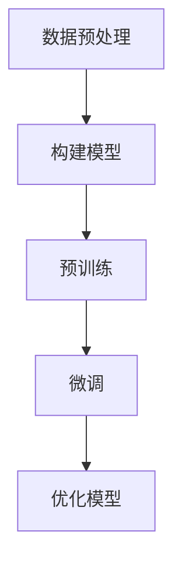
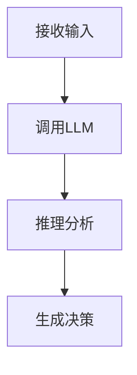
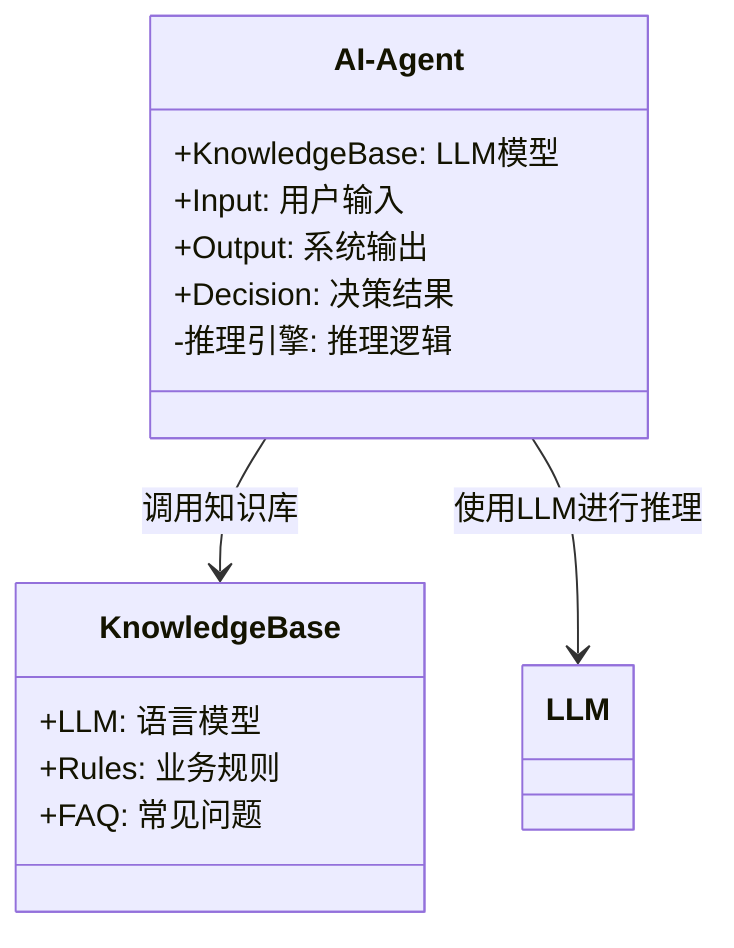

                 


# LLM在AI Agent常识推理中的应用

> 关键词：LLM，AI Agent，常识推理，大语言模型，人工智能，智能体

> 摘要：本文探讨了大语言模型（LLM）在AI Agent常识推理中的应用。通过详细分析LLM和AI Agent的核心概念，结合算法原理、系统架构和实际项目案例，展示了如何利用LLM提升AI Agent的推理能力。文章从背景介绍、核心概念、算法实现、系统设计、项目实战等多个维度展开，为读者提供全面的视角和深入的分析。

---

# 第一部分: LLM与AI Agent的背景与核心概念

## 第1章: LLM的基本概念

### 1.1 LLM的定义与特点

大语言模型（Large Language Model, LLM）是指基于深度学习技术构建的大型神经网络模型，能够理解和生成自然语言文本。其特点包括：

- **大规模数据训练**：通常使用海量文本数据进行预训练，具备强大的语言理解和生成能力。
- **通用性**：能够处理多种语言任务，如文本生成、问答系统、翻译等。
- **上下文理解**：通过上下文推理能力，能够回答复杂问题并进行常识推理。

### 1.2 AI Agent的基本概念

AI Agent（人工智能代理）是指能够感知环境、执行任务并做出决策的智能实体。其特点包括：

- **自主性**：能够在没有外部干预的情况下独立运作。
- **反应性**：能够根据环境变化实时调整行为。
- **目标导向**：通过设定目标，执行复杂任务并优化决策。

### 1.3 常识推理的基本概念

常识推理是指AI系统在面对日常知识和逻辑推理时的能力。其特点包括：

- **广泛性**：涵盖日常生活中的各种知识。
- **推理能力**：能够基于常识进行逻辑推理和判断。
- **不确定性处理**：在不完整信息的情况下做出合理推断。

## 第2章: LLM与AI Agent的结合

### 2.1 LLM在AI Agent中的角色

LLM在AI Agent中的主要作用包括：

1. **知识库支持**：作为AI Agent的知识库，提供丰富的常识和语言理解能力。
2. **推理辅助**：帮助AI Agent进行逻辑推理和上下文理解。
3. **交互能力**：通过自然语言处理技术，实现与用户的高效交互。

### 2.2 LLM与AI Agent的协同工作

LLM与AI Agent的协同工作流程如下：

1. **信息输入**：AI Agent接收用户输入或环境信息。
2. **知识调用**：LLM根据输入内容调用相关知识进行分析。
3. **推理决策**：结合常识推理能力，AI Agent做出决策或生成回复。
4. **反馈优化**：通过用户反馈优化LLM模型和AI Agent的性能。

### 2.3 LLM与AI Agent的对比分析

以下为LLM与AI Agent在核心属性上的对比：

| 属性 | LLM | AI Agent |
|------|------|----------|
| 主要功能 | 语言理解和生成 | 感知环境、推理决策 |
| 数据需求 | 大规模文本数据 | 多模态数据（文本、图像等） |
| 应用场景 | 问答系统、文本生成 | 自动驾驶、智能助手 |

## 第3章: LLM在AI Agent常识推理中的应用背景

### 3.1 问题背景

AI Agent在常识推理中的主要挑战包括：

1. **知识局限性**：传统AI Agent的知识库通常局限于特定领域，难以应对复杂多变的现实场景。
2. **推理能力不足**：在处理复杂逻辑推理时，AI Agent的性能有限。
3. **动态环境适应性**：在动态变化的环境中，AI Agent需要快速调整策略，这对推理能力提出了更高要求。

### 3.2 问题描述

本文旨在探讨如何通过LLM提升AI Agent的常识推理能力，解决以下问题：

1. **如何利用LLM的知识库增强AI Agent的理解能力？**
2. **如何实现LLM与AI Agent的无缝集成？**
3. **如何优化LLM在AI Agent中的推理性能？**

### 3.3 问题解决

通过结合LLM的强大语言理解和生成能力，AI Agent能够更好地进行常识推理和决策。具体解决方案包括：

1. **知识增强**：将LLM作为AI Agent的知识库，提供丰富的常识支持。
2. **推理优化**：利用LLM的推理能力，提升AI Agent的决策准确度。
3. **动态适应**：通过LLM的实时推理能力，增强AI Agent的环境适应性。

## 第4章: LLM与AI Agent的核心概念与联系

### 4.1 核心概念原理

#### 4.1.1 LLM的训练原理

LLM的训练过程通常包括以下几个步骤：

1. **数据预处理**：对大规模文本数据进行清洗、分词和格式化处理。
2. **模型构建**：基于Transformer架构构建神经网络模型。
3. **预训练**：使用自监督学习方法，通过预测词任务优化模型参数。
4. **微调**：针对特定任务进行有监督微调。

#### 4.1.2 AI Agent的决策机制

AI Agent的决策机制通常包括：

1. **感知环境**：通过传感器或API获取环境信息。
2. **知识调用**：利用知识库或外部模型（如LLM）获取相关信息。
3. **推理分析**：基于获取的信息进行逻辑推理，生成决策方案。
4. **执行操作**：根据决策结果执行具体操作。

### 4.2 概念属性特征对比

以下为LLM与AI Agent在核心属性上的对比：

| 属性 | LLM | AI Agent |
|------|------|----------|
| 核心功能 | 语言理解和生成 | 感知环境、推理决策 |
| 数据需求 | 大规模文本数据 | 多模态数据 |
| 应用场景 | 问答系统、文本生成 | 自动驾驶、智能助手 |

### 4.3 ER实体关系图架构

以下是LLM与AI Agent的实体关系图：

```mermaid
er
actor(AI Agent) -->> knowledge_base: 调用知识库
knowledge_base --> LLM: 集成LLM模型
LLM --> actor: 提供语言理解和生成支持
```

---

# 第二部分: LLM在AI Agent中的算法原理

## 第5章: LLM的算法实现

### 5.1 LLM的训练流程

以下是LLM的训练流程图：



### 5.2 LLM的数学模型

#### 5.2.1 损失函数

LLM的损失函数通常采用交叉熵损失：

$$
\text{Loss} = -\sum_{i=1}^{n} \log p(x_i)
$$

其中，$p(x_i)$ 是生成词的概率。

#### 5.2.2 概率分布

LLM基于概率分布生成文本，公式如下：

$$
P(\text{sequence}) = \prod_{i=1}^{n} P(x_i|x_{<i})
$$

---

## 第6章: AI Agent的推理算法

### 6.1 AI Agent的推理流程

以下是AI Agent的推理流程图：



### 6.2 AI Agent的数学模型

#### 6.2.1 决策模型

AI Agent的决策模型可以表示为：

$$
\text{Decision} = f(\text{Input}, \text{Knowledge}, \text{Context})
$$

其中，$f$ 是决策函数，$\text{Input}$ 是输入，$\text{Knowledge}$ 是知识库，$\text{Context}$ 是上下文。

---

# 第三部分: LLM在AI Agent中的系统架构设计

## 第7章: 系统分析与架构设计方案

### 7.1 应用场景介绍

本文以智能客服AI Agent为例，探讨LLM在常识推理中的应用。

### 7.2 系统功能设计

以下是系统功能的领域模型图：



### 7.3 系统架构设计

以下是系统的架构图：


---

## 第8章: 项目实战

### 8.1 环境安装

```bash
pip install transformers
pip install torch
pip install numpy
```

### 8.2 核心代码实现

以下是核心代码示例：

```python
from transformers import AutoModelForCausalLM, AutoTokenizer

model_name = "gpt2"
tokenizer = AutoTokenizer.from_pretrained(model_name)
model = AutoModelForCausalLM.from_pretrained(model_name)

def generate_response(prompt):
    inputs = tokenizer.encode(prompt, return_tensors="pt")
    outputs = model.generate(inputs, max_length=50, do_sample=True)
    response = tokenizer.decode(outputs[0], skip_special_tokens=True)
    return response

# 示例
prompt = "What is the capital of France?"
print(generate_response(prompt))
```

### 8.3 代码解读与分析

上述代码实现了一个简单的LLM驱动的AI Agent，能够根据输入生成回复。通过调整模型参数和增加知识库，可以进一步优化推理能力。

### 8.4 实际案例分析

以智能客服为例，LLM可以帮助AI Agent理解用户的问题并生成准确的回复。例如：

用户输入："我的订单在哪里？"

AI Agent通过调用LLM进行推理，生成回复："您可以在订单历史中查看您的订单状态。"

---

## 第9章: 总结与展望

### 9.1 总结

本文详细探讨了LLM在AI Agent常识推理中的应用，从理论到实践，展示了如何通过LLM提升AI Agent的推理能力和决策效率。

### 9.2 展望

未来，随着LLM技术的不断发展，AI Agent的常识推理能力将更加智能化和人性化，应用场景也将更加广泛。

---

# 结语

作者：AI天才研究院/AI Genius Institute & 禅与计算机程序设计艺术 /Zen And The Art of Computer Programming

---

本文通过系统的分析和实践，深入探讨了LLM在AI Agent常识推理中的应用，为读者提供了全面的技术视角和深入的实践指导。希望本文能为相关领域的研究者和开发者提供有价值的参考和启示。

