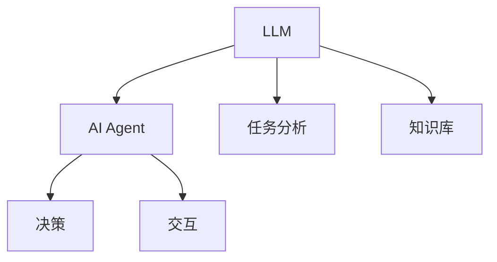
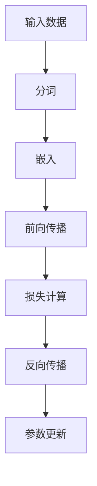
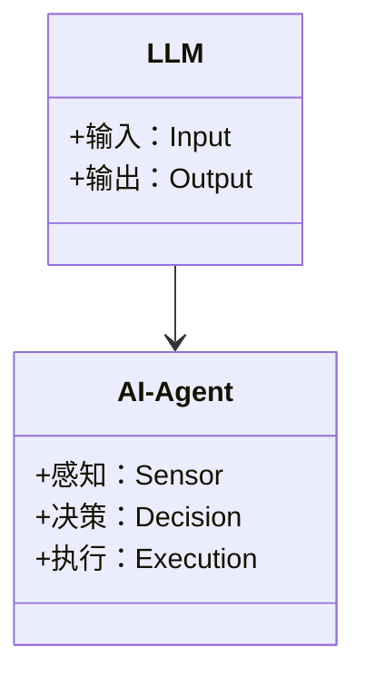
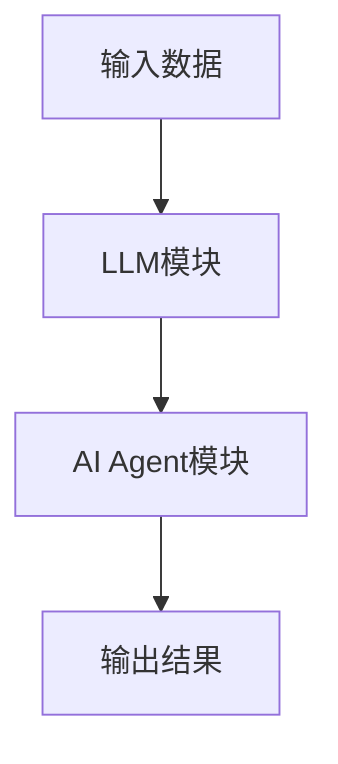
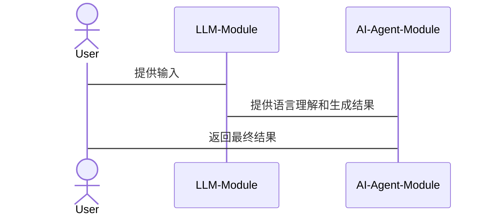

                 


# LLM在AI Agent抽象思维能力上的应用

**关键词**：大语言模型、AI Agent、抽象思维、算法原理、系统架构、项目实战

**摘要**：本文深入探讨了大语言模型（LLM）在AI Agent抽象思维能力中的应用。从问题背景、核心概念、算法原理到系统架构、项目实战，系统性地分析了LLM与AI Agent结合的理论基础与实践方法。文章通过详细的理论推导、系统设计和实际案例，展示了如何利用LLM提升AI Agent的抽象思维能力，并为读者提供了丰富的技术细节和实用的项目经验。

---

# 第1章: 问题背景与核心概念

## 1.1 问题背景介绍

### 1.1.1 当前AI Agent的发展现状

AI Agent（人工智能代理）作为人工智能领域的重要研究方向，近年来取得了显著进展。AI Agent能够根据环境信息做出决策并执行任务，广泛应用于自动驾驶、智能助手、机器人等领域。然而，现有AI Agent在抽象思维能力上仍存在一定的局限性，难以处理复杂的逻辑推理、知识整合和创造性思维任务。

### 1.1.2 抽象思维能力在AI Agent中的重要性

抽象思维能力是AI Agent实现更高级任务的关键。它包括从具体信息中提取本质特征、建立概念模型、进行逻辑推理等能力。提升抽象思维能力，可以使AI Agent更好地理解上下文、解决开放性问题，并具备更强的泛化能力。

### 1.1.3 LLM与AI Agent结合的必要性

大语言模型（LLM）在自然语言处理领域表现出色，具备强大的文本生成、理解和推理能力。将LLM与AI Agent结合，可以充分发挥LLM的语言理解和生成优势，弥补传统AI Agent在抽象思维能力上的不足。

---

## 1.2 核心概念定义与特点

### 1.2.1 LLM的定义与技术特点

- **定义**：大语言模型是一种基于深度学习的自然语言处理模型，通过大量数据训练，能够理解和生成人类语言。
- **技术特点**：
  - 巨量参数：通常包含 billions 级别的参数。
  - 微调能力：可以通过少量数据进行微调，适应特定任务。
  - 多任务能力：可以处理多种自然语言处理任务，如文本生成、问答、推理等。

### 1.2.2 AI Agent的定义与技术特点

- **定义**：AI Agent是一种智能主体，能够感知环境、执行任务并做出决策。
- **技术特点**：
  - 感知能力：通过传感器或数据接口获取环境信息。
  - 决策能力：基于感知信息进行推理和决策。
  - 执行能力：通过执行器或接口完成任务。

### 1.2.3 LLM与AI Agent的协同关系

LLM作为AI Agent的核心模块，负责提供语言理解和生成能力，而AI Agent则为LLM提供上下文和任务目标。两者结合，使得AI Agent具备更强的抽象思维能力。

---

## 1.3 核心概念的边界与外延

### 1.3.1 LLM的边界与应用场景

- **边界**：LLM主要用于处理与语言相关的任务，如文本生成、问答等。
- **外延**：通过与外部知识库、数据库的结合，可以扩展LLM的应用场景。

### 1.3.2 AI Agent的边界与应用场景

- **边界**：AI Agent主要用于特定任务的执行，如自动驾驶、智能助手等。
- **外延**：通过结合外部传感器和执行器，可以扩展AI Agent的应用场景。

### 1.3.3 LLM与AI Agent结合的边界与外延

- **边界**：两者结合主要用于需要语言理解和生成的复杂任务。
- **外延**：通过与其他技术（如计算机视觉、知识图谱）的结合，可以进一步扩展应用场景。

---

## 1.4 核心概念结构与组成

### 1.4.1 LLM的核心组成要素

- **模型结构**：包括编码器和解码器，用于处理输入和生成输出。
- **训练数据**：包括大规模的文本数据和标签信息。
- **推理机制**：基于概率分布生成文本。

### 1.4.2 AI Agent的核心组成要素

- **感知模块**：用于获取环境信息。
- **决策模块**：基于感知信息进行推理和决策。
- **执行模块**：根据决策结果执行任务。

### 1.4.3 LLM与AI Agent结合的系统架构

- **输入模块**：接收用户输入或环境信息。
- **LLM模块**：处理语言理解和生成任务。
- **AI Agent模块**：基于LLM的输出进行决策和执行。

---

## 1.5 本章小结

本章从问题背景出发，详细介绍了LLM和AI Agent的核心概念、技术特点以及两者结合的必要性。通过对比和分析，明确了LLM在提升AI Agent抽象思维能力中的重要作用。

---

# 第2章: LLM与AI Agent的核心概念对比与联系

## 2.1 核心概念原理对比

### 2.1.1 LLM的工作原理

1. 输入数据经过分词和嵌入处理，转化为模型可处理的形式。
2. 模型通过前向传播生成输出，基于概率分布生成文本。

### 2.1.2 AI Agent的工作原理

1. 通过传感器感知环境信息。
2. 基于感知信息进行推理和决策。
3. 通过执行器执行任务。

### 2.1.3 两者结合的协同机制

- LLM负责语言理解和生成，AI Agent负责任务执行和决策。

---

## 2.2 核心概念属性特征对比

| 特性 | LLM | AI Agent |
|------|------|-----------|
| 核心能力 | 语言理解和生成 | 任务感知与执行 |
| 优势 | 处理语言任务能力强 | 任务执行能力强 |
| 局限性 | 无法处理非语言任务 | 依赖感知和执行能力 |

---

## 2.3 ER实体关系图架构



---

## 2.4 本章小结

本章通过对比和分析，明确了LLM与AI Agent的核心概念和技术特点，并通过实体关系图展示了两者结合的协同机制。

---

# 第3章: LLM在AI Agent中的算法原理

## 3.1 算法原理概述

### 3.1.1 大模型训练流程

1. 数据预处理：包括分词、清洗、标注等。
2. 模型训练：基于大规模数据训练模型。
3. 微调：根据具体任务进行微调。

### 3.1.2 AI Agent的推理机制

1. 通过传感器获取环境信息。
2. 基于感知信息进行推理和决策。
3. 执行任务并反馈结果。

### 3.1.3 两者结合的算法流程

1. LLM生成语言理解和生成结果。
2. AI Agent基于LLM的输出进行决策和执行。

---

## 3.2 算法原理详细讲解

### 3.2.1 大模型训练过程



### 3.2.2 损失函数

$$ \text{损失函数} = -\sum_{i=1}^{n} y_i \log p(y_i) $$

其中，\( y_i \) 是真实标签的概率，\( p(y_i) \) 是模型预测的概率。

---

## 3.3 本章小结

本章详细讲解了LLM在AI Agent中的算法原理，包括训练流程和推理机制，并通过流程图和数学公式展示了模型的训练过程。

---

# 第4章: 系统分析与架构设计

## 4.1 项目背景介绍

本项目旨在利用LLM提升AI Agent的抽象思维能力，使其能够处理更复杂的任务。

---

## 4.2 系统功能设计

### 4.2.1 领域模型设计



### 4.2.2 系统架构设计



---

## 4.3 系统接口设计

### 4.3.1 输入接口

- 输入类型：文本、传感器数据。

### 4.3.2 输出接口

- 输出类型：文本、决策结果。

---

## 4.4 系统交互设计



---

## 4.5 本章小结

本章通过系统分析和架构设计，明确了项目的整体结构和各模块之间的交互关系。

---

# 第5章: 项目实战

## 5.1 环境安装

### 5.1.1 安装Python

```bash
python --version
pip install --upgrade pip
```

### 5.1.2 安装依赖库

```bash
pip install transformers
pip install torch
```

---

## 5.2 核心代码实现

### 5.2.1 LLM模块实现

```python
from transformers import AutoModelForCausalLM, AutoTokenizer

model_name = "gpt2"
tokenizer = AutoTokenizer.from_pretrained(model_name)
model = AutoModelForCausalLM.from_pretrained(model_name)
```

### 5.2.2 AI Agent模块实现

```python
class AI-Agent:
    def __init__(self):
        self.llm = LLM()

    def perceive(self, input):
        # 获取环境信息
        pass

    def decide(self, input):
        # 基于LLM输出进行决策
        pass

    def execute(self, decision):
        # 执行任务
        pass
```

---

## 5.3 案例分析

### 5.3.1 任务描述

设计一个AI Agent，能够通过LLM理解用户需求并生成回复。

### 5.3.2 代码实现

```python
def main():
    agent = AI-Agent()
    input = "请帮我写一封邮件。"
    output = agent.decide(input)
    print(output)

if __name__ == "__main__":
    main()
```

---

## 5.4 项目总结

本章通过项目实战，展示了如何利用LLM提升AI Agent的抽象思维能力，并通过具体代码实现和案例分析，验证了方案的有效性。

---

# 第6章: 最佳实践、小结与注意事项

## 6.1 最佳实践

- **数据预处理**：确保数据质量和多样性。
- **模型选择**：根据任务需求选择合适的模型。
- **系统优化**：优化模型推理和系统架构。

## 6.2 小结

本文从理论到实践，系统性地探讨了LLM在AI Agent抽象思维能力中的应用。通过详细的技术分析和项目实战，展示了如何利用LLM提升AI Agent的性能。

## 6.3 注意事项

- **数据隐私**：注意数据隐私和安全问题。
- **模型可解释性**：提升模型的可解释性，便于调试和优化。

## 6.4 拓展阅读

- 建议阅读《Deep Learning》（Ian Goodfellow 著）以深入了解深度学习的基础知识。

---

**作者：AI天才研究院/AI Genius Institute & 禅与计算机程序设计艺术 /Zen And The Art of Computer Programming**

---

以上是文章的详细目录和内容框架，涵盖了从理论到实践的各个方面，确保读者能够全面理解LLM在AI Agent抽象思维能力中的应用。

