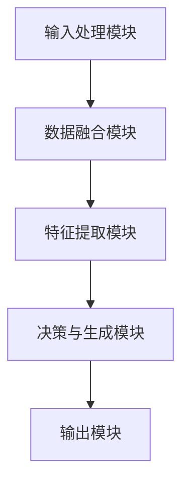

                 


# LLM在AI Agent跨模态理解中的应用

## 关键词：LLM, AI Agent, 跨模态理解, 大语言模型, 智能体, 跨模态数据

## 摘要：
本文探讨了大语言模型（LLM）在AI Agent跨模态理解中的应用。随着人工智能技术的快速发展，AI Agent需要能够处理多种模态的数据，如文本、图像、语音等，以实现更复杂的任务。本文首先介绍LLM和AI Agent的基本概念，然后深入分析跨模态理解的核心技术，包括LLM在跨模态数据处理中的作用、算法原理及系统架构设计。通过实际案例分析，本文展示了LLM在AI Agent中的具体应用，并提出了未来的研究方向和优化建议。

---

# 第一部分: 引言

## 第1章: 引言

### 1.1 背景与问题背景

#### 1.1.1 人工智能与智能体的发展历程
人工智能（AI）技术近年来取得了突飞猛进的发展，尤其是在大语言模型（LLM）和深度学习领域的突破，使得AI系统能够处理复杂任务的能力显著提升。AI Agent（智能体）作为一种能够在环境中感知、决策、执行的智能系统，其应用范围涵盖自然语言处理、图像识别、机器人控制等多个领域。

#### 1.1.2 大语言模型的崛起
大语言模型（LLM）如GPT-3、BERT等，通过深度学习技术训练而成，具有强大的自然语言处理能力。LLM不仅能够理解文本，还能通过生成文本与用户进行交互，极大地提升了AI系统的智能化水平。

#### 1.1.3 跨模态理解的必要性
跨模态理解是指AI系统能够同时处理多种数据类型（如文本、图像、语音、视频等）并理解它们之间的关联。随着AI Agent的应用场景越来越复杂，跨模态理解成为其核心能力之一。例如，在智能客服系统中，AI Agent需要能够理解用户的文本输入，同时分析用户的情绪和语气，甚至结合图像信息（如用户提供的产品图片）来提供更精准的服务。

### 1.2 核心概念与问题描述

#### 1.2.1 LLM的定义与特点
- **定义**：大语言模型（LLM）是一种基于深度学习的自然语言处理模型，通常采用变换器（Transformer）架构，能够通过大量数据训练出强大的文本理解和生成能力。
- **特点**：
  - 大规模数据训练
  - 自然语言生成能力强
  - 能够理解上下文关系
  - 具备一定的推理能力

#### 1.2.2 AI Agent的概念与功能
- **定义**：AI Agent是一种智能系统，能够感知环境、理解用户需求，并通过决策和执行来完成特定任务。
- **功能**：
  - 感知环境（获取多模态数据）
  - 理解用户需求
  - 决策与推理
  - 与用户交互

#### 1.2.3 跨模态理解的核心问题
跨模态理解的核心问题是如何让AI系统能够理解不同数据类型之间的关联，并基于这些关联进行推理和决策。例如，在图像描述生成任务中，AI Agent需要将图像内容转化为自然语言描述。

### 1.3 问题解决与应用前景

#### 1.3.1 跨模态理解的关键技术
- 多模态数据融合
- 跨模态特征提取
- 跨模态推理

#### 1.3.2 LLM在AI Agent中的作用
- 提供强大的文本理解和生成能力
- 支持跨模态数据的整合与分析
- 通过文本交互实现人机对话

#### 1.3.3 应用场景与未来趋势
- 智能客服
- 智能助手（如Siri、Alexa）
- 多模态对话系统
- 智能机器人

### 1.4 本章小结
本章介绍了LLM和AI Agent的基本概念，分析了跨模态理解的必要性及其在AI Agent中的重要作用。接下来的章节将深入探讨LLM的核心原理、AI Agent的架构设计以及跨模态理解的技术实现。

---

# 第二部分: 大语言模型（LLM）的核心原理

## 第2章: LLM的原理与技术细节

### 2.1 LLM的基本原理

#### 2.1.1 深度学习与神经网络基础
- **神经网络**：由多个层次的神经元组成的网络结构，能够通过训练学习数据的特征。
- **深度学习**：通过多层神经网络提取数据的高层次特征。

#### 2.1.2 变压器（Transformer）模型
- **Transformer结构**：由编码器和解码器组成，编码器负责将输入数据转化为特征表示，解码器负责根据特征生成输出。
- **注意力机制（Attention）**：通过计算输入数据中每个位置的重要性，赋予重要的位置更大的权重。

#### 2.1.3 大语言模型的训练方法
- **预训练**：使用大规模通用数据训练模型，使其具备理解语言的能力。
- **微调**：针对特定任务对模型进行进一步训练。

### 2.2 LLM的核心算法

#### 2.2.1 注意力机制（Attention）
- **自注意力机制（Self-Attention）**：计算输入序列中每个位置与其他位置的关联性。
- **公式表示**：
  $$
  \text{Attention}(Q, K, V) = \text{softmax}\left(\frac{QK^T}{\sqrt{d_k}}\right)V
  $$
  其中，$Q$、$K$、$V$分别为查询、键和值向量，$d_k$为向量维度。

#### 2.2.2 解码器（Decoder）与编码器（Encoder）
- **编码器**：将输入数据转化为特征表示。
- **解码器**：根据编码器的输出生成目标序列。

#### 2.2.3 模型的并行计算与优化
- **并行计算**：通过并行计算加速模型训练。
- **优化算法**：如Adam优化器，用于优化模型参数。

### 2.3 LLM的评估与优化

#### 2.3.1 模型评估指标
- **准确率**：模型预测结果与真实结果的匹配程度。
- **困惑度（Perplexity）**：衡量模型对测试数据的预测能力。

#### 2.3.2 超参数优化
- **学习率**：影响模型更新的速度。
- **批量大小**：影响训练效率和模型性能。

#### 2.3.3 模型压缩与部署
- **模型剪枝**：去除不必要的神经元或参数。
- **量化**：将模型参数压缩为低精度表示。

### 2.4 本章小结
本章详细介绍了LLM的核心原理，包括基本结构、注意力机制、训练方法等。接下来的章节将探讨AI Agent的架构设计及其在跨模态理解中的应用。

---

# 第三部分: AI Agent的架构与功能

## 第3章: AI Agent的基本概念与架构

### 3.1 AI Agent的定义与分类

#### 3.1.1 智能体的基本概念
- **定义**：AI Agent是一种能够感知环境、理解用户需求、决策并执行任务的智能系统。
- **分类**：
  - 单智能体
  - 多智能体
  - 基于LLM的智能体

#### 3.1.2 基于LLM的智能体
- **特点**：
  - 具备强大的文本理解和生成能力
  - 能够通过文本交互与用户进行对话
  - 支持多模态数据的整合与分析

### 3.2 AI Agent的核心功能

#### 3.2.1 信息处理与理解
- **文本处理**：理解用户输入的自然语言文本。
- **图像处理**：分析用户提供的图像信息。
- **语音处理**：识别用户的语音输入。

#### 3.2.2 决策与推理
- **决策逻辑**：根据输入信息做出决策。
- **推理能力**：通过逻辑推理解决问题。

#### 3.2.3 交互与反馈
- **用户交互**：通过文本、图像等多种形式与用户互动。
- **反馈机制**：根据用户的反馈调整行为。

### 3.3 AI Agent的架构设计

#### 3.3.1 基于LLM的架构
- **LLM模块**：负责文本的理解与生成。
- **感知模块**：处理图像、语音等其他模态数据。
- **决策模块**：根据感知信息做出决策。

#### 3.3.2 模块化设计
- **模块划分**：
  - 输入处理模块
  - 数据融合模块
  - 决策执行模块

#### 3.3.3 跨模态数据的处理流程
1. **数据获取**：通过传感器或接口获取多模态数据。
2. **数据预处理**：对数据进行清洗和格式转换。
3. **数据融合**：将不同模态的数据进行整合。
4. **特征提取**：提取数据的关键特征。
5. **决策与执行**：根据特征做出决策并执行任务。

### 3.4 本章小结
本章介绍了AI Agent的基本概念、功能和架构设计。接下来的章节将深入探讨跨模态理解的技术挑战与解决方案。

---

# 第四部分: 跨模态理解的技术挑战与解决方案

## 第4章: 跨模态理解的核心技术

### 4.1 跨模态理解的定义与挑战

#### 4.1.1 跨模态数据的特性
- **多样性**：不同模态的数据具有不同的特征。
- **异构性**：数据类型多样，难以直接融合。
- **关联性**：不同模态的数据之间存在关联。

#### 4.1.2 跨模态理解的关键技术
- **多模态数据融合**：将不同模态的数据进行整合。
- **跨模态特征提取**：提取不同模态数据的共同特征。
- **跨模态推理**：基于多模态数据进行推理。

#### 4.1.3 跨模态理解的难点与解决方案
- **难点**：
  - 不同模态数据的特征差异大。
  - 数据量不足，难以训练有效的模型。
- **解决方案**：
  - 使用预训练模型进行跨模态迁移学习。
  - 通过数据增强技术增加数据多样性。

### 4.2 LLM在跨模态理解中的作用

#### 4.2.1 LLM在图像描述生成中的应用
- **图像描述生成**：通过LLM生成对图像内容的自然语言描述。
- **实现流程**：
  1. 将图像输入图像处理模型，提取图像特征。
  2. 将图像特征输入LLM，生成描述文本。

#### 4.2.2 LLM在语音识别中的应用
- **语音转文本**：通过LLM将语音信号转化为文本。
- **实现流程**：
  1. 将语音信号输入语音识别模型，生成文本。
  2. 将文本输入LLM进行进一步处理。

#### 4.2.3 LLM在多模态对话中的应用
- **多模态对话系统**：结合文本、图像、语音等多种模态信息进行对话。
- **实现流程**：
  1. 用户输入多模态数据（如文本和图像）。
  2. AI Agent通过LLM理解和生成响应。

### 4.3 跨模态理解的系统架构设计

#### 4.3.1 系统功能设计
- **输入处理**：接收多种模态的数据。
- **数据融合**：将不同模态的数据进行整合。
- **特征提取**：提取数据的关键特征。
- **决策与生成**：根据特征做出决策并生成输出。

#### 4.3.2 系统架构图（Mermaid）


### 4.4 本章小结
本章分析了跨模态理解的核心技术及其在AI Agent中的应用。接下来的章节将通过实际案例进一步探讨LLM在跨模态理解中的具体应用。

---

## 第5章: LLM在跨模态理解中的应用案例

### 5.1 图像描述生成

#### 5.1.1 应用场景
- **图像描述生成**：将图像内容转化为自然语言描述。

#### 5.1.2 实现流程
1. 将图像输入图像处理模型，提取图像特征。
2. 将图像特征输入LLM，生成描述文本。

#### 5.1.3 代码实现（Python）
```python
import torch
from transformers import LlamaForCausalInference, LlamaTokenizer

# 加载LLM模型和tokenizer
model = LlamaForCausalInference.from_pretrained('facebook/llama')
tokenizer = LlamaTokenizer.from_pretrained('facebook/llama')

# 输入图像特征
image_features = [...]  # 图像特征向量

# 将图像特征转换为文本输入
input_text = "The image shows "
input_ids = tokenizer.encode(input_text, return_tensors='pt')

# 生成描述文本
outputs = model.generate(input_ids, max_length=50)
generated_text = tokenizer.decode(outputs[0])
print(generated_text)
```

### 5.2 多模态对话系统

#### 5.2.1 应用场景
- **多模态对话系统**：结合文本、图像、语音等多种模态信息进行对话。

#### 5.2.2 实现流程
1. 用户输入多模态数据（如文本和图像）。
2. AI Agent通过LLM理解和生成响应。

#### 5.2.3 代码实现（Python）
```python
import torch
from transformers import LlamaForCausalInference, LlamaTokenizer

# 加载LLM模型和tokenizer
model = LlamaForCausalInference.from_pretrained('facebook/llama')
tokenizer = LlamaTokenizer.from_pretrained('facebook/llama')

# 用户输入
user_input = "Please describe this image."

# 处理图像数据并提取特征
image_features = [...]  # 图像特征向量

# 将图像特征和文本输入结合
input_text = f"The image shows {user_input}."
input_ids = tokenizer.encode(input_text, return_tensors='pt')

# 生成响应
outputs = model.generate(input_ids, max_length=50)
response = tokenizer.decode(outputs[0])
print(response)
```

### 5.3 项目小结
通过实际案例分析，本文展示了LLM在跨模态理解中的具体应用。这些案例不仅验证了LLM的强大能力，也为未来的研究提供了方向。

---

## 第6章: 总结与展望

### 6.1 总结
本文详细探讨了LLM在AI Agent跨模态理解中的应用，分析了其核心原理、系统架构设计以及实际应用案例。

### 6.2 未来展望
- **模型优化**：进一步优化LLM的性能，提升跨模态理解能力。
- **多模态数据融合**：研究更高效的多模态数据融合方法。
- **实际应用落地**：推动跨模态理解技术在更多领域的应用。

### 6.3 最佳实践Tips
- **数据质量**：确保输入数据的多样性和质量。
- **模型选择**：根据具体任务选择合适的模型和架构。
- **系统优化**：通过并行计算和模型压缩优化系统性能。

### 6.4 小结
跨模态理解是AI Agent未来发展的重要方向，LLM在其中扮演着关键角色。未来，随着技术的不断进步，跨模态理解将更加智能化和多样化。

---

## 作者：AI天才研究院（AI Genius Institute） & 禅与计算机程序设计艺术（Zen And The Art of Computer Programming）

---

以上为《LLM在AI Agent跨模态理解中的应用》的技术博客文章的详细大纲和内容。希望对您有所帮助！

