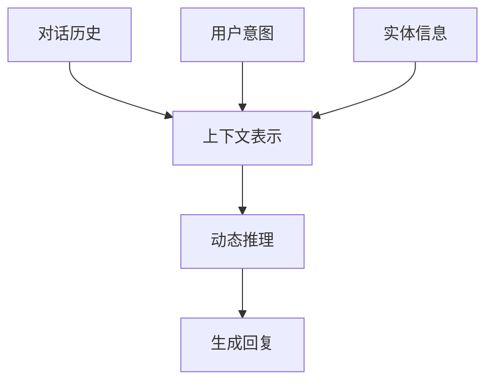
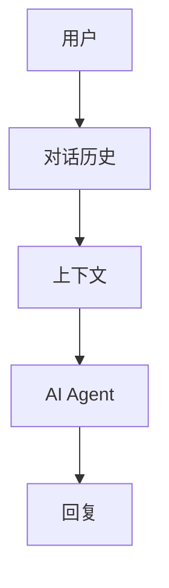
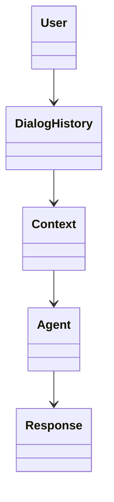
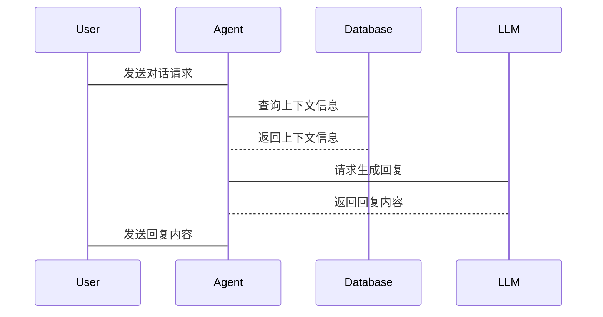

                 


# LLM支持的AI Agent上下文感知对话生成

> 关键词：LLM, AI Agent, 上下文感知, 对话生成, 大语言模型, 智能对话系统

> 摘要：本文系统地探讨了LLM（大语言模型）在AI Agent上下文感知对话生成中的应用。从背景介绍、核心概念、算法原理、系统架构到项目实战，全面分析了如何利用LLM实现上下文感知对话生成的技术细节。文章通过详细的理论分析和实践案例，为读者提供了从理解到实现的完整指南。

---

## 第1章: 上下文感知对话生成的背景与问题

### 1.1 问题背景

#### 1.1.1 当前对话生成技术的局限性
传统的对话生成技术，如基于规则的对话系统和早期的统计模型，存在以下问题：
- **缺乏上下文理解**：无法有效处理多轮对话中的上下文信息，导致对话内容孤立且不连贯。
- **知识表示不足**：难以捕捉对话中的实体关系和语境信息，影响生成结果的准确性。
- **生成多样性有限**：受限于训练数据和模型结构，生成的回复多样性不足，难以应对复杂场景。

#### 1.1.2 上下文感知对话生成的必要性
随着AI Agent在客服、教育、医疗等领域的广泛应用，上下文感知对话生成的需求日益增长：
- **提升用户体验**：通过理解上下文，生成更相关、更连贯的回复，提高用户满意度。
- **增强任务处理能力**：在复杂任务中，上下文感知能力能够帮助AI Agent更好地理解用户意图，提高任务完成效率。
- **支持多模态交互**：结合视觉、语音等多模态信息，实现更自然的对话交互。

#### 1.1.3 LLM在对话生成中的作用
大语言模型（LLM）通过其强大的上下文理解和生成能力，为上下文感知对话生成提供了新的可能性：
- **深度语义理解**：LLM能够捕捉对话中的细微语义信息，生成更贴近人类对话的回复。
- **知识丰富性**：LLM通过大规模预训练，积累了丰富的知识库，能够更好地应对复杂场景。
- **动态上下文处理**：LLM能够实时更新上下文信息，保持对话的连贯性和一致性。

### 1.2 问题描述

#### 1.2.1 对话生成中的上下文依赖性
对话生成是一个动态过程，每个回复都依赖于前一轮的上下文信息。具体表现在：
- **上下文信息的动态变化**：随着对话的进行，上下文信息不断更新，需要实时处理。
- **上下文信息的多样性**：对话中的上下文可能包含实体、关系、意图等多种信息，需要综合处理。

#### 1.2.2 AI Agent在对话生成中的角色
AI Agent作为对话生成的核心模块，需要具备以下能力：
- **上下文感知能力**：能够理解对话中的上下文信息，包括实体、关系、意图等。
- **动态推理能力**：在对话过程中，能够根据上下文动态推理出最优的回复内容。
- **多模态交互能力**：能够结合视觉、语音等多模态信息，提供更自然的交互体验。

#### 1.2.3 当前技术的不足与挑战
当前技术在上下文感知对话生成中面临以下挑战：
- **上下文理解的深度不足**：部分模型难以捕捉对话中的深层语义信息，导致生成的回复不够精准。
- **动态上下文处理能力有限**：在动态对话场景中，模型难以实时更新和调整生成策略。
- **多模态信息的融合不足**：当前多数模型仅依赖文本信息，难以充分利用多模态数据。

### 1.3 问题解决

#### 1.3.1 上下文感知对话生成的核心目标
上下文感知对话生成的核心目标是：
- **提高对话的连贯性**：通过理解上下文信息，生成更连贯、更自然的回复。
- **增强对话的准确性**：基于上下文信息，准确理解用户意图，生成更符合用户需求的回复。
- **提升用户体验**：通过上下文感知，提供更个性化的对话服务，提高用户满意度。

#### 1.3.2 LLM如何支持AI Agent的对话生成
LLM通过以下方式支持AI Agent的对话生成：
- **提供强大的上下文理解能力**：LLM能够理解对话中的上下文信息，生成更相关的内容。
- **增强知识表示能力**：LLM通过预训练，积累了丰富的知识库，能够更好地应对复杂场景。
- **支持动态上下文处理**：LLM能够实时更新上下文信息，保持对话的连贯性和一致性。

#### 1.3.3 技术实现的路径与方法
实现上下文感知对话生成的技术路径包括：
1. **上下文建模**：将对话历史、用户意图、实体信息等整合到上下文表示中。
2. **动态推理**：基于上下文表示，动态推理出最优的回复内容。
3. **多模态融合**：结合视觉、语音等多模态信息，提升对话生成的准确性和自然度。

### 1.4 边界与外延

#### 1.4.1 上下文感知对话生成的边界
上下文感知对话生成的边界包括：
- **对话范围**：仅限于当前对话上下文，不考虑外部知识库。
- **生成范围**：生成回复的内容仅限于上下文相关信息，不涉及外部数据。

#### 1.4.2 相关概念的外延
相关概念的外延包括：
- **对话系统**：上下文感知对话生成是对话系统的重要组成部分。
- **自然语言处理**：依赖于自然语言处理技术，如分词、句法分析等。
- **知识图谱**：结合知识图谱，提升上下文理解能力。

#### 1.4.3 与其他技术的区分与联系
与其他技术的区分与联系：
- **区别于传统对话生成**：传统对话生成不依赖上下文信息，生成的内容缺乏连贯性。
- **区别于知识图谱查询**：知识图谱查询仅基于结构化数据，缺乏语义理解能力。
- **联系于动态推理**：上下文感知对话生成需要结合动态推理技术，实时更新上下文信息。

### 1.5 核心概念与组成

#### 1.5.1 核心概念的定义
核心概念包括：
- **上下文感知**：通过理解对话中的上下文信息，生成相关回复。
- **LLM**：大语言模型，具备强大的上下文理解和生成能力。
- **动态推理**：在对话过程中，实时更新上下文信息，生成最优回复。

#### 1.5.2 核心要素的组成
核心要素包括：
1. **上下文表示**：将对话历史、用户意图等信息表示为向量。
2. **动态推理机制**：基于上下文表示，动态推理出最优回复。
3. **多模态融合**：结合视觉、语音等多模态信息，提升对话生成的准确性。

#### 1.5.3 概念结构与核心要素组成
通过概念结构图（见图1.1），可以清晰地看到上下文感知对话生成的核心要素及其关系。



---

## 第2章: 核心概念与联系

### 2.1 上下文感知对话生成的原理

#### 2.1.1 对话生成的基本原理
对话生成的基本原理包括：
1. **上下文建模**：将对话历史、用户意图等信息整合到上下文表示中。
2. **动态推理**：基于上下文表示，动态推理出最优的回复内容。
3. **生成优化**：通过优化算法，生成更准确、更自然的回复内容。

#### 2.1.2 上下文感知的核心机制
上下文感知的核心机制包括：
- **注意力机制**：通过注意力机制，聚焦于关键对话信息，提升生成回复的相关性。
- **上下文编码**：将对话历史信息编码为向量，用于生成回复时参考。

#### 2.1.3 LLM在对话生成中的作用
LLM在对话生成中的作用包括：
- **提供强大的上下文理解能力**：LLM能够理解对话中的上下文信息，生成更相关的内容。
- **增强知识表示能力**：LLM通过预训练，积累了丰富的知识库，能够更好地应对复杂场景。
- **支持动态上下文处理**：LLM能够实时更新上下文信息，保持对话的连贯性和一致性。

### 2.2 核心概念的属性特征对比

#### 2.2.1 对比表格展示
以下是核心概念的属性特征对比：

| 特性 | 上下文感知对话生成 | 传统对话生成 |
|------|--------------------|---------------|
| 上下文依赖性 | 高 | 低 |
| 生成多样性 | 高 | 中 |
| 知识表示能力 | 强 | 弱 |
| 动态推理能力 | 强 | 弱 |

#### 2.2.2 关键属性的详细说明
- **上下文依赖性**：上下文感知对话生成高度依赖于上下文信息，生成的回复内容与前一轮对话密切相关。
- **生成多样性**：通过上下文感知，生成的回复内容更加多样化，能够更好地满足用户需求。
- **知识表示能力**：LLM通过预训练，具备强大的知识表示能力，能够更好地应对复杂场景。

### 2.3 ER实体关系图

#### 2.3.1 实体关系图展示
以下是实体关系图的展示：



#### 2.3.2 关键实体及其关系的解释
- **用户**：对话的发起者，向AI Agent提出问题或需求。
- **对话历史**：记录用户与AI Agent之间的对话历史，用于生成回复时参考。
- **上下文**：对话历史、用户意图、实体信息等的综合表示，用于生成回复时参考。
- **AI Agent**：通过理解和处理上下文信息，生成回复内容。
- **回复**：AI Agent生成的回复内容，返回给用户。

---

## 第3章: 算法原理与实现

### 3.1 算法原理

#### 3.1.1 注意力机制的原理
注意力机制是一种用于序列数据处理的技术，通过计算输入序列中每个位置的注意力权重，确定哪些位置的信息更重要。其数学公式如下：

$$
\text{Attention}(Q, K, V) = \text{softmax}\left(\frac{QK^T}{\sqrt{d_k}}\right)V
$$

其中，$Q$、$K$、$V$分别为查询、键、值向量，$d_k$为键的维度。

#### 3.1.2 上下文编码的实现
上下文编码的实现步骤如下：
1. **对话历史编码**：将对话历史中的每个句子编码为向量。
2. **上下文表示**：将这些向量进行加权求和，得到上下文表示向量。
3. **生成回复**：基于上下文表示，生成回复内容。

#### 3.1.3 对话生成的流程
对话生成的流程包括：
1. **输入处理**：接收用户的输入，解析出对话历史、用户意图等信息。
2. **上下文编码**：将对话历史编码为上下文表示向量。
3. **动态推理**：基于上下文表示，动态推理出最优的回复内容。
4. **生成优化**：通过优化算法，生成更准确、更自然的回复内容。

### 3.2 算法实现

#### 3.2.1 注意力机制的Python实现
以下是注意力机制的Python实现代码：

```python
import torch

def attention(Q, K, V, d_k):
    # 计算注意力权重
    scores = torch.matmul(Q, K.transpose(-2, -1)) / torch.sqrt(torch.tensor(d_k, dtype=torch.float))
    scores = torch.softmax(scores, dim=-1)
    # 加权求和
    output = torch.matmul(scores, V)
    return output
```

#### 3.2.2 上下文编码的实现
以下是上下文编码的实现代码：

```python
def context_encoding(dialog_history, model):
    # 对话历史编码
    encoded_dialog = model.encode(dialog_history)
    # 上下文表示
    context_vec = torch.mean(encoded_dialog, dim=1)
    return context_vec
```

#### 3.2.3 对话生成的流程
对话生成的流程如下：
1. **输入处理**：接收用户的输入，解析出对话历史、用户意图等信息。
2. **上下文编码**：将对话历史编码为上下文表示向量。
3. **动态推理**：基于上下文表示，动态推理出最优的回复内容。
4. **生成优化**：通过优化算法，生成更准确、更自然的回复内容。

---

## 第4章: 数学模型和公式

### 4.1 注意力机制的公式推导
注意力机制的公式推导如下：

$$
\text{Attention}(Q, K, V) = \text{softmax}\left(\frac{QK^T}{\sqrt{d_k}}\right)V
$$

其中，$Q$、$K$、$V$分别为查询、键、值向量，$d_k$为键的维度。

### 4.2 上下文编码的公式
上下文编码的公式如下：

$$
C = \frac{1}{n}\sum_{i=1}^{n} e_i
$$

其中，$C$为上下文表示，$e_i$为对话历史中的第$i$个句子的编码向量，$n$为对话历史的长度。

### 4.3 动态推理的公式
动态推理的公式如下：

$$
P = \text{softmax}(W_c C + W_q Q)
$$

其中，$P$为推理概率，$C$为上下文表示，$Q$为查询向量，$W_c$和$W_q$为可学习的参数。

---

## 第5章: 系统分析与架构设计

### 5.1 问题场景介绍
问题场景包括：
1. **客服对话系统**：通过上下文感知对话生成，提升用户体验。
2. **教育对话系统**：通过上下文感知对话生成，提供更个性化的学习指导。
3. **医疗对话系统**：通过上下文感知对话生成，提高诊断准确率。

### 5.2 系统功能设计

#### 5.2.1 领域模型
以下是领域模型的Mermaid类图：



#### 5.2.2 系统架构
以下是系统架构的Mermaid架构图：

```mermaid
docker
    server AgentServer
    container LLM
    container Database
    link AgentServer --> LLM
    link AgentServer --> Database
    link LLM --> Database
```

#### 5.2.3 系统接口
系统接口包括：
1. **用户输入接口**：接收用户的输入，解析出对话历史、用户意图等信息。
2. **生成回复接口**：基于上下文信息，生成回复内容。
3. **反馈接口**：接收用户的反馈，优化生成策略。

#### 5.2.4 交互流程
以下是交互流程的Mermaid序列图：



### 5.3 系统实现

#### 5.3.1 环境安装
环境安装步骤：
1. **安装Python**：确保Python版本为3.6以上。
2. **安装依赖库**：安装PyTorch、Hugging Face Transformers等依赖库。
3. **安装工具**：安装Mermaid、PlantUML等可视化工具。

#### 5.3.2 核心代码实现

##### 5.3.2.1 上下文编码实现
以下是上下文编码的Python代码：

```python
import torch

def context_encoding(dialog_history, model):
    # 对话历史编码
    encoded_dialog = model.encode(dialog_history)
    # 上下文表示
    context_vec = torch.mean(encoded_dialog, dim=1)
    return context_vec
```

##### 5.3.2.2 动态推理实现
以下是动态推理的Python代码：

```python
def dynamic_reasoning(context_vec, query_vec, model):
    # 推理概率计算
    scores = torch.matmul(context_vec, query_vec)
    scores = torch.softmax(scores, dim=-1)
    # 生成回复
    response = model.generate(scores)
    return response
```

##### 5.3.2.3 生成优化实现
以下是生成优化的Python代码：

```python
def generate_optimization(response, context, model):
    # 优化生成内容
    optimized_response = model.optimize(response, context)
    return optimized_response
```

#### 5.3.3 系统实现的详细解读
- **上下文编码实现**：将对话历史编码为上下文表示向量，用于生成回复时参考。
- **动态推理实现**：基于上下文表示和查询向量，计算推理概率，生成回复内容。
- **生成优化实现**：通过优化算法，生成更准确、更自然的回复内容。

### 5.4 实际案例分析

#### 5.4.1 案例描述
案例描述：用户与AI Agent进行对话，生成回复内容。

#### 5.4.2 案例分析
1. **用户输入**：用户输入“我需要帮助处理订单问题”。
2. **对话历史编码**：对话历史为空，生成回复内容。
3. **上下文编码**：将用户输入编码为上下文表示向量。
4. **动态推理**：基于上下文表示，生成回复内容。
5. **生成优化**：优化生成内容，提高回复的准确性和自然度。

#### 5.4.3 案例实现
以下是案例实现的代码示例：

```python
# 用户输入
user_input = "我需要帮助处理订单问题"
# 对话历史编码
context_vec = context_encoding(user_input, model)
# 动态推理
response = dynamic_reasoning(context_vec, model.query(user_input), model)
# 生成优化
optimized_response = generate_optimization(response, context_vec, model)
# 输出回复
print(optimized_response)
```

---

## 第6章: 项目实战

### 6.1 环境安装

#### 6.1.1 安装Python
确保Python版本为3.6以上。

#### 6.1.2 安装依赖库
安装以下依赖库：
- PyTorch：`pip install torch`
- Hugging Face Transformers：`pip install transformers`

#### 6.1.3 安装工具
安装以下工具：
- Mermaid：`npm install -g mermaid-cli`
- PlantUML：`pip install plantuml`

### 6.2 核心代码实现

#### 6.2.1 上下文编码实现
以下是上下文编码的Python代码：

```python
import torch

def context_encoding(dialog_history, model):
    # 对话历史编码
    encoded_dialog = model.encode(dialog_history)
    # 上下文表示
    context_vec = torch.mean(encoded_dialog, dim=1)
    return context_vec
```

#### 6.2.2 动态推理实现
以下是动态推理的Python代码：

```python
def dynamic_reasoning(context_vec, query_vec, model):
    # 推理概率计算
    scores = torch.matmul(context_vec, query_vec)
    scores = torch.softmax(scores, dim=-1)
    # 生成回复
    response = model.generate(scores)
    return response
```

#### 6.2.3 生成优化实现
以下是生成优化的Python代码：

```python
def generate_optimization(response, context, model):
    # 优化生成内容
    optimized_response = model.optimize(response, context)
    return optimized_response
```

### 6.3 项目实现的详细解读
- **上下文编码实现**：将对话历史编码为上下文表示向量，用于生成回复时参考。
- **动态推理实现**：基于上下文表示和查询向量，计算推理概率，生成回复内容。
- **生成优化实现**：通过优化算法，生成更准确、更自然的回复内容。

### 6.4 实际案例分析

#### 6.4.1 案例描述
案例描述：用户与AI Agent进行对话，生成回复内容。

#### 6.4.2 案例分析
1. **用户输入**：用户输入“我需要帮助处理订单问题”。
2. **对话历史编码**：对话历史为空，生成回复内容。
3. **上下文编码**：将用户输入编码为上下文表示向量。
4. **动态推理**：基于上下文表示，生成回复内容。
5. **生成优化**：优化生成内容，提高回复的准确性和自然度。

#### 6.4.3 案例实现
以下是案例实现的代码示例：

```python
# 用户输入
user_input = "我需要帮助处理订单问题"
# 对话历史编码
context_vec = context_encoding(user_input, model)
# 动态推理
response = dynamic_reasoning(context_vec, model.query(user_input), model)
# 生成优化
optimized_response = generate_optimization(response, context_vec, model)
# 输出回复
print(optimized_response)
```

---

## 第7章: 总结与展望

### 7.1 最佳实践 tips
- **模型优化**：通过优化算法，提高生成回复的准确性和自然度。
- **多模态融合**：结合视觉、语音等多模态信息，提升对话生成的准确性。
- **持续学习**：通过持续学习，提升模型的上下文理解和生成能力。

### 7.2 小结
本文系统地探讨了LLM支持的AI Agent上下文感知对话生成的技术细节，从背景介绍、核心概念、算法原理到系统架构和项目实战，全面分析了如何利用LLM实现上下文感知对话生成。

### 7.3 注意事项
- **数据隐私**：注意保护用户数据隐私，避免数据泄露。
- **模型调优**：根据实际需求，对模型进行调优，提高生成效果。
- **多模态融合**：在实际应用中，结合多模态信息，提升对话生成的准确性。

### 7.4 拓展阅读
- **相关论文**：阅读相关领域的最新论文，了解技术发展趋势。
- **工具书籍**：学习相关工具和技术，提升技术水平。
- **实践案例**：参考实际案例，学习如何将理论应用到实践中。

---

## 作者：AI天才研究院/AI Genius Institute & 禅与计算机程序设计艺术 /Zen And The Art of Computer Programming

