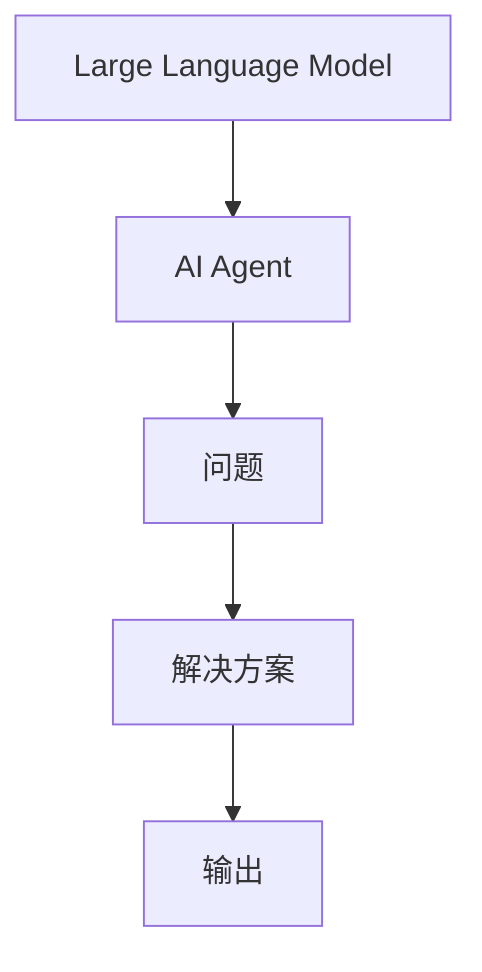
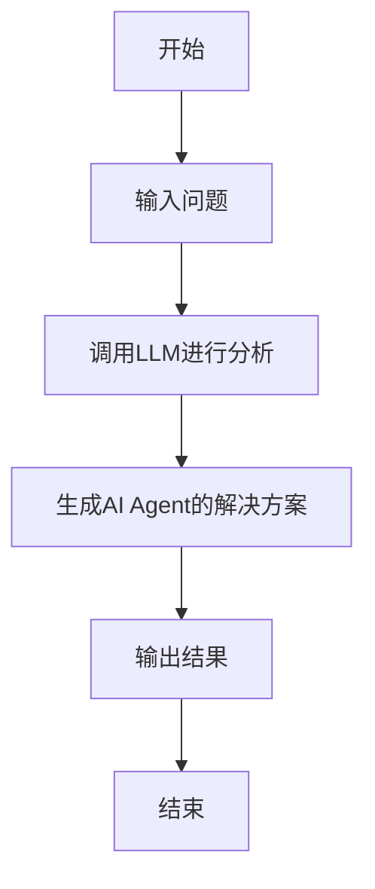
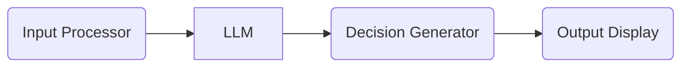
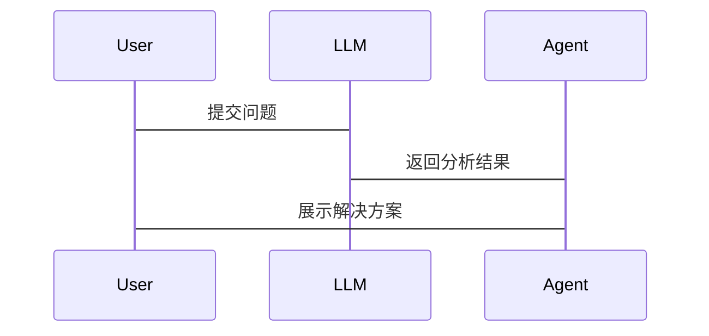

                 


# LLM驱动的AI Agent创新问题解决技术

> 关键词：LLM, AI Agent, 创新问题解决, 大语言模型, 人工智能

> 摘要：本文详细探讨了LLM驱动的AI Agent在创新问题解决中的技术原理和应用。通过分析背景、核心概念、算法原理、系统架构以及实际案例，本文为读者提供了从理论到实践的全面解读，帮助技术从业者深入了解并应用这一创新技术。

---

## 第一部分：背景介绍

### 第1章：LLM驱动的AI Agent概述

#### 1.1 问题背景
- **当前AI技术的发展现状**：人工智能技术正在迅速发展，尤其是在自然语言处理（NLP）领域，大语言模型（LLM）如GPT-3、GPT-4等表现出强大的能力。
- **LLM技术的崛起与应用**：LLM不仅能够生成自然语言文本，还能进行推理、回答问题和完成复杂任务。
- **AI Agent的概念与目标**：AI Agent是一种智能体，能够感知环境、执行任务并做出决策，其目标是通过智能化手段解决问题。

#### 1.2 问题描述
- **LLM驱动的AI Agent的核心问题**：如何将LLM的强大能力与AI Agent的智能决策能力结合起来，实现创新的 problem-solving。
- **问题解决方法**：通过设计一种创新的算法，将LLM生成的文本理解和AI Agent的决策能力结合起来。
- **边界与外延**：本文仅讨论基于LLM的AI Agent技术，不涉及其他类型的人工智能技术。

#### 1.3 核心概念与要素
- **LLM的核心要素**：大规模参数、预训练和微调技术。
- **AI Agent的关键组成部分**：感知、决策、执行模块。
- **创新问题解决技术的核心要素**：LLM的文本理解和生成能力、AI Agent的智能决策能力。

---

## 第二部分：核心概念与联系

### 第2章：LLM与AI Agent的核心原理

#### 2.1 核心概念原理
- **LLM的原理与工作机制**：LLM通过大规模的数据训练，能够生成与上下文相关的文本。
- **AI Agent的原理与工作流程**：AI Agent通过感知环境、分析问题、生成解决方案并执行任务。
- **创新问题解决技术的原理**：结合LLM的文本生成能力和AI Agent的决策能力，实现创新的 problem-solving。

#### 2.2 核心概念对比
- **LLM与传统NLP模型的对比**：
  | 特性 | LLM | 传统NLP模型 |
  |------|------|-------------|
  | 参数规模 | 大规模 | 小规模 |
  | 模型能力 | 强大的生成和理解能力 | 较弱的生成和理解能力 |
- **AI Agent与传统AI系统的对比**：
  | 特性 | AI Agent | 传统AI系统 |
  |------|----------|-------------|
  | 智能性 | 高度智能，具备决策能力 | 智能性有限，通常执行固定任务 |
  | 适应性 | 高度适应环境变化 | 适应性有限 |

#### 2.3 ER实体关系图


---

## 第三部分：算法原理讲解

### 第3章：LLM与AI Agent的算法原理

#### 3.1 算法原理
- **LLM的训练与推理流程**：
  1. **预训练**：通过大量无标签数据进行自监督学习，学习语言的结构和语义。
  2. **微调**：在特定任务上进行有监督学习，优化模型性能。
  3. **推理**：根据输入生成输出，通常采用贪心算法或采样方法。
- **AI Agent的决策与执行流程**：
  1. **感知环境**：通过传感器或输入数据获取环境信息。
  2. **分析问题**：利用LLM生成理解结果并制定解决方案。
  3. **执行任务**：通过执行模块完成具体任务。

#### 3.2 算法流程图


#### 3.3 Python代码实现
```python
def llm_driven_agent(problem):
    # 调用LLM进行分析
    llm_output = llm_generate(problem)
    # 生成解决方案
    solution = generate_solution(llm_output)
    # 执行任务
    execute(solution)
    return llm_output, solution

# 示例LLM生成函数
def llm_generate(problem):
    return f"Solution to {problem}: {problem.split(' ')[-1]}"

# 示例解决方案生成函数
def generate_solution(llm_output):
    return f"Execute {llm_output.split(': ')[-1]}"

# 示例执行函数
def execute(solution):
    print(f"Executing solution: {solution}")
```

---

## 第四部分：系统分析与架构设计方案

### 第4章：系统架构设计

#### 4.1 问题场景介绍
- **问题场景**：设计一个基于LLM的AI Agent，用于解决用户提出的复杂问题。

#### 4.2 系统功能设计
- **领域模型**：定义系统的功能模块，包括输入处理、LLM调用、决策生成和输出展示。
- **系统架构设计图**：


#### 4.3 接口设计
- **输入接口**：接收用户输入的问题。
- **输出接口**：展示生成的解决方案和执行结果。

#### 4.4 交互流程


---

## 第五部分：项目实战

### 第5章：环境安装与核心实现

#### 5.1 环境安装
- **Python版本**：Python 3.8+
- **依赖库**：安装必要的Python库，如`transformers`、`numpy`等。

#### 5.2 核心实现
- **LLM调用**：使用预训练的LLM模型进行文本生成。
- **决策生成**：基于LLM的输出生成解决方案。

#### 5.3 实际案例分析
- **案例描述**：解决一个复杂的技术问题，如代码调试。
- **代码实现**：
  ```python
  def debug_code(error_log):
      llm_output = llm_generate(error_log)
      solution = generate_solution(llm_output)
      return solution
  ```

---

## 第六部分：总结与展望

### 第6章：总结与展望

#### 6.1 最佳实践 tips
- **数据质量**：确保输入数据的质量，以提高LLM的性能。
- **模型选择**：根据具体任务选择合适的LLM模型。
- **系统优化**：定期优化系统架构以提高效率。

#### 6.2 小结
本文详细探讨了LLM驱动的AI Agent在创新问题解决中的技术原理和应用，通过理论分析和实际案例，展示了这一技术的潜力和优势。

#### 6.3 注意事项
- **数据隐私**：确保数据处理符合隐私保护法规。
- **模型性能**：关注模型的计算效率和资源消耗。

#### 6.4 拓展阅读
- **推荐书籍**：《生成式人工智能：原理与应用》
- **推荐论文**：《Large Language Models: The New AI paradigm》

---

作者：AI天才研究院/AI Genius Institute & 禅与计算机程序设计艺术/Zen And The Art of Computer Programming

