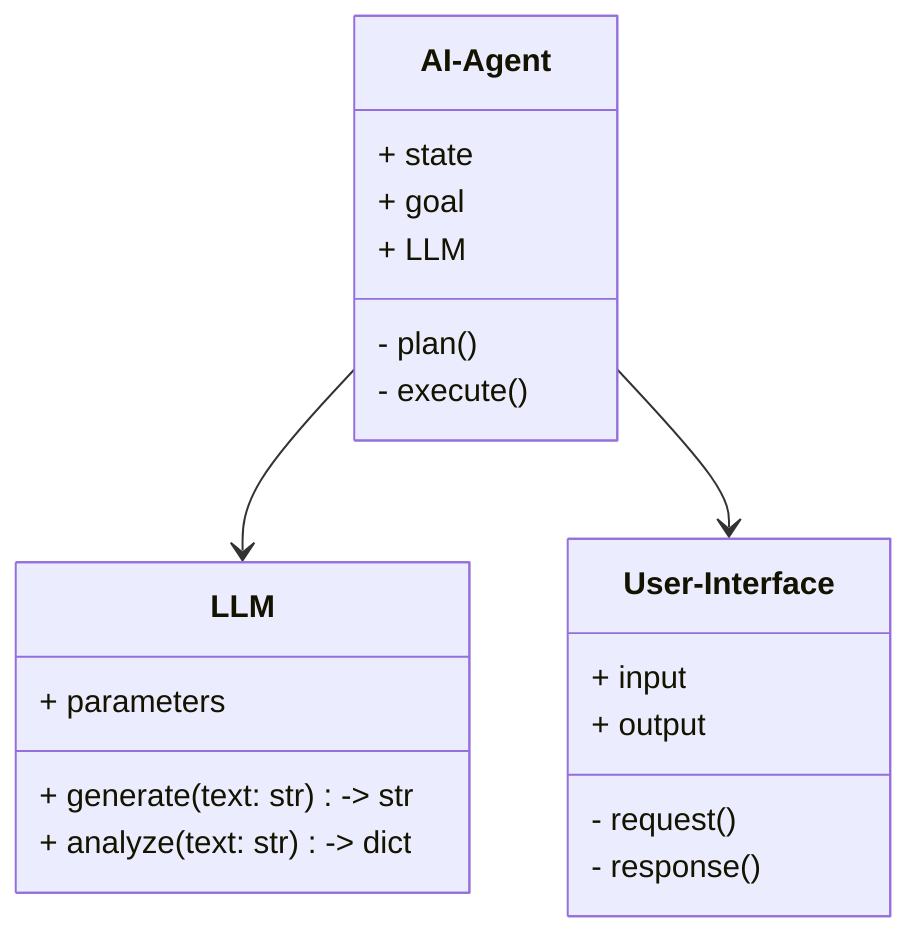
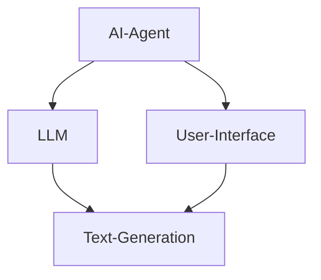
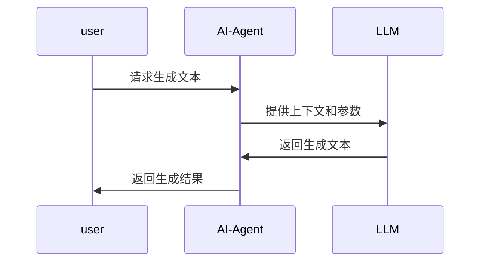

                 


# LLM驱动的AI Agent创造性写作能力

> 关键词：LLM, AI Agent, 创造性写作, 大语言模型, 人工智能代理

> 摘要：本文探讨了如何利用大语言模型（LLM）驱动AI代理，提升其创造性写作能力。通过详细分析LLM的原理、AI代理的设计与实现，以及系统架构，本文旨在为读者提供一个全面的视角，理解如何结合这些技术来实现创新的写作方式。

---

## 第一部分: LLM驱动的AI Agent创造性写作能力概述

### 第1章: LLM与AI Agent的基本概念

#### 1.1 LLM的定义与特点
- **1.1.1 大语言模型的定义**  
  大语言模型（LLM, Large Language Model）是指经过大量数据训练的深度学习模型，能够理解和生成人类语言。其特点包括：
  - **规模大**：参数量通常在 billions 级别。
  - **通用性**：适用于多种NLP任务，如翻译、问答、文本生成等。
  - **基于Transformer架构**：使用自注意力机制，能够处理长文本上下文。

- **1.1.2 LLM的核心特点**  
  - **预训练与微调**：LLM通常通过大量通用文本数据预训练，然后针对特定任务进行微调。
  - **生成能力**：能够生成连贯且符合语境的文本。
  - **可解释性**：通过注意力机制，可以部分解释模型的决策过程。

- **1.1.3 LLM与传统NLP模型的区别**  
  - **计算能力**：LLM需要大量计算资源，而传统模型通常规模较小。
  - **适应性**：LLM适用于多种任务，传统模型通常针对特定任务优化。

#### 1.2 AI Agent的定义与特点
- **1.2.1 AI Agent的基本概念**  
  AI Agent（人工智能代理）是指能够感知环境、自主决策并执行任务的智能体。其特点包括：
  - **自主性**：无需人工干预，自主完成任务。
  - **反应性**：能够实时感知环境变化并做出反应。
  - **目标导向**：通常有明确的目标，驱动其行为。

- **1.2.2 AI Agent的核心特点**  
  - **环境交互**：通过传感器或API与外部环境交互。
  - **任务驱动**：根据目标分解任务，制定行动计划。
  - **学习能力**：能够通过经验优化决策策略。

- **1.2.3 LLM与AI Agent的结合方式**  
  - **LLM作为核心模块**：AI Agent利用LLM进行自然语言处理任务。
  - **决策与生成**：AI Agent通过LLM生成文本内容，做出决策。
  - **优势**：结合了LLM的生成能力和AI Agent的自主决策能力。

#### 1.3 创造性写作的定义与特点
- **1.3.1 创造性写作的定义**  
  创造性写作是指通过创新思维和想象力，创作出独特的文学作品，如小说、诗歌等。

- **1.3.2 创造性写作的特点**  
  - **创新性**：内容具有新颖性，避免重复。
  - **情感表达**：能够传达作者的情感和思想。
  - **多样性**：涵盖多种文学形式，如散文、戏剧等。

- **1.3.3 LLM驱动的AI Agent在创造性写作中的作用**  
  - **辅助创作**：帮助作者生成灵感和初稿。
  - **自动化创作**：AI Agent可以独立创作文本。
  - **风格多样化**：根据需求生成不同风格的作品。

---

## 第二部分: LLM的原理与技术基础

### 第2章: LLM的原理与技术基础

#### 2.1 LLM的结构与训练方法
- **2.1.1 Transformer模型的基本结构**  
  Transformer模型由编码器和解码器组成，编码器负责将输入文本转换为向量表示，解码器根据编码结果生成输出文本。其核心组件包括：
  - **自注意力机制**：捕捉输入文本中的长距离依赖关系。
  - **前馈网络**：对输入进行非线性变换。

- **2.1.2 大模型的训练方法**  
  - **预训练**：在大规模通用文本数据上进行无监督学习。
  - **微调**：在特定任务数据上进行有监督学习。
  - **迁移学习**：将预训练模型应用于新任务。

- **2.1.3 常见的LLM模型架构**  
  - **BERT**：基于Transformer的编码模型。
  - **GPT**：生成式预训练模型。
  - **T5**：文本到文本的模型。

#### 2.2 LLM的训练目标与损失函数
- **2.2.1 交叉熵损失函数**  
  交叉熵损失函数用于衡量模型预测与真实标签之间的差异，公式如下：
  $$\text{Cross-Entropy Loss} = -\sum_{i=1}^{n} y_i \log(p_i)$$
  其中，\( y_i \) 是真实标签的概率分布，\( p_i \) 是模型预测的概率分布。

- **2.2.2 基于LLM的生成目标**  
  - **最大似然估计**：生成使条件概率最大的文本序列。
  - **对抗训练**：通过生成对抗网络（GAN）提升生成质量。

- **2.2.3 模型的优化策略**  
  - **学习率调整**：采用学习率衰减策略，如Adam优化器。
  - **模型并行与数据并行**：通过分布式训练加速模型训练。

#### 2.3 LLM的评估与优化
- **2.3.1 常见的评估指标**  
  - **困惑度（Perplexity）**：衡量模型预测下一个词的能力。
  - **BLEU、ROUGE**：文本生成的评估指标。
  - **Human Evaluation**：人工评估生成文本的质量。

- **2.3.2 模型的优化方法**  
  - **减少模式坍缩**：通过多样化训练策略提升生成多样性。
  - **引入奖励模型**：通过强化学习优化生成质量。
  - **蒸馏技术**：将大模型的知识迁移到小模型。

- **2.3.3 模型的可解释性**  
  - **注意力权重分析**：通过可视化注意力权重理解模型决策过程。
  - **反向传播生成**：通过梯度分析生成过程。

---

## 第三部分: AI Agent的设计与实现

### 第3章: AI Agent的设计与实现

#### 3.1 AI Agent的基本概念
- **3.1.1 AI Agent的定义**  
  AI Agent是能够感知环境、自主决策并执行任务的智能体。

- **3.1.2 AI Agent的核心特点**  
  - **自主性**：无需外部干预，自主完成任务。
  - **反应性**：实时感知环境变化并做出反应。
  - **目标导向**：根据目标驱动行为。

#### 3.2 AI Agent的设计原则
- **3.2.1 简单有效的架构**  
  AI Agent的架构需要简洁高效，便于维护和扩展。

- **3.2.2 可扩展性**  
  设计时考虑未来的扩展需求，便于添加新功能或优化现有功能。

#### 3.3 LLM与AI Agent的结合
- **3.3.1 LLM作为核心模块**  
  AI Agent利用LLM进行自然语言处理任务，如文本生成、理解。

- **3.3.2 AI Agent的决策与生成**  
  AI Agent通过LLM生成文本内容，结合自身目标进行决策，生成符合要求的输出。

---

## 第四部分: 系统架构设计

### 第4章: 系统架构设计

#### 4.1 问题场景介绍
- **创造性写作的应用场景**  
  包括文学创作、广告文案生成、技术文档编写等。

#### 4.2 系统功能设计
- **领域模型（Domain Model）**  
  使用 Mermaid 绘制领域模型类图，展示系统的主要功能模块及其交互关系。



- **系统架构设计**  
  使用 Mermaid 绘制系统架构图，展示系统的主要组件及其交互关系。



- **系统接口设计**  
  定义系统的主要接口及其功能，确保模块间交互清晰。

- **系统交互序列图**  
  使用 Mermaid 绘制系统交互的序列图，展示用户与系统之间的交互流程。



---

## 第五部分: 项目实战

### 第5章: 项目实战

#### 5.1 环境安装
- **安装Python**：确保Python版本为3.8或更高。
- **安装依赖库**：使用 pip 安装所需的库，如 `transformers`、`mermaid` 等。

#### 5.2 核心代码实现
- **LLM与AI-Agent的交互代码**  
  示例代码如下：

```python
from transformers import GPT2LMHeadModel, GPT2Tokenizer

class AI-Agent:
    def __init__(self, model_name='gpt2'):
        self.model = GPT2LMHeadModel.from_pretrained(model_name)
        self.tokenizer = GPT2Tokenizer.from_pretrained(model_name)
    
    def generate_text(self, prompt):
        inputs = self.tokenizer.encode(prompt, return_tensors='pt')
        outputs = self.model.generate(inputs, max_length=50, temperature=0.7)
        return self.tokenizer.decode(outputs[0], skip_special_tokens=True)
```

#### 5.3 代码解读与分析
- **代码结构**  
  代码定义了一个AI-Agent类，初始化加载预训练模型，并定义了生成文本的方法。

- **生成过程**  
  通过设置温度参数（temperature）控制生成的随机性，值越小，生成结果越确定。

#### 5.4 案例分析
- **案例：生成小说片段**  
  输入提示为“在一个遥远的星球上”，生成一段科幻小说的开头。

#### 5.5 项目总结
- **总结**  
  通过本项目，我们实现了利用LLM驱动的AI Agent进行创造性写作的能力，展示了AI技术在文学创作中的潜力。

---

## 第六部分: 扩展阅读

### 第6章: 扩展阅读

#### 6.1 前沿技术
- **AI生成艺术**：探索LLM在生成音乐、绘画等领域的应用。

#### 6.2 工具推荐
- **Hugging Face**：提供丰富的预训练模型和工具。
- **Colab**：适合快速实验和开发的云平台。

#### 6.3 未来趋势
- **多模态生成**：结合视觉、听觉等多模态信息，生成更丰富的文本内容。
- **实时创作**：提升模型的实时生成能力，支持流式输出。

#### 6.4 写作比赛
- **AI写作竞赛**：参加或组织AI驱动的写作比赛，推动技术进步。

---

## 作者：AI天才研究院/AI Genius Institute & 禅与计算机程序设计艺术 /Zen And The Art of Computer Programming

---

这篇文章通过详细分析LLM的原理、AI代理的设计与实现，以及系统架构，为读者提供了一个全面的视角，理解如何结合这些技术来实现创新的写作方式。通过项目实战和扩展阅读，进一步巩固了所学知识，并展望了未来的发展趋势。

