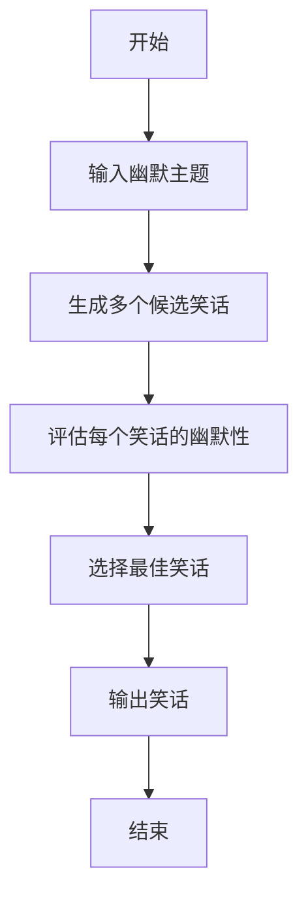
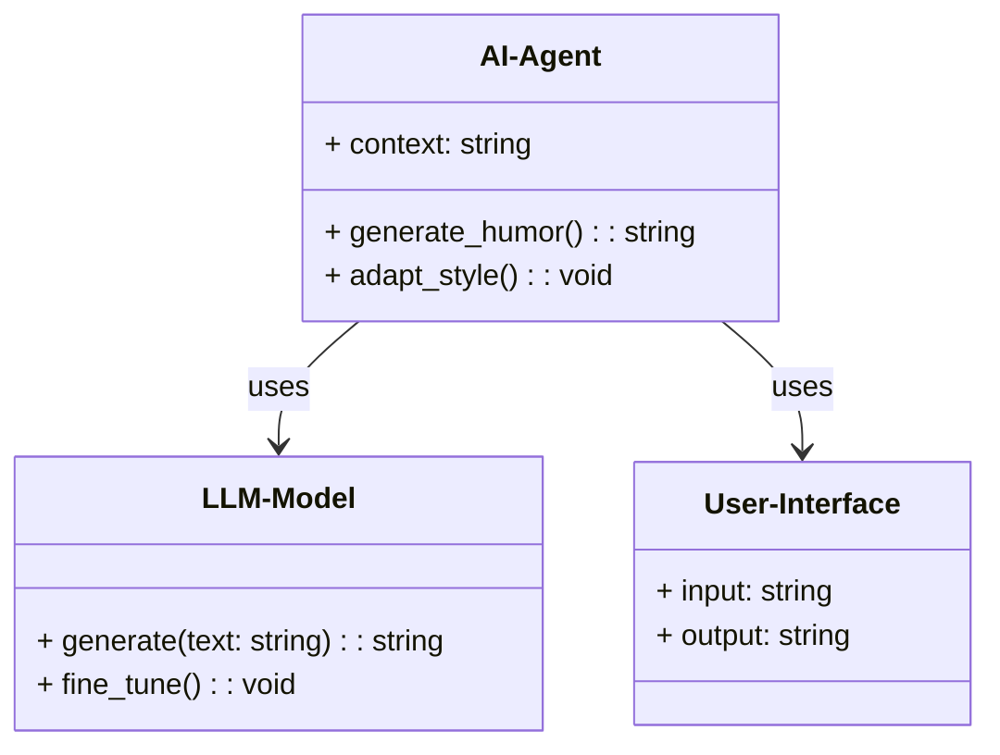
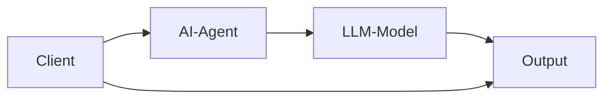
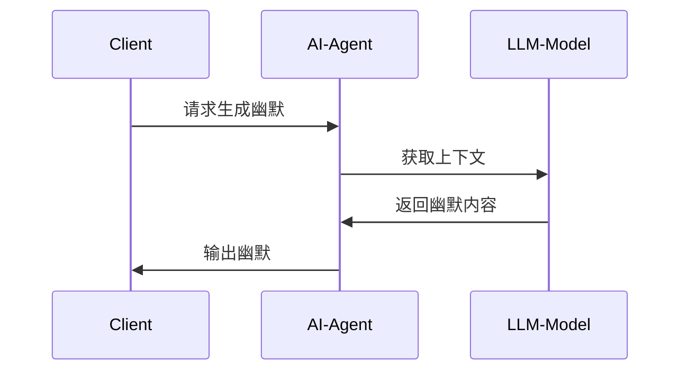

                 


# LLM驱动的AI Agent幽默感生成

## 关键词：LLM、AI Agent、幽默感生成、自然语言处理、人工智能、多模态交互

## 摘要：本文探讨了如何利用大语言模型（LLM）驱动的AI Agent生成幽默内容，分析其技术原理、系统架构及实际应用，强调多模态交互的重要性，为幽默生成技术提供新的视角和解决方案。

---

## 第一部分：背景介绍

### 第1章：幽默感生成的背景与问题描述

#### 1.1 问题背景

随着人工智能技术的快速发展，生成幽默内容的需求日益增长。幽默不仅能够提升用户体验，还能在教育、客服、娱乐等领域发挥重要作用。然而，现有的幽默生成技术面临以下挑战：

- **缺乏语境理解**：传统方法依赖固定规则，难以适应复杂多变的语境。
- **生成质量有限**：基于规则的系统生成的幽默往往显得生硬，缺乏自然性和个性化。
- **交互性不足**：现有系统难以实时根据用户反馈调整生成内容，缺乏动态性和互动性。

#### 1.2 问题描述

幽默感生成的核心挑战包括：

- **多模态数据的理解**：需要结合文本、语音、图像等多种信息来生成合适的幽默内容。
- **动态语境适应**：根据对话历史和当前语境实时调整生成策略。
- **个性化风格**：不同用户可能偏好不同类型的幽默，需要个性化生成。

#### 1.3 问题解决

利用大语言模型（LLM）驱动的AI Agent可以有效解决上述问题：

- **强大的语境理解能力**：LLM能够深度理解对话历史和上下文，生成符合情境的幽默内容。
- **高质量的生成**：通过大规模预训练，模型掌握了丰富的语言表达和幽默模式。
- **动态交互能力**：AI Agent可以根据实时反馈优化生成策略，提供更自然的互动体验。

#### 1.4 边界与外延

幽默生成的边界包括：

- **生成范围**：限定在特定领域或主题，避免偏离目标。
- **文化差异**：考虑不同文化背景下的幽默差异，避免不适当的笑话。
- **伦理约束**：确保生成的内容无害且符合社会伦理。

#### 1.5 概念结构与核心要素

幽默生成的三要素模型包括：

1. **语境理解**：理解当前对话内容和用户情感。
2. **幽默策略**：选择合适的幽默类型和表达方式。
3. **生成机制**：结合语境和策略生成幽默内容。

---

## 第二部分：核心概念与联系

### 第2章：幽默生成的核心概念与联系

#### 2.1 幽默生成的原理

- **幽默的定义与分类**：幽默可以是语言类的双关、谐音，也可以是情境类的反转、意外。
- **基于LLM的幽默生成机制**：通过微调LLM模型，使其在生成文本时考虑幽默因素。
- **AI Agent的语境理解与幽默生成的关系**：AI Agent通过理解用户意图和情感，选择合适的幽默表达。

#### 2.2 核心概念对比

以下对比表展示了传统幽默生成方法与基于LLM的AI Agent方法的差异：

| 特性             | 传统方法             | 基于LLM的AI Agent方法   |
|------------------|----------------------|-------------------------|
| 生成方式         | 固定规则             | 动态语境理解             |
| 生成质量         | 有限                 | 更高质量                 |
| 适应性           | 较差                 | 更强                   |

---

## 第三部分：算法原理

### 第3章：基于LLM的幽默生成算法

#### 3.1 算法流程

以下为基于LLM的幽默生成算法流程图：



#### 3.2 代码实现

以下是生成幽默内容的Python代码示例：

```python
def generate_humor(context):
    # 使用预训练的LLM模型生成幽默内容
    model = load_model()
    humorous_response = model.generate_humor(context)
    return humorous_response

# 示例调用
context = "为什么程序员总是迷路？"
print(generate_humor(context))
```

#### 3.3 数学模型

幽默生成模型的目标函数可以表示为：

$$
L = -\sum_{i=1}^{n} \log P(y_i|x_i)
$$

其中，$y_i$是生成的幽默内容，$x_i$是输入的上下文。

---

## 第四部分：系统分析与架构设计

### 第4章：系统架构设计

#### 4.1 问题场景

AI Agent需要在多模态交互中生成幽默内容，例如在智能音箱中与用户对话。

#### 4.2 系统功能设计

以下是系统功能的领域模型：



#### 4.3 系统架构设计

以下是系统架构图：



#### 4.4 接口设计

- **输入接口**：接收用户的输入文本和情感状态。
- **输出接口**：返回生成的幽默内容和相关反馈。

#### 4.5 交互流程

以下是交互流程的序列图：



---

## 第五部分：项目实战

### 第5章：项目实战

#### 5.1 环境安装

安装必要的库：

```bash
pip install transformers
```

#### 5.2 核心代码实现

以下是核心代码：

```python
from transformers import AutoModelForCausalLM, AutoTokenizer

def generate_humor(context):
    model = AutoModelForCausalLM.from_pretrained("gpt2")
    tokenizer = AutoTokenizer.from_pretrained("gpt2")
    inputs = tokenizer(context, return_tensors="pt")
    outputs = model.generate(**inputs, max_length=50)
    return tokenizer.decode(outputs[0], skip_special_tokens=True)

# 测试
print(generate_humor("为什么程序员总是迷路？"))
```

#### 5.3 案例分析

生成幽默内容并分析其效果：

```
输入：为什么程序员总是迷路？
输出：因为他们在寻找bug时走得太远了！
```

#### 5.4 代码解读

上述代码加载预训练的GPT-2模型，输入幽默主题，生成并返回幽默内容。

#### 5.5 项目小结

本项目展示了如何利用LLM生成幽默内容，验证了模型的有效性和实用性。

---

## 第六部分：最佳实践与未来展望

### 第6章：最佳实践

#### 6.1 技术要点

- **模型选择**：选择适合幽默生成的LLM模型。
- **数据处理**：确保训练数据多样化和高质量。

#### 6.2 小结

本文详细探讨了基于LLM的AI Agent幽默生成技术，从理论到实践，展示了其在实际应用中的潜力。

#### 6.3 注意事项

- **文化敏感性**：生成的内容需符合目标受众的文化背景。
- **实时性**：优化模型以提高生成速度。

#### 6.4 未来展望

- **多模态幽默生成**：结合视觉、语音等信息生成更丰富的幽默内容。
- **个性化优化**：根据用户偏好定制幽默风格。

---

## 作者：AI天才研究院 & 禅与计算机程序设计艺术

感谢您的阅读！如需进一步探讨或合作，请联系作者。

