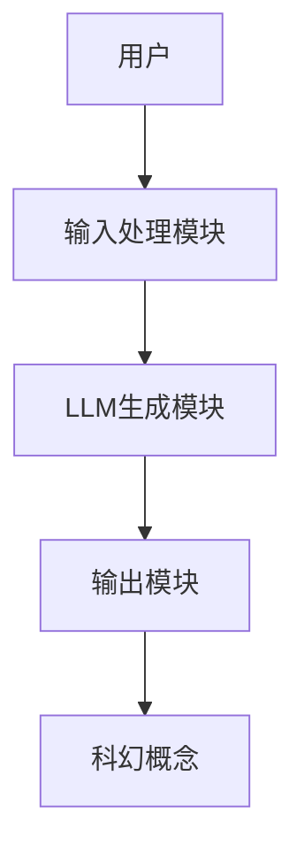
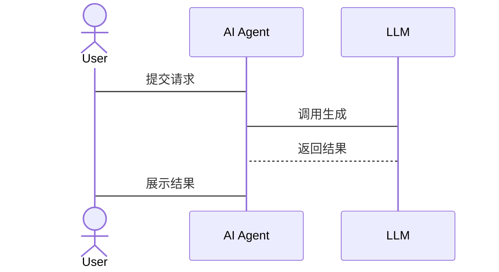

                 


```markdown
# LLM驱动的AI Agent科幻概念生成器

## 关键词：LLM、AI Agent、科幻概念生成器、大语言模型、人工智能代理、创造性思维

## 摘要：
本文探讨了如何利用大语言模型（LLM）驱动人工智能代理（AI Agent）来生成科幻概念。通过分析其技术原理、实现过程和应用场景，文章详细阐述了LLM与AI Agent的结合方式，以及如何通过系统架构设计和项目实战来构建一个高效的科幻概念生成器。

---

# 第一部分: LLM驱动的AI Agent科幻概念生成器背景介绍

# 第1章: LLM与AI Agent概述

## 1.1 LLM的基本概念
### 1.1.1 大语言模型的定义
大语言模型（LLM）是一种基于深度学习的自然语言处理模型，通过大量数据训练，能够理解和生成人类语言。其核心在于通过概率生成机制，模仿人类的思维方式。

### 1.1.2 LLM的核心特点
- **大规模训练数据**：LLM通常基于 billions of parameters 的数据集进行训练，如GPT系列模型。
- **上下文理解**：通过注意力机制，模型能够理解上下文关系，生成连贯的文本。
- **生成能力**：支持多种文本生成任务，如翻译、问答、文本摘要等。

### 1.1.3 LLM与传统NLP模型的区别
传统NLP模型通常针对特定任务设计，而LLM是通用的大语言模型，能够处理多种任务。

## 1.2 AI Agent的基本概念
### 1.2.1 AI Agent的定义
AI Agent是一种智能体，能够感知环境、执行任务并做出决策。它通过与环境交互，实现预定目标。

### 1.2.2 AI Agent的核心功能
- **状态感知**：通过传感器或数据输入，感知当前环境状态。
- **目标设定**：根据感知到的状态，设定目标。
- **行动规划**：基于目标，制定行动计划。
- **执行与反馈**：执行计划并根据反馈调整策略。

### 1.2.3 AI Agent与传统软件的区别
AI Agent具备自主性、反应性、目标导向性和社会性，能够适应环境变化。

## 1.3 LLM驱动的AI Agent的背景与意义
### 1.3.1 LLM与AI Agent结合的背景
随着LLM技术的成熟，AI Agent的智能化水平显著提升，推动了其在多个领域的应用。

### 1.3.2 LLM驱动AI Agent的意义
LLM为AI Agent提供了强大的语言理解和生成能力，使其能够更好地与人类交互，并执行复杂任务。

### 1.3.3 LLM驱动AI Agent的应用场景
- **智能助手**：帮助用户完成日常任务，如信息检索、日程管理。
- **内容创作**：生成文章、故事等创造性内容。
- **问题解决**：辅助用户解决复杂问题，提供解决方案。

## 1.4 科幻概念生成器的定义与目标
### 1.4.1 科幻概念生成器的定义
科幻概念生成器是一种AI工具，通过LLM驱动的AI Agent，生成科幻故事、设定、情节等。

### 1.4.2 科幻概念生成器的核心目标
- **创意激发**：帮助用户快速生成创意。
- **内容生成**：自动生成科幻故事、设定等。
- **多样化输出**：支持多种风格和主题的科幻创作。

### 1.4.3 科幻概念生成器的实现路径
- **模型训练**：使用科幻小说数据训练LLM。
- **功能设计**：设计AI Agent的功能模块。
- **系统集成**：将LLM与AI Agent集成，实现科幻概念生成。

## 1.5 本章小结
本章介绍了LLM和AI Agent的基本概念，探讨了它们的结合方式及其在科幻概念生成中的应用。

---

# 第二部分: LLM驱动的AI Agent核心概念与联系

# 第2章: LLM与AI Agent的核心原理

## 2.1 LLM的核心原理
### 2.1.1 大语言模型的训练过程
- **数据准备**：收集并预处理大规模文本数据。
- **模型训练**：使用深度学习框架，如TensorFlow或PyTorch，训练模型。
- **优化调整**：通过调整超参数，优化模型性能。

### 2.1.2 概率生成机制
- **生成策略**：模型根据上下文，预测下一个词的概率分布。
- **解码过程**：通过贪心搜索或蒙特卡洛采样生成文本。

### 2.1.3 注意力机制与解码器结构
- **注意力机制**：计算输入序列中每个词的重要性，生成位置权重。
- **解码器结构**：基于注意力机制，生成目标序列。

## 2.2 AI Agent的核心原理
### 2.2.1 状态感知与目标设定
- **状态感知**：通过传感器或数据输入，获取环境状态。
- **目标设定**：根据状态，设定目标。

### 2.2.2 行动规划与决策
- **行动规划**：基于目标，制定行动计划。
- **决策机制**：通过概率模型或规则集，选择最优动作。

### 2.2.3 人机交互与反馈
- **交互界面**：提供用户与AI Agent交互的界面。
- **反馈机制**：根据用户反馈，调整AI Agent的行为。

## 2.3 LLM与AI Agent的结合原理
### 2.3.1 信息传递
- **输入输出**：AI Agent将任务需求输入LLM，LLM生成文本输出。
- **反馈循环**：AI Agent根据LLM的输出，调整自身行为。

### 2.3.2 功能协同
- **语言生成**：LLM负责生成自然语言文本。
- **任务执行**：AI Agent负责任务规划与执行。

## 2.4 核心概念的属性特征对比
| 概念 | 属性 | 特征 |
|------|------|------|
| LLM  | 数据驱动 | 需要大量数据训练 |
| AI Agent | 目标导向 | 具备明确的目标 |
| 科幻概念生成器 | 创造性 | 能生成多样化的故事 |

## 2.5 ER实体关系图
```mermaid
er
actor: User
agent: AI Agent
model: LLM
(Actor) -[请求]-> (Agent)
(Agent) -[调用]-> (Model)
(Model) -[返回]-> (Agent)
(Agent) -[反馈]-> (Actor)
```

## 2.6 本章小结
本章详细讲解了LLM与AI Agent的核心原理，分析了它们的属性特征，并通过ER图展示了它们之间的关系。

---

# 第三部分: LLM驱动的AI Agent算法原理讲解

# 第3章: LLM算法原理

## 3.1 LLM的训练过程
### 3.1.1 模型结构
- **编码器**：将输入序列转换为向量表示。
- **解码器**：根据编码器输出，生成目标序列。

### 3.1.2 损失函数
- **交叉熵损失**：衡量模型预测与真实标签的差异。

### 3.1.3 优化算法
- **Adam优化器**：常用优化算法，结合动量和学习率衰减。

## 3.2 LLM的生成过程
### 3.2.1 解码器结构
- **自注意力机制**：计算序列中每个词的重要性。
- **位置编码**：为每个词添加位置信息。

### 3.2.2 生成策略
- **贪心搜索**：逐词生成，选择概率最高的词。
- **蒙特卡洛采样**：随机采样生成多个候选，选择最优解。

## 3.3 LLM的数学模型
### 3.3.1 注意力机制
$$
\text{Attention}(Q, K, V) = \text{softmax}\left(\frac{QK^T}{\sqrt{d_k}}\right)V
$$

### 3.3.2 解码器结构
$$
\text{Decoder}(x) = \text{Self-attention}(x) + \text{FFN}(x)
$$

## 3.4 本章小结
本章详细讲解了LLM的训练和生成过程，分析了其数学模型。

---

# 第四部分: LLM驱动的AI Agent系统分析与架构设计方案

# 第4章: 系统分析与架构设计

## 4.1 问题场景介绍
科幻概念生成器需要生成多样化的科幻故事，满足用户的创作需求。

## 4.2 项目介绍
### 4.2.1 项目目标
- 自动生成科幻故事。
- 提供多种风格和主题的选择。

## 4.3 系统功能设计
### 4.3.1 领域模型
- **用户输入**：用户输入任务需求。
- **模型调用**：调用LLM生成文本。
- **结果输出**：输出生成的科幻概念。

### 4.3.2 功能模块
- **输入处理模块**：处理用户输入。
- **生成模块**：调用LLM生成文本。
- **输出模块**：展示生成结果。

## 4.4 系统架构设计


## 4.5 系统接口设计
### 4.5.1 输入接口
- **API接口**：提供HTTP接口，接收用户请求。
- **命令行接口**：支持命令行输入。

### 4.5.2 输出接口
- **文本输出**：生成的科幻概念以文本形式输出。
- **可视化界面**：通过图形界面展示生成结果。

## 4.6 系统交互流程


## 4.7 本章小结
本章分析了系统的功能模块和架构设计，展示了系统的交互流程。

---

# 第五部分: LLM驱动的AI Agent项目实战

# 第5章: 项目实战

## 5.1 环境安装
- **安装Python**：确保Python 3.8及以上版本。
- **安装依赖库**：使用pip安装必要的库，如transformers、torch。

## 5.2 系统核心实现

### 5.2.1 LLM集成
```python
from transformers import GPT2LMHeadModel, GPT2Tokenizer

tokenizer = GPT2Tokenizer.from_pretrained('gpt2')
model = GPT2LMHeadModel.from_pretrained('gpt2')
```

### 5.2.2 AI Agent实现
```python
class AI_Agent:
    def __init__(self):
        self.model = model
        self.tokenizer = tokenizer

    def generate_concept(self, prompt):
        inputs = self.tokenizer(prompt, return_tensors='np')
        outputs = self.model.generate(inputs.input_ids, max_length=500)
        return self.tokenizer.decode(outputs[0], skip_special_tokens=True)
```

## 5.3 代码应用解读与分析
- **模型加载**：加载预训练的GPT-2模型。
- **生成函数**：根据输入提示，生成科幻概念。

## 5.4 实际案例分析
### 5.4.1 案例背景
用户输入提示：“在一个平行宇宙中，人类发现了时间裂缝。”

### 5.4.2 系统生成
系统调用LLM生成科幻故事，输出结果。

## 5.5 项目小结
本章通过实际案例展示了系统的实现过程和应用效果。

---

# 第六部分: LLM驱动的AI Agent最佳实践

# 第6章: 最佳实践

## 6.1 性能优化
- **模型压缩**：使用较小的模型或进行模型蒸馏。
- **并行计算**：利用多线程或分布式计算提升性能。

## 6.2 可扩展性
- **模块化设计**：将系统设计为模块化结构，便于扩展。
- **接口标准化**：提供统一的接口，方便与其他系统集成。

## 6.3 可维护性
- **代码规范**：遵循代码规范，提高代码可读性。
- **文档完善**：提供详细的文档，便于维护和升级。

## 6.4 拓展阅读
推荐阅读相关领域的最新论文和技术博客，了解前沿技术。

## 6.5 本章小结
本章总结了系统设计和实现中的最佳实践，为读者提供了宝贵的参考。

---

# 第七部分: 总结与展望

# 第7章: 总结与展望

## 7.1 本项目总结
本项目通过LLM驱动AI Agent，成功实现了科幻概念生成器，展示了LLM与AI Agent结合的巨大潜力。

## 7.2 未来展望
未来，随着技术的发展，科幻概念生成器将更加智能化和多样化，为创作提供更多可能性。

---

# 作者

作者：AI天才研究院（AI Genius Institute） & 禅与计算机程序设计艺术（Zen And The Art of Computer Programming）

联系方式：[联系邮箱](mailto:contact@example.com)

---

感谢您的阅读！如需进一步探讨或合作，请随时联系！
```

