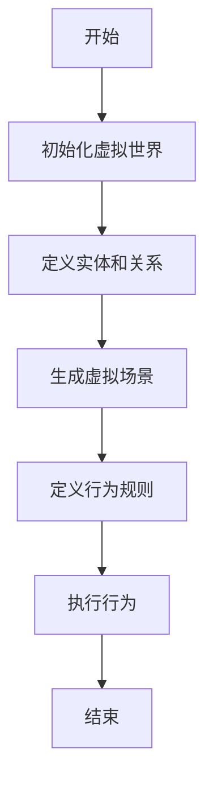
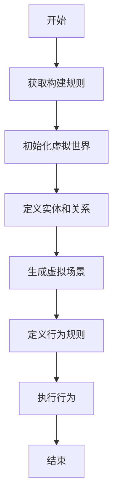
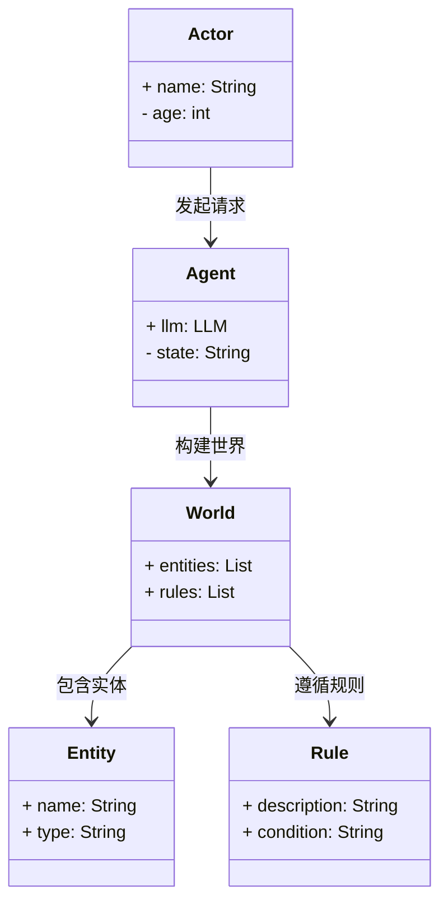

                 


# LLM驱动的AI Agent虚构世界构建器

---

> **关键词**：LLM、AI Agent、虚构世界构建、大语言模型、AI智能体、虚拟世界构建器  
> **摘要**：本文详细探讨了如何利用大语言模型（LLM）驱动AI Agent构建虚构世界的核心原理、系统架构、算法实现及实际应用场景。文章从背景介绍、核心概念、算法原理、系统架构设计、项目实战到最佳实践，全面分析了LLM驱动AI Agent虚构世界构建器的实现细节和实际应用。

---

# 第一部分: 背景介绍

## 第1章: LLM驱动的AI Agent虚构世界构建器概述

### 1.1 核心概念：LLM驱动的AI Agent虚构世界构建器
#### 1.1.1 问题背景与目标
随着AI技术的快速发展，特别是大语言模型（LLM）的崛起，构建一个由AI Agent驱动的虚构世界变得越来越重要。这种构建器能够利用LLM的强大能力，生成和管理复杂虚拟环境中的实体、关系和行为。本文将探讨如何利用LLM驱动AI Agent构建一个动态、智能的虚构世界。

#### 1.1.2 构建虚构世界的核心目标
- 提供一个高度智能化的虚拟环境。
- 实现AI Agent与虚拟世界的无缝交互。
- 支持复杂的任务执行和场景模拟。

#### 1.1.3 技术优势与应用场景
- **技术优势**：
  - 利用LLM的强大生成能力，实现复杂场景的自动化构建。
  - AI Agent能够实时响应和调整虚拟世界的动态变化。
- **应用场景**：
  - 游戏开发：生成动态游戏场景和AI角色。
  - 智能助手：构建虚拟助手的工作环境。
  - 教育：创建虚拟教室和学习场景。

---

## 第2章: 虚构世界构建的基本原理

### 2.1 虚构世界的构建目标与边界
- **构建目标**：创建一个高度结构化的虚拟环境，支持AI Agent的智能交互。
- **构建边界**：明确虚拟世界的范围、实体类型和行为规则。

### 2.2 构建过程中的核心要素
- **实体**：虚拟世界中的基本单位，包括角色、物品、地点等。
- **关系**：实体之间的联系，如“角色拥有物品”、“角色位于地点”等。
- **行为**：实体在虚拟世界中的动作和事件。

### 2.3 构建器的输入输出关系
- **输入**：构建规则、实体描述、行为规范。
- **输出**：虚拟世界的数据模型、交互接口。

---

# 第二部分: 核心概念与联系

## 第3章: LLM与AI Agent的关系

### 3.1 LLM的核心原理与特点
- **LLM的核心原理**：基于深度学习的生成模型，能够理解和生成自然语言文本。
- **LLM的特点**：
  - 大规模参数：通常包含数十亿参数。
  - 自监督学习：通过大量无标签数据进行预训练。
  - 微调能力：可以通过小样本数据进行任务特定的微调。

### 3.2 AI Agent的定义与功能
- **AI Agent的定义**：一种智能体，能够在复杂环境中感知、推理和执行任务。
- **AI Agent的功能**：
  - 感知环境：通过传感器或API获取信息。
  - 推理决策：基于LLM生成策略。
  - 执行操作：通过API或用户接口执行任务。

### 3.3 LLM驱动AI Agent的机制
- **LLM作为知识库**：AI Agent利用LLM生成上下文相关的知识。
- **LLM作为决策引擎**：AI Agent通过LLM生成决策策略。
- **LLM作为生成器**：AI Agent利用LLM生成自然语言输出。

---

## 第4章: 虚构世界构建器的实体关系

### 4.1 实体关系图（ER图）
以下是虚构世界构建器的实体关系图：

```mermaid
er
    actor: 用户
    agent: AI Agent
    world: 虚拟世界
    entity: 实体
    action: 行为
    rule: 规则

    actor --> agent: 发起请求
    agent --> world: 构建世界
    world --> entity: 包含实体
    entity --> action: 实体行为
    entity --> rule: 遵循规则
```

---

# 第三部分: 算法原理讲解

## 第5章: LLM驱动的AI Agent算法原理

### 5.1 LLM的训练过程
- **预训练**：使用大规模无标签数据进行自监督学习。
- **微调**：针对特定任务进行小样本数据的微调。

### 5.2 AI Agent的决策机制
- **基于LLM的生成式推理**：AI Agent通过LLM生成可能的决策选项。
- **基于规则的约束**：结合虚拟世界的规则，选择最优决策。

### 5.3 虚构世界构建的算法流程
以下是虚构世界构建的算法流程图：



---

## 第6章: 算法实现细节

### 6.1 用 mermaid 绘制的算法流程图
以下是具体的算法流程图：



### 6.2 代码实现示例
以下是一个简单的LLM驱动的AI Agent虚构世界构建器的代码示例：

```python
class LLM:
    def generate(self, prompt):
        pass

class Agent:
    def __init__(self, llm):
        self.llm = llm

    def act(self, world):
        # 通过LLM生成决策
        prompt = f"当前世界状态：{world}; 请生成一个动作。"
        action = self.llm.generate(prompt)
        return action

class World:
    def __init__(self, entities, rules):
        self.entities = entities
        self.rules = rules

    def execute_action(self, action):
        # 执行动作并更新世界状态
        pass

# 使用示例
llm = LLM()
agent = Agent(llm)
world = World(entities, rules)
action = agent.act(world)
world.execute_action(action)
```

### 6.3 数学模型与公式
LLM的训练过程通常涉及以下数学公式：

$$ \text{损失函数} = \text{交叉熵损失}(\hat{y}, y) $$

其中，$\hat{y}$ 是模型的预测概率分布，$y$ 是真实标签。

---

# 第四部分: 系统分析与架构设计

## 第7章: 虚构世界构建器的系统架构

### 7.1 系统功能设计
- **输入模块**：接收构建规则和初始条件。
- **构建模块**：生成虚拟世界的数据模型。
- **执行模块**：执行AI Agent的行为并更新虚拟世界。

### 7.2 用 mermaid 绘制的系统架构图
以下是系统架构图：



### 7.3 接口设计与交互流程
- **接口设计**：
  - `init_world(entities, rules)`：初始化虚拟世界。
  - `execute_action(action)`：执行行为并更新世界状态。

- **交互流程**：
  1. 用户通过接口发起构建请求。
  2. AI Agent利用LLM生成决策。
  3. 虚拟世界执行行为并返回结果。

---

# 第五部分: 项目实战

## 第8章: 虚构世界构建器的实现

### 8.1 环境安装与配置
- **依赖项**：安装Python、LLM框架（如GPT-3.5-turbo）。
- **配置文件**：设置API密钥和构建规则。

### 8.2 核心代码实现
以下是一个完整的虚构世界构建器的代码实现：

```python
class LLM:
    def __init__(self, api_key):
        self.api_key = api_key

    def generate(self, prompt):
        # 模拟LLM的生成过程
        return "生成的输出"

class Agent:
    def __init__(self, llm):
        self.llm = llm

    def act(self, world):
        prompt = f"当前世界状态：{world}; 请生成一个动作。"
        return self.llm.generate(prompt)

class World:
    def __init__(self, entities, rules):
        self.entities = entities
        self.rules = rules

    def execute_action(self, action):
        # 模拟执行动作
        pass

# 使用示例
llm = LLM("your_api_key")
agent = Agent(llm)
world = World(entities, rules)
action = agent.act(world)
world.execute_action(action)
```

### 8.3 代码解读与分析
- **LLM类**：负责生成文本输出。
- **Agent类**：利用LLM生成决策。
- **World类**：管理虚拟世界的状态和行为。

### 8.4 实际案例分析
- **案例背景**：构建一个虚拟游戏世界。
- **实现步骤**：
  1. 初始化虚拟世界。
  2. 定义实体和规则。
  3. AI Agent生成决策并执行行为。

---

# 第六部分: 最佳实践与总结

## 第9章: 实践总结与注意事项

### 9.1 项目小结
本文详细探讨了如何利用LLM驱动AI Agent构建虚构世界的核心原理、系统架构和实际应用。通过理论分析和代码实现，展示了构建一个动态、智能的虚拟世界的方法。

### 9.2 注意事项与优化建议
- **数据质量**：确保构建规则和初始数据的准确性。
- **性能优化**：优化LLM的生成速度和虚拟世界的执行效率。
- **安全性**：确保虚拟世界的安全性和稳定性。

### 9.3 拓展阅读与深入学习方向
- **LLM优化**：研究更高效的LLM训练和生成方法。
- **AI Agent增强**：探索更复杂的AI Agent行为和决策机制。
- **虚拟世界扩展**：研究更大规模、更复杂虚拟世界的构建方法。

---

**作者：AI天才研究院/AI Genius Institute & 禅与计算机程序设计艺术 /Zen And The Art of Computer Programming**

