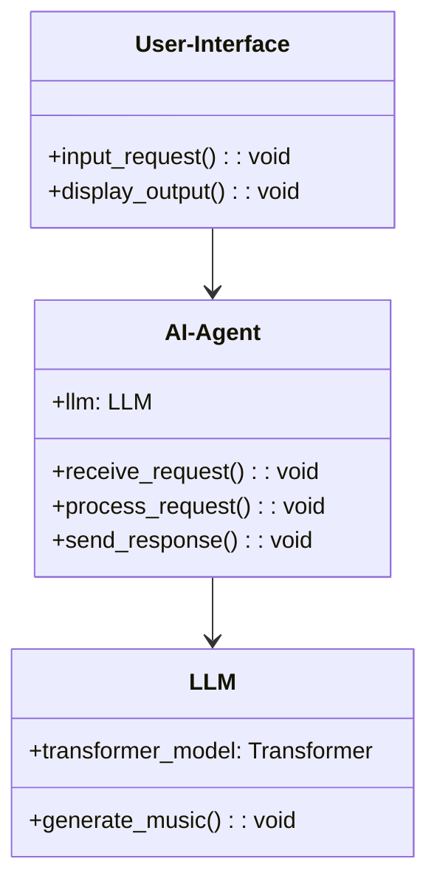
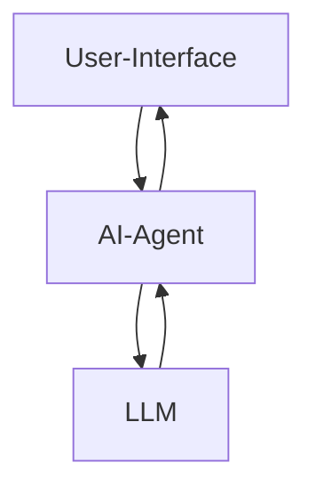
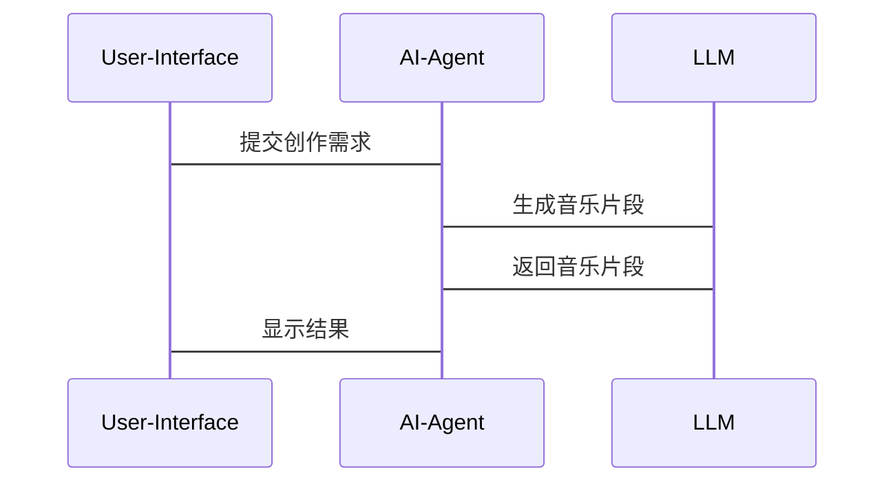

                 


# LLM驱动的AI Agent音乐创作与分析

## 关键词：
- Large Language Model (LLM)
- AI Agent
- Music Composition
- Music Analysis
- Transformer Model

## 摘要：
本文深入探讨了大语言模型（LLM）驱动的AI代理在音乐创作与分析中的应用。通过分析LLM的核心原理、音乐生成与分析的技术细节，以及实际项目中的系统设计与实现，本文展示了如何利用AI技术推动音乐创作的创新。文章内容涵盖背景介绍、算法原理、系统架构、项目实战和未来展望，为读者提供全面的技术解析。

---

# 第1章: AI Agent与LLM概述

## 1.1 AI Agent的基本概念
### 1.1.1 AI Agent的定义与分类
- **定义**: AI Agent是一种智能体，能够感知环境、自主决策并执行任务。
- **分类**: 可分为简单反射式代理、基于模型的反射式代理、目标驱动代理和效用驱动代理。

### 1.1.2 LLM在AI Agent中的作用
- LLM为AI Agent提供强大的自然语言理解和生成能力。
- LLM通过文本输入生成音乐创作灵感或分析结果。

### 1.1.3 音乐领域的AI Agent应用潜力
- 音乐创作辅助工具：生成旋律、和弦进行和歌词。
- 音乐分析工具：识别音乐风格、情感和结构。

## 1.2 LLM驱动的AI Agent核心原理
### 1.2.1 大语言模型的工作原理
- **Transformer模型**: 通过自注意力机制捕捉文本中的长距离依赖关系。
- **序列建模**: LLM通过生成序列来模拟音乐创作的过程。

### 1.2.2 AI Agent的决策机制
- **基于LLM的决策**: AI Agent通过LLM生成多个候选方案，再通过优化目标选择最优解。

### 1.2.3 LLM与音乐创作的结合方式
- **文本到音乐**: LLM生成音乐创作的文本描述，如歌词或创作灵感。
- **音乐生成**: LLM直接生成音乐序列。

## 1.3 音乐创作与分析的背景与挑战
### 1.3.1 音乐创作的传统方法与局限性
- 传统音乐创作依赖人类音乐家的经验，效率较低。
- 音乐创作工具的功能有限，难以提供创意建议。

### 1.3.2 AI在音乐创作中的优势
- 提供无限的创意可能性。
- 快速生成音乐片段供人类音乐家参考。

### 1.3.3 当前音乐分析的技术瓶颈
- 音乐分析需要结合声学特征和语义理解，技术复杂度高。
- 不同音乐风格的差异性导致分析模型的泛化能力不足。

---

# 第2章: LLM驱动的音乐生成原理

## 2.1 大语言模型的音乐生成能力
### 2.1.1 LLM生成音乐文本的机制
- LLM通过自注意力机制理解输入文本，生成与音乐相关的描述文本。

### 2.1.2 音乐生成的序列建模方法
- **序列到序列模型**: 将音乐生成任务建模为序列到序列的问题。
- **生成策略**: 采样生成策略，如贪心采样和随机采样。

### 2.1.3 基于LLM的音乐生成模型结构
- **输入层**: 接收音乐创作需求的文本描述。
- **编码器层**: 对输入文本进行编码，提取特征表示。
- **解码器层**: 生成音乐序列。

## 2.2 基于LLM的音乐生成算法
### 2.2.1 Transformer模型在音乐生成中的应用
- **自注意力机制**: 捕捉音乐创作需求中的关键信息。
- **位置编码**: 为音乐生成序列中的位置信息。

### 2.2.2 音乐生成的注意力机制
- **全局注意力**: 关注整个输入序列的信息。
- **局部注意力**: 突出与当前生成位置相关的部分。

### 2.2.3 音乐生成的损失函数与训练策略
- **损失函数**: 使用交叉熵损失函数。
- **训练策略**: 采用渐进式训练，逐步增加音乐生成的复杂度。

## 2.3 音乐生成的数学模型
### 2.3.1 Transformer模型的数学公式
$$\text{Decoder层结构：}(x, y) \rightarrow \text{Attention}(x, y) \rightarrow \text{FFN}(y)$$

### 2.3.2 音乐生成的损失函数
$$\mathcal{L} = -\sum_{t=1}^{T} \log p(y_t|x_{<t})$$

---

# 第3章: 音乐分析与LLM的关系

## 3.1 音乐分析的核心任务
### 3.1.1 音乐风格识别
- **任务目标**: 区分不同音乐风格，如古典、摇滚、爵士等。

### 3.1.2 音乐情感分析
- **情感分类**: 根据音乐特征预测情感类别。

### 3.1.3 音乐结构分析
- **结构识别**: 分析音乐的段落划分，如前奏、主歌、副歌等。

## 3.2 LLM在音乐分析中的应用
### 3.2.1 基于LLM的音乐文本分析
- **文本摘要**: 提炼音乐作品的核心内容。
- **文本分类**: 对音乐评论进行情感分类。

### 3.2.2 基于LLM的音乐情感推理
- **情感推理**: 利用LLM预测音乐的情感倾向。

### 3.2.3 LLM在音乐推荐系统中的应用
- **用户偏好分析**: 基于LLM理解用户的音乐偏好。
- **音乐推荐**: 生成符合用户喜好的音乐推荐列表。

---

# 第4章: LLM驱动的AI Agent音乐创作系统架构

## 4.1 系统功能需求分析
### 4.1.1 音乐创作模块
- **创作需求输入**: 用户输入创作需求，如音乐风格、情感等。
- **生成音乐片段**: 基于LLM生成音乐片段供用户参考。

### 4.1.2 音乐分析模块
- **音乐风格识别**: 识别音乐片段的风格。
- **音乐情感分析**: 分析音乐片段的情感倾向。

## 4.2 系统架构设计
### 4.2.1 领域模型设计


### 4.2.2 系统架构图


### 4.2.3 接口设计
- **输入接口**: 用户输入音乐创作需求。
- **输出接口**: 生成音乐片段或分析结果。

### 4.2.4 交互流程


---

# 第5章: 项目实战

## 5.1 环境安装
### 5.1.1 安装Python
- 安装Python 3.8及以上版本。

### 5.1.2 安装依赖库
- 安装必要的库：`transformers`, `numpy`, `matplotlib`.

## 5.2 系统核心实现
### 5.2.1 音乐生成代码
```python
from transformers import AutoTokenizer, AutoModelForCausalLM

tokenizer = AutoTokenizer.from_pretrained("gpt2")
model = AutoModelForCausalLM.from_pretrained("gpt2")

def generate_music(n_tokens=100):
    inputs = tokenizer("Generate a melody...", return_tensors="pt")
    outputs = model.generate(**inputs, max_length=n_tokens, do_sample=True)
    return tokenizer.decode(outputs[0], skip_special_tokens=True)
```

### 5.2.2 音乐分析代码
```python
import numpy as np
import librosa

def analyze_music(audio_path):
    y, sr = librosa.load(audio_path, sr=44100)
    features = librosa.feature.mfcc(y, sr=sr)
    return features
```

## 5.3 案例分析
### 5.3.1 音乐生成案例
- 输入: "生成一首古典风格的钢琴曲。"
- 输出: 自动生成一段钢琴旋律。

### 5.3.2 音乐分析案例
- 输入: 带有情感标记的音乐片段。
- 输出: 分析结果为“情感：悲伤，风格：流行”。

---

# 第6章: 总结与展望

## 6.1 本章小结
- 总结了LLM驱动的AI Agent在音乐创作与分析中的应用。
- 介绍了系统的实现细节和实际案例。

## 6.2 未来展望
- 提高音乐生成的多样性与质量。
- 拓展音乐分析的深度与广度。
- 结合视觉和情感分析，提升音乐创作体验。

---

# 参考文献
[此处列出参考文献]

---

# 附录
## 附录A: 项目代码
```python
# 附录内容
```

## 附录B: 其他资源
- 推荐阅读的书籍和论文。

---

作者：AI天才研究院/AI Genius Institute & 禅与计算机程序设计艺术 /Zen And The Art of Computer Programming

