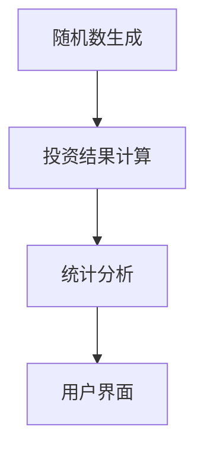
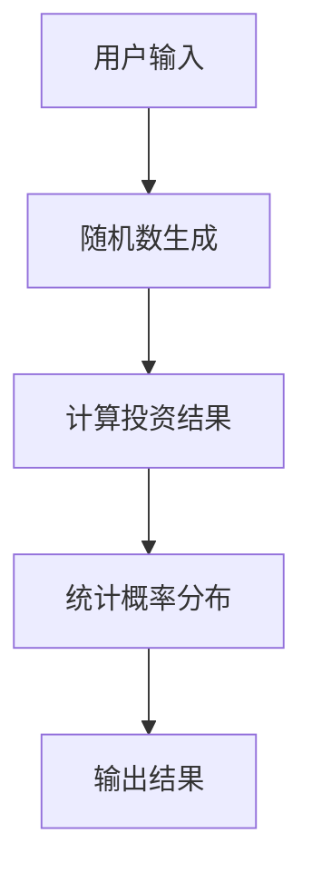

                 


# Monte Carlo模拟：投资结果的概率分布分析

## 关键词：
- Monte Carlo模拟、概率分布、投资分析、金融建模、随机数生成

## 摘要：
Monte Carlo模拟是一种强大的工具，用于分析投资结果的概率分布。通过生成大量随机数并模拟投资结果，投资者可以更好地理解潜在的风险和回报分布。本文将逐步介绍Monte Carlo模拟的核心原理、数学模型、金融投资中的应用以及系统架构设计，帮助读者掌握这一技术的关键细节。

---

# 第一部分: Monte Carlo模拟基础

## 第1章: Monte Carlo模拟概述

### 1.1 Monte Carlo模拟的基本概念

#### 1.1.1 概率分布的基本概念
概率分布是描述随机变量可能取值及其对应概率的数学工具。在投资分析中，我们通常关注资产回报、市场波动等随机变量的概率分布。常见的概率分布包括：
- **正态分布**：资产回报的典型模型。
- **对数正态分布**：适用于资产价格的对数变换。
- **t分布**：用于假设检验，尤其适用于小样本数据。
- **均匀分布**：适用于无偏随机数生成。

#### 1.1.2 Monte Carlo模拟的定义与特点
Monte Carlo模拟是一种通过随机采样方法模拟复杂系统行为的技术。其特点包括：
- **随机性**：基于随机数生成。
- **多次模拟**：通过大量模拟运行得到概率分布。
- **适用性广**：适用于复杂、非线性系统。

#### 1.1.3 Monte Carlo模拟在投资分析中的应用
- **资产定价**：模拟不同市场条件下资产的预期回报。
- **风险评估**：分析投资组合在不同波动情况下的表现。
- **投资组合优化**：通过模拟优化资产配置。

### 1.2 Monte Carlo模拟的核心原理

#### 1.2.1 随机数生成的原理
随机数生成是Monte Carlo模拟的基础。常用的随机数生成方法包括：
- **均匀分布随机数生成**：通过计算机生成均匀分布的随机数。
- **非均匀分布随机数生成**：通过变换方法生成特定分布的随机数。

#### 1.2.2 概率分布模型的构建
概率分布模型的选择取决于具体的投资问题。例如，资产回报通常假设为正态分布，而极端风险事件可能需要使用更复杂的分布模型。

#### 1.2.3 Monte Carlo模拟的基本步骤
1. 确定模拟的随机变量及其分布。
2. 生成大量随机数。
3. 计算投资结果。
4. 统计结果并分析概率分布。

---

# 第二部分: Monte Carlo模拟的数学基础

## 第2章: 概率分布与随机变量

### 2.1 常见概率分布模型

#### 2.1.1 正态分布
正态分布在投资分析中广泛应用于资产回报的建模。其概率密度函数为：
$$
f(x) = \frac{1}{\sqrt{2\pi\sigma^2}} e^{-\frac{(x-\mu)^2}{2\sigma^2}}
$$
其中，$\mu$ 是均值，$\sigma$ 是标准差。

#### 2.1.2 对数正态分布
适用于资产价格的对数变换。其概率密度函数为：
$$
f(x) = \frac{1}{x\sqrt{2\pi\sigma^2}} e^{-\frac{(\ln x - \mu)^2}{2\sigma^2}}
$$

#### 2.1.3 t分布
用于假设检验，其概率密度函数为：
$$
f(x) = \frac{\Gamma\left(\frac{\nu+1}{2}\right)}{\sqrt{\nu\pi} \Gamma\left(\frac{\nu}{2}\right) \left(1+\frac{x^2}{\nu}\right)^{\frac{\nu+1}{2}}}
$$
其中，$\nu$ 是自由度。

#### 2.1.4 均匀分布
均匀分布常用于随机数生成的基准分布。其概率密度函数为：
$$
f(x) = \begin{cases}
\frac{1}{b-a}, & a \leq x \leq b \\
0, & \text{其他情况}
\end{cases}
$$

### 2.2 随机数生成算法

#### 2.2.1 均匀分布随机数生成
使用线性同余生成器生成均匀分布随机数：
$$
X_{n+1} = (aX_n + c) \mod m
$$
其中，$a$ 是乘数，$c$ 是增量，$m$ 是模数。

#### 2.2.2 非均匀分布随机数生成
通过变换方法生成非均匀分布随机数。例如，使用逆变换法生成正态分布随机数：
$$
X = \mu + \sigma \sqrt{-2\ln U}
$$
其中，$U$ 是均匀分布随机数。

### 2.3 概率密度函数与累积分布函数

#### 2.3.1 概率密度函数的定义
概率密度函数（PDF）描述了随机变量在某点的密度。

#### 2.3.2 累积分布函数的定义
累积分布函数（CDF）描述了随机变量小于等于某值的概率。

#### 2.3.3 常见分布的PDF和CDF公式
- 正态分布的CDF：
$$
F(x) = \frac{1}{2}\left(1 + \text{erf}\left(\frac{x-\mu}{\sigma\sqrt{2}}\right)\right)
$$
其中，$\text{erf}$ 是误差函数。

---

# 第三部分: Monte Carlo模拟的算法与实现

## 第3章: Monte Carlo模拟的算法原理

### 3.1 Monte Carlo模拟的基本算法

#### 3.1.1 算法步骤
1. 初始化参数：均值、标准差等。
2. 生成随机数：根据选择的概率分布生成随机数。
3. 计算结果：根据随机数计算投资结果。
4. 统计结果：统计所有模拟结果，得到概率分布。

#### 3.1.2 算法流程图


### 3.2 随机数生成的数学模型

#### 3.2.1 均匀分布随机数生成公式
$$
U = \frac{a}{N} \times \text{rand}(N)
$$

#### 3.2.2 非均匀分布随机数生成方法
$$
X = \mu + \sigma \sqrt{-2\ln U}
$$

---

## 第4章: Monte Carlo模拟在金融投资中的应用

### 4.1 资产定价

#### 4.1.1 模型选择
常用模型：
- **Black-Scholes模型**：适用于期权定价。
- **随机波动率模型**：如Heston模型。

#### 4.1.2 模拟步骤
1. 确定资产价格模型。
2. 生成随机数。
3. 计算期权价格。
4. 统计结果并分析分布。

### 4.2 风险评估

#### 4.2.1 VaR（在险值）计算
通过蒙特卡洛模拟计算投资组合的VaR值：
$$
\text{VaR} = \text{分位数}(P \text{损失分布})
$$

### 4.3 投资组合优化

#### 4.3.1 优化目标
最大化预期收益，最小化风险。

#### 4.3.2 模拟步骤
1. 确定资产回报分布。
2. 生成随机数。
3. 计算投资组合收益。
4. 优化资产配置。

---

## 第5章: 系统分析与架构设计

### 5.1 系统功能设计

#### 5.1.1 模块划分
- 随机数生成模块
- 投资结果计算模块
- 统计分析模块

#### 5.1.2 系统架构图


### 5.2 接口设计

#### 5.2.1 输入接口
- 参数输入：均值、标准差等。

#### 5.2.2 输出接口
- 概率分布结果
- 风险指标（如VaR）

### 5.3 交互流程图



---

## 第6章: 项目实战

### 6.1 环境配置

#### 6.1.1 工具选择
- Python：使用NumPy和Matplotlib库。

### 6.2 核心实现

#### 6.2.1 随机数生成代码
```python
import numpy as np
np.random.seed(42)
uniform_random = np.random.rand(1000)
```

#### 6.2.2 投资结果计算代码
```python
mu = 0.05
sigma = 0.2
returns = mu + sigma * np.random.randn(1000)
```

### 6.3 实际案例分析

#### 6.3.1 资产定价案例
- 模拟股票价格：
```python
import math
import numpy as np

mu = 0.05
sigma = 0.2
paths = 1000
steps = 252

# 生成随机数
random_numbers = np.random.randn(steps, paths)
# 计算股票价格
prices = np.zeros((steps, paths))
prices[0] = 100
for i in range(1, steps):
    prices[i] = prices[i-1] * (1 + mu + sigma * random_numbers[i-1])
```

#### 6.3.2 风险评估案例
- 计算VaR：
```python
import numpy as np
import pandas as pd

returns = np.random.normal(mu, sigma, 10000)
sorted_returns = np.sort(returns)
VaR_95 = sorted_returns[int(0.05 * len(sorted_returns))]
print(f"VaR at 95% confidence level: {VaR_95}")
```

### 6.4 项目小结

---

## 第7章: 总结与展望

### 7.1 总结
Monte Carlo模拟是一种强大的工具，能够帮助投资者分析复杂的投资问题。

### 7.2 展望
随着计算能力的提升，Monte Carlo模拟在投资分析中的应用将更加广泛。

### 7.3 最佳实践

#### 7.3.1 选择合适的工具
- 使用Python和相关库（如NumPy、Pandas）进行高效计算。

#### 7.3.2 注意计算资源
- 大规模模拟需要高性能计算资源。

#### 7.3.3 关注收敛性
- 确保模拟结果的收敛性。

---

## 作者：AI天才研究院/AI Genius Institute & 禅与计算机程序设计艺术 /Zen And The Art of Computer Programming

---

通过本文，读者可以全面了解Monte Carlo模拟在投资结果概率分布分析中的应用，掌握其实现原理和系统架构设计，为实际投资分析提供理论支持和实践指导。

