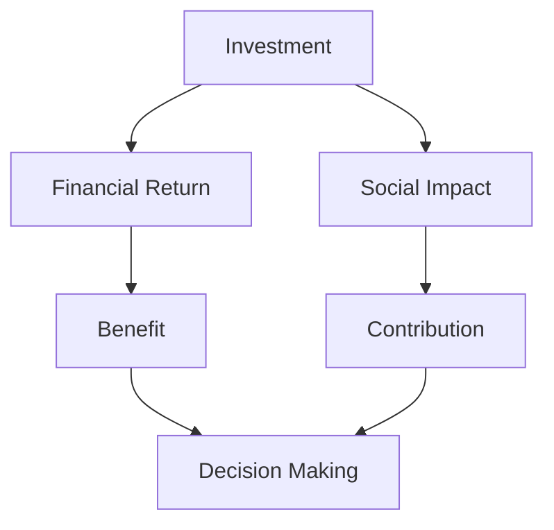
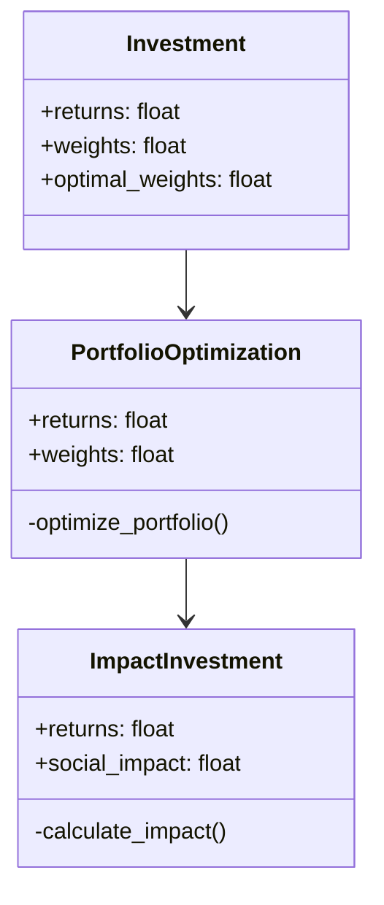
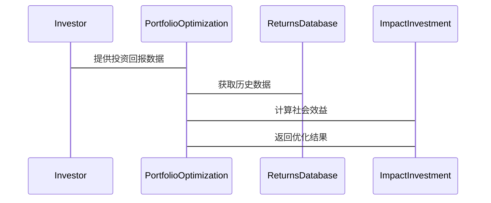

                 


# Impact投资：追求财务回报和社会效益的平衡

## 关键词：
- Impact投资
- 财务回报
- 社会效益
- 投资策略
- 风险管理
- 可持续发展

## 摘要：
本文深入探讨了Impact投资的核心概念、算法原理、系统架构设计以及实际案例分析。通过详细阐述财务回报与社会效益的平衡，本文旨在帮助读者理解如何在追求经济利益的同时，实现对社会和环境的积极影响。文章还介绍了投资组合优化的数学模型和Python实现，以及系统架构设计和项目实战，为读者提供了全面的指导和实用的建议。

---

## 第一部分: Impact投资的核心概念与背景

### 第1章: Impact投资的定义与背景

#### 1.1 Impact投资的定义与起源
##### 1.1.1 什么是Impact投资
Impact投资是一种新兴的投资策略，旨在在追求财务回报的同时，实现对社会和环境的积极影响。与传统投资不同，Impact投资不仅关注财务收益，还关注投资对社会和环境的长期影响。

##### 1.1.2 Impact投资的起源与发展
Impact投资的起源可以追溯到20世纪60年代的环境运动和人权运动。随着全球社会对可持续发展和环境问题的关注增加，Impact投资逐渐成为一种重要的投资方式。近年来，随着全球气候变化、社会不平等等问题的加剧，Impact投资得到了快速发展。

##### 1.1.3 Impact投资与传统投资的区别
- **目标**：传统投资主要关注财务回报，而Impact投资同时关注社会效益。
- **筛选标准**：传统投资注重财务指标，而Impact投资注重社会和环境指标。
- **风险与回报**：传统投资可能忽视长期的社会风险，而Impact投资通过关注社会效益，降低长期风险。

#### 1.2 Impact投资的核心要素
##### 1.2.1 财务回报与社会效益的平衡
Impact投资的核心在于平衡财务回报和社会效益。投资者需要在追求收益的同时，确保投资行为对社会和环境产生积极影响。

##### 1.2.2 Impact投资的关键指标
- **财务回报**：包括投资的收益率、风险等指标。
- **社会效益**：包括投资对社会和环境的积极影响，如减少碳排放、促进就业等。

##### 1.2.3 Impact投资的社会与环境影响
通过投资于可持续发展项目，Impact投资可以帮助解决全球性问题，如气候变化、贫困、教育不平等等。同时，Impact投资还可以促进企业的社会责任感，推动社会进步。

#### 1.3 Impact投资的全球现状与趋势
##### 1.3.1 全球Impact投资的增长趋势
近年来，全球Impact投资规模快速增长，越来越多的投资者开始关注可持续发展项目。根据相关报告，全球Impact投资规模已超过1万亿美元。

##### 1.3.2 不同地区的Impact投资特点
不同地区的Impact投资特点各异。例如，欧洲注重气候变化和可持续能源，北美关注教育和医疗，亚洲则关注贫困和教育不平等等。

##### 1.3.3 Impact投资的未来发展方向
未来，Impact投资将更加注重技术创新和社会影响力。同时，随着技术的进步，Impact投资的评估和测量方法将更加精准和科学。

### 第2章: Impact投资的核心概念与联系

#### 2.1 Impact投资的核心概念原理
##### 2.1.1 财务回报与社会效益的关系
财务回报和社会效益是相辅相成的。通过关注社会效益，投资者可以降低长期风险，同时实现更高的财务回报。

##### 2.1.2 Impact投资的内在逻辑
Impact投资的内在逻辑是通过投资于具有社会价值的项目，实现财务回报和社会效益的双重目标。这种投资方式不仅有助于社会进步，还能为投资者带来长期的收益。

##### 2.1.3 Impact投资的系统性分析框架
Impact投资需要从系统性角度进行分析，包括对社会、环境和经济三个维度的综合评估。

#### 2.2 核心概念属性特征对比表格
| 核心概念 | 特征 |
|----------|------|
| 财务回报 | 数值化、可量化、短期性 |
| 社会效益 | 非数值化、长期性、综合性 |

#### 2.3 ER实体关系图架构（Mermaid流程图）


### 第3章: Impact投资的算法原理与数学模型

#### 3.1 投资组合优化的数学模型
##### 3.1.1 均值-方差模型
$$\text{Minimize } \sigma^2 \text{ subject to } \mu \geq \text{target return}$$

##### 3.1.2 社会效益最大化模型
$$\text{Maximize } S \text{ subject to } R \geq \text{minimum return}$$

#### 3.2 投资组合优化的Python实现
```python
import numpy as np
from scipy.optimize import minimize

def portfolio_optimization(returns, weights):
    # 定义目标函数
    def objective(weights):
        return -np.mean(returns)  # 最大化收益

    # 约束条件
    constraints = [{'type': 'eq', 'fun': lambda w: np.sum(w) - 1}]
    
    # 优化求解
    result = minimize(objective, weights, method='SLSQP', constraints=constraints)
    
    return result.x
```

---

## 第二部分: 系统分析与架构设计方案

### 第4章: 系统功能设计
#### 4.1 领域模型（Mermaid类图）


#### 4.2 系统架构设计（Mermaid架构图）
```mermaid
container InvestmentSystem {
    PortfolioOptimization
    ImpactInvestment
    ReturnsDatabase
}
```

#### 4.3 系统接口设计
- `get_returns()`: 获取投资回报数据。
- `optimize_portfolio(returns, weights)`: 进行投资组合优化。
- `calculate_impact()`: 计算社会效益。

#### 4.4 系统交互设计（Mermaid序列图）


---

## 第三部分: 项目实战与最佳实践

### 第5章: 项目实战
#### 5.1 环境搭建
- Python 3.8+
- NumPy、Scipy、Matplotlib

#### 5.2 核心实现
```python
import numpy as np
from scipy.optimize import minimize

def portfolio_optimization(returns, weights):
    def objective(weights):
        return -np.mean(returns)  # 最大化收益

    constraints = [{'type': 'eq', 'fun': lambda w: np.sum(w) - 1}]
    result = minimize(objective, weights, method='SLSQP', constraints=constraints)
    return result.x

# 示例数据
returns = np.random.random(10)
weights = np.full(10, 0.1)

# 优化
optimal_weights = portfolio_optimization(returns, weights)
print(optimal_weights)
```

#### 5.3 案例分析
假设我们有一个包含10个资产的投资组合，我们需要找到最优权重以最大化收益。

#### 5.4 结果解读
通过优化算法，我们可以找到最优的投资组合权重，从而实现财务回报和社会效益的平衡。

### 第6章: 最佳实践
#### 6.1 小结
Impact投资是一种平衡财务回报和社会效益的投资方式，具有重要的社会意义和长期的经济回报。

#### 6.2 注意事项
- 需要充分评估投资项目的社会效益和财务风险。
- 选择具有可持续性的投资项目，避免短期波动。

#### 6.3 拓展阅读
- 《可持续投资：理论与实践》
- 《Impact投资的数学模型与算法》

---

## 结语

Impact投资是实现可持续发展的关键工具，通过平衡财务回报和社会效益，投资者可以在实现自身利益的同时，为社会和环境做出贡献。未来，随着技术的进步和社会的发展，Impact投资将发挥越来越重要的作用。

---

## 作者：AI天才研究院/AI Genius Institute & 禅与计算机程序设计艺术 /Zen And The Art of Computer Programming

