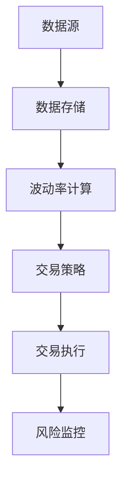
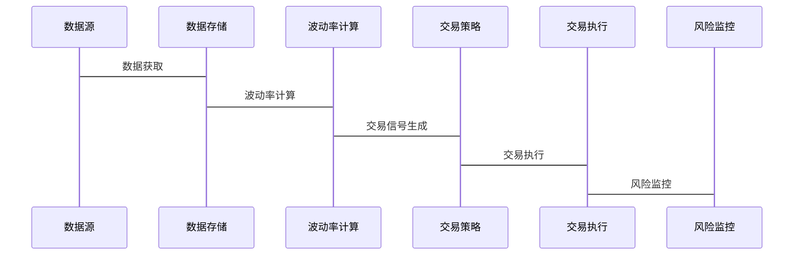

                 


# Volatility投资策略：如何从市场波动中获利

## 关键词：
- 波动性投资策略
- 市场波动
- 投资策略
- 波动率计算
- 交易信号生成

## 摘要：
波动性投资策略是一种利用市场波动性获利的投资方法。本文将详细介绍波动性投资策略的核心概念、数学模型、算法实现以及系统架构设计。通过分析波动性的定义、特征及其对投资者的影响，探讨动量策略、均值回归策略和趋势跟踪策略等具体策略。同时，结合波动率计算公式、马科维茨有效前沿模型等数学工具，讲解如何优化投资组合并控制风险。最后，通过Python代码示例展示波动性策略的实际应用，并总结波动性投资策略的优势与劣势。

---

## 第1章: 市场波动的基础知识

### 1.1 市场波动的定义与特征
波动性是指资产价格在一定时间内的波动程度，通常用标准差或波动率来衡量。波动性是市场风险的重要指标，反映了资产价格的不确定性。

#### 1.1.1 市场波动的定义
市场波动性是指资产价格在短时间内剧烈波动的现象，通常由市场参与者的买卖行为、信息冲击和市场情绪等因素引起。

#### 1.1.2 市场波动的特征
- **短期性**：波动性通常在短期内发生，可能是由于市场情绪的变化或突发事件引发。
- **不可预测性**：波动性具有随机性，难以被准确预测。
- **传染性**：市场波动性可能会在不同资产或市场之间传染。

#### 1.1.3 市场波动对投资者的影响
市场波动性对投资者的影响是双刃剑。波动性高的市场可能带来更高的收益，但也伴随着更高的风险。

---

### 1.2 波动性与投资策略的关系
波动性是投资策略的重要组成部分，不同的投资策略会根据波动性的高低调整投资组合和交易策略。

#### 1.2.1 波动性对投资决策的影响
- 波动性高的资产可能带来更高的收益，但也伴随着更高的风险。
- 投资者需要根据自身的风险承受能力选择适合的波动性策略。

#### 1.2.2 不同市场环境下的波动性策略
- **牛市**：波动性较低，适合长期投资策略。
- **熊市**：波动性较高，适合短期交易策略。

#### 1.2.3 波动性与风险的平衡
投资者需要在波动性和风险之间找到平衡点，选择适合自己的投资策略。

---

### 1.3 市场波动的测量与分析
测量和分析市场波动性是波动性投资策略的基础。

#### 1.3.1 波动率的计算方法
波动率通常用标准差来衡量，公式如下：
$$ \text{波动率} = \sqrt{\frac{1}{n}\sum_{i=1}^{n}(r_i - \bar{r})^2} $$
其中，$r_i$是第i个资产的收益率，$\bar{r}$是平均收益率。

#### 1.3.2 历史波动率与隐含波动率的区别
- **历史波动率**：基于过去实际收益率计算得出的波动率。
- **隐含波动率**：通过期权价格等衍生品计算得出的波动率，反映了市场参与者对未来的预期。

#### 1.3.3 波动率的可视化分析
使用折线图或柱状图来可视化波动率的变化趋势，帮助投资者更好地理解市场波动性。

---

## 第2章: 波动性投资策略的核心概念

### 2.1 波动性投资策略的分类
波动性投资策略可以分为动量策略、均值回归策略和趋势跟踪策略。

#### 2.1.1 动量策略
动量策略基于价格动量的原理，认为价格会延续之前的趋势。具体策略包括：
- **动量过滤器**：选择近期收益率较高的资产进行投资。
- **动量组合**：将多个资产按照收益率排序，选择收益率最高的部分进行投资。

#### 2.1.2 均值回归策略
均值回归策略基于价格会回归均值的假设，适用于波动性较高的市场环境。具体策略包括：
- **均值回归过滤器**：选择近期偏离均值较大的资产进行投资。
- **均值回归组合**：将多个资产按照偏离均值的程度排序，选择偏离均值较大的部分进行投资。

#### 2.1.3 趋势跟踪策略
趋势跟踪策略基于价格趋势的持续性，适用于长期趋势明显的市场环境。具体策略包括：
- **趋势过滤器**：选择价格趋势明显的资产进行投资。
- **趋势组合**：将多个资产按照趋势强度排序，选择趋势强度较高的部分进行投资。

---

### 2.2 波动性策略的数学模型
数学模型是波动性策略的核心，帮助投资者优化投资组合和风险控制。

#### 2.2.1 波动率的计算公式
$$ \text{波动率} = \sqrt{\frac{1}{n}\sum_{i=1}^{n}(r_i - \bar{r})^2} $$
其中，$r_i$是第i个资产的收益率，$\bar{r}$是平均收益率。

#### 2.2.2 马科维茨有效前沿模型
$$ \text{最优组合} = \argmin_w \left( w^T \Sigma w \right) \text{ subject to } \mu^T w = \mu_t \text{ 和 } w^T \mathbf{1} = 1 $$
其中，$\Sigma$是资产的协方差矩阵，$\mu$是资产的期望收益率，$w$是投资组合的权重。

---

### 2.3 波动性策略的优劣势分析
波动性策略有其独特的优劣势，投资者需要根据自身需求选择适合的策略。

#### 2.3.1 波动性策略的优势
- **收益高**：波动性高的资产可能带来更高的收益。
- **灵活性强**：波动性策略可以根据市场变化进行调整。

#### 2.3.2 波动性策略的劣势
- **风险高**：波动性高的资产可能伴随着更高的风险。
- **复杂性高**：波动性策略需要复杂的数学模型和算法支持。

---

## 第3章: 波动性策略的算法实现

### 3.1 波动性策略的算法框架
算法框架是波动性策略的核心，包括数据获取、波动率计算和交易信号生成等步骤。

#### 3.1.1 数据获取与预处理
- 数据来源：从金融数据源获取资产的收益率数据。
- 数据预处理：对数据进行清洗和标准化处理。

#### 3.1.2 波动率计算与信号生成
- 波动率计算：使用历史收益率数据计算资产的波动率。
- 交易信号生成：根据波动率和策略模型生成交易信号。

#### 3.1.3 交易信号的生成与执行
- 交易信号生成：根据波动率和策略模型生成买入或卖出信号。
- 交易执行：根据交易信号执行交易操作。

---

### 3.2 波动性策略的优化算法
优化算法是提高波动性策略效果的重要手段。

#### 3.2.1 窗口调整法
通过调整计算波动率的时间窗口，优化策略的适应性。

#### 3.2.2 动态再平衡法
根据市场变化动态调整投资组合的权重，优化风险和收益。

#### 3.2.3 参数优化法
通过优化策略参数，提高策略的收益和风险调整后的收益。

---

### 3.3 波动性策略的回测与评估
回测是验证波动性策略有效性的关键步骤。

#### 3.3.1 回测框架的构建
- 数据获取：从金融数据源获取历史数据。
- 策略实现：将策略算法实现为代码。
- 回测执行：在历史数据上执行回测。

#### 3.3.2 回测结果的评估指标
- 净收益：策略的总收益。
- 夏普比率：衡量策略的风险调整后收益。
- 最大回撤：策略的最大亏损幅度。

---

## 第4章: 波动性策略的系统架构设计

### 4.1 波动性投资系统的模块划分
系统架构是实现波动性策略的基础。

#### 4.1.1 数据获取模块
- 数据来源：从金融数据源获取资产的收益率数据。
- 数据预处理：对数据进行清洗和标准化处理。

#### 4.1.2 波动率计算模块
- 波动率计算：使用历史收益率数据计算资产的波动率。
- 波动率分析：分析波动率的变化趋势。

#### 4.1.3 交易策略模块
- 交易信号生成：根据波动率和策略模型生成买入或卖出信号。
- 交易执行：根据交易信号执行交易操作。

#### 4.1.4 风险监控模块
- 风险监控：实时监控投资组合的风险指标。
- 风险预警：当风险指标超过阈值时，触发预警。

---

### 4.2 波动性系统的架构图


---

### 4.3 波动性系统的接口设计
接口设计是系统架构的重要组成部分。

#### 4.3.1 数据接口
- 数据获取接口：从金融数据源获取数据。
- 数据存储接口：将数据存储到数据库中。

#### 4.3.2 策略接口
- 波动率计算接口：计算资产的波动率。
- 交易信号生成接口：生成交易信号。

#### 4.3.3 执行接口
- 交易执行接口：执行交易操作。
- 风险监控接口：监控投资组合的风险。

---

### 4.4 波动性系统的交互流程


---

## 第5章: 波动性策略的项目实战

### 5.1 环境安装与配置
- **Python环境**：安装Python和必要的库，如Pandas、NumPy、Matplotlib等。
- **数据源**：从Yahoo Finance或其他金融数据源获取数据。

### 5.2 核心实现代码
```python
import pandas as pd
import numpy as np
import matplotlib.pyplot as plt

# 数据获取
def get_data(tickers, start_date, end_date):
    data = pd.DataFrame()
    for ticker in tickers:
        df = pd.read_csv(f'data/{ticker}.csv', parse_dates=True, index_col='Date')
        data[ticker] = df['Close']
    return data

# 波动率计算
def calculate_volatility(data, window=20):
    returns = data.pct_change()
    volatility = returns.rolling(window).std() * np.sqrt(window)
    return volatility

# 动量策略
def momentum_strategy(data, window=20):
    returns = data.pct_change()
    momentum = returns.rolling(window).mean()
    signal = momentum > momentum.rolling(window).quantile(0.5)
    return signal

# 交易信号生成
def generate_signals(data, strategy_func):
    signals = strategy_func(data)
    signals = signals.replace({True: 1, False: 0})
    return signals

# 交易回测
def backtest(signals, data):
    positions = signals.shift(1)
    returns = data.pct_change()
    profits = positions * returns
    cumulative_profit = (1 + profits.mean()).cumprod()
    return cumulative_profit

# 主函数
def main():
    tickers = ['AAPL', 'GOOGL', 'MSFT']
    start_date = '2020-01-01'
    end_date = '2023-12-31'
    data = get_data(tickers, start_date, end_date)
    volatility = calculate_volatility(data)
    signals = generate_signals(data, momentum_strategy)
    cumulative_profit = backtest(signals, data)
    plt.figure(figsize=(10, 6))
    plt.plot(cumulative_profit, label='Cumulative Profit')
    plt.xlabel('Date')
    plt.ylabel('Profit')
    plt.legend()
    plt.show()

if __name__ == '__main__':
    main()
```

### 5.3 代码应用解读与分析
- **数据获取**：从指定数据源获取股票数据。
- **波动率计算**：使用移动平均标准差计算波动率。
- **动量策略**：基于动量指标生成交易信号。
- **交易回测**：根据交易信号回测策略的收益。

### 5.4 实际案例分析
以AAPL、GOOGL和MSFT为例，回测动量策略的收益和风险。

---

## 第6章: 波动性投资策略的小结与展望

### 6.1 波动性投资策略的核心知识点总结
- 波动性是市场风险的重要指标。
- 波动性策略包括动量策略、均值回归策略和趋势跟踪策略。
- 波动率计算公式和马科维茨有效前沿模型是波动性策略的核心工具。

### 6.2 波动性投资策略的未来展望
- **机器学习的应用**：利用机器学习算法优化波动性策略。
- **大数据分析**：通过大数据分析提高波动性预测的准确性。
- **智能投顾**：结合人工智能技术，为投资者提供个性化的波动性投资策略。

---

## 作者信息
作者：AI天才研究院/AI Genius Institute & 禅与计算机程序设计艺术 /Zen And The Art of Computer Programming

---

通过本文的详细讲解，读者可以全面了解波动性投资策略的核心概念、算法实现和系统架构设计。同时，通过实际案例分析和Python代码示例，读者可以更好地理解和应用波动性投资策略。

