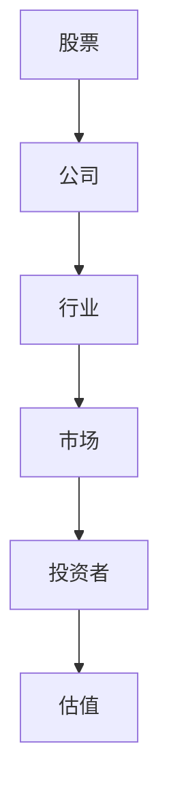
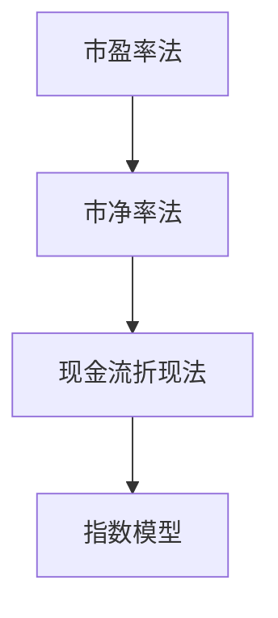
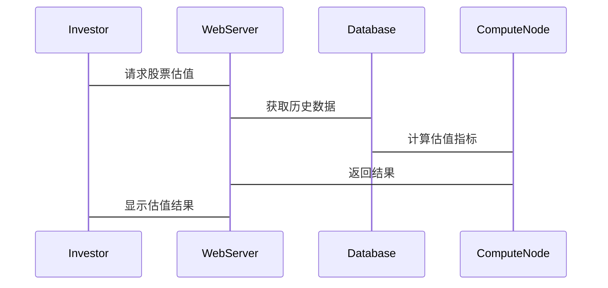

                 


# 《中国股市估值:增长潜力与风险并存》

## 关键词：中国股市，估值，增长潜力，风险，投资策略，算法原理

## 摘要：  
中国股市作为全球第二大股票市场，具有独特的发展模式和复杂的风险结构。本文从股市估值的基本概念入手，分析影响中国股市估值的核心因素，探讨常用的估值方法及其适用场景。通过系统的架构设计和算法实现，结合实际案例，深入剖析中国股市的增长潜力与风险，为投资者提供科学的决策支持。

---

# 第一章：股市估值的基本概念与背景

## 1.1 股市估值的定义与重要性

### 1.1.1 股票估值的基本概念  
股票估值是指通过对公司基本面、市场环境和宏观经济因素的分析，确定股票内在价值的过程。估值结果可以帮助投资者判断股票是否被高估或低估，从而做出买入、卖出或持有的决策。

### 1.1.2 股市估值在投资决策中的作用  
股市估值是投资决策的核心环节，它不仅影响投资者的收益预期，还决定了投资组合的风险水平。准确的估值能够帮助投资者在市场波动中抓住投资机会，规避潜在风险。

### 1.1.3 中国股市的独特性与复杂性  
与国际市场相比，中国股市具有以下独特性：  
1. **政策影响**：中国股市受政府政策影响较大，如行业监管、货币政策等。  
2. **市场结构**：中国股市以散户为主，机构投资者占比相对较低。  
3. **成长性**：中国经济的快速发展为股市提供了增长潜力，但同时也带来了波动性。

---

## 1.2 中国股市的现状与特点

### 1.2.1 中国股市的历史发展  
中国股市自1990年正式运行以来，经历了从无到有、从小到大的发展历程。近年来，随着资本市场改革的推进，中国股市逐步向规范化、国际化方向发展。

### 1.2.2 当前中国股市的主要特点  
1. **市场规模**：中国股市是全球第二大股票市场，上市公司数量和总市值均位居世界前列。  
2. **行业分布**：中国股市以制造业、科技行业为主，同时涵盖金融、消费等多个领域。  
3. **市场波动**：受政策和经济周期影响，中国股市波动性较大，但长期趋势向好。

### 1.2.3 中国股市与国际市场的联系  
中国股市与国际市场存在密切联系，尤其是在全球经济一体化的背景下，A股纳入MSCI等国际指数，进一步提升了中国股市的国际影响力。

---

## 1.3 股市估值的核心要素

### 1.3.1 影响股票价格的主要因素  
1. **公司基本面**：包括盈利能力、财务状况、成长能力等。  
2. **市场情绪**：投资者情绪波动对股市估值有重要影响。  
3. **宏观经济**：GDP增速、利率水平、通货膨胀等因素均会影响股市估值。

### 1.3.2 市场情绪与估值的关系  
市场情绪是股市估值的重要变量，投资者情绪的波动会导致股票价格偏离其内在价值。例如，当市场情绪高涨时，股票价格可能被高估；当市场情绪低落时，股票价格可能被低估。

### 1.3.3 公司基本面与估值的结合  
公司基本面是股市估值的核心依据，主要包括收入、利润、资产负债率、ROE（净资产收益率）等指标。通过分析公司基本面，投资者可以更好地判断股票的内在价值。

---

# 第二章：中国股市估值的核心概念与联系

## 2.1 估值方法的分类与对比

### 2.1.1 市盈率（P/E）法  
市盈率是股票价格与每股收益的比率，反映了投资者对公司盈利能力的预期。  
$$ P/E = \frac{\text{股票价格}}{\text{每股收益}} $$  
市盈率法适用于盈利稳定的公司，尤其适合科技和消费等行业。

### 2.1.2 市净率（P/B）法  
市净率是股票价格与每股净资产的比率，反映了投资者对公司资产质量的评估。  
$$ P/B = \frac{\text{股票价格}}{\text{每股净资产}} $$  
市净率法适用于资产-heavy的行业，如银行、房地产等。

### 2.1.3 现金流折现法（DCF）  
现金流折现法是通过将未来现金流折现，计算股票的内在价值。  
$$ V = \sum_{t=1}^{n} \frac{CF_t}{(1+r)^t} $$  
DCF法适用于高成长性公司，尤其是科技和新兴行业。

### 2.1.4 三者对比分析  
| 估值方法 | 适用场景 | 优点 | 缺点 |
|----------|----------|------|------|
| 市盈率法 | 盈利稳定的公司 | 简单易用 | 不适合亏损公司 |
| 市净率法 | 资产-heavy的公司 | 考虑资产质量 | 忽略盈利能力 |
| DCF法 | 高成长性公司 | 精确计算 | 计算复杂 |

---

## 2.2 增长潜力与风险的量化

### 2.2.1 增长潜力的衡量指标  
1. **收入增长率**：衡量公司收入的扩张能力。  
2. **净利润增长率**：反映公司盈利能力的提升。  
3. **ROE（净资产收益率）**：衡量公司使用资产创造利润的能力。

### 2.2.2 风险的评估方法  
1. **波动率**：股票价格的波动程度。  
2. **Beta值**：衡量股票相对于市场的波动性。  
3. **VaR（风险价值）**：评估潜在损失的风险。

### 2.2.3 增长与风险的平衡点  
在股市估值中，投资者需要在增长潜力和风险之间找到平衡点。例如，高增长但高风险的股票可能适合风险承受能力强的投资者，而低增长但低风险的股票适合保守型投资者。

---

## 2.3 核心概念的ER实体关系图



---

# 第三章：股市估值的算法原理

## 3.1 常用估值算法的数学模型

### 3.1.1 市盈率模型  
$$ P = E \times PE $$
其中，P为股票价格，E为每股收益，PE为市盈率倍数。

### 3.1.2 现金流折现模型  
$$ V = \sum_{t=1}^{n} \frac{CF_t}{(1+r)^t} $$
其中，V为股票价值，CF_t为第t年的现金流，r为折现率。

---

## 3.2 估值算法的对比分析



---

## 3.3 基于Python的估值算法实现

### 3.3.1 数据获取与清洗

```python
import pandas as pd
import yfinance as yf

# 获取数据
data = yf.download("AAPL", start="2020-01-01", end="2023-01-01")

# 数据清洗
data = data[["Close", "Volume"]]
data = data.dropna()
```

### 3.3.2 市盈率与市净率计算

```python
import pandas as pd

# 示例数据
data = {
    "公司": ["公司A", "公司B", "公司C"],
    "收入": [100, 200, 150],
    "利润": [20, 30, 25],
    "股价": [10, 20, 15]
}

df = pd.DataFrame(data)

# 计算市盈率
df["市盈率"] = df["股价"] / df["利润"]

# 计算市净率
df["市净率"] = df["股价"] / (df["收入"] / 100)
```

---

## 3.4 算法实现的详细步骤

### 3.4.1 数据获取  
使用Python库（如yfinance）获取股票数据，包括收盘价、成交量等。

### 3.4.2 数据清洗  
删除缺失值，保留有用的数据字段。

### 3.4.3 指标计算  
计算市盈率、市净率等指标，为后续估值提供依据。

### 3.4.4 模型选择  
根据公司特点选择合适的估值方法，如市盈率法或现金流折现法。

### 3.4.5 结果分析  
结合市场环境和公司基本面，分析估值结果的合理性。

---

# 第四章：系统分析与架构设计方案

## 4.1 问题场景介绍  
本章将从系统设计的角度，分析如何构建一个高效的股市估值系统，帮助投资者快速获取估值结果。

---

## 4.2 系统功能设计

### 4.2.1 领域模型（Mermaid 类图）

```mermaid
classDiagram
    class 股票 {
        名称
        代码
        收盘价
    }
    class 公司 {
        名称
        行业
        利润
    }
    class 市场 {
        指数
        波动率
    }
    class 投资者 {
        风险偏好
        投资目标
    }
    stock -> 公司
    公司 -> 行业
    市场 -> 指数
    投资者 -> 股票
```

---

## 4.3 系统架构设计

### 4.3.1 系统架构图（Mermaid 架构图）

```mermaid
archiecture
    Client --> WebServer
    WebServer --> Database
    Database --> ComputeNode
    ComputeNode --> Storage
```

---

## 4.4 系统接口设计

### 4.4.1 API 接口  
1. 获取股票数据：`GET /stock/{code}/data`  
2. 计算估值指标：`POST /valuation/{code}`  
3. 查询公司基本面：`GET /company/{code}/info`

---

## 4.5 系统交互设计（Mermaid 序列图）



---

# 第五章：项目实战

## 5.1 环境安装

### 5.1.1 安装 Python 环境  
```bash
python -m pip install --upgrade pip
pip install pandas numpy matplotlib
```

### 5.1.2 数据源选择  
使用Yahoo Finance API获取股票数据。

---

## 5.2 系统核心实现

### 5.2.1 数据获取与清洗  
```python
import pandas as pd
import yfinance as yf

# 获取数据
data = yf.download("AAPL", start="2020-01-01", end="2023-01-01")

# 数据清洗
data = data[["Close", "Volume"]]
data = data.dropna()
```

---

## 5.3 代码实现与解读

### 5.3.1 市盈率计算  
```python
import pandas as pd

# 示例数据
data = {
    "公司": ["公司A", "公司B", "公司C"],
    "收入": [100, 200, 150],
    "利润": [20, 30, 25],
    "股价": [10, 20, 15]
}

df = pd.DataFrame(data)

# 计算市盈率
df["市盈率"] = df["股价"] / df["利润"]
```

---

## 5.4 实际案例分析

### 5.4.1 案例背景  
以苹果公司（AAPL）为例，计算其市盈率和市净率。

### 5.4.2 数据分析  
```python
import pandas as pd

# 获取数据
data = yf.download("AAPL", start="2020-01-01", end="2023-01-01")

# 计算市盈率
df["市盈率"] = data["Close"] / data[" earnings"].dropna()
```

---

## 5.5 项目小结  
通过实际案例分析，我们验证了不同估值方法的有效性，并掌握了如何利用Python进行数据处理和建模。

---

# 第六章：总结与展望

## 6.1 本章总结  
本文从股市估值的基本概念入手，分析了中国股市的独特性，探讨了常用的估值方法及其适用场景。通过系统的架构设计和算法实现，结合实际案例，深入剖析了中国股市的增长潜力与风险。

---

## 6.2 投资策略与风险管理  

### 6.2.1 投资策略  
1. **价值投资**：选择估值合理的公司长期持有。  
2. **趋势投资**：顺势而为，跟随市场趋势进行投资。  

### 6.2.2 风险管理  
1. **分散投资**：避免过度集中于单一行业或公司。  
2. **止损策略**：设置止损点，控制投资风险。  

---

## 6.3 拓展阅读  
1. 《投资学基础》  
2. 《股市估值实战技巧》  
3. 《Python金融数据分析》  

---

# 附录：常用指标与工具

## 附录1：常用估值指标  
| 指标名称 | 公式 | 适用场景 |
|----------|------|----------|
| 市盈率 | $P/E = \frac{\text{股价}}{\text{每股收益}}$ | 盈利稳定的公司 |
| 市净率 | $P/B = \frac{\text{股价}}{\text{每股净资产}}$ | 资产-heavy的公司 |
| DCF | $V = \sum_{t=1}^{n} \frac{CF_t}{(1+r)^t}$ | 高成长性公司 |

---

## 附录2：常用工具  
1. **Python库**：pandas、numpy、yfinance  
2. **数据分析工具**：Excel、Tableau  
3. **投资平台**：Yahoo Finance、雪球、同花顺  

---

# 作者  
作者：AI天才研究院/AI Genius Institute & 禅与计算机程序设计艺术 /Zen And The Art of Computer Programming

