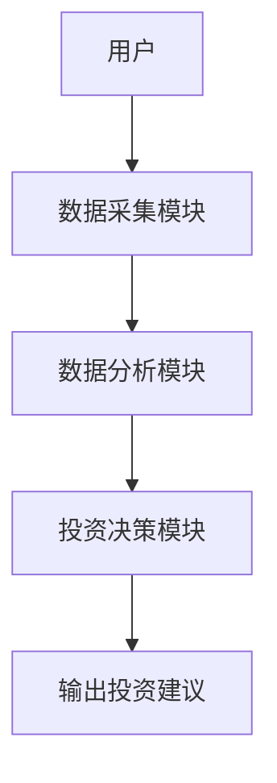

                 


# 乔尔·提林加斯特的全面价值投资：定量与定性分析的结合

> **关键词**：价值投资、定量分析、定性分析、投资策略、风险管理、系统架构、Python代码

> **摘要**：本文将深入探讨乔尔·提林加斯特的全面价值投资方法，重点分析如何将定量分析与定性分析相结合，以制定科学的投资策略。通过实际案例分析，本文将详细讲解如何运用数学模型和数据分析技术进行价值投资，同时结合系统架构设计，提供完整的投资解决方案。

---

## 引言

### 1.1 价值投资的基本概念

价值投资是一种基于对公司内在价值评估的投资策略，其核心在于寻找市场价格低于其内在价值的公司进行投资。这种方法强调长期持有优质资产，而非短期市场波动。价值投资的关键在于**独立思考**、**安全边际**和**长期视角**。

---

## 第二章: 定量分析方法

### 2.1 定量分析的核心概念

定量分析通过数学模型和统计方法，对市场数据进行分析，以寻找投资机会。常用工具包括Python、R语言等。

#### 2.1.1 数据收集与处理

从财务报表、市场数据等多源数据中提取关键指标，如市盈率（P/E）、市净率（P/B）等。

#### 2.1.2 指标计算与筛选

计算价值投资的关键指标，如低市盈率、低市净率、高股息率等，并筛选出符合条件的公司。

#### 2.1.3 模型构建与验证

使用回归分析、聚类分析等方法构建投资模型，并通过历史数据验证模型的有效性。

---

## 第三章: 定性分析方法

### 3.1 定性分析的核心要素

定性分析关注公司基本面、行业地位、竞争优势等因素。

#### 3.1.1 公司基本面分析

分析财务报表，关注收入、利润、现金流等关键指标。

#### 3.1.2 行业分析与竞争地位

评估行业前景和公司在行业中的竞争地位。

#### 3.1.3 管理团队与公司治理

考察管理层的背景、声誉和公司治理结构。

---

## 第四章: 定量与定性分析的结合

### 4.1 结合的必要性与优势

定量分析提供数据支持，定性分析提供深度见解，两者结合可提高投资决策的科学性和准确性。

#### 4.1.1 投资策略的制定

基于定量筛选和定性评估，制定投资组合。

#### 4.1.2 风险管理

通过定量分析评估风险，结合定性分析制定风险管理策略。

---

## 第五章: 投资风险管理

### 5.1 风险识别与量化

使用VaR（Value at Risk）模型量化投资组合的风险。

### 5.2 风险应对策略

通过分散投资、动态调整投资组合等方式降低风险。

---

## 第六章: 系统架构设计

### 6.1 系统功能设计

#### 6.1.1 数据采集模块

从多源数据中获取实时和历史数据。

#### 6.1.2 数据分析模块

基于定量和定性分析方法，生成投资建议。

#### 6.1.3 投资决策模块

结合分析结果，制定投资策略。

### 6.2 系统架构图



---

## 第七章: 项目实战

### 7.1 案例分析

以某行业为例，结合定量和定性分析方法，分析一家公司是否符合价值投资标准。

### 7.2 代码实现

使用Python代码实现定量分析模型：

```python
import pandas as pd
import numpy as np

# 示例数据
data = {
    '公司': ['A', 'B', 'C'],
    'PE': [10, 15, 20],
    'PB': [2, 1.5, 3]
}

df = pd.DataFrame(data)

# 定量筛选条件：PE < 15 且 PB < 2
mask = (df['PE'] < 15) & (df['PB'] < 2)
filtered = df[mask]

print(filtered)
```

---

## 第八章: 总结与展望

### 8.1 总结

通过定量与定性分析的结合，投资者可以更科学地制定投资策略，提高投资效率和准确性。

### 8.2 展望

未来，随着人工智能和大数据技术的发展，价值投资将更加依赖于定量分析与定性分析的结合。

---

## 作者

作者：AI天才研究院/AI Genius Institute & 禅与计算机程序设计艺术/Zen And The Art of Computer Programming

---

本文通过详细的定量分析和深入的定性分析，结合实际案例和系统设计，全面阐述了乔尔·提林加斯特的价值投资方法。希望读者通过本文能够掌握价值投资的核心理念，并在实际投资中灵活运用。

