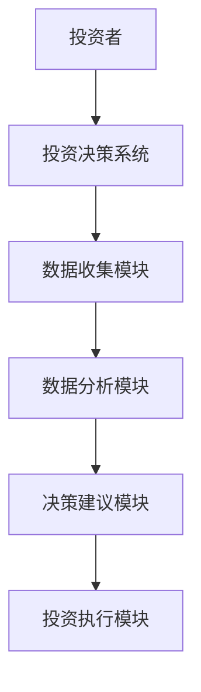

                 


# 《乔尔·提林加斯特的投资决策偏差纠正》

> 关键词：投资决策偏差，认知偏差，行为偏差，心理学模型，概率思维，决策框架

> 摘要：投资决策偏差是投资者在做出投资决策时常见的错误认知和行为模式，这些偏差可能导致投资决策的失误和资本损失。本文通过分析投资决策偏差的类型、成因及其对投资结果的影响，提出了一系列纠正偏差的策略和方法。结合心理学理论、数学模型和系统设计，本文详细探讨了如何通过概率思维、决策框架和系统化的投资策略来纠正投资决策偏差，从而帮助投资者做出更理性和高效的决策。

---

## 第一部分：引言

### 1.1 背景介绍

投资决策偏差是指投资者在决策过程中由于认知和行为的偏差，导致投资决策偏离理性预期的现象。这些偏差可能来源于个体的心理因素、环境因素或市场结构。本文旨在通过分析这些偏差的成因和表现形式，提出纠正偏差的方法。

### 1.2 问题描述

投资决策偏差广泛存在于个人和机构投资者中，常见的偏差包括过度自信、确认偏差、损失厌恶等。这些偏差可能导致投资者做出错误的投资决策，进而影响投资收益。

### 1.3 研究意义

纠正投资决策偏差有助于提高投资决策的准确性和效率，降低投资风险，从而帮助投资者实现长期稳健的投资回报。

---

## 第二部分：投资决策偏差的类型与成因

### 2.1 认知偏差

认知偏差是指个体在信息处理过程中产生的系统性错误。常见的投资认知偏差包括：

- **过度自信偏差**：投资者对自己判断的过度信任，可能导致冒险行为。
- **确认偏差**：投资者倾向于寻找支持自己观点的信息，忽略相反的证据。

### 2.2 行为偏差

行为偏差是指个体在决策过程中表现出的非理性行为。常见的投资行为偏差包括：

- **损失厌恶**：投资者对损失的厌恶程度高于对收益的偏好。
- **从众心理**：投资者跟随市场的趋势，缺乏独立判断。

### 2.3 群体决策偏差

群体决策偏差是指在群体决策中常见的偏差。常见的群体决策偏差包括：

- **羊群效应**：投资者跟随大多数人的决策，导致市场的非理性波动。
- **集体风险转移**：群体决策中个体责任感的分散，导致风险承担行为。

---

## 第三部分：纠正投资决策偏差的策略

### 3.1 提高自我认知

- **识别偏差**：通过自我反思和记录，识别自己常见的偏差类型。
- **教育学习**：通过学习心理学和投资学知识，提高对偏差的认知。

### 3.2 建立决策框架

- **制定投资计划**：明确投资目标和策略，避免情绪化决策。
- **使用概率思维**：通过概率分析，评估投资的潜在收益和风险。

### 3.3 运用数学模型

- **概率期望值公式**：
  $$E = \sum (P_i \times V_i)$$
  其中，\(E\) 表示期望值，\(P_i\) 表示事件 \(i\) 的概率，\(V_i\) 表示事件 \(i\) 的价值。

### 3.4 建立监控机制

- **定期回顾**：定期检查投资决策，评估偏差的影响。
- **调整策略**：根据偏差的表现，及时调整投资策略。

---

## 第四部分：系统设计与实现

### 4.1 系统架构设计

使用 Mermaid 绘制系统架构图：



### 4.2 数据收集与分析

- **数据收集模块**：收集市场数据、历史数据和投资者行为数据。
- **数据分析模块**：使用统计学方法和机器学习算法，识别投资决策中的偏差。

### 4.3 决策支持工具

- **概率分析工具**：通过概率模型，评估不同投资方案的风险和收益。
- **情景模拟工具**：模拟不同市场环境下的投资决策，帮助投资者做出更理性的选择。

---

## 第五部分：项目实战

### 5.1 项目背景

假设我们有一个股票投资组合，需要纠正投资者的决策偏差。

### 5.2 系统实现

以下是使用 Python 实现的概率分析工具代码：

```python
import numpy as np

def expected_value(values, probabilities):
    return np.sum(values * probabilities)

# 示例数据
values = [100, 200, 300]
probabilities = [0.2, 0.3, 0.5]

# 计算期望值
ev = expected_value(values, probabilities)
print(f"期望值为：{ev}")
```

### 5.3 实战分析

通过概率分析工具，投资者可以量化不同投资方案的期望值，从而做出更理性的决策。

---

## 第六部分：结论

### 6.1 总结

纠正投资决策偏差需要从认知、行为和系统等多个层面入手。通过提高自我认知、建立决策框架和运用数学模型，投资者可以有效减少偏差的影响，提高投资决策的准确性。

### 6.2 展望

未来，随着人工智能和大数据技术的发展，纠正投资决策偏差的方法和工具将更加智能化和个性化。投资者需要不断学习和适应，以应对不断变化的市场环境。

---

## 参考文献

1. 克鲁格曼, P. R. (2014). 《投资者心理与决策偏差》
2. 坎尼曼, D. (2002). 《判断与决策的启发式》
3. 特沃斯基, A., & 克拉克, R. (1996). 《前景理论：对期望效用理论的修正》

---

**作者：AI天才研究院/AI Genius Institute & 禅与计算机程序设计艺术 /Zen And The Art of Computer Programming**

