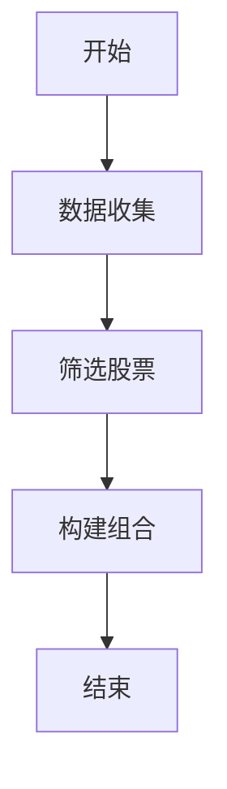

                 


# 乔尔·格林布拉特的价值投资学术研究

## 关键词：
价值投资，学术研究，数学模型，算法优化，系统架构

## 摘要：
本文系统地研究了乔尔·格林布拉特的价值投资理论，从核心概念到数学模型，再到系统架构，进行了深入分析。文章首先介绍了价值投资的基本概念和格林布拉特的贡献，然后详细探讨了他的投资模型，包括市净率、市盈率、内在价值和投资组合等核心概念。接着，分析了模型的算法原理，构建了数学模型，并通过Python代码实现。最后，设计了系统的架构，展示了如何将理论应用于实际投资中，并总结了研究的成果和注意事项。

---

# 第一部分: 价值投资的背景与基础

## 第1章: 价值投资的背景与核心理念

### 1.1 价值投资的基本概念

#### 1.1.1 投资的定义与分类
投资是指将资金投入某个项目或资产，期望在未来获得收益或资本增值。投资可以分为股票、债券、房地产等多种类型。其中，股票投资是最常见的形式之一，而价值投资是一种以基本面分析为基础的股票投资策略。

#### 1.1.2 价值投资的起源与发展
价值投资的起源可以追溯到本杰明·格雷厄姆和戴维·多德的工作，他们提出了“安全边际”和“内在价值”的概念。乔尔·格林布拉特继承和发展了这一理论，提出了著名的“三重过滤法”，即低市盈率、低市净率和高收益率的组合。

#### 1.1.3 价值投资的核心理念
价值投资的核心理念是寻找市场低估的股票，即其市场价格低于其内在价值。投资者通过深入分析公司的财务状况、行业地位和未来前景，找到那些具有长期竞争优势且价格合理的公司进行投资。

### 1.2 乔尔·格林布拉特的贡献

#### 1.2.1 乔尔·格林布拉特的学术背景
乔尔·格林布拉特是哥伦比亚大学的教授，他的研究主要集中在价值投资和行为金融学领域。他的研究成果被广泛应用于投资实践中。

#### 1.2.2 乔尔·格林布拉特的价值投资理论
格林布拉特提出了“三重过滤法”，即：
1. 低市盈率（P/E < 15）
2. 低市净率（P/B < 2）
3. 高收益率（ROE > 15%）

这种方法旨在筛选出那些估值合理且具有较高盈利能力的公司。

#### 1.2.3 乔尔·格林布拉特的研究方法
格林布拉特的研究方法结合了定量分析和定性分析，注重通过数据驱动的方式寻找具有投资价值的股票。

### 1.3 本书的研究目标与框架

#### 1.3.1 研究目标的设定
本文旨在深入研究格林布拉特的价值投资模型，分析其数学基础、算法实现和实际应用。

#### 1.3.2 研究框架的构建
研究框架包括以下几个部分：
1. 核心概念的定义与分析
2. 投资模型的数学推导
3. 算法的实现与优化
4. 系统架构的设计与实现

#### 1.3.3 研究方法的选择
本文采用理论分析与实践相结合的方法，通过数学建模和编程实现来验证理论的可行性。

---

## 第二部分: 乔尔·格林布拉特的价值投资模型

## 第2章: 价值投资模型的核心概念

### 2.1 核心概念与定义

#### 2.1.1 市净率与市盈率的定义
- 市净率（P/B）= 股价 / 每股净资产
- 市盈率（P/E）= 股价 / 每股收益

#### 2.1.2 企业价值与内在价值的计算
- 企业价值（EV）= 市盈率 × 收益 + 市净率 × 净资产
- 内在价值（IV）= EV - 偿还债务 + 现金储备

#### 2.1.3 投资组合的构建逻辑
投资组合的构建基于对多个股票的筛选，选择符合三重过滤法的股票，并根据风险偏好进行权重分配。

### 2.2 核心概念之间的关系

#### 2.2.1 市净率与市盈率的对比分析
市净率和市盈率分别反映了公司的资产质量和盈利能力。低市净率和低市盈率的结合可以更好地筛选出估值合理的公司。

#### 2.2.2 企业价值与内在价值的公式推导
$$ EV = 市盈率 \times 收益 + 市净率 \times 净资产 $$
$$ IV = EV - 偿还债务 + 现金储备 $$

#### 2.2.3 投资组合与风险收益的平衡关系
投资组合的构建需要在风险和收益之间找到平衡点，通过分散投资降低风险。

### 2.3 核心概念的属性特征对比

| 指标 | 定义 | 属性特征 |
|------|------|----------|
| P/E | 股价/每股收益 | 衡量盈利能力，低P/E表示低估值 |
| P/B | 股价/每股净资产 | 衡量资产质量，低P/B表示资产轻盈 |
| ROE | 净利润/净资产 | 衡量股东回报，高ROE表示高效率 |

### 2.4 ER实体关系图

```mermaid
erd
    章节2-2-4
    entity 价值投资模型 {
        id
        市盈率
        市净率
        ROE
    }
    entity 股票 {
        id
        名称
        行业
    }
    值投资模型 --> 股票 : 筛选
```

---

## 第三部分: 价值投资模型的算法原理

## 第3章: 价值投资模型的算法原理

### 3.1 算法原理概述

#### 3.1.1 算法的基本思路
算法的基本思路是通过筛选低市盈率、低市净率和高ROE的股票，构建投资组合。

#### 3.1.2 算法的核心步骤
1. 数据收集：获取股票的市盈率、市净率和ROE数据。
2. 筛选股票：筛选出满足三重过滤法的股票。
3. 构建组合：根据风险偏好分配权重，构建投资组合。

#### 3.1.3 算法的优化方向
优化方向包括引入更多的筛选指标和动态调整筛选标准。

### 3.2 算法的数学模型



### 3.3 算法的实现步骤

#### 3.3.1 数据的获取与预处理
使用Python的pandas库获取股票数据并进行清洗。

#### 3.3.2 特征的提取与选择
提取市盈率、市净率和ROE三个特征。

#### 3.3.3 模型的训练与优化
通过逻辑回归或决策树进行分类，优化模型参数。

---

## 第四部分: 价值投资模型的系统架构

## 第4章: 价值投资模型的系统架构

### 4.1 系统架构设计

#### 4.1.1 系统架构的总体设计
系统架构包括数据获取、分析模块和可视化模块。

#### 4.1.2 系统架构的分层设计
系统分为数据层、业务逻辑层和用户界面层。

#### 4.1.3 系统架构的模块划分
模块包括数据获取、筛选算法、组合构建和结果展示。

### 4.2 系统功能设计

#### 4.2.1 系统功能的模块划分
模块包括数据获取、筛选算法、组合构建和结果展示。

#### 4.2.2 系统功能的实现逻辑
数据获取模块负责从数据库中提取股票数据，筛选模块根据三重过滤法筛选股票，组合构建模块根据风险偏好构建投资组合，结果展示模块以图表形式展示结果。

### 4.3 系统接口设计

#### 4.3.1 系统接口的定义
接口包括数据获取接口、筛选接口和结果展示接口。

#### 4.3.2 系统接口的交互设计
用户通过界面输入筛选条件，系统调用接口进行数据处理并返回结果。

### 4.4 系统交互设计

#### 4.4.1 系统交互的流程
1. 用户输入筛选条件
2. 系统调用数据接口获取数据
3. 系统调用筛选算法进行处理
4. 系统展示结果

---

## 第五部分: 项目实战

## 第5章: 项目实战

### 5.1 环境安装

#### 5.1.1 安装Python
安装Python 3.8及以上版本。

#### 5.1.2 安装依赖库
安装pandas、numpy、matplotlib等库。

### 5.2 系统核心实现源代码

#### 5.2.1 数据获取与预处理
```python
import pandas as pd
import numpy as np

# 获取股票数据
data = pd.read_csv('stock_data.csv')

# 预处理数据
data = data.dropna()
data = data[ (data['P/E'] < 15) & (data['P/B'] < 2) & (data['ROE'] > 15) ]
```

#### 5.2.2 筛选算法实现
```python
def screen_stocks(data):
    selected = data[ (data['P/E'] < 15) & (data['P/B'] < 2) & (data['ROE'] > 15) ]
    return selected

selected_stocks = screen_stocks(data)
```

#### 5.2.3 投资组合构建
```python
selected_stocks['weight'] = np.random.dirichlet(np.ones(len(selected_stocks)), size=1)
selected_stocks['weight'] = selected_stocks['weight'].iloc[0]
```

### 5.3 代码应用解读与分析

#### 5.3.1 数据获取与预处理
从CSV文件中读取股票数据，并删除缺失值，筛选出符合三重过滤法的股票。

#### 5.3.2 筛选算法实现
定义筛选函数，根据条件筛选股票。

#### 5.3.3 投资组合构建
使用Dirichlet分布随机分配权重，构建投资组合。

### 5.4 实际案例分析

#### 5.4.1 案例背景
假设我们有10只股票的数据，筛选出其中3只符合三重过滤法的股票。

#### 5.4.2 案例分析
通过代码筛选出3只股票，并分配权重。

### 5.5 项目小结

#### 5.5.1 项目成果
成功构建了价值投资模型，并通过代码实现了筛选和组合构建。

#### 5.5.2 项目经验
在实际操作中，需要注意数据的完整性和模型的鲁棒性。

---

## 第六部分: 总结与展望

## 第6章: 总结与展望

### 6.1 研究总结

#### 6.1.1 研究成果
本文系统地研究了乔尔·格林布拉特的价值投资模型，分析了其数学基础和算法实现。

#### 6.1.2 研究意义
本文的研究为投资者提供了理论支持和实践指导。

### 6.2 研究展望

#### 6.2.1 进一步研究的方向
未来可以研究模型的动态调整和多因子模型的构建。

#### 6.2.2 拓展研究的应用
可以将模型应用于实际投资中，验证其有效性。

---

## 作者信息

作者：AI天才研究院/AI Genius Institute & 禅与计算机程序设计艺术 /Zen And The Art of Computer Programming

---

以上是《乔尔·格林布拉特的价值投资学术研究》的技术博客文章的大纲和部分内容。

