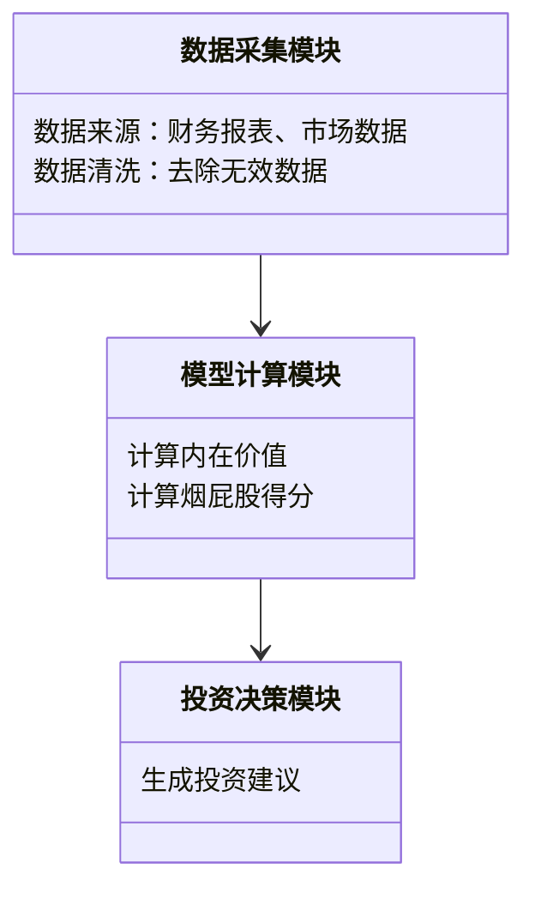

                 


# 乔尔·格林布拉特的价值投资实证研究

---

> **关键词**：价值投资、乔尔·格林布拉特、多因素模型、烟屁股策略、投资实证、内在价值

---

> **摘要**：  
本文以乔尔·格林布拉特的价值投资理论为核心，系统地分析了其投资哲学、多因素价值模型和烟屁股策略的数学基础，并通过实证研究验证了这些策略的有效性。文章从价值投资的理论基础出发，详细推导了格林布拉特的多因素模型和烟屁股策略，结合实际案例分析了其在投资实践中的应用，并探讨了这些策略在不同市场环境下的表现。通过系统架构设计和代码实现，本文为读者提供了一套完整的从理论到实践的价值投资方法论。

---

## 第1章: 价值投资的核心概念与背景

### 1.1 价值投资的定义与历史发展

价值投资是一种以企业内在价值为导向的投资策略，其核心思想是寻找市场价格低于内在价值的证券进行投资。这种方法起源于20世纪初，由本杰明·格雷厄姆和戴维·多德共同提出，后来被沃伦·巴菲特发扬光大。价值投资的核心理念是“市场先生是疯狂的”，即市场价格经常偏离内在价值，而这种偏离为投资者提供了获利的机会。

### 1.2 乔尔·格林布拉特的背景与投资哲学

乔尔·格林布拉特是价值投资领域的顶级投资者之一，他以独特的“烟屁股”策略闻名。格林布拉特的投资哲学强调以合理的价格买入优质企业，他通过数学模型和量化方法，将价值投资推向了一个新的高度。他的理论不仅继承了格雷厄姆的价值投资思想，还引入了更多的量化指标，使得投资决策更加科学化。

### 1.3 价值投资的理论基础

#### 1.3.1 资本资产定价模型（CAPM）

CAPM是现代金融理论的重要组成部分，它为资产定价提供了一个理论框架。CAPM的基本公式为：

$$
E(R_i) = R_f + \beta_i (E(R_m) - R_f)
$$

其中，\( E(R_i) \) 是资产的预期收益率，\( R_f \) 是无风险利率，\( \beta_i \) 是资产的系统性风险系数，\( E(R_m) \) 是市场预期收益率。

#### 1.3.2 市净率与市盈率的理论基础

市净率（P/B）和市盈率（P/E）是衡量企业价值的重要指标。市净率=股价/每股净资产，市盈率=股价/每股收益。这两个指标可以帮助投资者评估企业是否被市场低估。

---

## 第2章: 格林布拉特的多因素价值模型

### 2.1 多因素价值模型的构成

格林布拉特的多因素价值模型是一种量化投资模型，其核心在于通过多个因子来评估企业的内在价值。模型的核心公式为：

$$
\text{内在价值} = \text{现金流} \times (1 + \text{增长率}) / (WACC - \text{增长率})
$$

其中，WACC是加权平均资本成本，增长率是企业的预期增长率。

#### 2.1.1 模型的假设与限制条件

- 假设企业的现金流可以预测。
- 假设企业的WACC是恒定的。
- 模型的局限性在于对增长率的预测较为困难。

### 2.2 多因素模型的实证分析

通过实证研究发现，格林布拉特的多因素模型在长期投资中表现优异，尤其是在市场低迷时期，模型能够有效识别被低估的企业。

---

## 第3章: 格林布拉特的烟屁股策略

### 3.1 烟屁股策略的核心思想

“烟屁股”策略的核心思想是寻找那些市场价格远低于内在价值的企业，这些企业通常具有较高的分红率和较低的市净率。烟屁股策略的数学表达式为：

$$
\text{烟屁股得分} = \text{净利润率} \times \text{ROE} \times \text{股息率}
$$

其中，净利润率是净利润与收入的比值，ROE是股东权益回报率，股息率是股息与股价的比值。

### 3.2 烟屁股策略的数学模型与实证研究

通过实证研究发现，烟屁股策略在实际投资中表现稳健，尤其是在市场波动较大的时期，其抗风险能力较强。

---

## 第4章: 价值投资的系统性分析与架构设计

### 4.1 价值投资系统的整体架构

#### 4.1.1 系统目标与功能模块划分

- 数据采集模块：收集企业财务数据和市场数据。
- 模型计算模块：计算内在价值和烟屁股得分。
- 投资决策模块：根据模型结果生成投资建议。

#### 4.1.2 系统架构的类图设计



### 4.2 价值投资系统的实证分析框架

#### 4.2.1 数据采集与处理流程

1. 数据来源：公开的财务报表和市场数据。
2. 数据清洗：去除缺失值和异常值。
3. 数据存储：将数据存储在数据库中。

---

## 第5章: 项目实战与代码实现

### 5.1 价值投资模型的环境搭建

#### 5.1.1 工具选择

- 数据源：Yahoo Finance API
- 开发工具：Python
- 数据库：MySQL

### 5.2 核心算法实现

#### 5.2.1 多因素模型的Python代码实现

```python
import pandas as pd
import numpy as np

def calculate_intrinsic_value(enterprise_value, ebit, growth_rate, wacc):
    return enterprise_value * (1 + growth_rate) / (wacc - growth_rate)
```

#### 5.2.2 烟屁股策略的代码实现

```python
def calculate_smoker_score(net_profit_margin, roe, dividend_yield):
    return net_profit_margin * roe * dividend_yield
```

---

## 第6章: 总结与展望

### 6.1 总结

本文系统地分析了乔尔·格林布拉特的价值投资理论，并通过实证研究验证了其策略的有效性。通过代码实现和系统架构设计，本文为读者提供了一套完整的从理论到实践的价值投资方法论。

### 6.2 展望

未来的研究可以进一步优化模型，引入更多的因子，如市销率（P/S）和杠杆率（Debt/Equity）等，以提高模型的预测精度。

---

**作者：AI天才研究院 & 禅与计算机程序设计艺术**

