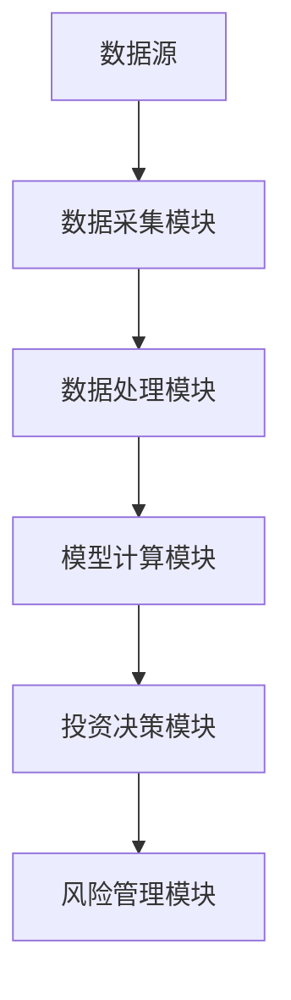
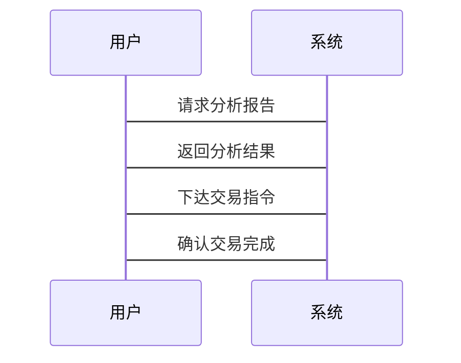
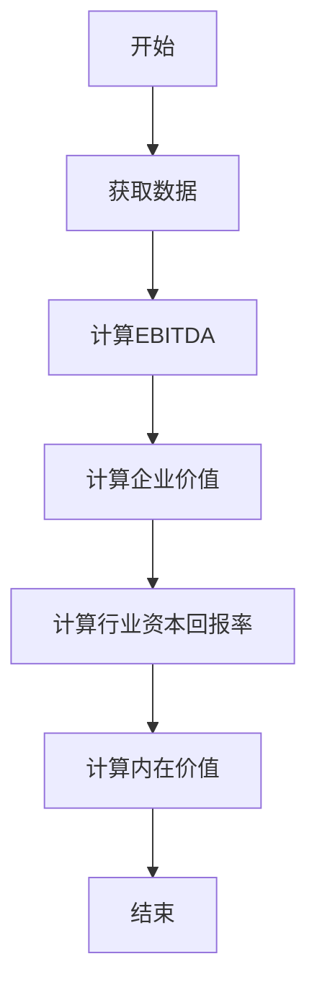

                 


# 《乔尔·格林布拉特的价值投资实践指南》

> 关键词：价值投资、格林布拉特模型、内在价值、投资策略、风险管理、系统架构

> 摘要：本文深入探讨了乔尔·格林布拉特的价值投资方法，从理论基础到数学模型，从系统设计到实战案例，全面解析了如何在实际投资中应用格林布拉特模型，帮助投资者找到被市场低估的投资机会。

---

## 第1章: 价值投资的核心概念

### 1.1 价值投资的定义与背景

#### 1.1.1 价值投资的起源与发展
价值投资是一种以基本面分析为基础的投资策略，起源于20世纪初，由本杰明·格雷厄姆和戴维·多德共同提出。其核心思想是寻找市场定价低于其内在价值的股票，长期持有以实现收益。

#### 1.1.2 价值投资的核心理念
价值投资强调企业的内在价值，认为市场价格与内在价值的差异是投资机会的来源。投资者应关注企业的基本面，如盈利能力、财务状况和行业地位，而非市场的短期波动。

#### 1.1.3 价值投资与成长投资的区别
- **价值投资**：关注低估值、高分红的公司，适合防御型投资者。
- **成长投资**：关注高增长、高潜力的公司，适合风险承受能力强的投资者。
- **区别**：价值投资注重安全边际，成长投资注重未来增长。

### 1.2 格林布拉特投资方法的核心要素

#### 1.2.1 格林布拉特的背景与投资哲学
乔尔·格林布拉特是价值投资的践行者，他将量化分析与基本面分析相结合，提出了一套独特的投资模型。他认为，投资的核心是找到市场的非理性定价，并通过系统化的方法捕捉这些机会。

#### 1.2.2 格林布拉特模型的数学公式
格林布拉特模型的核心公式为：
$$ \text{内在价值} = \frac{E}{IC} \times \text{行业资本回报率} $$

其中：
- $E$：企业价值（通常用息税前利润的5倍表示）。
- $IC$：息税折旧及摊销前利润（EBITDA）。
- 行业资本回报率：行业内可比公司的平均资本回报率。

#### 1.2.3 核心要素的分析框架
- 企业价值与现金流的匹配。
- 行业资本回报率的计算。
- 安全边际的确定。

### 1.3 价值投资与成长投资的对比分析

#### 1.3.1 价值投资与成长投资的异同
- **相同点**：都注重基本面分析，寻找优质公司。
- **不同点**：价值投资关注低估，成长投资关注高增长。

#### 1.3.2 价值投资适用的市场环境
- 市场低迷时更容易找到低估机会。
- 行业周期低谷时更容易发现价值。

#### 1.3.3 价值投资的风险与收益特征
- **风险**：短期波动大，可能长期不被市场认可。
- **收益**：通过长期持有优质低估资产，实现超额收益。

### 1.4 价值投资的历史发展与现状

#### 1.4.1 价值投资的演变历程
从格雷厄姆的“烟蒂股”到巴菲特的成长型价值投资，价值投资理论不断演变，但核心理念不变。

#### 1.4.2 格林布拉特模型的创新点
将量化分析与基本面分析结合，提出基于行业资本回报率的内在价值计算方法。

#### 1.4.3 当前价值投资的市场应用
近年来，随着市场的成熟，价值投资理念逐渐被更多投资者接受，但非理性波动仍然存在。

---

## 第2章: 格林布拉特模型的数学原理

### 2.1 格林布拉特模型的核心公式

#### 2.1.1 内在价值计算公式
$$ \text{内在价值} = \frac{E}{IC} \times \text{行业资本回报率} $$

- **企业价值 $E$**：通常基于EBITDA的倍数计算。
- **息税折旧及摊销前利润 $IC$**：EBITDA。
- **行业资本回报率**：行业内可比公司的平均ROE或ROA。

#### 2.1.2 市盈率与企业价值的关系
市盈率（P/E）是衡量估值的重要指标，但格林布拉特更倾向于使用企业价值与现金流的比值。

#### 2.1.3 模型的适用条件与限制
- 适用于成熟行业，尤其是周期性不强的行业。
- 依赖于准确的行业资本回报率数据。

### 2.2 格林布拉特模型的假设与验证

#### 2.2.1 模型的假设条件
- 市场存在非理性定价。
- 行业资本回报率稳定。
- 企业价值与现金流呈线性关系。

#### 2.2.2 模型的实证分析
通过对历史数据的回测，格林布拉特模型在长期表现上优于市场指数。

#### 2.2.3 模型的有效性与局限性
- **有效性**：在市场低迷或行业低谷时表现优异。
- **局限性**：对新兴行业和高增长企业的估值可能不够准确。

### 2.3 格林布拉特模型的改进与扩展

#### 2.3.1 对模型的优化建议
- 结合宏观经济指标。
- 考虑企业规模和杠杆比率。

#### 2.3.2 模型在不同市场环境下的应用
- **牛市**：谨慎使用，避免高估。
- **熊市**：积极寻找低估机会。

#### 2.3.3 模型的未来发展方向
结合大数据和机器学习，进一步优化内在价值计算。

---

## 第3章: 价值投资的系统分析与架构设计

### 3.1 投资系统的整体架构

#### 3.1.1 系统目标与范围
构建一个基于格林布拉特模型的量化投资系统，实现从数据采集到投资决策的全流程自动化。

#### 3.1.2 系统功能模块划分
- 数据采集模块。
- 模型计算模块。
- 投资决策模块。
- 风险管理模块。

#### 3.1.3 系统架构图（Mermaid）


### 3.2 投资决策的流程设计

#### 3.2.1 数据收集与处理流程
1. 收集企业财务数据。
2. 计算关键指标（如EBITDA、ROE）。
3. 确定行业资本回报率。

#### 3.2.2 模型计算与分析流程
1. 输入企业价值和现金流。
2. 计算内在价值。
3. 比较市场价与内在价值。

#### 3.2.3 投资决策与执行流程
1. 生成投资建议。
2. 风险评估。
3. 执行交易。

### 3.3 系统接口与交互设计

#### 3.3.1 数据接口设计
- 数据来源：公开财报、行业报告。
- 数据格式：CSV、JSON。

#### 3.3.2 用户界面设计
- 界面简洁，功能清晰。
- 提供实时数据查询和历史数据分析。

#### 3.3.3 交互流程图（Mermaid）


---

## 第4章: 价值投资的项目实战

### 4.1 项目环境与工具安装

#### 4.1.1 数据源选择与获取
使用Yahoo Finance获取公开的财务数据。

#### 4.1.2 数据分析工具安装
安装Python、Pandas、NumPy、Matplotlib。

#### 4.1.3 开发环境配置
安装Jupyter Notebook，配置数据接口。

### 4.2 核心算法实现

#### 4.2.1 内在价值计算的Python代码实现
```python
import pandas as pd
import requests

# 下载数据
def get_data(symbol):
    url = f"https://query1.finance.yahoo.com/quote/{symbol}/financials"
    response = requests.get(url)
    data = response.json()
    return data

# 计算内在价值
def calculate_intrinsic_value(symbol):
    data = get_data(symbol)
    ebitda = data['financials']['EBITDA']
    enterprise_value = 5 * ebitda
    industry_return = 0.1  # 假设行业资本回报率为10%
    intrinsic_value = (enterprise_value / ebitda) * industry_return
    return intrinsic_value

# 示例：分析沃尔玛（WMT）
symbol = "WMT"
iv = calculate_intrinsic_value(symbol)
print(f"{symbol}的内在价值为：{iv}")
```

#### 4.2.2 算法流程图（Mermaid）


### 4.3 项目实战分析

#### 4.3.1 实际案例分析：沃尔玛（WMT）
- **数据下载**：获取沃尔玛的财务数据。
- **内在价值计算**：使用上述代码计算内在价值。
- **市场价与内在价值对比**：判断是否低估。

#### 4.3.2 结果分析与解读
- 内在价值高于当前股价，说明存在低估机会。
- 结合行业趋势和公司基本面，判断是否值得投资。

#### 4.3.3 项目小结
通过实战案例，验证了格林布拉特模型的有效性，并展示了如何将其应用于实际投资决策。

---

## 第5章: 价值投资的最佳实践与小结

### 5.1 格林布拉特模型的优势与不足

#### 5.1.1 优势
- 量化分析与基本面分析结合。
- 适合系统化投资。

#### 5.1.2 不足
- 对行业资本回报率的依赖。
- 无法捕捉新兴行业的高增长机会。

### 5.2 投资策略与风险管理

#### 5.2.1 分散投资
避免过度集中，降低风险。

#### 5.2.2 定期复盘
及时调整投资组合，应对市场变化。

#### 5.2.3 系统化交易
通过系统化操作，减少人为干扰。

### 5.3 未来投资趋势与建议

#### 5.3.1 数据驱动的投资
结合大数据和AI技术，优化投资决策。

#### 5.3.2 全球化投资
关注国际市场，分散风险。

#### 5.3.3 可持续投资
注重ESG因素，推动长期价值。

### 5.4 小结与总结

通过本文的分析，我们可以看到，格林布拉特模型为价值投资提供了一种系统化的方法，但在实际应用中需要结合市场环境和公司基本面，不断优化和调整。

---

## 作者信息

作者：AI天才研究院/AI Genius Institute  
地址：禅与计算机程序设计艺术/Zen And The Art of Computer Programming  
GitHub：[https://github.com/ai-genius-institute](https://github.com/ai-genius-institute)

