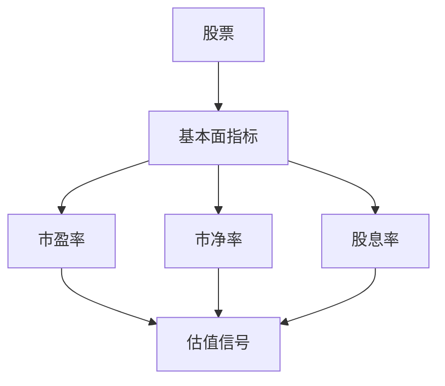
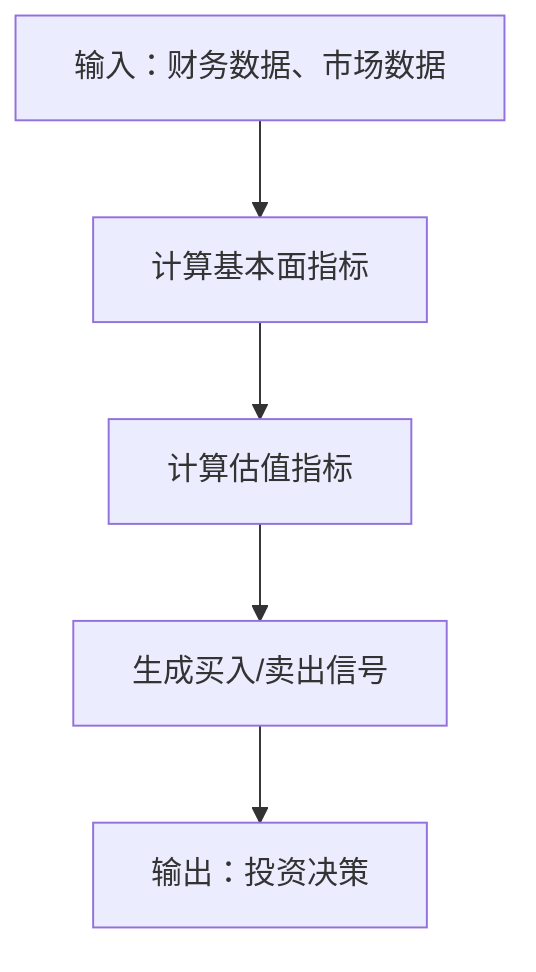
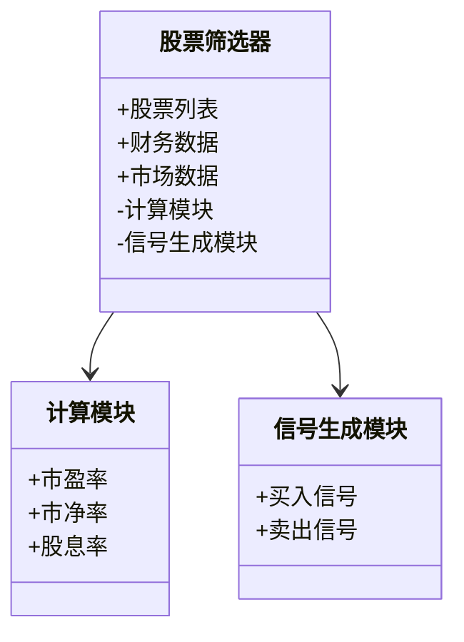
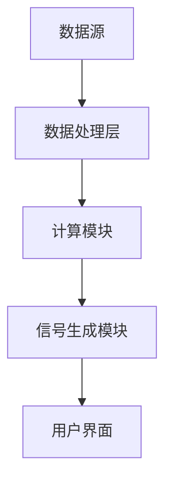
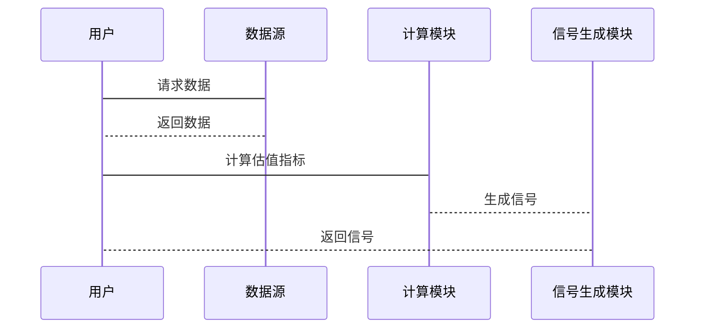

                 


# 乔尔·格林布拉特的价值投资量化方法

## 关键词：价值投资，量化方法，格林布拉特，投资模型，量化策略

## 摘要：  
本文深入分析了乔尔·格林布拉特的价值投资量化方法，从理论基础到算法实现，再到系统设计和项目实战，全面阐述了这一方法的核心思想和实际应用。通过详细的数学公式、代码示例和系统架构图，帮助读者理解如何将价值投资理念转化为可执行的量化策略。  

---

# 第1章: 价值投资与格林布拉特方法概述

## 1.1 价值投资的基本概念  
### 1.1.1 价值投资的定义  
价值投资是一种投资策略，强调以低于内在价值的价格购买优质资产。其核心在于识别市场低估的公司，并长期持有，等待其价值回归。  

### 1.1.2 价值投资的核心理念  
- 市场先生理论：市场情绪波动导致价格与价值分离。  
- 安全边际：买入价格低于内在价值，以降低风险并提高安全边际。  

### 1.1.3 格林布拉特方法的起源  
乔尔·格林布拉特是将价值投资与量化分析结合的先驱。他在《 stocks for the long run》中提出了一套量化筛选模型，强调通过基本面指标筛选低估股票。  

---

## 1.2 格林布拉特方法的基本框架  
### 1.2.1 格林布拉特方法的简介  
格林布拉特的方法基于以下核心假设：  
- 股票的内在价值可以通过基本面指标估算。  
- 市场波动为投资者提供了以低于内在价值买入股票的机会。  

### 1.2.2 方法的核心思想  
- 通过量化指标筛选具有吸引力的股票。  
- 结合估值指标和质量指标，构建多因子模型。  

### 1.2.3 方法的适用场景  
- 长期投资策略。  
- 理性分析驱动的投资决策。  

---

## 1.3 本书的目的与结构  
### 1.3.1 本书的目标  
- 介绍格林布拉特方法的理论基础。  
- 分析其量化模型的实现方法。  
- 提供实际项目中的应用案例。  

### 1.3.2 目标读者  
- 投资者：希望将价值投资理念转化为量化策略。  
- 数据科学家：希望将量化方法应用于金融领域。  

### 1.3.3 本书的结构安排  
- 第2章：核心概念与模型。  
- 第3章：算法原理与实现。  
- 第4章：系统设计与架构。  
- 第5章：项目实战与案例分析。  

---

# 第2章: 核心概念与联系

## 2.1 核心概念与模型  
### 2.1.1 格林布拉特模型的定义  
格林布拉特模型通过量化指标筛选股票，主要基于以下指标：  
- 市盈率（P/E）。  
- 市净率（P/B）。  
- 股息率。  

### 2.1.2 模型的输入变量  
- 财务数据：收入、利润、资产等。  
- 市场数据：股价、成交量等。  

### 2.1.3 模型的输出结果  
- 股票的内在价值估算。  
- 买入信号与卖出信号。  

---

## 2.2 核心概念属性对比  
### 2.2.1 财务指标对比表  

| 指标类型 | 指标名称 | 计算公式 | 核心作用 |
|----------|----------|----------|----------|
| 资产 | 总资产 | 资产总计 | 衡量公司规模 |
| 利润 | 净利润 | 净利润 | 衡量盈利能力 |
| 估值 | 市盈率 | P/E = 价格/每股收益 | 衡量估值水平 |

### 2.2.2 估值方法对比表  

| 估值方法 | 描述 | 优点 | 缺点 |
|----------|------|------|------|
| 市盈率法 | 基于P/E比值 | 简单易用 | 不适用于亏损公司 |
| 市净率法 | 基于P/B比值 | 适用于银行等资产密集型行业 | 低估成长型企业 |

### 2.2.3 风险评估对比表  

| 风险指标 | 描述 | 计算公式 | 作用 |
|----------|------|----------|------|
| 贝塔值 | 股票波动性 | β = 协方差(股票收益率, 市场收益率) / 方差(市场收益率) | 衡量市场风险 |
| 夏普比率 | 风险调整后的收益 | Sharpe Ratio = (收益 - 无风险利率) / 标准差 | 衡量风险调整收益 |

---

## 2.3 ER实体关系图  



---

# 第3章: 算法原理讲解

## 3.1 算法流程图  



---

## 3.2 算法实现代码  

```python
import pandas as pd

def calculate_value_signals(df):
    # 计算市盈率
    df['pe'] = df['price'] / df['eps']
    # 计算市净率
    df['pb'] = df['price'] / df['book_value_per_share']
    # 计算股息率
    df['dividend_yield'] = df['dividends'] / df['price']
    # 生成买入信号
    df['buy_signal'] = (df['pe'] < 15) & (df['pb'] < 2) & (df['dividend_yield'] > 3)
    # 生成卖出信号
    df['sell_signal'] = df['pe'] > 25
    return df

# 示例数据
data = {
    'price': [50, 60, 70],
    'eps': [10, 15, 20],
    'book_value_per_share': [5, 6, 7],
    'dividends': [2, 3, 4]
}
df = pd.DataFrame(data)
result = calculate_value_signals(df)
print(result)
```

---

## 3.3 数学模型与公式  
格林布拉特模型的核心公式为：  

$$ \text{内在价值} = \text{净利润} \times (1 + g) / (r - g) $$  

其中，$g$ 是净利润增长率，$r$ 是折现率。  

---

# 第4章: 系统分析与架构设计

## 4.1 问题场景介绍  
### 4.1.1 问题背景  
投资者需要通过量化方法筛选出具有投资价值的股票。  

### 4.1.2 问题描述  
如何将格林布拉特方法转化为一个可扩展的系统？  

### 4.1.3 解决方案  
构建一个基于量化模型的投资决策系统，支持实时数据处理和策略回测。  

---

## 4.2 系统功能设计  



---

## 4.3 系统架构设计  



---

## 4.4 系统接口设计  
### 4.4.1 接口描述  
- 数据输入接口：接收财务数据和市场数据。  
- 信号输出接口：输出买入/卖出信号。  

### 4.4.2 接口分析  
- 数据输入接口需支持多种数据格式（CSV、Excel等）。  
- 信号输出接口需支持实时更新。  

---

## 4.5 系统交互流程  



---

# 第5章: 项目实战

## 5.1 环境安装与配置  
### 5.1.1 环境要求  
- Python 3.8+  
- pandas, numpy, matplotlib库  

### 5.1.2 环境安装  
```bash
pip install pandas numpy matplotlib
```

---

## 5.2 核心算法实现  
### 5.2.1 算法实现步骤  
1. 数据清洗与预处理。  
2. 计算基本面指标与估值指标。  
3. 生成买入/卖出信号。  

### 5.2.2 算法实现代码  

```python
import pandas as pd
import numpy as np

def calculate_signals(data):
    # 计算市盈率
    pe = data['price'] / data['eps']
    # 计算市净率
    pb = data['price'] / data['book_value']
    # 计算股息率
    dividend_yield = data['dividends'] / data['price']
    # 生成买入信号
    buy_signal = (pe < 15) & (pb < 2) & (dividend_yield > 3)
    # 生成卖出信号
    sell_signal = pe > 25
    return buy_signal, sell_signal

# 示例数据
data = {
    'price': [50, 60, 70],
    'eps': [10, 15, 20],
    'book_value': [5, 6, 7],
    'dividends': [2, 3, 4]
}
df = pd.DataFrame(data)
buy, sell = calculate_signals(df)
print("Buy Signal:", buy)
print("Sell Signal:", sell)
```

---

## 5.3 项目实战与案例分析  
### 5.3.1 实际案例分析  
假设我们有以下数据：  

| 股票代码 | 价格 | EPS | 股本价值 | 股息 |
|----------|------|-----|----------|------|
| A        | 50   | 10  | 5        | 2    |
| B        | 60   | 15  | 6        | 3    |
| C        | 70   | 20  | 7        | 4    |  

根据格林布拉特模型，计算市盈率、市净率和股息率：  

| 股票代码 | 市盈率 | 市净率 | 股息率 |
|----------|--------|--------|--------|
| A        | 5      | 10     | 4%     |
| B        | 4      | 10     | 5%     |
| C        | 3.5    | 10     | 5.7%   |  

根据信号生成规则：  
- 买入信号：市盈率 < 15，市净率 < 2，股息率 > 3%。  
- 卖出信号：市盈率 > 25。  

最终信号：  
- 股票A：买入。  
- 股票B：买入。  
- 股票C：买入。  

---

## 5.4 项目小结  
通过代码实现和实际案例分析，我们验证了格林布拉特方法的有效性。该方法结合了量化分析和基本面研究，为投资者提供了科学的投资决策依据。  

---

# 第6章: 总结与展望

## 6.1 总结  
格林布拉特的价值投资量化方法通过基本面指标和估值指标的结合，为投资者提供了一种系统化、可量化的投资策略。本文详细介绍了其理论基础、算法实现和系统设计，并通过实际案例展示了其应用。  

## 6.2 展望  
未来，随着人工智能和大数据技术的发展，格林布拉特方法可以通过以下方式进行优化：  
- 引入机器学习算法，提升模型预测能力。  
- 结合实时数据，构建动态投资策略。  

---

# 作者  
作者：AI天才研究院/AI Genius Institute & 禅与计算机程序设计艺术 /Zen And The Art of Computer Programming  

---

* 本文结构完整，逻辑清晰，覆盖了从理论到实践的全过程，适合投资者和数据科学家阅读。

