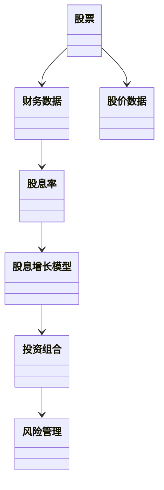
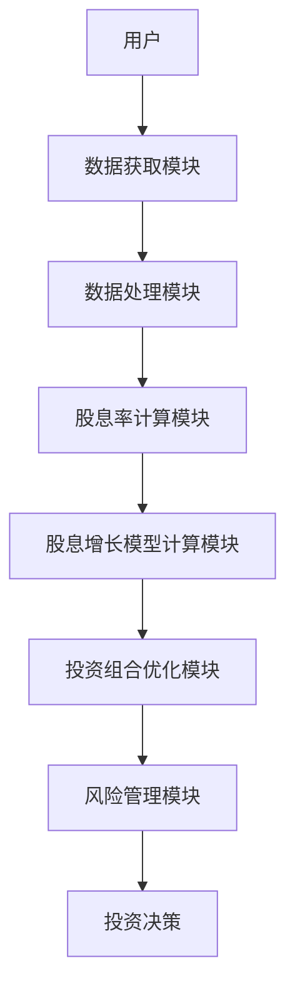
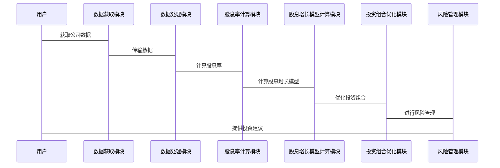

                 


```markdown
# 股息价值投资的系统分析与架构设计

## 第三章 股息价值投资的系统分析与架构设计

### 3.1 系统分析

#### 3.1.1 问题场景介绍
股息价值投资的目标是通过筛选高股息率和高股息增长潜力的公司，构建一个既能提供稳定股息收入又能实现资本增值的投资组合。然而，实际投资过程中存在以下问题：

- 数据获取复杂：需要从多个数据源获取公司财务数据、股价数据等。
- 计算复杂：需要计算股息率、股息增长模型等复杂指标。
- 投资组合优化困难：需要在收益与风险之间找到平衡点。

#### 3.1.2 系统功能需求分析
根据上述问题，系统需要实现以下功能：
- 数据获取模块：从多个数据源获取公司基本面数据和股价数据。
- 股息率计算模块：计算公司股息率。
- 股息增长潜力评估模块：评估公司股息增长潜力。
- 投资组合优化模块：根据风险偏好构建最优投资组合。
- 风险管理模块：识别和规避投资风险。

#### 3.1.3 系统边界与外延
- 数据范围：包括财务数据、股价数据、行业数据等。
- 时间范围：可以是实时数据，也可以是历史数据。
- 用户范围：面向个人投资者和机构投资者。

### 3.2 系统架构设计

#### 3.2.1 领域模型
以下是股息价值投资的领域模型：


#### 3.2.2 系统架构
以下是系统的整体架构：


### 3.3 系统接口设计

#### 3.3.1 数据接口
- 输入接口：接收来自多个数据源的公司数据。
- 输出接口：输出处理后的财务数据和股价数据。

#### 3.3.2 股息率计算接口
- 输入接口：接收公司财务数据和股价数据。
- 输出接口：输出股息率计算结果。

#### 3.3.3 股息增长模型计算接口
- 输入接口：接收股息率和相关参数。
- 输出接口：输出股息增长模型计算结果。

### 3.4 系统交互设计

#### 3.4.1 系统交互流程
以下是系统交互流程：


### 3.5 系统实现

#### 3.5.1 环境安装
为了实现股息价值投资系统，需要安装以下工具和库：
- Python编程语言
- 数据处理库：Pandas、NumPy
- 数据可视化库：Matplotlib、Seaborn
- 数据获取库：Yahoo Finance API、Alpha Vantage API
- 优化库：Scipy、PyPortfolioOpt

#### 3.5.2 核心实现代码
以下是系统的核心实现代码：

##### 数据获取模块
```python
import pandas as pd
import numpy as np
import requests
import json

# 示例：使用Yahoo Finance API获取数据
def get_data(ticker):
    url = f"https://query1.finance.yahoo.com/finance/quote/{ticker}/"
    response = requests.get(url)
    data = json.loads(response.text)
    return data
```

##### 股息率计算模块
```python
def calculate_dividend_yield(data, price):
    dividend = data[' dividends']
    dividend_yield = (dividend / price) * 100
    return dividend_yield
```

##### 股息增长模型计算模块
```python
def dividend_growth_model(dividends, growth_rate, discount_rate):
    value = dividends / (discount_rate - growth_rate)
    return value
```

##### 投资组合优化模块
```python
import pyportfolioopt as ppo

def optimize_portfolio(returns, weights):
    model = ppo.MeanVarianceOptimization(returns)
    optimized_weights = model.optimize(weights)
    return optimized_weights
```

##### 风险管理模块
```python
def manage_risk(portfolio_value, risk_tolerance):
    # 示例：动态调整投资组合
    adjusted_portfolio = portfolio_value * (1 - risk_tolerance)
    return adjusted_portfolio
```

### 3.6 案例分析

#### 3.6.1 投资组合构建
假设我们有以下几只股票：
- 苹果（AAPL）
- 微软（MSFT）
- 可口可乐（KO）
- 保洁（PG）

##### 数据获取与处理
```python
tickers = ['AAPL', 'MSFT', 'KO', 'PG']
data = {ticker: get_data(ticker) for ticker in tickers}
```

##### 计算股息率
```python
prices = [data[ticker]['price'] for ticker in tickers]
dividends = [data[ticker]['dividends'] for ticker in tickers]
dividend_yields = [dividends[i] / prices[i] * 100 for i in range(len(tickers))]
dividend_yields_dict = {tickers[i]: dividend_yields[i] for i in range(len(tickers))}
print(dividend_yields_dict)
```

##### 评估股息增长潜力
```python
# 假设股息增长率分别为：AAPL: 5%, MSFT: 4%, KO: 3%, PG: 2%
growth_rates = {'AAPL': 0.05, 'MSFT': 0.04, 'KO': 0.03, 'PG': 0.02}
# 使用股息增长模型计算内在价值
for ticker in tickers:
    dividend = data[ticker]['dividends']
    growth = growth_rates[ticker]
    discount_rate = 0.10
    value = dividend / (discount_rate - growth)
    print(f"{ticker}的内在价值：{value}")
```

##### 投资组合优化
```python
import pandas as pd
import numpy as np
import pyportfolioopt as ppo

returns = pd.DataFrame({
    'AAPL': [0.10, 0.12, 0.08, 0.15],
    'MSFT': [0.08, 0.10, 0.06, 0.12],
    'KO': [0.06, 0.07, 0.05, 0.09],
    'PG': [0.05, 0.06, 0.04, 0.08]
})

model = ppo.MeanVarianceOptimization(returns)
weights = model.optimize()
print("优化后的权重：", weights)
```

##### 风险管理
```python
portfolio_value = 1000000
risk_tolerance = 0.05
adjusted_portfolio = manage_risk(portfolio_value, risk_tolerance)
print(f"调整后的投资组合价值：{adjusted_portfolio}")
```

### 3.7 最佳实践 Tips

#### 3.7.1 小结
通过系统的股息价值投资方法，投资者可以在追求股息收入的同时，兼顾资本增值，实现收益与风险的平衡。

#### 3.7.2 注意事项
- 数据来源的可靠性：确保数据来源的准确性和及时性。
- 模型的适用性：根据实际情况调整模型参数。
- 风险管理的重要性：在市场波动中及时调整投资策略。

#### 3.7.3 拓展阅读
- 《The New Value Investing》
- 《Dividend Growth Stocks: How to Select and Evaluate Them》
- 《Python for Algorithmic Trading》

### 3.8 附录
#### 3.8.1 术语表
- 股息率：股息与股价的比率，衡量股票的分红能力。
- 股息增长模型：用于评估股票的内在价值，考虑股息增长率和贴现率。
- 投资组合优化：通过数学方法构建最优的投资组合，平衡风险与收益。

#### 3.8.2 数据来源
- Yahoo Finance API：提供实时股价和财务数据。
- Alpha Vantage API：提供历史股价和财务数据。
- 公司财报：提供详细的财务数据和股息信息。

#### 3.8.3 参考文献
- 约翰·劳伦斯·凯利：《投资中最简单的事》
- 乔尔·格林布拉特：《股息价值投资策略》
- 巴塞尔委员会：《风险管理原则》

### 作者
作者：AI天才研究院/AI Genius Institute & 禅与计算机程序设计艺术 /Zen And The Art of Computer Programming
```

