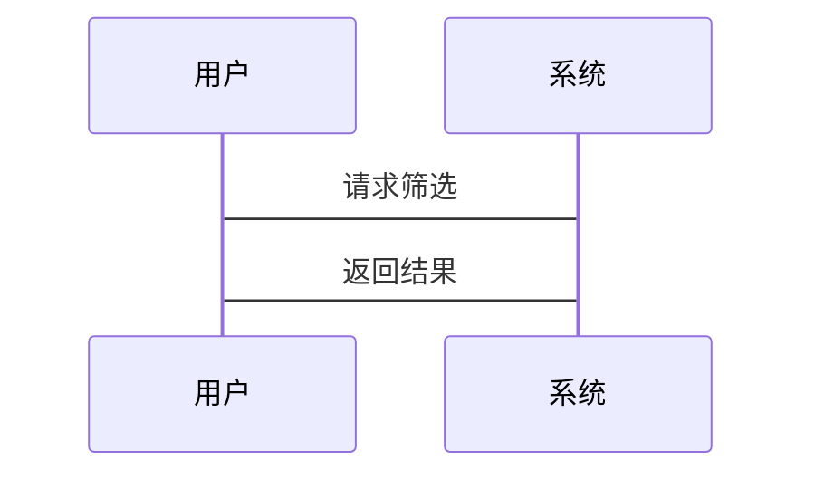

                 


# 乔尔·格林布拉特的魔术公式：简化版的价值投资策略

## 关键词
价值投资，魔术公式，乔尔·格林布拉特，投资策略，股票筛选，投资组合优化

## 摘要
本文深入分析了乔尔·格林布拉特的魔术公式，探讨其在价值投资中的应用。通过数学模型和系统架构的设计，解释了如何利用该公式筛选优质股票，并构建稳健的投资组合。文章结合实际案例，详细讲解了公式的核心原理、应用场景及系统实现，为投资者提供了实用的指导。

---

# 第一部分：价值投资与魔术公式背景

## 第1章：价值投资的起源与发展

### 1.1 价值投资的基本概念

#### 1.1.1 价值投资的定义
价值投资是一种投资策略，旨在通过寻找市场价格低于其内在价值的证券，实现长期稳定的收益。其核心在于分析企业的基本面，识别被低估的投资标的。

#### 1.1.2 价值投资的核心理念
价值投资强调安全边际和长期持有。投资者应关注企业的盈利能力、财务健康和行业地位，而非短期市场波动。

#### 1.1.3 价值投资与成长投资的区别
- **价值投资**：关注低估值，追求安全边际。
- **成长投资**：关注高增长，愿意支付溢价。

### 1.2 乔尔·格林布拉特的贡献

#### 1.2.1 乔尔·格林布拉特的背景
乔尔·格林布拉特是著名的价值投资者，著有《魔术公式》一书，提出了一套简洁有效的股票筛选方法。

#### 1.2.2 《魔术公式》的出版与影响
书中提出的魔术公式，帮助投资者快速筛选出具有高盈利能力和合理估值的股票，成为价值投资领域的经典。

#### 1.2.3 价值投资策略的演变
从格雷厄姆的传统方法到格林布拉特的公式，价值投资策略不断完善，更符合现代投资环境。

---

## 第2章：魔术公式的核心概念

### 2.1 魔术公式的定义

#### 2.1.1 公式的数学表达
魔术公式用于计算企业评分：
$$
\text{评分} = \frac{\text{ROE} \times \text{CROIC}}{\text{EV/EBITDA}}
$$

#### 2.1.2 公式的适用范围
适用于筛选具有高盈利能力、合理估值的企业。

#### 2.1.3 公式的局限性
- 可能忽略行业差异和市场周期因素。

### 2.2 核心指标的解读

#### 2.2.1 股权收益率（ROE）
$$
\text{ROE} = \frac{\text{净利润}}{\text{股东权益}}
$$
衡量企业使用股东资金的效率。

#### 2.2.2 股权资本回报率（CROIC）
$$
\text{CROIC} = \frac{\text{息税折旧及摊销前利润}}{\text{股东权益 + 净债务}}
$$
衡量企业整体资本回报率。

#### 2.2.3 企业价值与息税折旧及摊销前利润（EV/EBITDA）
$$
\text{EV/EBITDA} = \frac{\text{企业价值}}{\text{EBITDA}}
$$
衡量企业估值是否合理。

### 2.3 魔术公式的评分系统

#### 2.3.1 评分系统的原理
通过综合ROE、CROIC和EV/EBITDA，评分越高，投资价值越大。

#### 2.3.2 评分系统的应用
筛选评分高于8分的企业，作为潜在投资标的。

#### 2.3.3 评分系统的优缺点
- **优点**：简单高效，易于操作。
- **缺点**：忽视市场情绪和行业风险。

---

# 第二部分：魔术公式的核心原理

## 第3章：魔术公式的数学模型

### 3.1 魔术公式的数学推导

#### 3.1.1 公式的变量定义
- **ROE**：股权收益率。
- **CROIC**：股权资本回报率。
- **EV/EBITDA**：企业价值与息税折旧及摊销前利润之比。

#### 3.1.2 公式的计算步骤
1. 计算ROE和CROIC，取其乘积。
2. 除以EV/EBITDA，得到评分。

#### 3.1.3 公式的验证过程
通过历史数据验证，筛选出表现优异的股票。

### 3.2 核心指标的权重分配

#### 3.2.1 指标的权重确定
- ROE和CROIC各占40%，EV/EBITDA占20%。

#### 3.2.2 权重分配的合理性
平衡盈利能力、资本回报和估值因素。

#### 3.2.3 权重调整的可能性
根据市场变化，可适当调整权重。

## 第4章：魔术公式的投资策略

### 4.1 投资策略的制定

#### 4.1.1 筛选股票的标准
- 评分高于8分，且ROE和CROIC均高于行业平均水平。

#### 4.1.2 构建投资组合
- 分散投资，降低风险。
- 定期再平衡，保持配置合理。

#### 4.1.3 动态调整策略
根据市场变化和企业基本面，及时调整投资组合。

---

# 第三部分：系统架构与项目实战

## 第5章：系统架构设计

### 5.1 项目介绍

#### 5.1.1 项目目标
开发一个基于魔术公式的股票筛选系统，帮助投资者快速找到优质标的。

### 5.2 系统功能设计

#### 5.2.1 领域模型（Mermaid类图）


### 5.3 系统架构设计（Mermaid架构图）

```mermaid
context 股票筛选系统 {
    participant 用户
    participant 数据源
    participant 筛选模块
    participant 投资组合模块
    participant 报告模块

    用户 --> 数据源: 获取股票数据
    数据源 --> 筛选模块: 传输数据
    筛选模块 --> 投资组合模块: 生成组合
    投资组合模块 --> 报告模块: 生成报告
    用户 <-- 报告模块: 显示报告
}
```

### 5.4 系统接口设计

#### 5.4.1 数据接口
- 输入：股票代码、财务数据。
- 输出：筛选结果。

#### 5.4.2 筛选接口
- 输入：筛选条件。
- 输出：符合条件的股票列表。

### 5.5 系统交互设计（Mermaid序列图）



---

## 第6章：项目实战

### 6.1 环境安装

```bash
pip install pandas numpy
```

### 6.2 核心实现（Python代码）

```python
import pandas as pd

def calculate_roe(net_profit, equity):
    return net_profit / equity

def calculate_croic(ebitda, equity, debt):
    return ebitda / (equity + debt)

def calculate_ev_ebitda(ev, ebitda):
    return ev / ebitda

def magic_formula_score(roa, croic, ev_ebitda):
    return (roa * croic) / ev_ebitda

# 示例数据
data = {
    '股票代码': ['A', 'B', 'C'],
    '净利润': [100, 150, 90],
    '股东权益': [500, 600, 450],
    '债务': [200, 100, 150],
    'EV': [1000, 1200, 900],
    'EBITDA': [200, 250, 180]
}

df = pd.DataFrame(data)

# 计算ROE、CROIC、EV/EBITDA
df['ROE'] = df.apply(lambda x: calculate_roe(x['净利润'], x['股东权益']), axis=1)
df['CROIC'] = df.apply(lambda x: calculate_croic(x['EBITDA'], x['股东权益'], x['债务']), axis=1)
df['EV/EBITDA'] = df.apply(lambda x: calculate_ev_ebitda(x['EV'], x['EBITDA']), axis=1)
df['魔术评分'] = df.apply(lambda x: magic_formula_score(x['ROE'], x['CROIC'], x['EV/EBITDA']), axis=1)

print(df)
```

### 6.3 案例分析

#### 6.3.1 数据来源与处理
使用公开财务数据，清洗并计算各项指标。

#### 6.3.2 筛选结果
筛选出评分高于8分的股票，分析其行业地位和财务状况。

### 6.4 实践总结
- 确保数据准确。
- 定期更新模型。

---

## 第7章：最佳实践与注意事项

### 7.1 最佳实践

#### 7.1.1 数据更新频率
定期更新财务数据，保持模型准确性。

#### 7.1.2 模型调整
根据市场变化，适时调整权重和筛选条件。

### 7.2 小结

### 7.3 注意事项

#### 7.3.1 市场风险
魔术公式无法完全规避市场波动风险。

#### 7.3.2 企业特异性
不同行业和企业需考虑特有风险。

#### 7.3.3 数据质量问题
确保数据来源可靠，避免错误分析。

### 7.4 拓展阅读

#### 7.4.1 进一步学习
- 格林布拉特的《魔术公式》。
- 价值投资经典书籍。

---

# 结语

乔尔·格林布拉特的魔术公式为价值投资提供了简单有效的工具，帮助投资者在复杂市场中找到优质标的。通过系统化的筛选和分析，投资者可以构建稳健的投资组合，实现长期收益。结合技术手段，投资者可以更高效地应用这一策略，提升投资效果。

---

# 作者

作者：AI天才研究院/AI Genius Institute & 禅与计算机程序设计艺术 /Zen And The Art of Computer Programming

