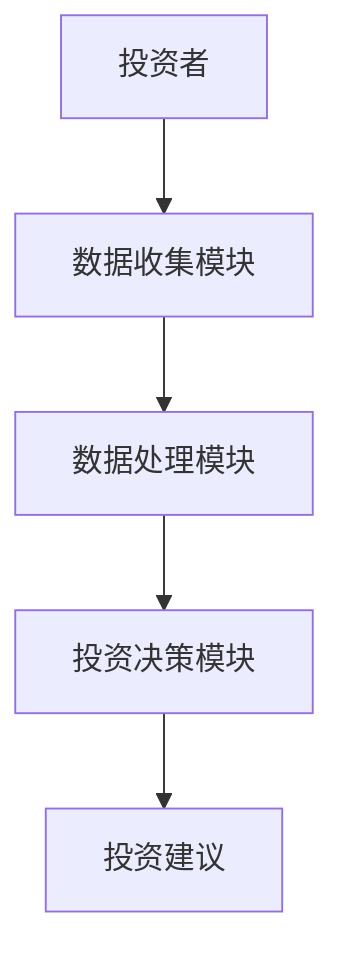

                 


# 乔尔·格林布拉特的魔法公式投资策略

---

## 关键词：魔法公式，投资策略，基本面分析，股票筛选，投资回报

---

## 摘要：  
乔尔·格林布拉特的魔法公式投资策略是一种基于基本面分析的投资方法，旨在通过量化企业价值和竞争优势来筛选出具有长期增长潜力的优质股票。本文将深入剖析魔法公式的核心思想，探讨其数学模型、系统架构以及实际应用中的关键点，同时结合案例分析和实证研究，为投资者提供一套科学的投资策略框架。

---

# 第一部分: 魔法公式投资策略的背景与基础

## 第1章: 投资的基本概念

### 1.1 投资的基本原理

#### 1.1.1 投资的定义与分类  
投资是指将资金投入到某个项目或资产中，以期获得未来的收益或资本增值。根据投资对象的不同，可以分为股票、债券、房地产等多种形式。股票投资是最常见的形式之一，其核心在于通过分析企业的基本面和市场趋势，找到具有长期增长潜力的公司。

#### 1.1.2 资产定价的基本原理  
资产定价是投资的核心问题之一。股票的价格反映了市场对该公司未来现金流的预期。根据现代投资组合理论（MPT）和资本资产定价模型（CAPM），股票的预期回报与市场风险相关，而魔法公式则提供了一种不同的视角，通过基本面指标来评估企业的内在价值。

#### 1.1.3 投资者心理与行为  
投资者的行为往往受到心理因素的影响，如贪婪和恐惧。魔法公式通过量化分析，试图减少情绪干扰，帮助投资者做出更理性的决策。

---

## 第2章: 魔法公式的起源与发展

### 2.1 乔尔·格林布拉特的背景介绍

#### 2.1.1 乔尔·格林布拉特的生平  
乔尔·格林布拉特（Joel Greenblatt）是一位著名的价值投资者，他的投资理念结合了基本面分析和数学模型，提出了魔法公式。

#### 2.1.2 魔法公式的提出与实践  
魔法公式最早出现在格林布拉特的著作《股市漫步》（*The Biggest Mistakes Investors Make and How to Avoid Them*）中。他通过分析数千家公司的财务数据，发现可以通过两个简单的指标——营业收益和投资资本回报率（ROIC）来评估企业的价值。

---

## 第3章: 魔法公式与传统投资方法的对比

### 3.1 传统投资方法概述

#### 3.1.1 基本分析与技术分析  
基本分析关注企业的财务状况和行业地位，而技术分析则通过价格和成交量的走势来预测市场走势。两者各有优缺点，但传统方法往往难以量化。

#### 3.1.2 市场有效性的讨论  
有效市场假说认为股票价格反映了所有公开信息，因此很难通过分析找到被低估的股票。然而，格林布拉特认为市场并非完全有效，尤其是当企业处于困境或被市场忽视时，魔法公式可以找到被低估的投资标的。

### 3.2 魔法公式的独特性

#### 3.2.1 魔法公式的核心思想  
魔法公式通过量化企业的盈利能力（营业收益）和资本回报率（ROIC），筛选出具有高回报和低估值的公司。

#### 3.2.2 魔法公式与价值投资的异同  
价值投资强调寻找被市场低估的公司，而魔法公式则通过量化指标进一步优化了这一过程。

---

# 第二部分: 魔法公式投资策略的核心分析

## 第4章: 魔法公式的数学模型与算法原理

### 4.1 魔法公式的核心公式

#### 4.1.1 魔法公式的公式结构  
魔法公式可以表示为：

$$ \text{Magic Formula} = \frac{\text{营业收益}}{\text{ invested capital}} \times \frac{\text{ROIC}}{\text{资本成本}} $$  

其中，营业收益（Earnings）是指企业在一定时期内的净利润，投资资本（Invested Capital）是指企业用于经营的资本，ROIC（Return on Invested Capital）是投资资本回报率。

#### 4.1.2 公式的数学推导与验证  
通过统计学方法，格林布拉特发现，营业收益和ROIC的结合能够有效预测企业的未来表现。

### 4.2 公式中的关键因素

#### 4.2.1 营业收益（Earnings）  
营业收益反映了企业的盈利能力。高营业收益意味着企业能够在竞争中获得更多的利润。

#### 4.2.2 投资资本（Invested Capital）  
投资资本是企业经营所需的资金，包括股东权益和债务资本。

#### 4.2.3 投资资本回报率（ROIC）  
ROIC是衡量企业使用资本效率的重要指标，高ROIC意味着企业能够用较少的资本创造更多的利润。

---

## 第5章: 魔法公式中的关键因素分析

### 5.1 营业收益与投资资本的关系

#### 5.1.1 营业收益的计算方法  
营业收益 = 净利润 = 收入 - 成本 - 费用

#### 5.1.2 投资资本的计算方法  
投资资本 = 股东权益 + 短期债务 + 长期债务

### 5.2 投资资本回报率（ROIC）的影响

#### 5.2.1 ROIC的计算与意义  
ROIC = 净利润 / 投资资本

高ROIC意味着企业能够高效地利用资本创造利润。

---

## 第6章: 魔法公式中的系统架构与算法实现

### 6.1 系统架构设计

#### 6.1.1 系统功能模块划分  
- 数据收集模块：获取企业的财务数据。
- 数据处理模块：计算营业收益、投资资本和ROIC。
- 投资决策模块：根据公式筛选出符合条件的股票。

#### 6.1.2 系统数据流图  


### 6.2 算法实现与代码分析

#### 6.2.1 魔法公式计算的Python代码实现  
```python
def magic_formula(earnings, invested_capital, roic, capital_cost):
    return (earnings / invested_capital) * (roic / capital_cost)
```

---

# 第三部分: 魔法公式投资策略的实际应用

## 第7章: 投资策略的具体应用

### 7.1 筛选标准与定性分析

#### 7.1.1 筛选标准  
根据魔法公式，筛选出营业收益/投资资本和ROIC/资本成本均高于行业平均水平的公司。

#### 7.1.2 定性分析  
分析企业的竞争优势、行业地位和管理团队。

### 7.2 投资组合的构建

#### 7.2.1 投资组合的构建策略  
将筛选出的股票按权重分配，构建一个分散化的投资组合。

#### 7.2.2 定期再平衡  
每隔一定时间（如每年），重新评估投资组合并进行调整。

### 7.3 风险管理

#### 7.3.1 风险管理策略  
设定止损点，分散投资，避免过度集中。

#### 7.3.2 心理纪律  
避免情绪化交易，坚持长期投资。

---

## 第8章: 案例分析与实证研究

### 8.1 成功案例分析

#### 8.1.1 零售业案例  
分析某家零售企业的财务数据，计算其魔法公式得分，判断其是否具有投资价值。

### 8.2 失败案例分析

#### 8.2.1 制造业案例  
分析某家制造业企业的财务数据，发现其ROIC较低，建议避免投资。

---

## 第9章: 魔法公式投资策略的总结与展望

### 9.1 总结

魔法公式通过量化分析，帮助投资者筛选出具有长期增长潜力的优质股票。其核心在于结合企业的盈利能力、资本回报率和估值水平，找到被低估的投资标的。

### 9.2 展望

随着大数据和人工智能技术的发展，魔法公式可以进一步优化，结合更多的财务指标和市场数据，提高投资决策的准确性。

---

## 作者：AI天才研究院 & 禅与计算机程序设计艺术

---

希望这篇文章能够为投资者提供深入的分析和实用的指导，帮助他们在复杂的金融市场中找到成功的投资策略。

