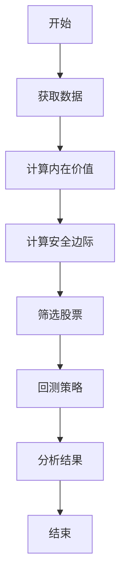

                 


# 《乔尔·格林布拉特的价值投资回测》

---

## 关键词：价值投资、回测、乔尔·格林布拉特、内在价值、安全边际

---

## 摘要：

本文深入探讨了乔尔·格林布拉特的价值投资策略及其回测方法，从理论基础到实践应用，系统地分析了价值投资的核心概念、数学模型和回测系统的构建。通过详细讲解内在价值、安全边际等关键指标，结合实际案例和Python代码实现，帮助读者全面理解并应用价值投资回测策略。本文适合投资领域的专业人士和对算法投资感兴趣的技术人员阅读。

---

# 第一部分：价值投资回测的背景与基础

## 第1章：价值投资与回测概述

### 1.1 价值投资的基本概念

- **1.1.1 价值投资的定义**  
  价值投资是一种以低于内在价值的价格购买优质股票的投资策略，强调长期持有和安全边际的重要性。

- **1.1.2 价值投资的核心理念**  
  突出市场的非理性波动，寻找被市场低估的股票，注重公司的基本面分析。

- **1.1.3 价值投资与其它策略的对比**  
  对比成长股投资和股息率高的股票投资，分析其优缺点。

### 1.2 乔尔·格林布拉特的贡献

- **1.2.1 乔尔·格林布拉特的背景**  
  简介其作为投资专家和畅销书作者的经历。

- **1.2.2 核心投资理念**  
  强调安全边际和内在价值的计算，提出“三步投资法”。

- **1.2.3 研究成果**  
  介绍其著作《The New York Portfolio Ideas》中的策略。

### 1.3 回测的意义与方法

- **1.3.1 回测的定义与作用**  
  通过历史数据验证策略的有效性，评估其在不同市场条件下的表现。

- **1.3.2 回测的步骤与流程**  
  数据获取、策略定义、回测执行、结果分析。

- **1.3.3 回测的优缺点分析**  
  如结果可能受数据区间和假设影响，但能提供量化支持。

### 1.4 价值投资回测的核心要素

- **1.4.1 股票筛选标准**  
  低市盈率、低市净率、高股息率等指标。

- **1.4.2 财务指标的重要性**  
  如ROE、ROA等财务比率分析。

- **1.4.3 市场情绪与回测的关系**  
  市场情绪波动对策略表现的影响。

---

## 第2章：价值投资的核心概念

### 2.1 安全边际

- **2.1.1 安全边际的定义**  
  股票的内在价值与市场价格之间的差距，提供缓冲以应对市场波动。

- **2.1.2 安全边际的计算方法**  
  基于内在价值的一定比例，通常为30%-50%。

- **2.1.3 安全边际的作用**  
  减少因市场波动带来的损失，提高投资的安全性。

### 2.2 内在价值

- **2.2.1 内在价值的定义**  
  股票基于其基本面应具有的合理价格，独立于市场波动。

- **2.2.2 内在价值的计算公式**  
  使用现金流折现模型（DDM）计算，公式为：  
  $$ V = \frac{C}{r - g} $$  
  其中，C为现金流，r为折现率，g为增长率。

- **2.2.3 内在价值与市场价格的关系**  
  当市场价格低于内在价值时，股票具有投资价值。

### 2.3 市场先生

- **2.3.1 市场先生的定义**  
  比喻市场的非理性波动，投资者应理性应对。

- **2.3.2 市场先生的行为特征**  
  价格波动无常，但长期趋向于反映内在价值。

- **2.3.3 市场先生与投资决策的关系**  
  投资者应利用市场波动，寻找低估机会。

### 2.4 股票筛选标准

- **2.4.1 低市盈率策略**  
  市盈率低于行业平均水平，通常在10倍以下。

- **2.4.2 低市净率策略**  
  市净率低于行业平均水平，通常在2倍以下。

- **2.4.3 高股息率策略**  
  股息率高于行业平均水平，通常在3%以上。

### 2.5 核心概念对比表

| 指标         | 低市盈率策略 | 低市净率策略 | 高股息率策略 |
|--------------|--------------|--------------|--------------|
| 适用场景     | 成长潜力大   | 资产负债低   | 现金流稳定   |
| 计算公式     | PE < 市场值   | PB < 市场值   | Dividend Yield > 市场值 |
| 优缺点       | 风险低，收益稳定 | 资产质量高 | 收入稳定，防御性强 |

### 2.6 本章小结

---

## 第3章：价值投资的数学模型与算法

### 3.1 内在价值计算模型

- **3.1.1 现金流折现模型（DDM）**  
  计算公式：  
  $$ V = \frac{D}{r - g} $$  
  其中，D为股息，r为折现率，g为股息增长率。

- **3.1.2 股权自由现金流模型**  
  计算公式：  
  $$ V = \frac{FCF}{r - g} $$  
  FCF为自由现金流。

- **3.1.3 内在价值计算步骤**  
  1. 收集公司财务数据；2. 估计未来现金流；3. 确定合适的折现率；4. 计算内在价值。

### 3.2 安全边际计算公式

- **3.2.1 安全边际计算公式**  
  $$ \text{安全边际} = \text{内在价值} \times (1 - \text{安全边际比例}) $$  
  安全边际比例通常为30%-50%。

- **3.2.2 安全边际与股票价格的关系**  
  当市场价格低于安全边际时，股票具有投资价值。

- **3.2.3 安全边际的调整与优化**  
  根据市场变化和公司基本面调整计算参数。

### 3.3 回测算法实现

- **3.3.1 回测的基本流程**  
  1. 数据获取；2. 策略定义；3. 策略回测；4. 结果分析。

- **3.3.2 回测的Python实现**  
  ```python
  import pandas as pd
  import numpy as np

  def calculate_intrinsic_value(fcf, discount_rate, growth_rate):
      return fcf / (discount_rate - growth_rate)

  data = pd.read_csv('stock_data.csv')
  data['intrinsic_value'] = data.apply(lambda x: calculate_intrinsic_value(x['FCF'], 0.1, 0.05), axis=1)
  data['margin_of_safety'] = data['intrinsic_value'] * 0.7
  ```

- **3.3.3 回测结果的分析与优化**  
  通过统计指标如夏普比率、最大回撤等评估策略表现。

### 3.4 算法流程图



### 3.5 本章小结

---

## 第4章：价值投资回测系统设计

### 4.1 系统架构设计

- **4.1.1 系统模块划分**  
  数据获取模块、数据预处理模块、策略回测模块、结果分析模块。

- **4.1.2 系统功能设计**  
  1. 数据获取与清洗；2. 策略定义与筛选；3. 回测执行；4. 结果可视化。

- **4.1.3 系统架构图**  
  ```mermaid
  classDiagram
      class 数据获取模块 {
          获取历史数据
          数据清洗
      }
      class 数据预处理模块 {
          计算财务指标
          筛选股票
      }
      class 策略回测模块 {
          执行回测
          计算收益
      }
      class 结果分析模块 {
          生成报告
          可视化结果
      }
      数据获取模块 --> 数据预处理模块
      数据预处理模块 --> 策略回测模块
      策略回测模块 --> 结果分析模块
  ```

### 4.2 项目实战

- **4.2.1 环境安装**  
  安装Python、Pandas、Matplotlib等库。

- **4.2.2 核心实现代码**  
  ```python
  import pandas as pd
  import matplotlib.pyplot as plt

  def get_data(tickers, start_date, end_date):
      data = pd.DataFrame()
      for ticker in tickers:
          data[ticker] = pd.read_csv(f'{ticker}.csv')['Close']
      return data

  def calculate_signals(data, low_pe=10, low_pb=2, high_dividend=0.03):
      signals = []
      for ticker in data.columns:
          pe = data[ticker].iloc[-1] / data[ticker].iloc[-1]. earnings
          pb = data[ticker].iloc[-1].book_value / data[ticker].iloc[-1].price
          dividend_yield = data[ticker].iloc[-1].dividend / data[ticker].iloc[-1].price
          if pe < low_pe and pb < low_pb and dividend_yield > high_dividend:
              signals.append(ticker)
      return signals

  data = get_data(['AAPL', 'MSFT', 'GOOGL'], '2020-01-01', '2023-12-31')
  signals = calculate_signals(data)
  ```

- **4.2.3 实际案例分析**  
  以苹果、微软为例，展示筛选过程和回测结果。

### 4.3 本章小结

---

## 第5章：总结与展望

### 5.1 价值投资回测的优缺点

- **优点**：  
  系统化、可量化，降低人为情绪干扰。

- **缺点**：  
  过度依赖历史数据，忽视市场变化。

### 5.2 实际应用中的注意事项

- 数据质量：确保数据准确性和完整性。  
- 回测时间窗口：选择合适的回测区间，避免数据偏差。  
- 策略调整：根据市场变化定期优化策略。

### 5.3 未来展望

- **算法优化**：引入机器学习提升筛选准确性。  
- **多因子模型**：结合多个价值因子进行综合评估。  
- **动态调整**：根据市场变化动态调整策略参数。

### 5.4 最佳实践 tips

- **数据来源**：选择可靠的金融数据供应商。  
- **回测频率**：根据策略类型选择合适的回测频率。  
- **风险管理**：设置止损点和止盈点，控制投资风险。

### 5.5 小结

---

## 作者：AI天才研究院 & 禅与计算机程序设计艺术

---

通过以上目录，您可以系统地了解乔尔·格林布拉特的价值投资策略，并学习如何进行有效的回测分析。

