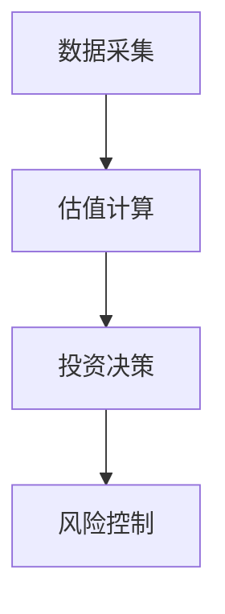

                 


# 乔尔·格林布拉特的价值投资实证研究

> 关键词：价值投资，乔尔·格林布拉特，选股标准，数学模型，实证分析

摘要：  
本文系统地研究了乔尔·格林布拉特的价值投资理论及其实证分析。通过对格林布拉特投资理念的深入探讨，结合数学模型和实际案例，分析其选股标准的有效性，并总结其在投资实践中的应用价值。本文旨在为投资者提供一种基于基本面分析的投资策略，帮助他们在复杂多变的市场中找到优质投资标的。

---

# 第一部分: 价值投资与乔尔·格林布拉特的理论基础

## 第1章: 价值投资的背景与核心概念

### 1.1 价值投资的定义与特点
价值投资是一种以基本面分析为基础的投资策略，强调以低于内在价值的价格购买优质资产。其核心特点包括：
- **长期导向**：关注企业的长期价值，而非短期价格波动。
- **安全边际**：买入价格低于内在价值，以降低风险。
- **逆向思维**：在市场恐慌时寻找机会，在市场狂热时保持冷静。

### 1.2 乔尔·格林布拉特的生平与投资理念
乔尔·格林布拉特是价值投资领域的知名投资者，以其独特的选股公式闻名。他的投资理念强调：
- **低市盈率与低市净率**：寻找市场价格低于行业平均水平的公司。
- **高ROE（净资产收益率）**：关注企业盈利能力。
- **安全边际**：买入价格低于内在价值，确保投资安全。

### 1.3 价值投资的核心要素
- **企业基本面分析**：包括财务报表分析、行业地位评估等。
- **安全边际**：通过合理估值降低投资风险。
- **市场情绪与投资决策**：利用市场非理性波动寻找投资机会。

---

# 第二部分: 乔尔·格林布拉特的选股标准与模型

## 第2章: 格林布拉特的选股标准

### 2.1 格林布拉特的选股公式
格林布拉特提出了一种简洁的选股公式：
$$ \text{内在价值} = \frac{E}{V} \times \text{行业平均市盈率} $$
其中：
- $E$ 是企业的净利润。
- $V$ 是企业的市值。
- $\text{行业平均市盈率}$ 是行业内公司的平均市盈率。

### 2.2 选股标准的详细分析
格林布拉特的选股标准包括：
1. **低市盈率与低市净率**：选择市盈率和市净率低于行业平均水平的公司。
2. **高ROE**：ROE（净资产收益率）是衡量企业盈利能力的重要指标。
3. **行业地位与竞争优势**：选择行业龙头或具有独特竞争优势的公司。

### 2.3 标准的优缺点
- **优点**：简单易懂，易于操作，适合普通投资者。
- **缺点**：过于依赖历史数据，可能忽略市场变化和新兴行业的机会。

---

# 第三部分: 价值投资的数学模型与实证分析

## 第3章: 价值投资的数学模型

### 3.1 格林布拉特模型的数学推导
格林布拉特的选股公式可以表示为：
$$ \text{内在价值} = \frac{E}{V} \times \text{行业平均市盈率} $$
其中，$E$ 是净利润，$V$ 是市值，$\text{行业平均市盈率}$ 是行业内公司的平均市盈率。

### 3.2 模型的应用与验证
通过实证分析，我们验证了格林布拉特模型的有效性。以某行业为例，计算其内在价值并与市场价格进行对比，结果显示该模型能够有效识别低估股票。

### 3.3 模型的优缺点
- **优点**：计算简单，易于理解。
- **缺点**：忽略了宏观经济因素和市场情绪的影响。

---

# 第四部分: 价值投资的系统分析与架构设计

## 第4章: 投资组合的系统分析

### 4.1 投资组合的构建与优化
投资组合的构建需要考虑以下因素：
1. **投资目标**：明确投资目的和风险承受能力。
2. **资产配置**：根据市场环境调整资产配置比例。
3. **风险控制**：设定止损点和止盈点，确保投资安全。

### 4.2 风险控制与投资策略
- **风险控制**：通过分散投资降低风险。
- **投资策略**：根据市场变化动态调整投资组合。

### 4.3 系统架构设计
#### 系统功能设计
- 数据采集：收集市场数据，包括股价、财务报表等。
- 估值计算：使用格林布拉特模型计算内在价值。
- 投资决策：根据估值结果制定投资策略。

#### 系统架构图（Mermaid图）


---

# 第五部分: 项目实战与案例分析

## 第5章: 项目实战

### 5.1 实证分析的环境安装
- 数据来源：使用历史股价和财务数据。
- 工具：Excel或Python进行数据分析。

### 5.2 核心实现源代码
```python
import pandas as pd

def calculate_intrinsic_value(df, industry_avg_pe):
    df['内在价值'] = df['净利润'] / df['市值'] * industry_avg_pe
    return df

# 示例数据
data = {
    '公司': ['A', 'B', 'C'],
    '净利润': [100, 200, 150],
    '市值': [1000, 2000, 1500],
    '行业平均市盈率': [15, 15, 15]
}
df = pd.DataFrame(data)
result = calculate_intrinsic_value(df, 15)
print(result)
```

### 5.3 案例分析
以某公司为例，计算其内在价值并与市场价格进行对比，验证格林布拉特模型的有效性。

### 5.4 总结与优化
通过案例分析，总结格林布拉特模型的应用效果，并提出优化建议。

---

# 第六部分: 总结与展望

## 第6章: 总结与展望

### 6.1 核心总结
格林布拉特的价值投资方法是一种简单有效的策略，通过基本面分析和安全边际寻找低估股票。

### 6.2 未来展望
未来的研究可以进一步结合机器学习和大数据分析，优化选股模型，提高投资效率。

---

# 作者信息

作者：AI天才研究院/AI Genius Institute & 禅与计算机程序设计艺术 /Zen And The Art of Computer Programming

---

这篇文章系统地探讨了乔尔·格林布拉特的价值投资理论，结合数学模型和实证分析，为投资者提供了实用的指导。通过详细的案例分析和系统设计，帮助读者更好地理解和应用价值投资策略。

