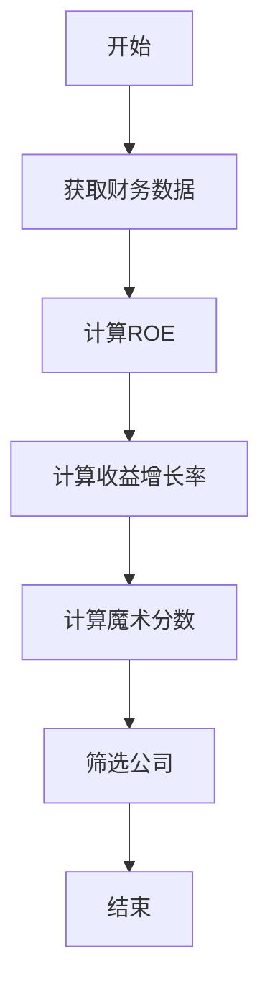
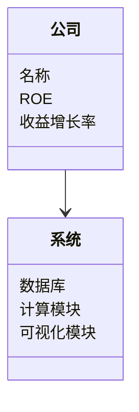

                 


# 乔尔格林布拉特的魔术公式

## 关键词：
- 乔尔·格林布拉特
- 魔术公式
- 投资分析
- 价值投资
- 成长投资
- 金融算法
- Python实现

## 摘要：
本文深入分析了乔尔·格林布拉特提出的魔术公式，探讨其在投资分析中的应用及其背后的数学原理。通过逐步推理，我们解释了如何将金融理论与计算机算法相结合，实现对股票的投资价值评估。文章从背景介绍、公式原理、算法实现、系统架构到项目实战，全面阐述了魔术公式的应用过程，最后总结了最佳实践和未来发展方向。

---

## 第一部分: 乔尔格林布拉特魔术公式的背景与核心概念

### # 第1章: 投资学与魔术公式概述

#### 1.1 投资学的基本概念
##### 1.1.1 什么是投资
投资是将资源（如资金）投入到某个项目或资产中，以期在未来获得收益的行为。投资的核心目标是通过价值发现和风险控制，实现资产的保值与增值。

##### 1.1.2 投资的基本原则
- **价值投资**：寻找市场价格低于其内在价值的资产。
- **成长投资**：投资于具有持续增长潜力的公司。
- **分散投资**：通过多样化投资降低风险。

##### 1.1.3 价值投资与成长投资的结合
价值投资关注低估值资产，而成长投资关注高增长潜力的公司。两者的结合能够平衡风险与收益，找到具有长期增长潜力的优质资产。

#### 1.2 魔术公式的起源与意义
##### 1.2.1 乔尔·格林布拉特的背景介绍
乔尔·格林布拉特是一位成功的投资专家，他提出的魔术公式结合了价值投资和成长投资的理念，旨在找到被市场低估的优质成长股。

##### 1.2.2 魔术公式的提出动机
传统价值投资关注低市盈率或低市净率的公司，而成长投资关注高收益增长的公司。魔术公式旨在找到两者之间的平衡点，综合考虑市盈率和收益增长。

##### 1.2.3 魔术公式在投资领域的影响
魔术公式为投资者提供了一种量化的方法，帮助他们快速筛选出具有投资价值的公司。它结合了基本面分析和量化分析的优势。

#### 1.3 魔术公式的数学基础
##### 1.3.1 魔术公式的公式结构
魔术公式的核心是通过计算公司的内在价值，判断其市场价格是否被低估。

##### 1.3.2 魔术公式的输入变量
- 每股收益（ROE）
- 净利润增长率
- 市盈率（P/E）
- 市净率（P/B）

##### 1.3.3 魔术公式的输出结果
- 魔术分数：用于衡量公司的投资价值。

---

## 第二部分: 魔术公式的原理与数学模型

### # 第2章: 魔术公式的原理与数学模型

#### 2.1 魔术公式的原理分析
##### 2.1.1 魔术公式的三要素
- 低市盈率
- 高收益增长率
- 高ROE

##### 2.1.2 魔术公式的计算步骤
1. 计算公司的ROE（净资产收益率）。
2. 计算公司的收益增长率。
3. 计算魔术分数：$$ \text{魔术分数} = \frac{\text{ROE} + \text{收益增长率}}{2} $$

##### 2.1.3 魔术公式的优缺点
- 优点：简单易用，能够快速筛选出具有投资价值的公司。
- 缺点：忽略了公司的行业地位和竞争优势。

#### 2.2 魔术公式的数学模型
##### 2.2.1 魔术公式的数学表达式
$$
\text{魔术分数} = \frac{\text{ROE} + \text{收益增长率}}{2}
$$

##### 2.2.2 魔术公式的变量定义
- ROE：净资产收益率，$$ \text{ROE} = \frac{\text{净利润}}{\text{净资产}} $$
- 收益增长率：$$ \text{收益增长率} = \frac{\text{净利润增长率}}{\text{净利润}} $$

##### 2.2.3 魔术公式的计算流程
1. 收集目标公司的财务数据。
2. 计算ROE和收益增长率。
3. 应用魔术公式计算魔术分数。
4. 根据魔术分数筛选出具有投资价值的公司。

#### 2.3 魔术公式的对比分析
##### 2.3.1 魔术公式与传统价值投资的对比
- 价值投资更关注市盈率和市净率，而魔术公式更关注ROE和收益增长率。

##### 2.3.2 魔术公式与成长投资的对比
- 成长投资更关注收益增长率，而魔术公式更关注ROE和收益增长率的结合。

##### 2.3.3 魔术公式与其他投资模型的对比
- 魔术公式结合了价值和成长投资的特点，具有较高的综合性和实用性。

---

## 第三部分: 魔术公式的算法实现

### # 第3章: 魔术公式的算法实现

#### 3.1 魔术公式的算法原理
##### 3.1.1 算法的输入与输出
- 输入：公司的财务数据（ROE、收益增长率）。
- 输出：魔术分数。

##### 3.1.2 算法的计算流程
1. 获取目标公司的ROE和收益增长率。
2. 应用魔术公式计算魔术分数。
3. 根据魔术分数筛选出具有投资价值的公司。

#### 3.2 魔术公式的Python实现
##### 3.2.1 环境搭建
- 安装Python和相关库（pandas、numpy）。

##### 3.2.2 核心代码实现
```python
import pandas as pd
import numpy as np

def calculate_magic_score(roe, revenue_growth):
    return (roe + revenue_growth) / 2

# 示例数据
data = {
    '公司': ['A', 'B', 'C', 'D'],
    'ROE': [0.2, 0.3, 0.1, 0.4],
    '收益增长率': [0.1, 0.2, 0.3, 0.05]
}

df = pd.DataFrame(data)

# 计算魔术分数
df['魔术分数'] = df.apply(lambda x: calculate_magic_score(x['ROE'], x['收益增长率']), axis=1)

print(df)
```

##### 3.2.3 代码解读
- 使用Pandas库处理数据。
- 计算每个公司的魔术分数。
- 展示结果。

#### 3.3 魔术公式的流程图


---

## 第四部分: 系统分析与架构设计

### # 第4章: 系统分析与架构设计

#### 4.1 系统功能设计
##### 4.1.1 功能模块
- 数据采集模块：获取公司财务数据。
- 计算模块：计算ROE和收益增长率。
- 筛选模块：根据魔术公式筛选公司。
- 可视化模块：展示结果。

##### 4.1.2 领域模型


#### 4.2 系统架构设计
##### 4.2.1 架构图
```mermaid
container 服务器端 {
    数据库
    计算模块
}
container 客户端 {
    可视化模块
}
服务器端 --> 客户端
```

#### 4.3 接口设计
##### 4.3.1 API接口
- GET /companies：获取公司列表。
- POST /magic-score：计算魔术分数。

##### 4.3.2 交互流程
1. 客户端发送公司数据请求。
2. 服务器端计算魔术分数。
3. 客户端接收并展示结果。

---

## 第五部分: 项目实战

### # 第5章: 项目实战

#### 5.1 环境安装
- 安装Python和相关库（pandas、numpy）。

#### 5.2 核心代码实现
```python
import pandas as pd
import numpy as np

def calculate_magic_score(roe, revenue_growth):
    return (roe + revenue_growth) / 2

# 示例数据
data = {
    '公司': ['A', 'B', 'C', 'D'],
    'ROE': [0.2, 0.3, 0.1, 0.4],
    '收益增长率': [0.1, 0.2, 0.3, 0.05]
}

df = pd.DataFrame(data)

# 计算魔术分数
df['魔术分数'] = df.apply(lambda x: calculate_magic_score(x['ROE'], x['收益增长率']), axis=1)

print(df)
```

#### 5.3 实际案例分析
- 数据来源：历史股票数据。
- 数据预处理：清洗和标准化。
- 应用魔术公式筛选出具有投资价值的股票。

---

## 第六部分: 最佳实践与小结

### # 第6章: 最佳实践与小结

#### 6.1 最佳实践
- 数据质量：确保数据准确性和完整性。
- 算法优化：结合其他指标进一步优化筛选逻辑。
- 系统维护：定期更新数据和优化算法。

#### 6.2 小结
乔尔格林布拉特的魔术公式是一种简单而有效的投资工具，能够帮助投资者快速筛选出具有投资价值的公司。本文通过理论分析、算法实现和系统设计，全面展示了魔术公式的应用过程。

#### 6.3 注意事项
- 魔术公式只是一个筛选工具，投资决策需要结合更多的因素。
- 数据来源和质量对结果影响较大，需谨慎处理。

#### 6.4 拓展阅读
- 乔尔·格林布拉特的其他投资理论。
- 其他投资模型的实现与应用。

---

## 作者：AI天才研究院/AI Genius Institute & 禅与计算机程序设计艺术/Zen And The Art of Computer Programming

---

以上是《乔尔格林布拉特的魔术公式》的技术博客文章的完整目录和内容大纲。通过逐步分析和详细阐述，我们深入探讨了魔术公式的原理、实现和应用，帮助读者更好地理解和应用这一投资工具。

