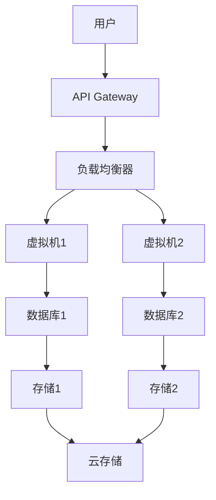
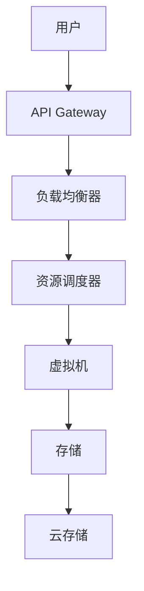

                 


# 云计算技术发展对IT产业格局的影响

> 关键词：云计算技术，IT产业格局，虚拟化技术，分布式存储，资源调度算法，商业模式，产业生态

> 摘要：云计算技术作为一种革命性的技术，正在深刻改变IT产业的格局。本文将从云计算的基本概念、核心技术、商业模式、系统架构以及实际应用等方面，全面分析云计算对IT产业的深远影响。通过详细的技术原理分析和实际案例探讨，揭示云计算如何重构产业生态，优化企业架构，并推动整个IT行业的创新发展。

---

## 第一部分：云计算技术发展背景与核心概念

### 第1章：云计算技术发展概述

#### 1.1 云计算的基本概念

##### 1.1.1 云计算的定义与特点
云计算是一种基于互联网的计算方式，通过将计算资源（如计算能力、存储空间、网络资源等）作为服务提供给用户，用户按需使用并按使用量付费。其特点包括按需分配、弹性扩展、资源共享、高可用性和成本优化。

##### 1.1.2 云计算的核心技术与服务模式
云计算的核心技术包括虚拟化技术、分布式存储技术、资源调度算法等。其服务模式主要分为IaaS（基础设施即服务）、PaaS（平台即服务）和SaaS（软件即服务）三种类型。

##### 1.1.3 云计算与传统IT架构的区别
与传统IT架构相比，云计算具有更高的资源利用率、更低的运维成本和更强的灵活性。传统架构依赖于物理服务器，而云计算通过虚拟化技术将资源池化，实现了资源的动态分配和弹性扩展。

#### 1.2 云计算的发展历程

##### 1.2.1 云计算的起源与演变
云计算的概念起源于20世纪90年代的“网格计算”和“效用计算”，但真正的发展始于21世纪初，随着互联网的普及和虚拟化技术的成熟，云计算逐渐成为主流的计算方式。

##### 1.2.2 云计算的关键发展阶段
- **第一阶段（2006年前）**：以亚马逊AWS的推出为代表，标志着IaaS模式的成熟。
- **第二阶段（2006-2015年）**：以容器化技术（如Docker）和编排工具（如Kubernetes）的出现为代表，推动了PaaS和Serverless架构的发展。
- **第三阶段（2015年至今）**：以混合云、多云架构的普及和AI/大数据技术的结合为代表，云计算进入智能化、生态化发展阶段。

##### 1.2.3 当前云计算技术的主要趋势
- **多云和混合云架构**：企业为了降低依赖风险，倾向于采用多云和混合云策略。
- **边缘计算**：随着5G和物联网的发展，云计算向边缘延伸，形成了“云边协同”的趋势。
- **AI与大数据结合**：云计算为AI和大数据分析提供了强大的计算能力支持。

---

### 第2章：云计算对IT产业格局的影响

#### 2.1 云计算对IT产业的颠覆性影响

##### 2.1.1 云计算如何改变企业IT架构
云计算通过虚拟化技术和弹性扩展能力，帮助企业构建灵活、高效的IT架构。企业无需再投入大量资源构建和维护物理服务器，而是通过云服务按需获取资源，显著降低了企业的资本投入（Capex）。

##### 2.1.2 云计算对传统IT服务模式的冲击
传统IT服务模式以硬件销售和定制化开发为主，而云计算的按需付费模式（Pay-as-you-go）彻底改变了这一模式。企业从购买硬件转向购买服务，软件从本地部署转向云端部署，推动了SaaS和PaaS市场的快速发展。

##### 2.1.3 云计算对企业成本结构的优化
云计算通过资源共享和弹性扩展，显著降低了企业的IT成本。企业可以根据实际需求动态调整资源使用量，避免了传统IT架构中硬件闲置和资源浪费的问题。

#### 2.2 云计算对产业链的重构

##### 2.2.1 云计算对硬件厂商的影响
云计算的普及对硬件厂商提出了新的挑战和机遇。传统硬件厂商需要转型为云服务提供商，通过提供弹性计算资源和云存储服务来满足市场需求。

##### 2.2.2 云计算对软件开发商的机遇与挑战
云计算为软件开发商提供了新的商业模式，SaaS模式成为主流。软件开发商可以通过云平台直接向用户提供服务，降低了销售和部署的复杂性。但同时，云计算的普及也要求软件开发商更加注重云原生开发，适应微服务架构和容器化部署的需求。

##### 2.2.3 云计算对系统集成商和运维服务商的影响
云计算的普及降低了企业对系统集成和运维服务的依赖，但同时也催生了新的服务模式，如云迁移服务、云安全服务和云优化服务。系统集成商和运维服务商需要转型为云服务提供商，提供更加专业的云解决方案。

---

## 第二部分：云计算技术的核心技术与实现原理

### 第3章：云计算的核心技术与实现原理

#### 3.1 云计算的关键技术

##### 3.1.1 虚拟化技术
虚拟化技术是云计算的核心技术之一，它允许一台物理服务器运行多个虚拟机，每个虚拟机都可以运行不同的操作系统和应用程序。通过虚拟化技术，云计算实现了资源的池化和高效利用。

##### 3.1.2 分布式存储技术
分布式存储技术是云计算的另一项核心技术，它通过将数据分散存储在多个节点上，提高了数据的可靠性和可用性。常见的分布式存储技术包括Hadoop Distributed File System (HDFS) 和 Amazon Simple Storage Service (S3)。

##### 3.1.3 负载均衡与资源调度算法
负载均衡技术用于将用户的请求均匀地分配到多个服务器上，避免单点过载。资源调度算法则根据当前系统的负载情况，动态调整资源的分配，确保系统的高效运行。

#### 3.2 云计算的资源调度算法

##### 3.2.1 负载均衡算法的原理与实现
负载均衡算法通过将请求分发到不同的服务器或节点上，提高系统的吞吐量和响应速度。常见的负载均衡算法包括轮询（Round Robin）、加权轮询（Weighted Round Robin）和随机选择（Random）等。

##### 3.2.2 容器编排算法的流程图
容器编排算法用于管理容器化应用的部署和运行，确保应用的高可用性和扩展性。常见的容器编排工具包括Kubernetes和Docker Swarm。

##### 3.2.3 资源分配的数学模型
资源分配的数学模型通过优化算法，实现资源的最优分配。例如，可以使用线性规划模型来最小化资源使用成本，同时满足系统的性能需求。

---

### 第4章：云计算的商业模式与产业生态

#### 4.1 云计算的商业模式

##### 4.1.1 IaaS、PaaS、SaaS的定价策略
- **IaaS（基础设施即服务）**：按使用的计算资源和存储空间付费。
- **PaaS（平台即服务）**：按使用的计算资源、存储空间和开发工具付费。
- **SaaS（软件即服务）**：按使用的软件功能和用户数量付费。

##### 4.1.2 云计算的按需付费模式
云计算的按需付费模式使得企业可以根据实际需求灵活调整资源使用量，避免了传统IT架构中硬件闲置和资源浪费的问题。

##### 4.1.3 云计算的收益与成本分析
云计算的收益主要来自于服务费和API调用费，而成本主要包括硬件投入、带宽成本和运维成本。通过规模效应和资源共享，云计算的边际成本逐渐降低，使得其在大规模应用中更具竞争力。

#### 4.2 云计算的产业生态

##### 4.2.1 云计算产业链的主要参与者
云计算产业链的主要参与者包括云服务提供商（如AWS、Azure、阿里云）、硬件厂商（如Intel、AMD）、软件开发商（如Salesforce、SAP）和系统集成商（如IBM、 Accenture）。

##### 4.2.2 云计算生态系统的构建与优化
云计算生态系统通过整合各种服务和工具，形成了一个完整的云服务生态。例如，AWS提供了丰富的云服务和工具，帮助用户快速构建和部署应用程序。

##### 4.2.3 云计算对就业市场的深远影响
云计算的普及催生了大量新的职业机会，如云架构师、云运维工程师、云安全专家等。同时，传统IT岗位（如系统管理员、网络管理员）也逐渐向云相关岗位转型。

---

## 第三部分：云计算技术的系统分析与架构设计

### 第5章：云计算系统的架构设计

#### 5.1 云计算系统的功能模块

##### 5.1.1 计算资源管理模块
计算资源管理模块负责管理云计算平台的计算资源，包括虚拟机的创建、销毁和资源分配。

##### 5.1.2 存储资源管理模块
存储资源管理模块负责管理云计算平台的存储资源，包括数据的存储、备份和恢复。

##### 5.1.3 网络资源管理模块
网络资源管理模块负责管理云计算平台的网络资源，包括虚拟网络的创建、管理和流量控制。

#### 5.2 云计算系统的架构图
以下是一个典型的云计算系统的架构图：



---

### 第6章：云计算系统的接口设计与交互流程

#### 6.1 云计算系统的接口设计

##### 6.1.1 API接口的设计原则
API接口的设计应遵循RESTful原则，包括使用HTTP方法（如GET、POST、PUT、DELETE）、使用JSON格式数据、提供统一的API网关等。

##### 6.1.2 API接口的实现与测试
以下是一个简单的API接口实现示例：

```python
from flask import Flask
from flask_restful import Resource, Api

app = Flask(__name__)
api = Api(app)

class HelloWorld(Resource):
    def get(self):
        return {"message": "Hello, World!"}

api.add_resource(HelloWorld, '/')

if __name__ == '__main__':
    app.run(debug=True)
```

##### 6.1.3 API接口的安全性保障
API接口的安全性保障包括使用HTTPS协议、API密钥、JWT令牌等。

#### 6.2 云计算系统的交互流程

##### 6.2.1 用户请求的处理流程
以下是一个用户请求的处理流程图：

```mermaid
sequenceDiagram
    participant 用户
    participant API Gateway
    participant 负载均衡器
    participant 虚拟机1
    用户 -> API Gateway: 发送请求
    API Gateway -> 负载均衡器: 转发请求
    负载均衡器 -> 虚拟机1: 分发请求
    虚拟机1 -> 返回响应
    负载均衡器 -> 用户: 返回响应
```

##### 6.2.2 资源分配的交互流程
以下是一个资源分配的交互流程图：



##### 6.2.3 负载均衡的交互流程
以下是一个负载均衡的交互流程图：


---

## 第四部分：项目实战与总结

### 第7章：云计算技术的项目实战

#### 7.1 项目背景与目标
本项目旨在通过构建一个简单的云平台，展示云计算技术的核心功能和实现原理。项目目标包括实现虚拟机的创建与销毁、存储资源的管理、负载均衡的实现等。

#### 7.2 项目实现

##### 7.2.1 环境配置
需要安装以下工具和库：
- Python 3.8+
- Flask
- Flask-Restful
- requests

##### 7.2.2 核心代码实现
以下是一个简单的云计算平台的核心代码实现示例：

```python
from flask import Flask
from flask_restful import Resource, Api
import requests

app = Flask(__name__)
api = Api(app)

class VMResource(Resource):
    def get(self):
        # 查询可用虚拟机
        response = requests.get("http://api/vm")
        return response.json()

    def post(self):
        # 创建虚拟机
        data = request.get_json()
        response = requests.post("http://api/vm", json=data)
        return response.json()

api.add_resource(VMResource, '/vm')

if __name__ == '__main__':
    app.run(debug=True)
```

##### 7.2.3 测试与优化
通过Postman或curl工具进行API测试，确保各个功能模块正常运行。同时，通过监控工具（如Prometheus）进行性能优化和资源调度。

#### 7.3 项目总结
通过本项目，我们成功展示了云计算技术的核心功能和实现原理。项目的实现不仅加深了我们对云计算技术的理解，也为后续的深入学习和实践打下了坚实的基础。

---

## 第五部分：总结与展望

### 第8章：总结与展望

#### 8.1 云计算技术的总结
云计算技术作为一种革命性的技术，正在深刻改变IT产业的格局。通过虚拟化技术、分布式存储技术和资源调度算法的结合，云计算实现了资源的高效利用和动态扩展，为企业提供了灵活、高效的IT架构。

#### 8.2 云计算技术的未来展望
未来，云计算技术将继续向智能化、生态化方向发展。随着AI和大数据技术的不断进步，云计算将与这些技术深度融合，为企业提供更加智能化、个性化的云服务。同时，边缘计算的普及和5G技术的发展也将推动云计算向边缘延伸，形成“云边协同”的新趋势。

---

## 附录

### 附录A：相关术语解释

- **虚拟化技术**：通过软件模拟物理硬件的功能，允许多个虚拟机在一台物理服务器上运行。
- **分布式存储技术**：将数据分散存储在多个节点上，提高数据的可靠性和可用性。
- **资源调度算法**：根据系统的负载情况，动态调整资源的分配，确保系统的高效运行。

### 附录B：常用工具与库

- **Flask**：Python的微网框架，常用于构建RESTful API。
- **Docker**：容器化技术，用于构建和运行应用程序。
- **Kubernetes**：容器编排工具，用于管理容器化应用的部署和运行。

---

## 作者

作者：AI天才研究院/AI Genius Institute & 禅与计算机程序设计艺术/Zen And The Art of Computer Programming

---

通过以上结构化的内容，我们可以看到云计算技术在IT产业格局中的重要地位和深远影响。云计算不仅改变了企业的IT架构，还重构了整个IT产业链，推动了技术的不断创新和进步。未来，随着技术的进一步发展，云计算将继续在IT产业中发挥关键作用，并为企业和社会创造更大的价值。

