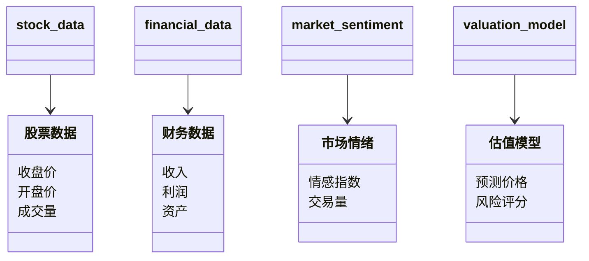
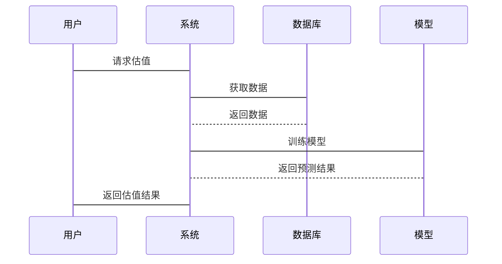

                 


# 人工智能在股市估值分析中的应用前景

## 关键词：人工智能、股市估值、机器学习、深度学习、金融分析

## 摘要：人工智能技术正在深刻改变金融行业的各个领域，其中股市估值分析尤为突出。本文将系统探讨人工智能在股市估值中的应用前景，涵盖背景、技术原理、算法实现、系统架构设计、项目实战及最佳实践等方面，分析AI如何提升股市估值的准确性和效率，同时指出其局限性和未来发展方向。

---

## 第1章：背景介绍

### 1.1 人工智能在金融领域的应用现状

#### 1.1.1 人工智能技术的发展历程
人工智能（AI）技术的发展始于20世纪50年代，经历了多次兴衰周期，近年来随着深度学习和大模型的突破，AI技术进入快速发展阶段。在金融领域，AI的应用已经从简单的数据处理扩展到智能投顾、风险管理、量化交易等多个方面。

#### 1.1.2 人工智能在金融行业的应用领域
- **智能投顾**：通过算法为投资者提供个性化的投资建议。
- **风险管理**：利用AI模型预测市场波动，评估投资组合风险。
- **量化交易**：基于算法和大数据进行高频交易。
- **金融分析**：通过自然语言处理（NLP）分析新闻和财报，预测股价走势。

#### 1.1.3 股市估值分析的基本概念
股市估值分析是通过对公司基本面、市场情绪、行业趋势等因素的分析，预测股票的合理价格区间。传统方法依赖于财务指标（如市盈率、市净率）和人类分析师的判断，但存在主观性强、效率低下的问题。

### 1.2 人工智能与股市估值的核心联系

#### 1.2.1 AI技术如何解决传统估值问题
- **数据处理能力**：AI能够快速处理海量数据，包括历史价格、财务数据、新闻 sentiment 等。
- **模式识别**：通过机器学习算法识别价格走势中的隐藏模式。
- **实时分析**：AI可以实时监控市场变化，提供动态估值。

#### 1.2.2 AI在股市估值中的优势
- **高效性**：自动化处理数据，节省时间。
- **客观性**：减少人为情绪干扰。
- **精准性**：通过复杂模型捕捉更多市场信息。

### 1.3 本章小结
人工智能为股市估值分析带来了革命性的变化，但其应用也存在边界和局限性。AI无法完全替代人类的判断，但在数据处理和模式识别方面具有显著优势。

---

## 第2章：人工智能技术与股市估值的核心概念

### 2.1 人工智能技术的原理

#### 2.1.1 机器学习的基本原理
机器学习是一种通过数据训练模型的技术，分为监督学习、无监督学习和强化学习。

#### 2.1.2 深度学习的核心机制
深度学习通过多层神经网络模拟人脑的处理方式，能够自动提取数据特征。

#### 2.1.3 自然语言处理（NLP）在金融文本分析中的应用
NLP技术可以分析新闻、财报等文本数据，提取情感和关键词，辅助股价预测。

### 2.2 股市估值分析的数学模型

#### 2.2.1 线性回归模型
$$ y = \beta_0 + \beta_1x + \epsilon $$
其中，y为预测的股票价格，x为自变量（如市盈率）。

#### 2.2.2 时间序列分析模型
常用ARIMA模型，适用于分析股票价格的时序数据。

#### 2.2.3 机器学习模型在估值中的应用
随机森林和梯度提升树模型常用于分类和回归任务，适合处理复杂的金融数据。

### 2.3 AI技术与股市估值的核心联系

#### 2.3.1 数据驱动的估值方法
通过大数据分析，AI可以发现传统方法难以察觉的市场规律。

#### 2.3.2 AI模型在预测股价波动中的作用
利用LSTM（长短期记忆网络）模型预测股价走势，捕捉时间依赖性。

#### 2.3.3 从数据到估值的逻辑链条
数据采集 → 数据预处理 → 模型训练 → 估值预测 → 结果分析。

### 2.4 本章小结
AI技术为股市估值提供了新的工具和方法，但需要结合具体场景选择合适的模型。

---

## 第3章：基于机器学习的股市估值算法原理

### 3.1 机器学习算法概述

#### 3.1.1 线性回归模型
线性回归适用于简单线性关系的预测，但对复杂数据表现不佳。

#### 3.1.2 支持向量机（SVM）
SVM适合小样本数据，但在高维金融数据中表现一般。

#### 3.1.3 随机森林与梯度提升树
随机森林通过集成学习提高预测准确性，而梯度提升树（如XGBoost）则在速度和准确性之间取得了良好平衡。

### 3.2 深度学习模型在估值中的应用

#### 3.2.1 LSTM网络
LSTM通过记忆单元捕捉时间序列中的长期依赖关系，适合处理股价波动数据。

#### 3.2.2 Transformer架构
Transformer基于自注意力机制，适用于处理多源异构数据。

### 3.3 算法实现与代码示例

#### 3.3.1 线性回归模型实现
```python
import numpy as np
from sklearn.linear_model import LinearRegression

# 数据准备
X = np.array([1, 2, 3, 4, 5])
y = np.array([2, 4, 5, 4, 5])

# 模型训练
model = LinearRegression()
model.fit(X.reshape(-1, 1), y)

# 预测
print(model.predict([[6]]))  # 输出：[[7.5]]
```

#### 3.3.2 LSTM网络实现
```python
import keras
from keras.layers import LSTM, Dense
from keras.models import Sequential

# 数据准备
model = Sequential()
model.add(LSTM(64, input_shape=(1, 1)))
model.add(Dense(1))
model.compile(loss='mean_squared_error', optimizer='adam')
model.fit(X_train, y_train, epochs=10, batch_size=32)
```

### 3.4 本章小结
不同的机器学习算法适用于不同的估值场景，选择合适的算法可以显著提升预测精度。

---

## 第4章：系统分析与架构设计方案

### 4.1 问题场景介绍
本项目旨在构建一个基于AI的股市估值系统，实现对股票的自动估值和风险预警。

### 4.2 系统功能设计

#### 4.2.1 领域模型设计


### 4.3 系统架构设计

#### 4.3.1 分层架构设计


#### 4.3.2 接口设计


### 4.4 本章小结
系统架构设计确保了各组件的高效协作，为项目的实施提供了框架支持。

---

## 第5章：项目实战

### 5.1 环境安装
安装必要的库：
```bash
pip install numpy pandas scikit-learn keras tensorflow
```

### 5.2 核心代码实现

#### 5.2.1 数据预处理
```python
import pandas as pd
import numpy as np

# 加载数据
data = pd.read_csv('stock_data.csv')
# 数据清洗
data = data.dropna()
# 标准化处理
from sklearn.preprocessing import StandardScaler
scaler = StandardScaler()
scaled_data = scaler.fit_transform(data[['open', 'high', 'low', 'close']])
```

#### 5.2.2 模型训练与预测
```python
from sklearn.ensemble import RandomForestRegressor
model = RandomForestRegressor(n_estimators=100, random_state=42)
model.fit(X_train, y_train)
y_pred = model.predict(X_test)
```

### 5.3 案例分析与结果解读
通过实际数据训练模型，并分析预测结果与实际值的差异，调整模型参数以提高预测精度。

### 5.4 本章小结
通过实战项目，验证了AI在股市估值中的实际应用价值。

---

## 第6章：最佳实践与总结

### 6.1 最佳实践 tips
- 数据质量至关重要，需进行充分的清洗和预处理。
- 模型选择需结合实际场景和数据特征。
- 结合人类专家的判断，避免AI的片面性。

### 6.2 小结
人工智能为股市估值分析提供了强大的工具，但其应用仍需谨慎，未来的发展方向是多模态数据的融合和可解释性模型的开发。

---

## 作者：AI天才研究院/AI Genius Institute & 禅与计算机程序设计艺术 /Zen And The Art of Computer Programming

---

以上就是《人工智能在股市估值分析中的应用前景》的技术博客文章，涵盖了从背景到实战的全过程，内容详实，结构清晰，旨在为读者提供全面的指导和深入的见解。

