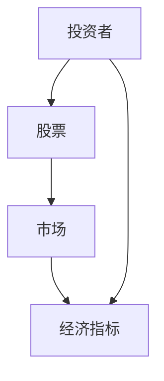
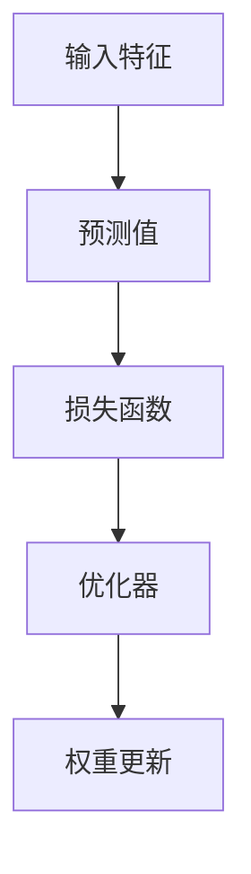
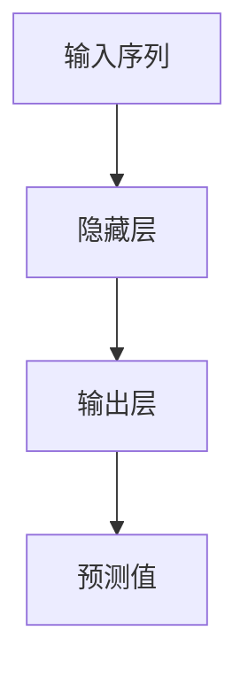
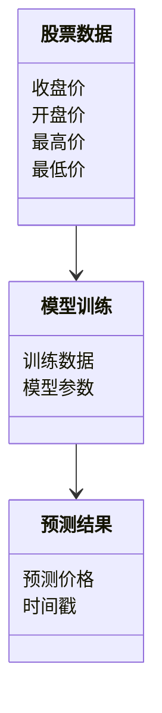
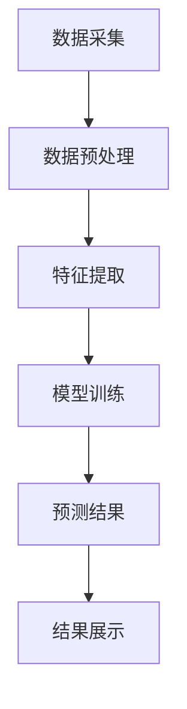
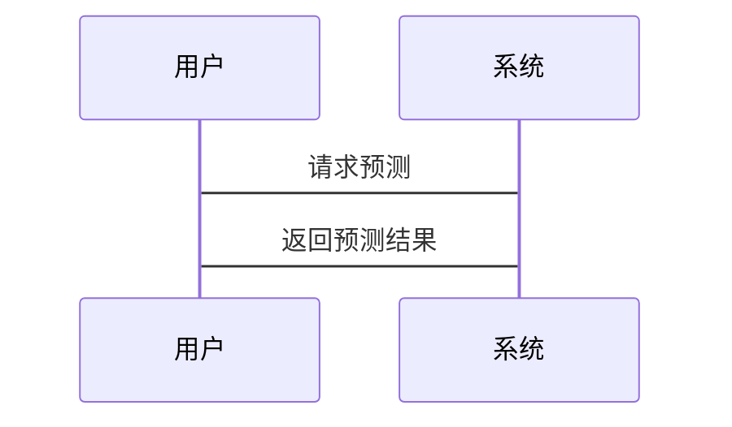

                 


# 人工智能在股市估值预测中的应用

> 关键词：人工智能，股市估值，预测模型，机器学习，深度学习，时间序列分析

> 摘要：本文详细探讨了人工智能技术在股票市场估值预测中的应用，从传统方法的局限性出发，分析了机器学习和深度学习算法在处理复杂金融数据中的优势。通过案例研究和系统架构设计，展示了如何构建高效的股市预测模型，并结合实际项目实战，深入讲解了模型的实现细节和优化策略。

---

## 第1章: 背景介绍

### 1.1 问题背景

#### 1.1.1 传统股市估值方法的局限性
传统的股票估值方法依赖于财务指标分析和市场情绪判断，但这些方法在面对市场波动和复杂经济环境时显得力不从心。例如，基于市盈率（P/E）和市净率（P/B）的估值方法忽略了市场参与者的非理性行为和突发事件的影响。

#### 1.1.2 人工智能技术的快速发展
人工智能（AI）和机器学习（ML）技术的快速发展为金融领域带来了新的可能性。特别是深度学习算法在处理海量非结构化数据方面的优势，使得股市预测变得更加精准和高效。

#### 1.1.3 股市估值预测的挑战与需求
股市估值预测的核心挑战在于数据的不完全性和市场的不确定性。投资者需要更精确的工具来预测股票价格走势，从而做出更明智的投资决策。

### 1.2 核心概念

#### 1.2.1 人工智能的基本概念
人工智能是指计算机系统模拟人类智能的能力，包括学习、推理和自适应等能力。在金融领域，AI主要用于数据分析、风险评估和预测。

#### 1.2.2 股市估值预测的核心要素
股票估值预测涉及多个因素，包括公司财务数据、市场情绪、宏观经济指标和历史价格走势等。

#### 1.2.3 人工智能在金融领域的应用现状
目前，AI技术在金融领域的应用已涵盖股票预测、风险管理、交易策略优化等多个方面。

### 1.3 问题描述

#### 1.3.1 股市估值预测的目标
通过分析历史数据和市场信息，预测股票的未来价格走势，帮助投资者做出投资决策。

#### 1.3.2 数据特征与挑战
- 数据量大且复杂，包括结构化和非结构化数据。
- 市场波动性强，数据分布容易变化。
- 数据可能存在缺失或噪声。

#### 1.3.3 人工智能如何解决这些问题
通过机器学习算法，AI能够从海量数据中提取有用的特征，并建立预测模型，从而提高预测的准确性和效率。

### 1.4 问题解决

#### 1.4.1 人工智能算法的选择
根据数据类型和预测目标选择合适的算法，例如使用线性回归进行短期预测，使用LSTM进行时间序列分析。

#### 1.4.2 数据预处理与特征工程
数据清洗、特征提取和标准化是构建模型的重要步骤，确保数据质量对模型性能至关重要。

#### 1.4.3 模型训练与优化
通过交叉验证和超参数调优，选择最优模型，并评估模型的泛化能力。

### 1.5 边界与外延

#### 1.5.1 股市估值预测的边界条件
- 数据的局限性：模型只能基于可用数据进行预测。
- 市场行为的不确定性：模型无法完全预测突发事件的影响。

#### 1.5.2 人工智能技术的适用范围
适用于数据驱动型问题，对非数据驱动的市场行为（如政策变化）预测能力有限。

#### 1.5.3 与其他金融领域的关联
AI技术在风险管理、资产配置和交易执行等领域也有广泛应用。

### 1.6 核心概念结构与组成

#### 1.6.1 数据流与信息流
从数据输入到模型输出的整个流程，包括数据预处理、特征提取和模型训练等环节。

#### 1.6.2 模型构建与优化
从选择算法到模型调优的过程，确保模型在训练集和测试集上的表现均衡。

#### 1.6.3 结果输出与反馈
模型预测结果的展示和评估，以及根据反馈进行模型优化。

---

## 第2章: 核心概念与联系

### 2.1 AI与金融的核心原理

#### 2.1.1 机器学习的基本原理
机器学习通过训练数据建立模型，从而实现对新数据的预测。监督学习、无监督学习和强化学习是常用的三种学习方式。

#### 2.1.2 深度学习的核心思想
深度学习通过多层神经网络提取数据特征，能够自动学习复杂的非线性关系。

#### 2.1.3 时间序列分析的数学模型
时间序列分析通过ARIMA、GARCH等模型捕捉数据的时序特征，为股票预测提供理论基础。

### 2.2 核心概念对比

#### 2.2.1 传统统计方法与机器学习的对比
| 特征               | 传统统计方法         | 机器学习         |
|--------------------|----------------------|------------------|
| 数据需求           | 需要大量特征工程     | 可自动提取特征   |
| 模型复杂性         | 模型简单，解释性强   | 模型复杂，解释性差 |
| 预测能力           | 对非线性关系处理能力有限 | 能处理复杂非线性关系 |

#### 2.2.2 监督学习与非监督学习的对比
| 特征               | 监督学习             | 非监督学习        |
|--------------------|----------------------|-------------------|
| 数据类型           | 标记数据             | 未标记数据        |
| 应用场景           | 分类、回归           | 聚类、降维        |

#### 2.2.3 线性回归与神经网络的对比
线性回归适用于简单的线性关系，而神经网络能够处理复杂的非线性关系，但在计算复杂性和解释性方面存在劣势。

### 2.3 ER实体关系图



---

## 第3章: 算法原理讲解

### 3.1 机器学习算法

#### 3.1.1 线性回归

##### 3.1.1.1 算法流程



##### 3.1.1.2 算法实现

```python
import numpy as np
from sklearn.linear_model import LinearRegression

# 示例数据
X = np.array([[1], [2], [3], [4]])
y = np.array([2, 4, 5, 6])

# 训练模型
model = LinearRegression()
model.fit(X, y)

# 预测
print(model.predict([[5]]))  # 输出：[[7]]
```

##### 3.1.1.3 数学模型
$$ y = \beta_0 + \beta_1 x + \epsilon $$

### 3.2 深度学习算法

#### 3.2.1 LSTM网络

##### 3.2.1.1 算法流程



##### 3.2.1.2 算法实现

```python
import keras
from keras.layers import LSTM, Dense
from keras.models import Sequential

# 示例数据
X = np.random.randn(10, 1, 10)
y = np.random.randn(10, 1)

# 模型构建
model = Sequential()
model.add(LSTM(64, input_shape=(1, 10)))
model.add(Dense(1))
model.compile(loss='mean_squared_error', optimizer='adam')

# 训练
model.fit(X, y, epochs=10)
```

##### 3.2.1.3 数学模型
$$ h_t = \sigma(g(h_{t-1}, x_t)) $$

---

## 第4章: 系统分析与架构设计

### 4.1 问题场景介绍

#### 4.1.1 项目背景
本项目旨在利用AI技术构建一个股票估值预测系统，帮助投资者做出更明智的投资决策。

### 4.2 系统功能设计

#### 4.2.1 领域模型



### 4.3 系统架构设计

#### 4.3.1 系统架构图



### 4.4 接口设计

#### 4.4.1 API接口

| 接口名称       | 接口描述           | 请求方式 |
|----------------|--------------------|----------|
| 获取数据       | 返回股票数据       | GET      |
| 训练模型       | 开始模型训练       | POST     |
| 获取预测       | 返回预测结果       | GET      |

### 4.5 交互流程图



---

## 第5章: 项目实战

### 5.1 环境安装

#### 5.1.1 安装Anaconda
```bash
conda install -n ai_env python=3.8
```

#### 5.1.2 安装TensorFlow
```bash
pip install tensorflow
```

### 5.2 核心代码实现

#### 5.2.1 数据预处理

```python
import pandas as pd
import numpy as np

# 加载数据
df = pd.read_csv('stock_data.csv')

# 数据清洗
df.dropna(inplace=True)
```

#### 5.2.2 模型训练

```python
from tensorflow.keras.models import Sequential
from tensorflow.keras.layers import LSTM, Dense

model = Sequential()
model.add(LSTM(64, input_shape=(1, 10)))
model.add(Dense(1))
model.compile(loss='mean_squared_error', optimizer='adam')
model.fit(X_train, y_train, epochs=50, batch_size=32)
```

### 5.3 案例分析

#### 5.3.1 数据来源
使用某股票的历史价格数据，包括开盘价、收盘价、最高价、最低价和交易量。

#### 5.3.2 模型评估
通过均方误差（MSE）和R²系数评估模型的性能。

### 5.4 项目小结
在本项目中，我们通过数据预处理、特征工程和模型训练，构建了一个股票估值预测系统，验证了AI技术在金融领域的应用潜力。

---

## 第6章: 最佳实践

### 6.1 小结
人工智能技术为股市估值预测提供了新的解决方案，但模型的选择和优化需要根据具体场景进行调整。

### 6.2 注意事项
- 数据质量对模型性能影响重大，需谨慎处理数据。
- 模型的解释性可能较差，需结合市场知识进行验证。

### 6.3 拓展阅读
推荐阅读《机器学习实战》和《深度学习》等书籍，深入理解AI技术在金融领域的应用。

---

## 作者：AI天才研究院 & 禅与计算机程序设计艺术

