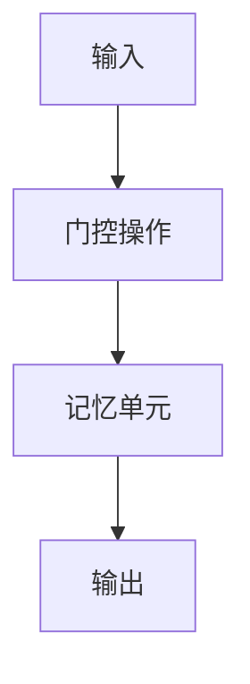

                 


# 人工智能对股市估值准确性的提升研究

**关键词**：人工智能、股市估值、机器学习、深度学习、LSTM、随机森林、数学模型

**摘要**：本文系统探讨了人工智能在提升股市估值准确性中的应用，从理论基础到算法原理，再到系统设计和实战案例，详细分析了如何通过AI技术优化股票估值模型。文章首先介绍了传统估值方法的局限性，然后深入讲解了机器学习、深度学习和强化学习在股市分析中的应用。接着，通过具体的算法模型（如线性回归、随机森林和LSTM）展示了AI在预测中的优势。最后，结合实际案例，分析了系统设计和项目实现的细节，总结了当前研究的成果与未来的发展方向。

---

## 第一部分：引言

### 第1章：研究背景与意义

#### 1.1 问题背景

股票市场的估值是投资者做出投资决策的重要依据。传统的估值方法主要依赖财务指标分析和市场趋势判断，这些方法虽然有一定效果，但也存在诸多局限性。例如，传统方法难以捕捉市场中的复杂模式和非线性关系，且容易受到人为情绪和市场波动的影响。随着人工智能技术的快速发展，越来越多的研究开始关注如何利用机器学习、深度学习等技术提升股市估值的准确性。

#### 1.2 问题描述

股市估值的核心挑战在于如何准确预测股票的价格波动。传统方法往往基于历史数据和经验判断，难以应对市场的不确定性和复杂性。人工智能技术，尤其是机器学习和深度学习，通过从海量数据中提取特征并建立预测模型，为股市估值提供了新的可能性。然而，如何选择合适的算法、如何构建高效的模型以及如何处理数据中的噪声等问题，仍然是当前研究的难点。

#### 1.3 问题解决

人工智能通过以下方式提升股市估值的准确性：
1. **数据驱动**：利用历史交易数据、市场情绪数据和财务报表等多源数据进行分析。
2. **模式识别**：识别传统方法难以发现的市场规律和潜在风险。
3. **实时更新**：通过持续学习和模型优化，适应市场的动态变化。

#### 1.4 边界与外延

本研究的边界条件包括：
- **数据范围**：主要关注历史交易数据和财务数据。
- **预测范围**：短期股票价格预测，不涉及长期趋势分析。
- **技术限制**：不考虑高频交易和实时市场干预。

相关领域的外延包括：
- **量化交易**：利用算法进行自动化交易决策。
- **风险管理**：通过AI技术识别市场风险并制定应对策略。

#### 1.5 概念结构与核心要素组成

核心要素包括：
- 数据源：历史价格、交易量、财务指标、市场情绪。
- 算法选择：机器学习、深度学习、强化学习。
- 模型评估：准确率、召回率、F1分数。

概念之间的关系可以通过以下ER图表示：

```mermaid
erDiagram
    用户角色{}{
        id
        用户名
        权限
    }
    股票数据{}{
        股票代码
        交易日期
        收盘价
        成交量
    }
    市场情绪{}{
        情绪指标
        时间戳
    }
    算法模型{}{
        模型ID
        模型类型
        训练数据
    }
    用户角色 -> 股票数据: 查询
    用户角色 -> 市场情绪: 获取
    股票数据 -> 算法模型: 输入
    市场情绪 -> 算法模型: 输入
```

---

## 第二部分：人工智能与股市估值的核心概念

### 第2章：人工智能基础

#### 2.1 机器学习与深度学习

机器学习通过训练模型从数据中提取特征，常用的算法包括线性回归、支持向量机（SVM）和随机森林。深度学习则通过多层神经网络提取非线性特征，适用于处理复杂的数据模式。

| 算法类型 | 特点 | 适用场景 |
|----------|------|----------|
| 机器学习 | 数据需求较少，模型简单 | 小型数据集 |
| 深度学习 | 数据需求较多，模型复杂 | 大型数据集 |

#### 2.2 强化学习与预测模型

强化学习通过模拟交易策略，在虚拟环境中不断试错，找到最优策略。其核心在于通过奖励机制优化决策过程。

#### 2.3 神经网络与特征工程

神经网络通过多层结构提取数据特征，特征工程则是对数据进行预处理和特征选择，以提高模型性能。

---

## 第三部分：算法原理与数学模型

### 第3章：算法原理

#### 3.1 线性回归模型

线性回归是最简单的回归模型，假设自变量和因变量之间存在线性关系。

$$ y = \beta_0 + \beta_1x + \epsilon $$

**案例分析**：使用股票价格预测，假设数据为开盘价和收盘价，预测收盘价的变化。

#### 3.2 随机森林模型

随机森林通过构建多个决策树并集成预测结果，具有较高的鲁棒性。

$$ \text{预测值} = \sum_{i=1}^n \text{投票结果} $$

**流程图**：

```mermaid
graph TD
    A[开始] -> B[特征选择]
    B -> C[生成决策树]
    C -> D[集成预测]
    D -> E[结束]
```

#### 3.3 LSTM模型

长短期记忆网络（LSTM）适用于时间序列数据的预测。

$$ f_t = \sigma(W_f[x_t,h_{t-1}]) $$

**流程图**：



---

## 第四部分：系统分析与架构设计

### 第4章：系统分析

#### 4.1 问题场景介绍

系统功能需求包括：
- 数据采集：获取股票价格、交易量等数据。
- 数据预处理：清洗数据、处理缺失值。
- 模型训练：选择算法并训练模型。
- 预测与评估：输出预测结果并评估模型性能。

---

## 第五部分：项目实战

### 第5章：项目实战

#### 5.1 环境安装

安装必要的库：

```bash
pip install pandas numpy scikit-learn tensorflow
```

#### 5.2 系统核心实现源代码

```python
import pandas as pd
import numpy as np
from sklearn.ensemble import RandomForestRegressor
from tensorflow.keras.models import Sequential
from tensorflow.keras.layers import LSTM, Dense

# 数据预处理
data = pd.read_csv('stock_data.csv')
X = data[['open', 'high', 'low', 'volume']]
y = data['close']

# 划分训练集和测试集
from sklearn.model_selection import train_test_split
X_train, X_test, y_train, y_test = train_test_split(X, y, test_size=0.2)

# 随机森林模型
rf_model = RandomForestRegressor()
rf_model.fit(X_train, y_train)
rf_pred = rf_model.predict(X_test)

# LSTM模型
model = Sequential()
model.add(LSTM(64, input_shape=(X_train.shape[1], 1)))
model.add(Dense(1))
model.compile(loss='mean_squared_error', optimizer='adam')
model.fit(X_train.values.reshape((X_train.shape[0], X_train.shape[1], 1)), y_train, epochs=10, batch_size=32)
lstm_pred = model.predict(X_test.values.reshape((X_test.shape[0], X_test.shape[1], 1)))
```

---

## 第六部分：总结与展望

### 第6章：总结与展望

#### 6.1 最佳实践 tips

- 数据预处理是关键，尤其是处理缺失值和异常值。
- 选择合适的模型，避免过拟合。

#### 6.2 小结

人工智能通过数据驱动和模式识别，显著提高了股市估值的准确性。随机森林和LSTM模型在实际应用中表现出色。

#### 6.3 注意事项

- 数据质量和模型选择直接影响预测结果。
- 模型需要定期更新以适应市场变化。

#### 6.4 拓展阅读

推荐阅读相关书籍和论文，深入理解机器学习和深度学习在金融领域的应用。

---

**作者：AI天才研究院 & 禅与计算机程序设计艺术**

