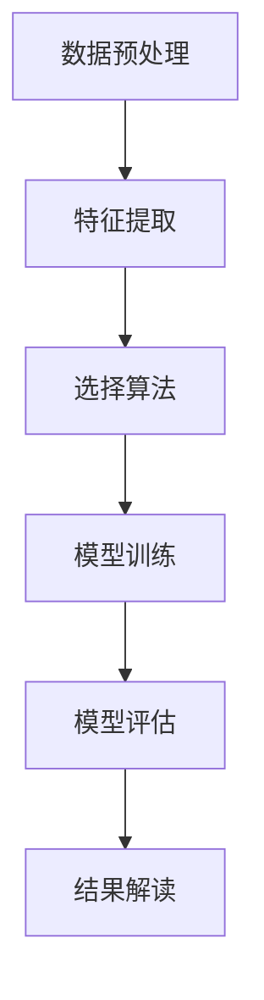
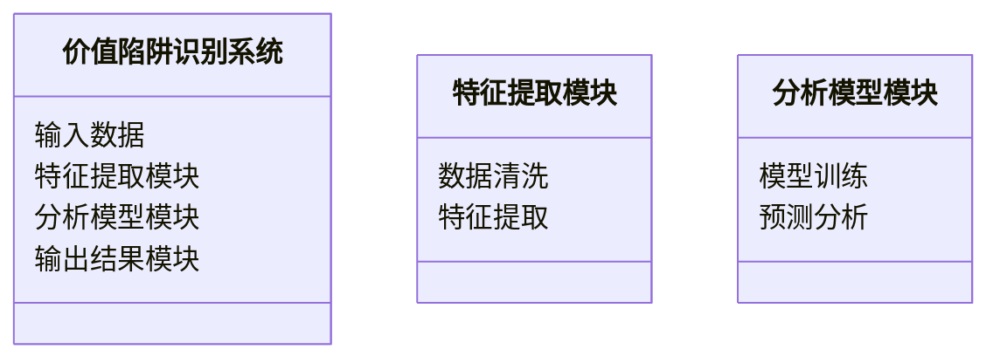
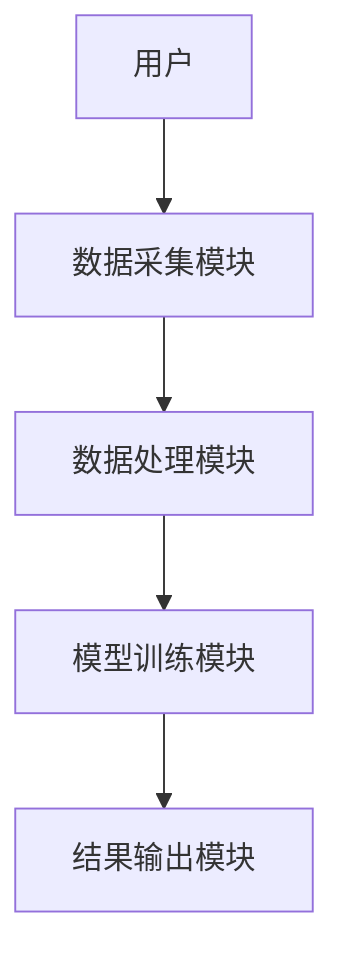
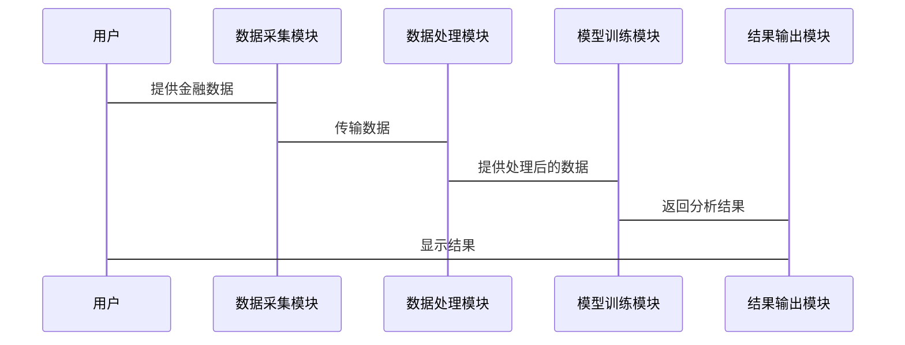

                 


# 人工智能辅助识别价值陷阱

> 关键词：人工智能，价值陷阱，金融分析，机器学习，风险管理，数据挖掘，投资策略

> 摘要：人工智能在识别价值陷阱中的应用，利用机器学习和深度学习技术，通过分析海量数据和复杂模式，帮助投资者识别潜在风险和虚假投资机会，提升投资决策的准确性和效率。

---

# 第1章 价值陷阱的定义与识别背景

## 1.1 价值陷阱的定义与特征

### 1.1.1 价值陷阱的定义

价值陷阱是指那些表面上看似有吸引力，但实际上隐藏着重大风险或缺陷的投资机会或金融产品。投资者可能因为信息不对称、情绪影响或认知偏差而误判其价值，导致损失。

### 1.1.2 价值陷阱的核心特征

| 特征 | 描述 |
|------|------|
| 表现吸引力 | 以高收益、低风险为诱饵 |
| 隐藏风险 | 存在未公开的缺陷或潜在风险 |
| 信息不对称 | 投资者难以获取关键信息 |
| 时间依赖性 | 风险可能在特定时间点爆发 |

### 1.1.3 价值陷阱的分类与场景

- **股票投资陷阱**：如高市盈率但业绩不佳的股票。
- **金融产品陷阱**：如复杂衍生品中的隐藏风险。
- **市场行为陷阱**：如市场操纵或虚假信息传播。

## 1.2 人工智能在金融分析中的应用背景

### 1.2.1 传统金融分析的局限性

传统金融分析依赖人工判断，容易受到主观因素影响，难以处理海量数据，且效率低下。

### 1.2.2 人工智能在金融领域的优势

- 数据处理能力强：AI能快速分析大量数据，发现隐藏规律。
- 模式识别精准：通过机器学习识别复杂模式，提前预警风险。
- 自动化决策支持：AI辅助投资决策，减少人为错误。

### 1.2.3 价值陷阱识别的痛点与需求

- 现有工具难以发现隐藏风险。
- 投资者需要更高效、准确的分析工具。
- 对实时数据的处理需求迫切。

## 1.3 人工智能辅助识别价值陷阱的意义

### 1.3.1 提高投资效率

AI能够快速处理和分析数据，帮助投资者节省时间。

### 1.3.2 减少投资风险

通过识别潜在风险，AI帮助投资者做出更明智的决策。

### 1.3.3 未来金融分析的趋势

AI将逐渐成为金融分析的核心工具，推动投资策略的智能化。

## 1.4 本章小结

本章介绍了价值陷阱的定义、特征及其分类，分析了传统金融分析的局限性，并阐述了人工智能在识别价值陷阱中的重要意义。

---

# 第2章 人工智能与价值陷阱识别的核心概念

## 2.1 人工智能的核心概念

### 2.1.1 人工智能的定义与原理

人工智能是模拟人类智能的技术，涵盖学习、推理和自我改进。

### 2.1.2 机器学习与深度学习的区别

| 方面 | 机器学习 | 深度学习 |
|------|----------|----------|
| 数据需求 | 需大量标注数据 | 可处理未标注数据 |
| 模型复杂度 | 模型简单 | 模型复杂 |
| 应用场景 | 数据分类、回归 | 图像识别、自然语言处理 |

### 2.1.3 自然语言处理与图像识别

- **自然语言处理（NLP）**：用于分析金融新闻和报告。
- **图像识别**：用于分析财务报表中的图像数据。

## 2.2 价值陷阱识别的关键要素

### 2.2.1 价值陷阱的关键特征

- **财务数据异常**：如收入与利润不匹配。
- **市场行为异常**：如成交量突增但股价未涨。
- **行业趋势分析**：如行业低迷时的表现。

### 2.2.2 数据特征与模式识别

- **时间序列分析**：识别价格波动模式。
- **文本挖掘**：分析公司公告中的关键词。

### 2.2.3 风险评估与预警机制

- **风险评分**：通过模型评估投资风险。
- **预警系统**：实时监控并发出警报。

## 2.3 人工智能与价值陷阱识别的联系

### 2.3.1 数据驱动的模式识别

AI通过分析历史数据，识别潜在的价值陷阱模式。

### 2.3.2 自动化分析与决策支持

AI帮助投资者快速做出决策，减少人为干预。

### 2.3.3 智能化预警系统

AI实时监控市场动态，提前预警潜在风险。

## 2.4 核心概念对比分析

### 2.4.1 传统分析方法与AI方法对比

| 方面 | 传统方法 | AI方法 |
|------|----------|--------|
| 效率 | 低效 | 高效 |
| 准确性 | 受限于人类判断 | 更精准 |
| 数据处理 | 有限 | 海量 |

### 2.4.2 不同AI技术的适用场景

- **监督学习**：适用于分类任务，如股票评级。
- **无监督学习**：适用于聚类分析，如客户分群。
- **强化学习**：适用于动态决策，如实时交易策略。

### 2.4.3 价值陷阱识别的流程优化

- 数据预处理：清洗和标准化数据。
- 模型训练：构建分类或回归模型。
- 结果解读：解释模型输出，指导投资决策。

## 2.5 本章小结

本章探讨了人工智能在识别价值陷阱中的核心概念，分析了不同AI技术的应用场景，并提出了流程优化的建议。

---

# 第3章 人工智能辅助识别价值陷阱的算法原理

## 3.1 算法原理概述

### 3.1.1 监督学习模型

$$ \text{损失函数} = \frac{1}{n}\sum_{i=1}^{n}(y_i - \hat{y_i})^2 $$

### 3.1.2 特征提取方法

- **主成分分析（PCA）**：降低数据维度，提取主要特征。
- **词袋模型（Bag-of-Words）**：用于文本数据处理。

### 3.1.3 分类与回归模型

- **逻辑回归（Logistic Regression）**：用于二分类问题。
- **随机森林（Random Forest）**：用于分类和回归。
- **神经网络（Neural Networks）**：适用于复杂模式识别。

## 3.2 算法实现流程



## 3.3 算法实现代码示例

### 3.3.1 环境安装

```bash
pip install numpy scikit-learn
```

### 3.3.2 核心代码实现

```python
from sklearn.ensemble import RandomForestClassifier
from sklearn.metrics import accuracy_score
import numpy as np

# 示例数据
X = np.array([[1, 2], [3, 4], [5, 6]])
y = np.array([0, 1, 0])

# 模型训练
model = RandomForestClassifier()
model.fit(X, y)

# 预测
predicted = model.predict([[2, 3], [4, 5], [6, 7]])
print("预测结果:", predicted)
print("准确率:", accuracy_score([0, 1, 0], predicted))
```

## 3.4 算法优化与调优

### 3.4.1 参数调整

- 调整树的棵数（n_estimators）。
- 调整树的深度（max_depth）。

### 3.4.2 模型评估

- 准确率、召回率、F1分数。
- ROC-AUC曲线。

## 3.5 本章小结

本章详细讲解了人工智能算法在识别价值陷阱中的实现过程，包括数据预处理、特征提取、模型选择和评估。

---

# 第4章 系统分析与架构设计方案

## 4.1 系统功能设计

### 4.1.1 领域模型



### 4.1.2 系统架构设计



### 4.1.3 系统接口设计

- 输入接口：接收金融数据。
- 输出接口：提供分析结果。
- API接口：与其他系统集成。

### 4.1.4 系统交互流程



## 4.2 本章小结

本章通过系统设计的方法，详细描述了人工智能辅助识别价值陷阱的系统架构和交互流程。

---

# 第5章 项目实战：人工智能识别价值陷阱的应用

## 5.1 股票市场价值陷阱识别

### 5.1.1 项目环境安装

```bash
pip install pandas numpy scikit-learn
```

### 5.1.2 核心代码实现

```python
import pandas as pd
from sklearn.ensemble import RandomForestClassifier

# 数据加载
data = pd.read_csv('stock_data.csv')

# 数据预处理
X = data[['市盈率', '营收增长率']]
y = data['评级']

# 模型训练
model = RandomForestClassifier()
model.fit(X, y)

# 预测
test_data = pd.read_csv('test_stock_data.csv')
predicted_ratings = model.predict(test_data[['市盈率', '营收增长率']])
print("预测评级:", predicted_ratings)
```

### 5.1.3 案例分析

分析某股票的历史数据，识别其是否存在价值陷阱，并解释模型预测结果。

## 5.2 金融文本挖掘与价值陷阱识别

### 5.2.1 项目环境安装

```bash
pip install spacy transformers
```

### 5.2.2 核心代码实现

```python
import spacy
from spacy.lang.zh import Chinese

# 中文分词
nlp = Chinese()
text = "该公司业绩持续下滑，但股价却上涨。"
doc = nlp(text)
for token in doc:
    print(token.text)
```

### 5.2.3 案例分析

分析公司公告文本，识别潜在的风险因素。

## 5.3 本章小结

本章通过实际案例展示了人工智能在股票分析和金融文本挖掘中的应用，帮助投资者识别价值陷阱。

---

# 第6章 最佳实践与注意事项

## 6.1 最佳实践 tips

- 数据质量是关键：确保数据的准确性和完整性。
- 模型调优：定期更新和优化模型。
- 结果解读：理解模型输出的含义，避免误用。

## 6.2 小结

人工智能辅助识别价值陷阱的应用前景广阔，但需要结合具体场景进行优化。

## 6.3 注意事项

- 数据隐私保护：遵守相关法律法规。
- 模型解释性：确保模型结果可解释。
- 风险控制：建立有效的风险管理机制。

## 6.4 拓展阅读

- 《机器学习实战》
- 《Python机器学习》
- 《自然语言处理入门》

## 6.5 本章小结

本章总结了人工智能辅助识别价值陷阱的最佳实践，并提供了相关的注意事项和拓展阅读资料。

---

# 作者：AI天才研究院 & 禅与计算机程序设计艺术

---

这篇文章系统地介绍了人工智能在识别价值陷阱中的应用，从理论到实践，涵盖了算法原理、系统设计和项目实战，帮助读者全面理解并掌握这一技术。

