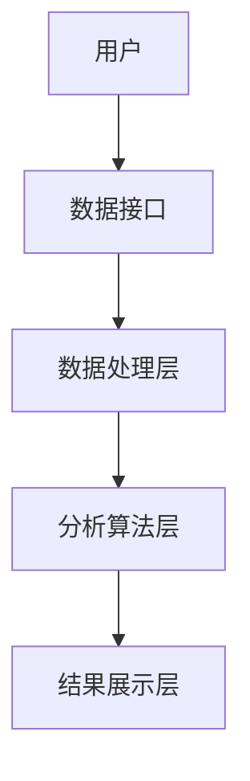

                 


# 《从历史角度理解当前市场状况的重要性》

---

## 关键词：市场分析、历史数据、市场周期、投资策略、风险管理、案例分析

---

## 摘要：  
本文从历史角度深入探讨当前市场状况的重要性，分析市场周期、供需关系和参与者行为模式，结合数学模型和算法，提供系统的市场分析方法，最后通过实际案例展示如何利用历史数据预测未来趋势，并提出风险管理策略和投资建议。

---

# 第一部分：从历史视角理解市场分析的基础

---

## 第1章：市场分析的基本概念

### 1.1 市场分析的定义与重要性

#### 1.1.1 市场分析的定义  
市场分析是通过对市场数据的收集、整理和分析，研究市场结构、供需关系、价格变化和参与者行为的过程，旨在揭示市场规律并预测未来趋势。

#### 1.1.2 市场分析的重要性  
市场分析能够帮助投资者和企业管理者做出更明智的决策，优化资源配置，降低风险，抓住市场机会。

#### 1.1.3 历史视角在市场分析中的作用  
历史数据提供了市场的演变规律，帮助我们识别周期性模式，预测未来趋势。

---

### 1.2 市场分析的核心要素

#### 1.2.1 市场结构的定义  
市场结构包括市场的参与者、交易规则、价格形成机制等。

#### 1.2.2 市场参与者的角色  
参与者包括买方、卖方、中间商和监管机构，不同角色的行为影响市场供需。

#### 1.2.3 市场数据的分类与特征  
市场数据分为历史数据、实时数据和预测数据，具有时间性、连续性和周期性特征。

---

### 1.3 市场分析的历史演变

#### 1.3.1 传统市场分析方法  
基于经验判断，依赖市场直觉和价格走势。

#### 1.3.2 现代市场分析方法  
引入统计学和计算机技术，利用大数据和算法进行分析。

#### 1.3.3 数据驱动的市场分析  
通过历史数据挖掘，发现市场规律，预测未来趋势。

---

### 1.4 市场分析的边界与外延

#### 1.4.1 市场分析的边界  
关注市场内部因素，如供需、价格，不考虑外部宏观因素。

#### 1.4.2 市场分析的外延  
结合宏观经济、政策和行业趋势，扩展分析范围。

#### 1.4.3 市场分析与其他学科的关系  
与经济学、统计学和计算机科学密切相关。

---

### 1.5 本章小结  
市场分析是理解当前市场的重要工具，历史数据提供了关键的规律和模式。

---

## 第2章：历史视角下的市场周期

### 2.1 市场周期的定义与特征

#### 2.1.1 市场周期的定义  
市场周期是市场在不同阶段的波动过程，包括繁荣、衰退、萧条和复苏。

#### 2.1.2 市场周期的特征  
周期性波动、价格波动、供需变化。

---

### 2.2 历史上的市场周期案例

#### 2.2.1 经典市场周期案例分析  
分析20世纪以来的几次经济危机和复苏过程。

#### 2.2.2 市场周期的规律总结  
周期的长短不一，但波动规律相似。

#### 2.2.3 市场周期的预测方法  
通过历史数据和数学模型预测未来趋势。

---

### 2.3 市场周期与当前市场的关系

#### 2.3.1 历史周期对当前市场的启示  
识别当前周期所处阶段，预测未来走势。

#### 2.3.2 当前市场周期的独特性  
全球化和数字化带来的新挑战和机会。

#### 2.3.3 市场周期的未来预测  
结合历史周期和当前趋势，预测未来市场变化。

---

### 2.4 本章小结  
历史周期提供了宝贵的参考，帮助我们理解当前市场的动态。

---

## 第3章：市场分析的核心概念与联系

### 3.1 市场分析的核心概念

#### 3.1.1 市场分析的核心要素  
包括价格、供需、参与者行为。

#### 3.1.2 市场分析的关键指标  
如成交量、价格指数、波动率。

#### 3.1.3 市场分析的逻辑框架  
供需关系→价格变化→市场趋势。

---

### 3.2 市场分析的核心原理

#### 3.2.1 市场供需关系的分析  
供给与需求的相互作用决定市场价格。

#### 3.2.2 市场价格波动的规律  
价格波动遵循统计学规律，可通过模型预测。

#### 3.2.3 市场参与者的行为模式  
理性与非理性行为影响市场走势。

---

### 3.3 市场分析的ER实体关系图

```mermaid
er
actor: 市场参与者
market: 市场
price: 价格
supply: 供给
demand: 需求
```

---

## 第4章：市场分析的数学模型与算法

### 4.1 时间序列分析

#### 4.1.1 时间序列分析的定义  
研究数据随时间的变化规律，用于预测未来趋势。

#### 4.1.2 时间序列分析的数学模型  
ARIMA模型：$$ARIMA(p, d, q)$$

#### 4.1.3 时间序列分析的应用  
使用Python代码实现ARIMA模型。

---

### 4.2 机器学习在市场分析中的应用

#### 4.2.1 机器学习的定义  
通过算法学习数据模式，用于分类和预测。

#### 4.2.2 机器学习模型的选择  
随机森林、神经网络等。

#### 4.2.3 机器学习模型的实现  
使用Python代码实现随机森林模型。

---

### 4.3 系统分析与架构设计

#### 4.3.1 系统架构图  


#### 4.3.2 系统功能设计  
领域模型：$$\text{市场分析系统} = \{用户, 数据, 算法, 结果\}$$

---

## 第5章：项目实战

### 5.1 环境配置

#### 5.1.1 安装Python和相关库  
安装numpy、pandas、scikit-learn。

### 5.2 核心实现代码

#### 5.2.1 时间序列分析代码  
```python
from statsmodels.tsa.arima_model import ARIMA
import pandas as pd

# 加载数据
data = pd.read_csv('market_data.csv')

# 拟合ARIMA模型
model = ARIMA(data['price'], order=(5, 1, 0))
model_fit = model.fit()

# 预测未来价格
forecast = model_fit.forecast(steps=10)
```

#### 5.2.2 机器学习模型代码  
```python
from sklearn.ensemble import RandomForestRegressor

# 加载数据
data = pd.read_csv('market_data.csv')

# 划分训练集和测试集
X = data[['feature1', 'feature2']]
y = data['target']

# 训练模型
model = RandomForestRegressor(n_estimators=100)
model.fit(X, y)

# 预测
y_pred = model.predict(X)
```

---

### 5.3 案例分析

#### 5.3.1 案例背景  
分析过去五年股票价格走势。

#### 5.3.2 数据处理  
清洗数据，处理缺失值和异常值。

#### 5.3.3 模型训练与预测  
使用ARIMA和随机森林模型进行预测，并比较结果。

---

## 第6章：风险管理与投资策略

### 6.1 风险管理

#### 6.1.1 风险的定义与分类  
市场风险、流动性风险、信用风险。

#### 6.1.2 风险管理策略  
分散投资、对冲交易、风险限额。

---

### 6.2 投资策略

#### 6.2.1 投资组合理论  
$$\text{最优组合} = \argmin \sigma^2 \text{ subject to } E[r] \geq \text{目标收益}$$

#### 6.2.2 基于历史数据的投资策略  
结合市场周期和历史数据制定投资计划。

---

## 第7章：总结与展望

### 7.1 总结  
历史数据是理解当前市场的重要工具，结合数学模型和算法，可以提高分析的准确性。

### 7.2 展望  
未来市场分析将更加依赖人工智能和大数据技术，实时数据分析和个性化投资策略将成为主流。

---

## 附录

### A. 数据来源与工具推荐  
推荐使用Yahoo Finance和Quandl获取数据，工具包括Pandas、NumPy和TensorFlow。

### B. 进一步阅读  
推荐阅读《投资学》和《时间序列分析》。

---

## 作者：AI天才研究院 & 禅与计算机程序设计艺术

---

**摘要**：本文从历史角度深入探讨了当前市场状况的重要性，结合数学模型和算法，提供了系统的市场分析方法，最后通过实际案例展示了如何利用历史数据预测未来趋势，并提出了风险管理策略和投资建议。

