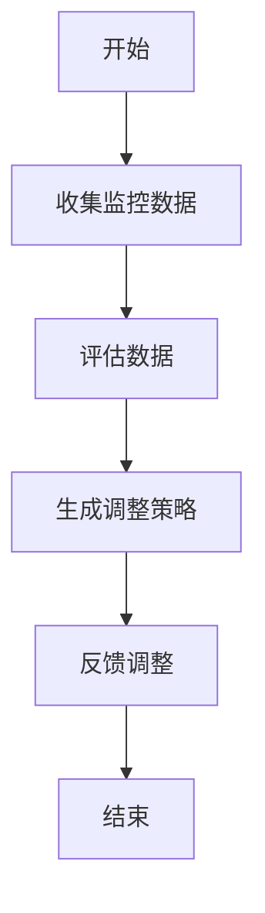
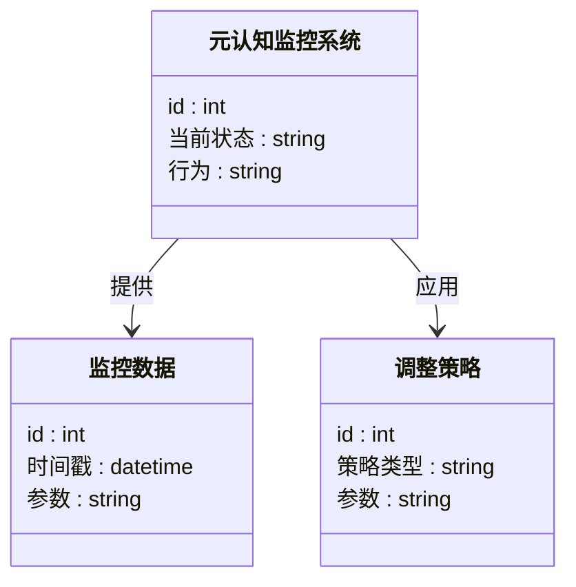
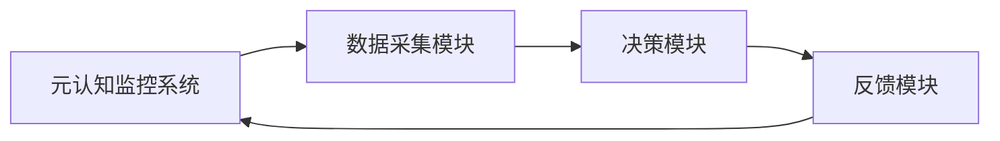
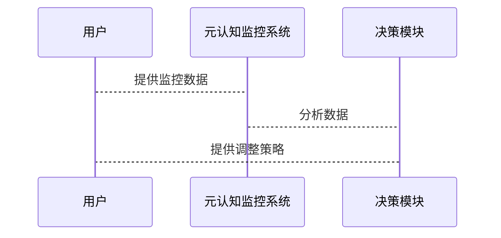
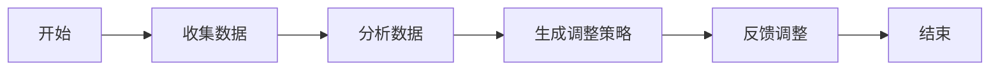

                 


# 从零开始：AI Agent的元认知监控系统

**关键词：** AI Agent, 元认知监控, 系统架构, 算法原理, 项目实战

**摘要：** 本文将深入探讨AI Agent的元认知监控系统，从基本概念、核心原理到系统架构和项目实现，逐步解析如何构建一个高效、可靠的元认知监控系统。通过详细的技术分析和实际案例，帮助读者全面理解该系统的实现与应用。

---

## 第一章: AI Agent与元认知监控系统背景介绍

### 1.1 AI Agent的基本概念

AI Agent（人工智能代理）是指能够感知环境、自主决策并执行任务的智能实体。它可以分为两类：**简单反射型**和**基于模型的反应型**。简单反射型AI Agent仅依赖当前感知信息做出反应，而基于模型的反应型AI Agent则利用内部模型和记忆来优化决策过程。

元认知监控系统是AI Agent的重要组成部分，负责监控和调整AI Agent的认知过程，确保其在复杂环境中的稳定性和高效性。

### 1.2 元认知监控的定义与特点

元认知监控是指AI Agent对其自身的认知过程进行监控、评估和调整的能力。其特点包括：
- **自适应性**：能够根据环境变化动态调整监控策略。
- **实时性**：实时监控和反馈，确保快速响应。
- **自主性**：无需外部干预，自主完成监控任务。

### 1.3 元认知监控在AI Agent中的作用

元认知监控系统在AI Agent中的作用主要体现在：
- **优化决策过程**：通过监控和调整认知过程，提高决策的准确性和效率。
- **增强鲁棒性**：在复杂和不确定环境中，确保AI Agent的稳定性和可靠性。
- **提升可解释性**：帮助人类理解和解释AI Agent的决策过程。

---

## 第二章: 元认知监控系统的核心概念与联系

### 2.1 核心概念原理

元认知监控系统的原理可以分解为三个关键部分：
1. **监控模块**：负责收集和分析AI Agent的认知过程数据。
2. **评估模块**：基于监控数据，评估认知过程的有效性和准确性。
3. **调整模块**：根据评估结果，动态调整AI Agent的行为策略。

### 2.2 核心概念对比表

| **概念**          | **简单反射型AI Agent**       | **基于模型的反应型AI Agent**       | **元认知监控系统**                     |
|--------------------|-----------------------------|-------------------------------------|---------------------------------------|
| 决策依据          | 当前环境感知                | 内部模型和记忆                   | 实时监控和反馈                       |
| 独特功能          | 快速反应                   | 策略优化和记忆检索                | 自适应监控和调整                     |
| 优势              | 实时响应                   | 高效性和准确性                     | 稳定性和可解释性                     |

### 2.3 ER实体关系图

```mermaid
erDiagram
    actor 用户
    actor 环境
    actor 元认知监控系统
    class AI Agent {
        id : int
        状态 : string
        行为 : string
    }
    class 监控数据 {
        id : int
        时间戳 : datetime
        参数 : string
    }
    class 调整策略 {
        id : int
        策略类型 : string
        参数 : string
    }
    用户 --> AI Agent : 控制
    环境 --> AI Agent : 感知
    AI Agent --> 元认知监控系统 : 提供监控数据
    元认知监控系统 --> AI Agent : 应用调整策略
    元认知监控系统 --> 监控数据 : 存储
    元认知监控系统 --> 调整策略 : 生成
```

---

## 第三章: 元认知监控系统的算法原理

### 3.1 算法原理概述

元认知监控系统的核心算法基于**强化学习**和**注意力机制**。强化学习用于优化监控策略，注意力机制用于聚焦关键认知过程。

### 3.2 算法流程图



### 3.3 算法实现代码

以下是一个基于强化学习的监控算法示例：

```python
import numpy as np

class强化学习算法:
    def __init__(self, 状态空间大小, 动作空间大小):
        self.状态空间大小 = 状态空间大小
        self.动作空间大小 = 动作空间大小
        self.学习率 = 0.01
        self.折扣因子 = 0.99
        self.价值函数 = np.zeros(状态空间大小)

    def 选择动作(self, 当前状态):
        # 这里可以使用策略网络选择动作
        return np.random.choice(self.动作空间大小)

    def 更新价值函数(self, 当前状态, 下一个状态, 奖励):
        self.价值函数[current_state] += self.学习率 * (奖励 + self.折扣因子 * max(self.价值函数[next_state]) - self.价值函数[current_state])

    def 学习(self, 当前状态, 下一个状态, 奖励):
        self.更新价值函数(current_state, next_state, reward)
```

---

## 第四章: 元认知监控系统的系统分析与架构设计

### 4.1 系统分析

元认知监控系统的设计需要考虑以下几点：
- **问题场景**：AI Agent在复杂环境中的决策过程需要实时监控和调整。
- **项目介绍**：本文将设计一个基于强化学习的元认知监控系统，用于优化AI Agent的行为策略。

### 4.2 系统功能设计

以下是系统的领域模型类图：



### 4.3 系统架构设计

以下是系统的架构图：



### 4.4 系统接口设计

以下是系统的接口描述：
- **输入接口**：接受AI Agent的当前状态和行为数据。
- **输出接口**：提供调整策略和反馈信息。

### 4.5 系统交互设计

以下是系统的交互序列图：



---

## 第五章: 元认知监控系统的项目实战

### 5.1 环境安装与配置

首先，安装所需的开发环境和依赖库：

```bash
pip install numpy matplotlib
```

### 5.2 核心代码实现

以下是一个简单的元认知监控系统代码示例：

```python
import numpy as np
import matplotlib.pyplot as plt

class 元认知监控系统:
    def __init__(self, 状态空间大小):
        self.状态空间大小 = 状态空间大小
        self.监控数据 = []

    def 收集数据(self, 当前状态):
        self.监控数据.append(current_state)

    def 分析数据(self):
        plt.plot(self.监控数据)
        plt.show()

# 示例使用
监控系统 = 元认知监控系统(10)
for i in range(10):
    监控系统.收集数据(i)
监控系统.分析数据()
```

### 5.3 案例分析

以下是一个具体的案例分析：



---

## 第六章: 总结与展望

### 6.1 总结

本文详细介绍了AI Agent的元认知监控系统，从基本概念到算法原理，再到系统架构和项目实战，为读者提供了一个全面的视角。

### 6.2 展望

未来的研究方向包括：
- 更高效的监控算法。
- 更强大的系统架构设计。
- 更广泛的应用场景。

---

## 作者：AI天才研究院/AI Genius Institute & 禅与计算机程序设计艺术 /Zen And The Art of Computer Programming

