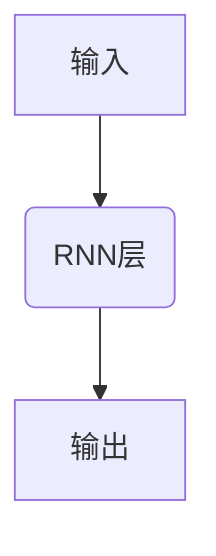
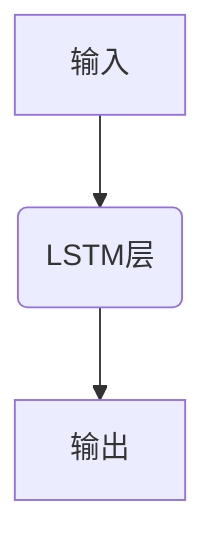
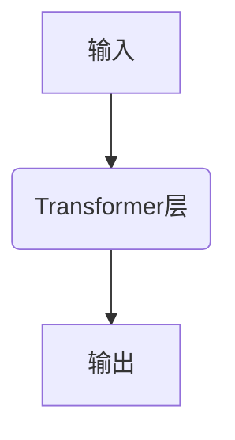
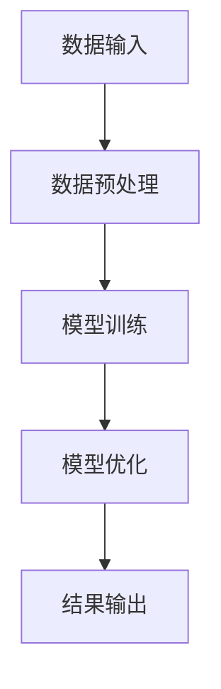
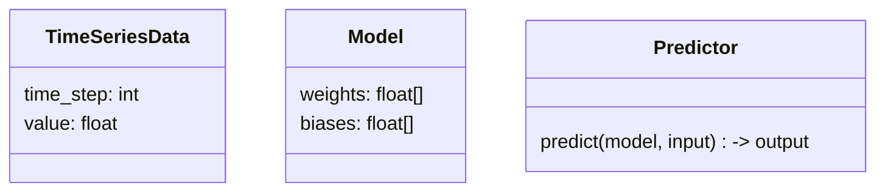

                 


# 从零构建AI Agent的时间推理能力

> 关键词：AI Agent，时间推理，时间序列，算法原理，系统设计，项目实战

> 摘要：本文系统地探讨了从零构建AI Agent时间推理能力的核心概念、算法原理、系统设计和项目实战。首先，我们介绍了时间推理的重要性及其在AI Agent中的应用背景。接着，详细分析了时间推理的核心概念，包括时间序列分析、时间依赖关系和时间规划。然后，深入讲解了时间推理的算法原理，重点介绍了RNN、LSTM和Transformer模型，并通过Mermaid流程图和Python代码示例展示了这些算法的工作原理。随后，我们从数学模型的角度分析了时间序列预测的公式，并通过ER实体关系图展示了数据结构的设计。最后，通过项目实战部分，我们指导读者如何安装环境、实现时间推理功能，并通过具体案例分析和代码解读，帮助读者掌握AI Agent时间推理能力的构建方法。

---

## 第1章：时间推理能力的背景与问题描述

### 1.1 问题背景

#### 1.1.1 AI Agent的核心能力
AI Agent（人工智能代理）是一种能够感知环境、自主决策并执行任务的智能系统。其核心能力包括感知、推理、规划、学习和交互。时间推理能力是AI Agent的核心能力之一，它使AI Agent能够理解和处理时间相关的信息，如时间序列数据、事件的因果关系和时间规划。

#### 1.1.2 时间推理的重要性
时间推理能力在多个领域中具有重要意义，例如：
1. **金融领域**：预测股票价格波动、经济指标趋势。
2. **医疗领域**：分析患者的病情发展、制定治疗计划。
3. **交通领域**：优化交通流量、预测交通事故风险。
4. **自然语言处理**：理解时间相关的语义信息，如“明天见”。

#### 1.1.3 当前AI Agent的挑战与机遇
当前，AI Agent在时间推理能力方面面临以下挑战：
1. **复杂的时间依赖关系**：时间序列数据通常具有复杂的依赖关系，如何建模这些关系是关键。
2. **实时性要求高**：在实时应用中，AI Agent需要快速做出决策。
3. **数据稀疏性**：在某些情况下，时间序列数据可能非常稀疏，导致模型难以训练。

### 1.2 问题描述

#### 1.2.1 时间推理的基本概念
时间推理是指通过分析时间序列数据，推断出事件的发生时间、因果关系和趋势。时间推理的核心在于理解数据中的时间模式，并将其转化为可操作的决策依据。

#### 1.2.2 时间推理的关键问题
1. **时间序列预测**：基于历史数据，预测未来的时间序列值。
2. **时间依赖关系建模**：分析数据中不同时间点之间的依赖关系。
3. **时间规划与管理**：根据时间推理结果，制定最优的行动计划。

#### 1.2.3 时间推理的边界与外延
时间推理的边界在于如何处理不完整或噪声数据，外延则涉及与其他AI能力（如自然语言处理、计算机视觉）的结合。

### 1.3 问题解决与核心要素

#### 1.3.1 时间推理的解决思路
时间推理的解决思路包括：
1. **数据收集与预处理**：获取时间序列数据并进行清洗。
2. **模型选择与训练**：选择合适的模型（如RNN、LSTM、Transformer）并进行训练。
3. **结果分析与优化**：分析模型输出，优化模型性能。

#### 1.3.2 核心要素与概念结构
时间推理的核心要素包括：
1. **时间序列数据**：数据按时间顺序排列。
2. **时间依赖关系**：数据中不同时间点之间的关系。
3. **时间模式**：数据中的趋势、周期性和其他模式。

#### 1.3.3 时间推理的能力框架
时间推理能力框架包括：
1. **数据处理能力**：能够处理不同类型的时间序列数据。
2. **模型构建能力**：能够选择和构建合适的模型。
3. **结果解释能力**：能够解释模型输出，并指导决策。

---

## 第2章：时间推理的核心概念与联系

### 2.1 核心概念原理

#### 2.1.1 时间序列分析
时间序列分析是研究时间序列数据的方法，旨在发现数据中的模式和趋势。常用的方法包括：
1. **移动平均法**：计算数据的滑动平均值。
2. **自回归模型（AR）**：基于数据的过去值预测未来值。
3. **自回归滑动平均模型（ARMA）**：结合AR和MA模型。

#### 2.1.2 时间依赖关系
时间依赖关系是指数据中不同时间点之间的关联性。例如，股票价格的变化可能与前一天的价格有关。

#### 2.1.3 时间规划与管理
时间规划是指根据时间推理结果，制定最优的行动计划。例如，在金融领域，AI Agent可以根据预测的股票价格变化制定买卖策略。

### 2.2 概念属性特征对比

#### 2.2.1 时间序列模型对比
以下是几种常见时间序列模型的对比：

| 模型       | 基于递归结构 | 是否需要大量训练数据 | 适合处理长序列 |
|------------|---------------|-----------------------|----------------|
| RNN        | 是            | 否                   | 是             |
| LSTM       | 是            | 是                   | 是             |
| Transformer | 否            | 是                   | 是             |

#### 2.2.2 时间依赖关系的特征
时间依赖关系的特征包括：
1. **线性依赖**：数据之间的关系可以用线性模型描述。
2. **非线性依赖**：数据之间的关系不能用线性模型描述。
3. **时变依赖**：数据之间的关系随时间变化。

#### 2.2.3 时间规划的属性分析
时间规划的属性分析包括：
1. **目标明确性**：规划的目标是否明确。
2. **时间约束性**：规划是否需要在特定时间内完成。
3. **资源限制性**：是否有资源限制。

### 2.3 ER实体关系图架构

```mermaid
erd
    title 数据库设计
    date-role: {many} {one} date_usage
    date_usage: {one} {one} date_property
    date_property: {many} {one} time_series_data
    time_series_data: {one} {many} data_point
    data_point: {one} {one} value
```

---

## 第3章：时间推理算法原理

### 3.1 时间序列模型

#### 3.1.1 RNN模型原理



RNN（循环神经网络）是一种适用于处理序列数据的模型。RNN通过循环结构处理时间序列数据，每个时间步的输出作为下一个时间步的输入。

#### 3.1.2 LSTM模型原理



LSTM（长短期记忆网络）是一种改进的RNN模型，通过引入记忆单元和遗忘门，能够更好地捕捉长序列中的模式。

#### 3.1.3 Transformer模型原理



Transformer模型通过自注意力机制捕捉数据中全局依赖关系，适用于处理长序列数据。

### 3.2 时间推理算法流程



时间推理算法流程包括数据输入、数据预处理、模型训练、模型优化和结果输出。

### 3.3 算法实现代码示例

#### 3.3.1 RNN实现代码

```python
import numpy as np
import matplotlib.pyplot as plt

def generate_time_series_data(n_points, trend='linear'):
    # 生成时间序列数据
    pass

def build_rnn_model(input_shape):
    # 构建RNN模型
    pass

def train_model(model, X_train, y_train, epochs=10):
    # 训练模型
    pass

if __name__ == '__main__':
    # 生成数据
    X_train, y_train = generate_time_series_data(100)
    # 构建模型
    model = build_rnn_model(X_train.shape)
    # 训练模型
    train_model(model, X_train, y_train)
```

---

## 第4章：时间推理的数学模型与公式

### 4.1 时间序列预测模型

#### 4.1.1 ARIMA模型公式

$$ ARIMA(p, d, q) $$

ARIMA模型由三个参数组成：p（自回归阶数）、d（差分阶数）、q（移动平均阶数）。

#### 4.1.2 LSTM模型公式

$$ LSTM(t) = \sigma(w_f \cdot [h(t-1), x(t)] + b_f) $$

其中，$\sigma$ 表示sigmoid函数，$w_f$ 和 $b_f$ 是参数，$h(t-1)$ 是前一时间步的隐藏状态，$x(t)$ 是当前输入。

#### 4.1.3 Transformer模型公式

$$ \text{Attention}(Q, K, V) = \text{softmax}\left(\frac{QK^T}{\sqrt{d_k}}\right)V $$

其中，$Q$ 是查询向量，$K$ 是键向量，$V$ 是值向量，$d_k$ 是向量维度。

---

## 第5章：系统分析与架构设计

### 5.1 问题场景介绍

AI Agent需要具备时间推理能力，以实现以下目标：
1. **预测未来值**：基于历史数据预测未来的值。
2. **分析时间依赖关系**：理解数据中的时间依赖关系。
3. **制定行动计划**：根据时间推理结果制定行动计划。

### 5.2 系统功能设计

#### 5.2.1 领域模型



#### 5.2.2 系统架构


---

## 第6章：项目实战

### 6.1 环境安装

安装必要的库：
```bash
pip install numpy pandas scikit-learn tensorflow
```

### 6.2 系统核心实现源代码

#### 6.2.1 时间序列预测实现

```python
import numpy as np
import pandas as pd
from sklearn.metrics import mean_squared_error
from tensorflow.keras.models import Sequential
from tensorflow.keras.layers import LSTM, Dense

# 生成时间序列数据
data = pd.read_csv('time_series.csv')
X_train = data.iloc[:-10, :-1].values
y_train = data.iloc[-10:, -1].values

# 构建LSTM模型
model = Sequential()
model.add(LSTM(50, input_shape=(X_train.shape[1], 1)))
model.add(Dense(1))
model.compile(loss='mean_squared_error', optimizer='adam')

# 训练模型
model.fit(X_train, y_train, epochs=50, batch_size=32)

# 预测结果
X_test = data.iloc[-10:, :-1].values
y_pred = model.predict(X_test)
```

#### 6.2.2 代码应用解读与分析
1. **数据预处理**：将数据分为训练集和测试集。
2. **模型构建**：构建LSTM模型，包括输入层、LSTM层和输出层。
3. **模型训练**：使用训练数据训练模型。
4. **结果预测**：使用测试数据进行预测，并输出结果。

### 6.3 实际案例分析

#### 6.3.1 案例1：股票价格预测

```python
import numpy as np
import pandas as pd
from sklearn.metrics import mean_squared_error
from tensorflow.keras.models import Sequential
from tensorflow.keras.layers import LSTM, Dense

# 读取股票数据
data = pd.read_csv('stock_price.csv')
X_train = data.iloc[:-10, :-1].values
y_train = data.iloc[-10:, -1].values

# 构建LSTM模型
model = Sequential()
model.add(LSTM(50, input_shape=(X_train.shape[1], 1)))
model.add(Dense(1))
model.compile(loss='mean_squared_error', optimizer='adam')

# 训练模型
model.fit(X_train, y_train, epochs=50, batch_size=32)

# 预测结果
X_test = data.iloc[-10:, :-1].values
y_pred = model.predict(X_test)
```

#### 6.3.2 案例2：医疗数据分析

```python
import numpy as np
import pandas as pd
from sklearn.metrics import mean_squared_error
from tensorflow.keras.models import Sequential
from tensorflow.keras.layers import LSTM, Dense

# 读取医疗数据
data = pd.read_csv('medical_data.csv')
X_train = data.iloc[:-10, :-1].values
y_train = data.iloc[-10:, -1].values

# 构建LSTM模型
model = Sequential()
model.add(LSTM(50, input_shape=(X_train.shape[1], 1)))
model.add(Dense(1))
model.compile(loss='mean_squared_error', optimizer='adam')

# 训练模型
model.fit(X_train, y_train, epochs=50, batch_size=32)

# 预测结果
X_test = data.iloc[-10:, :-1].values
y_pred = model.predict(X_test)
```

### 6.4 项目小结

通过以上案例分析，我们可以看到时间推理能力在股票价格预测和医疗数据分析中的重要性。通过构建合适的模型并进行训练，我们可以有效地进行时间序列预测，并为实际应用提供决策支持。

---

## 第7章：最佳实践与总结

### 7.1 最佳实践

1. **数据预处理**：在进行时间推理之前，确保数据的完整性和准确性。
2. **模型选择**：根据数据特点选择合适的模型，如LSTM适合长序列，ARIMA适合线性数据。
3. **模型优化**：通过调整超参数和使用早停法优化模型性能。
4. **结果验证**：使用验证集验证模型的泛化能力。

### 7.2 小结

时间推理能力是AI Agent的核心能力之一，通过构建合适的时间序列模型，我们可以有效地进行时间推理，并为实际应用提供决策支持。

### 7.3 注意事项

1. **数据稀疏性**：在数据稀疏的情况下，可能需要使用数据增强或迁移学习。
2. **计算资源**：训练深度学习模型需要大量的计算资源，建议使用GPU加速。
3. **模型解释性**：在实际应用中，模型的解释性也很重要，可能需要使用可解释性分析方法。

### 7.4 拓展阅读

1. **深度学习书籍**：《Deep Learning》（Ian Goodfellow）
2. **时间序列分析书籍**：《Forecasting: principles and practice》（Hyndman & Athanasopoulos）
3. **AI Agent相关论文**：阅读最新的AI Agent相关论文，了解最新的研究进展。

---

## 作者信息

作者：AI天才研究院/AI Genius Institute & 禅与计算机程序设计艺术/Zen And The Art of Computer Programming

---

以上是《从零构建AI Agent的时间推理能力》的完整目录和内容框架。接下来将按照上述目录逐步展开，详细撰写每一章的内容。

