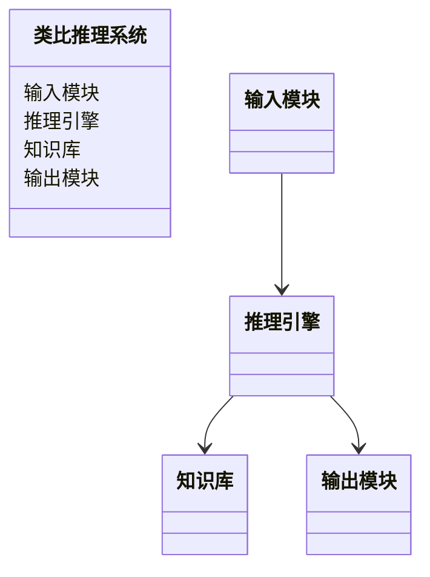

                 


# 从零构建AI Agent的类比推理系统

> 关键词：AI Agent，类比推理，知识表示，推理算法，系统架构

> 摘要：本文将从零开始，系统地介绍如何构建一个AI Agent的类比推理系统。通过背景与概述、核心概念与原理、算法原理、系统架构、项目实战、高级主题和总结，本文详细阐述了构建类比推理系统的各个方面，从理论到实践，帮助读者全面掌握类比推理系统的构建方法。

---

## 第1章: AI Agent与类比推理概述

### 1.1 AI Agent的基本概念
AI Agent（人工智能代理）是指能够感知环境、执行任务并做出决策的智能实体。它可以是一个软件程序，也可以是物理设备，其核心目标是通过自主行动来优化目标函数。

#### 1.1.1 什么是AI Agent
AI Agent是一个能够感知环境、与环境交互、并采取行动以实现目标的实体。它可以分为简单反射型、基于模型型、目标驱动型和实用驱动型四种类型。

#### 1.1.2 AI Agent的类型与特点
- **简单反射型Agent**：基于当前感知直接做出反应，没有内部状态。
- **基于模型型Agent**：维护环境模型，能够根据当前状态和环境信息做出决策。
- **目标驱动型Agent**：具有明确的目标，并采取行动以实现目标。
- **实用驱动型Agent**：基于效用函数进行决策，追求效用的最大化。

#### 1.1.3 类比推理在AI Agent中的作用
类比推理是AI Agent理解、学习和决策的重要能力。通过类比推理，AI Agent可以将已有的知识迁移到新的情境中，从而提高其推理和问题解决能力。

---

### 1.2 类比推理的定义与重要性
类比推理是一种基于相似性进行推断的思维方式，广泛应用于数学、逻辑、语言理解和问题解决等领域。

#### 1.2.1 类比推理的基本概念
类比推理是通过比较两个事物的相似性，将已知的信息扩展到未知领域的过程。其核心在于发现不同事物之间的共同模式或结构。

#### 1.2.2 类比推理在AI中的应用领域
- **自然语言处理**：如句法分析、语义理解。
- **计算机视觉**：如图像识别、目标检测。
- **机器学习**：如数据标注、特征提取。

#### 1.2.3 构建类比推理系统的意义
构建类比推理系统可以增强AI Agent的理解和推理能力，使其能够更好地处理复杂问题。

---

### 1.3 本书的目标与内容框架
#### 1.3.1 本书的目标
通过系统化的方法，从理论到实践，帮助读者掌握构建AI Agent类比推理系统的核心技术。

#### 1.3.2 本书的内容框架
- **背景与概述**：介绍AI Agent和类比推理的基本概念。
- **核心概念与原理**：深入分析类比推理的机制和方法。
- **算法原理**：讲解主流的类比推理算法及其实现。
- **系统架构**：设计类比推理系统的整体架构。
- **项目实战**：通过实际案例，展示系统构建过程。
- **高级主题**：探讨类比推理的优化策略和未来方向。

#### 1.3.3 学习本书的建议
建议读者具备基本的编程和机器学习知识，同时熟悉Python和相关AI框架。

---

## 第2章: 类比推理的核心机制

### 2.1 类比推理的基本原理
类比推理的核心在于发现不同事物之间的相似性，并利用这些相似性进行推断。

#### 2.1.1 类比推理的逻辑结构
类比推理通常遵循“如果A与B在某些方面相似，那么A在其他方面也可能与B相似”的逻辑。

#### 2.1.2 类比推理的关键步骤
1. **识别相似性**：发现两个事物之间的共同特征。
2. **建立映射关系**：将这些相似特征映射到目标领域。
3. **推导结论**：基于映射关系得出新的结论。

#### 2.1.3 类比推理的数学模型
类比推理可以用向量空间模型来表示。例如，使用余弦相似度来衡量两个向量之间的相似性：

$$ \text{相似度} = \frac{\vec{A} \cdot \vec{B}}{\|\vec{A}\| \cdot \|\vec{B}\|} $$

---

### 2.2 类比推理的核心概念对比
#### 2.2.1 不同类比推理方法的对比
| 方法             | 描述                                   | 优缺点                     |
|------------------|--------------------------------------|---------------------------|
| 符号推理          | 基于符号规则进行推理                 | 易于解释，但灵活性差       |
| 基于向量的推理    | 基于向量空间模型进行推理             | 更灵活，但解释性较差       |
| 神经符号结合      | 结合符号规则和神经网络进行推理       | 结合了两者的优点           |

#### 2.2.2 类比推理与归纳推理的区别
- **归纳推理**：从具体实例中总结一般规律。
- **类比推理**：基于相似性进行推断。

#### 2.2.3 类比推理与演绎推理的区别
- **演绎推理**：从一般到特殊的推理。
- **类比推理**：基于相似性进行推断。

---

### 2.3 类比推理的ER实体关系图
以下是类比推理系统的ER实体关系图：

```mermaid
er
    entity 类比推理系统 {
        类别 类别号(PK)
        名称 名称
    }

    entity 实例 {
        实例号(PK)
        类别号(FK)
        属性1 属性1
        属性2 属性2
    }

    entity 映射关系 {
        映射ID(PK)
        实例1 实例号(FK)
        实例2 实例号(FK)
        映射权重 映射权重
    }
```

---

## 第3章: 类比推理的算法原理

### 3.1 基于符号的类比推理算法
#### 3.1.1 算法流程
1. **提取特征**：从输入中提取符号特征。
2. **建立映射关系**：将符号特征映射到目标领域。
3. **推理结论**：基于映射关系进行推理。

#### 3.1.2 算法实现
以下是基于符号的类比推理算法的Python实现示例：

```python
def symbolic_reasoning(features_A, features_B):
    # 建立符号映射
    mapping = {}
    for a, b in zip(features_A, features_B):
        mapping[a] = b
    # 推理结论
    conclusion = [mapping.get(a, None) for a in new_features]
    return conclusion
```

---

### 3.2 基于向量的类比推理算法
#### 3.2.1 算法流程
1. **向量化输入**：将输入转换为向量表示。
2. **计算相似度**：使用余弦相似度等方法计算向量之间的相似度。
3. **推导结论**：基于相似度进行类比推理。

#### 3.2.2 算法实现
以下是基于向量的类比推理算法的Python实现示例：

```python
import numpy as np

def vector_based_reasoning(vec_A, vec_B):
    # 计算余弦相似度
    similarity = np.dot(vec_A, vec_B) / (np.linalg.norm(vec_A) * np.linalg.norm(vec_B))
    # 推导结论
    conclusion = similarity * vec_B
    return conclusion
```

---

### 3.3 神经符号结合的类比推理算法
#### 3.3.1 算法流程
1. **神经网络提取特征**：使用神经网络提取输入的特征表示。
2. **符号规则进行推理**：基于符号规则进行推理。
3. **输出结论**：结合神经网络和符号推理的结果输出结论。

#### 3.3.2 算法实现
以下是神经符号结合的类比推理算法的Python实现示例：

```python
import torch

class NeuralSymbolicReasoning(torch.nn.Module):
    def __init__(self, input_dim, hidden_dim):
        super(NeuralSymbolicReasoning, self).__init__()
        self.neural_layer = torch.nn.Linear(input_dim, hidden_dim)
        self.symbolic_layer = torch.nn.Linear(hidden_dim, 1)

    def forward(self, x):
        x = self.neural_layer(x)
        output = self.symbolic_layer(x)
        return output
```

---

## 第4章: 类比推理系统的架构设计

### 4.1 系统功能设计
类比推理系统的功能模块包括：
- **输入模块**：接收输入数据。
- **推理引擎**：执行类比推理。
- **知识库**：存储背景知识。
- **输出模块**：返回推理结果。

#### 4.1.1 领域模型
以下是类比推理系统的领域模型：



---

### 4.2 系统架构设计
类比推理系统的架构包括：
- **数据层**：存储输入数据和知识库。
- **计算层**：执行推理计算。
- **应用层**：提供接口和用户交互。

#### 4.2.1 系统架构图
以下是类比推理系统的架构图：


---

## 第5章: 类比推理系统的项目实战

### 5.1 环境搭建
#### 5.1.1 安装依赖
安装必要的Python库，如numpy、scipy、scikit-learn等。

#### 5.1.2 环境配置
配置开发环境，如Jupyter Notebook、PyCharm等。

---

### 5.2 核心实现
#### 5.2.1 类比推理算法实现
实现基于符号、向量和神经符号结合的类比推理算法。

#### 5.2.2 知识库构建
构建包含领域知识的知识库，如词向量库、规则库等。

---

### 5.3 应用案例
#### 5.3.1 自然语言处理
在自然语言处理中，使用类比推理进行语义分析。

#### 5.3.2 图像识别
在图像识别中，使用类比推理进行目标检测。

---

## 第6章: 高级主题与未来展望

### 6.1 类比推理的优化策略
- **数据增强**：通过数据增强提高模型的泛化能力。
- **模型优化**：采用更复杂的神经网络结构提高推理精度。

### 6.2 类比推理的未来发展方向
- **多模态推理**：结合文本、图像等多种模态信息进行推理。
- **实时推理**：优化算法实现低延迟的实时推理。

---

## 第7章: 总结

### 7.1 全文总结
本文从理论到实践，系统地介绍了如何构建AI Agent的类比推理系统，涵盖了算法原理、系统架构和项目实战等方面。

### 7.2 学习总结
通过本文的学习，读者可以掌握类比推理的核心技术，并将其应用于实际场景中。

### 7.3 未来展望
类比推理技术将在更多领域得到应用，如自动驾驶、智能客服等，未来的研究将更加注重多模态推理和实时推理能力。

---

## 作者：AI天才研究院/AI Genius Institute & 禅与计算机程序设计艺术 /Zen And The Art of Computer Programming

---

**注**：由于篇幅限制，本文仅展示部分内容。完整文章将包含更多详细的技术细节和代码示例。

