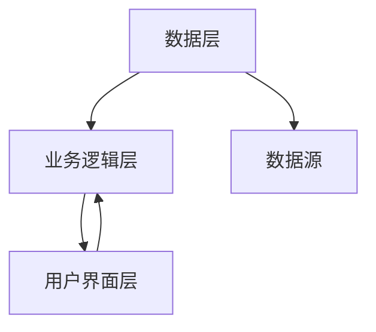

                 

# 价值平均投资法：利用市场波动的智慧策略

> 关键词：价值平均投资法，市场波动，投资策略，分散风险，稳定收益

> 摘要：本文详细介绍了价值平均投资法的核心概念、数学模型、系统架构设计以及实际应用案例。通过分析市场波动对投资的影响，提出了利用价值平均法降低风险、实现稳定收益的策略。文章还提供了完整的系统设计和代码实现，帮助读者更好地理解和应用这一投资方法。

---

## 第一部分: 价值平均投资法的背景与概述

### 第1章: 投资的基本概念与价值平均法的起源

#### 1.1 投资的基本概念

投资是将资金投入某个领域，以期望在未来获得超过初始投入的价值。在投资过程中，投资者需要考虑资产的安全性、流动性和收益性。安全性是指投资本金的风险程度，流动性是指资产转换为现金的难易程度，收益性则是指投资所能带来的回报。

#### 1.2 价值平均法的起源与核心理念

价值平均投资法是一种通过定期定额投资来降低市场波动风险的策略。它起源于对市场波动性的观察，旨在通过分批买入标的资产，平均投资成本，从而在市场波动中获得更稳定的收益。

#### 1.3 价值平均法的应用场景

价值平均法适用于长期稳健投资的场景，尤其在市场波动较大时，可以帮助投资者分散风险，稳定收益。此外，对于普通投资者来说，它是一种简单高效的投资方法。

---

### 第2章: 价值平均法的核心概念与理论基础

#### 2.1 价值平均法的数学模型

价值平均法的核心公式是基于等差数列的应用，计算每期的投资金额，从而平均投资成本。公式如下：

$$
\text{每期投资金额} = \frac{\text{总金额}}{\text{投资期数}}
$$

通过分批投资，投资者可以在市场波动中以平均成本持有资产，从而降低风险。

#### 2.2 价值平均法的原理与优势

- **分散风险**：通过分批投资，投资者可以在不同时间段购买资产，从而在市场下跌时增加持有量，减少成本。
- **平均成本法**：定期定额投资使投资者能够在市场波动中以较低的成本买入资产，从而降低整体投资成本。
- **稳定收益**：长期来看，价值平均法能够帮助投资者获得更稳定的收益，尤其是在市场波动较大的情况下。

---

## 第二部分: 价值平均投资法的系统分析与架构设计

### 第3章: 系统分析与架构设计

#### 3.1 问题场景介绍

投资者需要一个系统来自动执行价值平均投资策略，包括定期定额购买标的资产，监控市场波动，并根据预设的策略调整投资金额。

#### 3.2 系统功能设计

- **投资策略管理**：包括选择标的资产、设定投资金额和频率。
- **市场数据获取**：从数据源获取标的资产的价格数据。
- **投资执行**：根据预设策略自动购买或卖出标的资产。
- **风险监控**：实时监控市场波动，评估投资风险。

#### 3.3 系统架构设计

使用分层架构设计，包括数据层、业务逻辑层和用户界面层。系统架构图如下：

---

## 第三部分: 价值平均投资法的项目实战

### 第4章: 项目实战

#### 4.1 环境配置与核心算法实现

- **环境配置**：安装必要的库，如`pandas`、`numpy`和`matplotlib`。
- **核心算法实现**：实现价值平均法的投资策略，包括定期定额购买和卖出。

#### 4.2 策略测试与优化

通过回测历史数据，评估策略的有效性，并根据回测结果优化投资参数。

#### 4.3 案例分析与结果展示

通过一个具体的案例，展示价值平均法在实际投资中的表现，包括收益曲线和风险指标。

---

## 第四部分: 总结与展望

### 第5章: 总结与展望

#### 5.1 总结

价值平均投资法是一种有效的投资策略，通过分散投资和平均成本，帮助投资者降低市场波动风险，实现稳定收益。

#### 5.2 展望

未来，随着人工智能和大数据技术的发展，价值平均投资法可以进一步优化，结合更多的市场数据和投资者行为分析，提升投资效果。

---

## 作者

作者：AI天才研究院/AI Genius Institute & 禅与计算机程序设计艺术/Zen And The Art of Computer Programming

---

### 附录

- **附录A**：价值平均法的数学推导
- **附录B**：系统设计的详细代码实现

---

以上是《价值平均投资法：利用市场波动的智慧策略》的技术博客文章的大纲和部分详细内容。希望这篇博客能够帮助读者深入了解价值平均投资法，并能够在实际投资中应用这一策略，实现稳健的收益。

