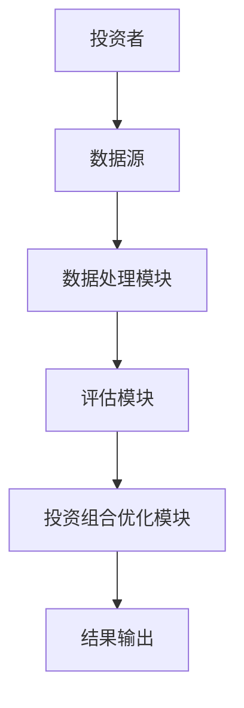

                 


# 价值投资与ESG投资的结合

> 关键词：价值投资，ESG投资，可持续投资，投资组合优化，环境、社会和治理（ESG）

> 摘要：本文探讨了价值投资与ESG投资相结合的策略，分析了两者结合的优势，并通过数学模型和案例展示了如何在实际投资中应用。文章从理论基础到系统设计，再到实战应用，全面解析了价值投资与ESG投资结合的潜力和方法。

---

# 引言

## 1.1 价值投资与ESG投资的结合概述

价值投资是一种以股票内在价值为核心的投资策略，而ESG投资则关注企业在环境、社会和治理方面的表现。两者的结合不仅考虑了财务回报，还兼顾了社会责任和可持续发展，成为现代投资的重要趋势。

---

# 第二部分: 价值投资的理论基础

## 第2章: 价值投资的核心理论

### 2.1 价值投资的基本原理

#### 2.1.1 市场有效性的假设
价值投资者认为市场并非总是有效，存在被低估的股票。我们可以通过以下公式计算股票的内在价值：

$$
\text{内在价值} = \frac{\text{预期现金流}}{\text{折现率}}
$$

#### 2.1.2 安全边际的概念
安全边际是股票市场价格低于其内在价值的部分，公式为：

$$
\text{安全边际} = \text{内在价值} - \text{市场价格}
$$

#### 2.1.3 股票内在价值的计算
以股息贴现模型（DDM）为例，计算公式如下：

$$
\text{内在价值} = \frac{D_1}{k - g}
$$

其中，$D_1$为第一年的股息，$k$为贴现率，$g$为股息增长率。

---

## 第3章: ESG投资的理论基础

### 3.1 ESG投资的核心理念

#### 3.1.1 环境（E）
关注企业的碳排放、能源使用效率等环境表现。例如，采用绿色能源的企业可能在未来更具竞争优势。

#### 3.1.2 社会（S）
评估企业在社会责任方面的表现，如员工福利、社区贡献等。

#### 3.1.3 治理（G）
关注公司治理结构的透明度和有效性，如董事会构成、高管薪酬等。

### 3.2 ESG投资的评估模型

#### 3.2.1 ESG评分模型
通过量化企业表现，生成ESG评分。例如，使用以下步骤：

1. 收集企业ESG数据。
2. 对每个维度进行标准化处理。
3. 计算综合ESG评分。

---

# 第三部分: 价值投资与ESG投资的结合模型

## 第4章: 价值投资与ESG投资的结合模型

### 4.1 整合模型的设计

#### 4.1.1 数据收集
- 收集企业的财务数据和ESG数据。

#### 4.1.2 综合评估
通过以下公式计算综合评分：

$$
\text{综合评分} = \alpha \times \text{财务评分} + \beta \times \text{ESG评分}
$$

其中，$\alpha$和$\beta$为权重系数。

---

# 第四部分: 系统分析与架构设计

## 第5章: 系统分析与架构设计方案

### 5.1 系统功能设计

#### 5.1.1 数据流图
使用Mermaid图展示数据流：



### 5.2 系统架构设计

#### 5.2.1 架构图
使用Mermaid图展示系统架构：


---

# 第五部分: 项目实战

## 第6章: 项目实战

### 6.1 环境安装

#### 6.1.1 工具安装
- Python 3.8+
- Pandas, NumPy, Scikit-learn

### 6.2 核心代码实现

#### 6.2.1 数据收集与处理

```python
import pandas as pd

# 假设data为ESG数据，financials为财务数据
data = pd.merge(data, financials, on='company_id')
```

#### 6.2.2 投资组合优化

```python
from scipy.optimize import minimize

def portfolio_optimization(weights, returns, risk_free_rate):
    portfolio_return = weights.dot(returns)
    portfolio_variance = weights.T.dot(weights.dot(np.diag(1/returns.shape[0])))
    return -portfolio_return + risk_free_rate * portfolio_variance

# 优化权重
result = minimize(portfolio_optimization, initial_weights, args=(returns, risk_free_rate))
```

---

# 总结与展望

## 第7章: 总结与展望

### 7.1 本书的核心内容回顾

- 结合价值投资和ESG投资的优势。
- 提供了数学模型和系统设计。

### 7.2 未来研究方向

- 开发更复杂的优化算法。
- 扩大样本量，验证模型的稳定性。

### 7.3 最佳实践 tips

- 定期更新数据，保持模型的准确性。
- 结合市场变化，灵活调整投资策略。

---

# 作者

作者：AI天才研究院/AI Genius Institute & 禅与计算机程序设计艺术 /Zen And The Art of Computer Programming

---

通过以上结构，文章详细探讨了价值投资与ESG投资的结合，从理论到实践，为读者提供了全面的指导和深入的分析。

